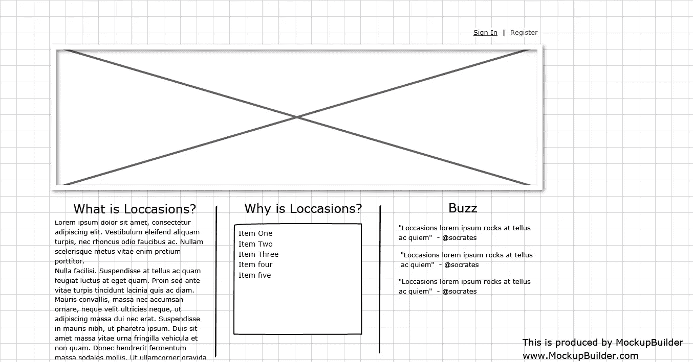
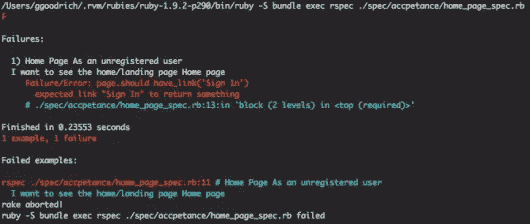
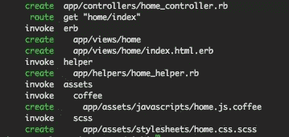

# Rails 深度挖掘:位置，主页

> 原文：<https://www.sitepoint.com/rails-deep-dive-loccasions-home-page/>

在[的最后一篇文章](https://www.sitepoint.com/rails-deep-dive-application-setup-loccasions/)中，我们结束了我们的应用程序结构。在本帖中，我们将从我们的第一个用户故事*开始。作为一个未注册用户，我想看看主页/登陆页。*在这个简短的用户故事中，有几点需要指出。首先，我们已经确定了应用程序的一个角色，它是一个*未注册的*用户。还有，这个故事告诉我们，我们需要有一个不受授权保护的主页。

## 模仿主页

这个页面是我们应用程序的前门，任何人都可以敲它。在这一点上，如果团队中有一个有才华的网页设计师能够制作出一个简单、优雅的页面就好了。不幸的是，我们只有我，我的设计技巧，嗯，还很原始。咳嗽
当有人请不起真正的设计师时，呃，我是说，当我在设计网页时，我喜欢画出线框。互联网上有太多的模型工具(几乎到处都有纸和铅笔)，我已经选定了 [MockupBuilder](http://mockupbuilder.com) ，因为我常用的工具(铅笔)正在休假。我在这里做了一个快速模型:



我们的蓝图

这是一个简单的，如果犯罪的熟悉，主页。这里有登录和注册的链接，一个用来宣传网站的大图片，下面有一个分区用来放关于棒极了的 Loccasions 的信息。这种布局很好地融入了网格系统，这没有错。

## 准备测试环境

在我们通过窥镜进行模拟之前，我们需要设置我们的测试环境并编写一个(或两个)测试来验证我们的页面。我在上一篇文章中提到了丹尼尔·凯霍的( *[@rails_apps](http://twitter.com/rails_apps "RailsApps on Twitter")* ) [优秀教程](https://github.com/railsapps "RailsApps on GitHub")，我很大程度上依赖他们来设置 Loccasions 的测试环境。

### 设置 RSpec

RSpec 附带了设置环境的生成器，因此打开一个终端，`cd`进入*locations*目录并键入:

```
rails g rspec:install
```

这个命令的输出抱怨 Mongoid 配置不存在(呃，第一个错误)，所以我们需要生成它。

```
rails g mongoid:config
```

这给了我们一个 *config/mongoid.yml* ，它将驱动我们在 MongoDB 中创建数据库。重新运行`rails g rspec:install`并且 rspec 又高兴了(除非，MongoDB 没有运行)。

我们不打算在临时情况下使用 ActiveRecord，所以我们必须在 *spec/spec_helper.rb* 文件中注释掉几行。注释掉这些行:

```
# config.fixture_path = "#{::Rails.root}/spec/fixtures"
# config.use_transactional_fixtures = true
```

在测试套件之间，我们希望 RSpec 清理数据库。 *database_cleaner* gem 为我们执行这项任务。将以下内容添加到 *spec/spec_helper.rb* 文件中。

```
# Clean up the database
require 'database_cleaner'
config.before(:suite) do
  DatabaseCleaner.strategy = :truncation
  DatabaseCleaner.orm = "mongoid"
end

config.before(:each) do
  DatabaseCleaner.clean
end
```

同样在 *spec_helper.rb* 文件中，添加

```
require 'capybara/rspec'</code>
```

去找水豚匹配者。

mongoid-rspec gem 为我们提供了一些很好的 r spec 匹配器，帮助我们的测试更有效地传达它们的目的。这些匹配器通过创建一个 *spec/support/mongoid.rb* (您也必须创建 *support* 目录)文件添加到 RSpec 中，文件如下:

```
RSpec.configure do |config|
  config.include Mongoid::Matchers
end
```

这使我们的测试环境进入一种我们可以开始运行的状态。仍然有一些事情需要设置，但是我们会在更紧迫的时候再做。为了确保我们没有破坏任何东西，在命令提示符下运行`rake -T`,并确保您看到了 RSpec 任务。如果一切正常，run `rake spec`和 RSpec 应该会告诉你没什么关系，这是好事。

## 我们的第一个测试

看看我们当前的用户故事，一个未注册的用户需要看到我们的主页。我们如何衡量我们遇到了这个故事？主页上有哪些我们可以确认并知道我们没事的内容？我对衡量什么的第一个想法是:

*   该页面有一个“登录”链接
*   页面标题是“位置:主页”
*   该页面有“什么是 Loccasions？”在它的某个地方。(我们要解释一下自己……)

我们将在第一次接受度测试中使用水豚的新[功能语法](http://jeffkreeftmeijer.com/2011/acceptance-testing-using-capybaras-new-rspec-dsl/)开始。创建一个名为*spec/acceptance/home _ page _ spec . Rb*的文件(你也必须创建 *acceptance* 目录)，内容如下:
需要“spec_helper”

```
feature 'Home Page', %q{
  As an unregistered user
  I want to see the home/landing page
} do
  background do
    # Nothing to do here
  end

  scenario "Home page" do
    visit "/"
    page.should have_link('Sign In')
    page.should have_selector('title', :text => "Loccasions")
    page.should have_content('What is Loccasions?')
  end

end
```

该规范非常易于阅读，并寻找我们用来衡量成功的项目。从验收测试开始，我们从用户的角度驱动设计。运行`rake spec`会导致:



啊...我们的第一个规格...

不出所料，该规范未能找到“登录”链接。现在，我们仍然使用默认的 index.html 在*公共*目录中，所以让我们删除它。再次运行规范，我们现在看到一个“路由错误”,这也是有意义的，因为我们没有根路由。基于以前的 Rails 应用程序和惯例，让我们制作一个带有“索引”动作的“主页”控制器。

```
rails g controller Home index
```



埃尔比？怎么了？？

嗯……有些不对劲。生成器创建了 ERB 模板，而不是 Haml 模板。我发誓我读到过，在 3.1 中，在你的 Gemfile 中包含 Haml 会自动使它成为默认的 template_engine。看来我错了。哦，好吧，快速的解决方案是将`gem "haml-rails", "~> 0.3.4"`添加到我们的 Gemfile 和`bundle install`中。现在，重新运行`rails g controller Home index`，瞧！，我们有一个 Haml 模板。(哦，继续删除*app/views/home/index . html . erb*文件)

接下来，我们需要将我们的根路径指向新控制器上的*索引*方法。打开 *config/routes.rb* ，去掉`get "home#index"`行，换成`root :to => "home#index"`。再次运行该规范会返回无“登录”链接错误。为了节省时间和精力，我将向前跳一点，为我们的主页创建布局。我使用的是[框架](http://getskeleton.com/)，并相应修改了*app/views/layouts/application . html . haml*(我将 ERB 布局文件迁移到 Haml)和*app/views/home/index . html . Haml*文件。以下是你需要做的事情:

*   下载并解压缩骨架。
*   将文件从 *javascript* 和*样式表*目录复制到 *app/assets/* 中的相同目录
*   用这里的内容[替换你的*app/views/layouts/application . html . haml*文件的内容](https://github.com/ruprict/loccasions/commit/8f1ec41663858aba3015ef50cf2985da6f3c5caf#app/views/layouts/application.html.haml)
*   用这里的内容[替换你的*app/views/home/index . html . haml*文件的内容](https://raw.github.com/ruprict/loccasions/master/app/views/home/index.html.haml)
*   将你的*app/assets/style sheets/home . CSS . sass*文件的内容替换为这里的[内容](https://raw.github.com/ruprict/loccasions/master/app/assets/stylesheets/home.css.scss)
*   将复制到你的*应用/资产/图片*目录

如果您重新运行该规范，它就会通过。


从左手边超过我

就这样，我们的第一个用户故事完成了。米勒时间到了！

请随意查看 Haml 文件的布局和索引，看看我是如何满足我们的规范的。一旦你熟悉了 Haml 的语法，我们布局的细节就没那么有趣了。

```
git add .
git commit -am "Added home page and layout"
git push origin master
```

下一次，我们将从另一个用户故事开始，看看它在哪里发生。和往常一样，我对你对这个系列的看法和评论很感兴趣。

顺便说一句，Loccasions 标题使用的字体是[八一胶水](http://glue.deviantart.com/art/Eight-One-45198536)。

## 分享这篇文章