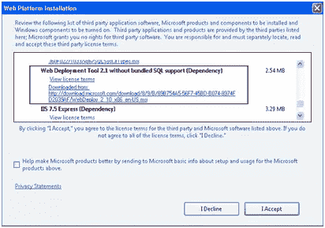
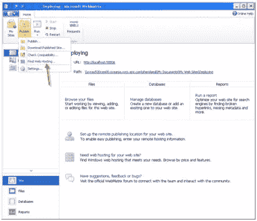
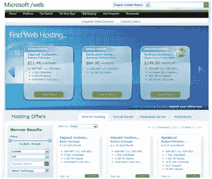
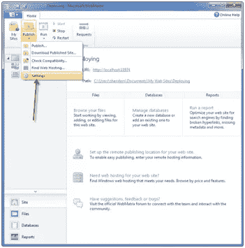
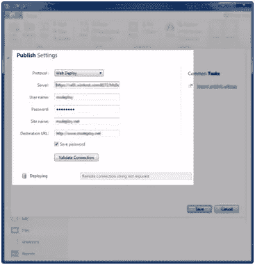
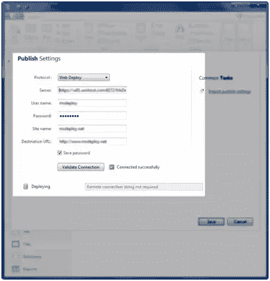
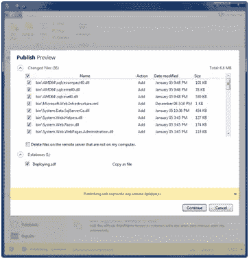
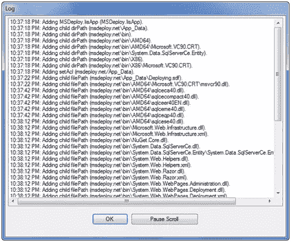

# 在 WebMatrix 中使用 Web Deploy 发布

> 原文：<https://www.sitepoint.com/publishing-with-web-deploy-in-webmatrix/>

我们的 WebMatrix 系列中的[前几篇文章已经带您了解了如何使用 Web 应用程序库](#earlier)[建立一个电子商务网站](../a-gallery-of-web-apps/)和[找到合适的 CMS](../finding-the-right-cms-with-web-app-gallery/) ，使用 WebMatrix 建立[动态网站，以及使用 WebMatrix](../building-dynamic-websites-with-webmatrix/)[托管、发布和生成流量](../hosting-publishing-and-generating-traffic-with-webmatrix/)。

在所有这些中，我们承认了一个叫做 **Web Deploy** 的特定 WebMatrix 功能，但并没有深入细节。这是因为我们的重点一直放在实际操作的专业开发人员上，Web Deploy 的一大优势是它使初学者或业余开发人员更容易发布网站。

但这并不意味着我们不应该对 Web Deploy 感兴趣。在下一篇文章中，您将了解为什么 WebMatrix suite 实际上是最高级开发人员的一套非常方便的工具。现在，让我们深入研究 Web Deploy。

本文假设您已经阅读了前面提到的文章，或者已经安装了 [WebMatrix](http://www.microsoft.com/web/webmatrix/) 。

简而言之，Web Deploy 运行在服务器上，让您能够本地或远程部署网站。通过这样做，它可以处理大量原本需要手动处理的任务和流程。

### 为什么选择 Web Deploy？

开发和设计网站或网络应用是一回事，但是部署——发布到网络服务器——在最好的情况下也总是很棘手。Web Deploy 极大地简化了网站的迁移、管理和部署。Web Deploy 不仅可以复制文件和文件夹，还可以执行配置转换、提供数据库方案以及数据、打包依赖项(如 COM 对象)、安装 SSL 证书和许多其他功能。

Web Deploy 方法的一个例子是，它使用差异上传只传输修改过的文件，节省了您的时间和工作。

Web Deploy 还支持基于. NET 的提供者 API，使您能够创建自定义部署操作，因此它非常适合企业。这是一种方法的一部分，旨在使从有一个网站的想法到宣布它开始营业变得容易而无痛苦。

### 装置

当您通过 [Web 平台安装程序](http://www.microsoft.com/web/downloads/platform.aspx)安装 WebMatrix 时，Web Deploy 会作为一个依赖项自动安装。参见图 1，“Web 平台安装程序依赖性”。

**图一。Web 平台安装程序依赖关系**

完成后，Web Deploy 被安装到*C:Program files IIS 微软 Web Deploy V2* 目录。运行 Web Deploy 时执行的实际文件是`msdeploy.exe`。这个文件让您可以做一些相当聪明的事情，但是现在请注意，本文中的每个 Web Deploy 示例最终都会执行这个文件。

**部署数据库**

如果您使用 SQL Server Compact 作为数据库，数据将存储在一个*中。您网站中的 *App_Data* 文件夹中的 sdf* 文件。当您发布数据库时，WebMatrix 不仅复制了*。sdf* 文件也是数据库程序本身到 web 服务器的。这确保了即使 web 服务器上尚未安装 SQL Server Compact，发布的网站也能工作。这样做的最大好处是，您不需要单独的脚本来创建数据库模式和可选地插入数据。都为你做好了。

如果您使用的是 SQL Server 或 MySQL 数据库，WebMatrix 会通过创建脚本来发布数据库，这些脚本会在您的托管提供商为您创建的数据库中运行。这些脚本创建数据库表并将数据插入其中，以便复制计算机上数据库中的结构和数据。

在本文中，我将使用 SQL Server Compact 来演示 Web Deploy 如何轻松地进行数据库部署。

### 查找和创建 Web 主机帐户

如果你打算在网上发布你的网站，你可能需要找一个主机提供商。WebMatrix 简化了这项任务。要设置虚拟主机，请按照下列步骤操作。

1.  Open WebMatrix and in the Home tab, expand Publish and choose Find Web Hosting as Figure 2, “Find Web Hosting” shows.

    **图二。寻找虚拟主机**

    

2.  The Windows Web Hosting Gallery website will open.  Figure 3, “Windows Web Hosting Gallery” shows how you can search through the list of providers to find the right hosting solution for your needs.

    **图 3。Windows 虚拟主机库**

    

一旦你决定了一个主机提供商，按照主机提供商的网站提供的指导来设置你的新帐户。

设置帐户后，主机提供商会向您发送一封电子邮件，其中包含您发布网站所需的信息。这些值可能因主机而异，但常见的值可能如下所示:

*   **服务器**:your.provider.com
*   **用户名**:你的用户名
*   **密码**:密码
*   **地点名称**:yoursite.your.provider.com
*   **目的地网址:**http://your site . your . provider . com

如果您的帐户包含 SQL Server 数据库，您还会收到有关如何连接到该数据库的信息。通常，数据库连接字符串如下所示:

*用户 ID =用户；密码=密码；初始目录=数据库名；数据源=sql.host*

这些值可以输入到 WebMatrix 中，这将允许您向主机发布您的网站。一些主机提供商将向您发送一个发布设置文件，该文件带有。publishsettings 扩展。这是一个 XML 文件，您可以在配置网站以发布到主机提供商时使用。这使你不必手动输入数据。如果您的网站连接到数据库，并且您正在使用 Web Deploy，则该文件还将包括数据库连接字符串。

**使用 SQL Server Compact 配置您的网站进行发布**

下一步是在发布到 web 主机之前配置网站。

1.  Open WebMatrix and in the Home tab, expand Publish and choose Settings as Figure 4, “Web Hosting Settings” shows.

    **图 4。虚拟主机设置**

    

    将出现“发布设置”窗口。这在图 5“发布设置”中突出显示。

    **图 5。发布设置**

    

2.  使用 Web Deploy 作为*协议*，输入服务器、用户名、密码、网站名称和您的主机提供商提供给您的目的地 URL。以下是这些值的分类:
    1.  服务器–这是由您的主机提供商提供的服务器名称。这方面的一个例子是*https://webserver.winhost.com:8172/MsDeploy.axd*(用实际的服务器名替换 webserver，例如:w07)。
    2.  用户名–由您的主机提供商提供的用户凭据。
    3.  密码–您在注册托管服务提供商时输入的密码。
    4.  站点名称–您希望应用程序上传到的路径。这可能是 accountdomain.com 的 T1 或 accountdomain.com/subdirectory 的 T2 T3。这个字段不要包含 *http://www* 。
    5.  目标 URL–您的网站的 URL。不需要超文本传输协议(HTTP)。可以输入*http://www.yourwebsite.com*或者*http://www.yourwebsite.com/wiki*。
3.  为了避免每次部署都要重新输入密码，您可以选择*保存密码*。
4.  数据库名称也将显示。显示消息*不需要远程连接字符串*。这是因为 SQL Server Compact 将被打包到部署中，因此不需要远程数据库连接。连接字符串驻留在 web.config 文件中。注意，如果您使用的是 SQL 数据库，那么您应该在这里添加我们前面提到的数据库连接字符串(*用户 ID =用户；密码=密码；初始目录=数据库名；数据源=sql.host)。*
5.  Click *Validate Connection*to verify WebMatrix is able to connect to your hosting provider.  This is highlighted in Figure 6, “Validating the Connection”.

    **图 6。验证连接**

    

**出版**

拼图的最后一块是发布网站。同样，这也可以通过 WebMatrix 轻松实现。在发布任何文件之前，WebMatrix 会整理将要发布的文件，以便您可以根据需要进行更改。按照以下步骤将网站发布到您的主机提供商。

1.  Open WebMatrix and in the Home tab, expand *Publish* and choose *Publish..*.  The *Publish Preview* window appears.  Using this screen, you can modify any files if required.  If you don’t want a file to be published, clear the check box under *Changed Files*.  Any file that has a clear check box won’t be published.  It is **vitally important**to remember if you do deploy a database, and it already exists on the hosting provider, the existing database will be overwritten.  Finally you must remember to copy the database as part of the deployment.  This is accomplished by selecting the check box next to the database name.  Figure 7, “Publish Preview” shows you what’s going to be deployed.

    **图 7。发布预览**

    

    您也可以选择在部署开始前从 web 服务器上删除所有不在本地计算机上的文件。选择*删除远程服务器上不在我电脑上的文件*可启用此功能。

2.  Once you’ve made your decision on what files to publish, click *Continue*.  WebMatrix will now publish all of the files behind the scenes, which means you can continue working in WebMatrix while still publishing.  It will display the progress in the navigation bar in the bottom of the screen.  This can be seen in Figure 8, “Publishing Status”.

    **图 8。发布状态**

    

    您可以随时点击导航栏中的 *Log* 来查看发布过程进行到哪一步。图 9，“发布日志”描述了这个屏幕。

    **图 9。发布日志**

    

### 摘要

不难看出，Web Deploy 简化了许多繁琐的配置细节，这些细节经常会影响网站或 Web 应用程序的发布。这样一来，它不仅吸引了经验较少的开发人员，而且对于在本地主机原型和测试现场站点之间快速切换的专业开发人员来说，也成为了一个有价值的工具。

**SitePoint Content Partner**

本教程是在微软的支持下完成的。我们与微软合作，由 SitePoint 独立编写，努力共同开发对您最有用、最相关的内容。

我发现 WebMatrix 作为一个开发工具非常方便，特别是在测试应用程序组合以在 ASP.NET 网站上创建特定功能时。如果我使用 Web Deploy，我可以将 WebMatrix 设置为下载现有网站、编辑、测试并再次上传。

除了令人印象深刻的 Razor 语法、SQL Compact 的大小和健壮性以及 IIS Express 结合 ASP.Net 开发服务器和 IIS Web 服务器的优势的方式，Web Deploy 的易用性有助于使 WebMatrix 成为值得认真考虑的 ASP.NET 编辑套件。

了解更多信息的良好起点是 [Web Deploy 2.0](http://www.iis.net/download/WebDeploy) 和 [WebMatrix](http://www.microsoft.com/web/webmatrix/) 网站。

文章顺序:

*   [网络应用程序库，第 1 部分](https://www.sitepoint.com/article/microsoft-web-app-gallery-part-1)
*   [使用网络应用程序库寻找合适的 CMS](https://www.sitepoint.com/finding-the-right-cms-with-web-app-gallery/)
*   [用 WebMatrix 构建动态网站](https://www.sitepoint.com/building-dynamic-websites-with-webmatrix/)
*   [通过 WebMatrix 托管、发布和产生流量](https://www.sitepoint.com/hosting-publishing-and-generating-traffic-with-webmatrix/)

## 分享这篇文章