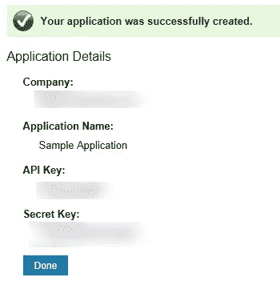

# Windows Phone 应用程序中的 LinkedIn

> 原文：<https://www.sitepoint.com/linkedin-from-a-windows-phone-app/>

到目前为止，您已经看到了用于认证和使用[脸书](https://www.facebook.com/sitepoint/)、[推特](https://www.sitepoint.com/twitter-in-a-windows-phone-7-app/)和 [Live Id](https://www.sitepoint.com/using-windows-live-id-in-a-windows-phone-7-app/) 的示例，涵盖了 OAuth 1 和 2。在这篇文章中，你会看到我们如何轻松地利用现有的代码来对抗 LinkedIn。

我们将从你在我之前关于 [Twitter 认证](https://www.sitepoint.com/twitter-in-a-windows-phone-7-app/)的文章中看到的代码开始。然而，在你做任何编码之前，你当然必须去 LinkedIn 注册一个应用程序。转到 [LinkedIn 开发者的](http://developer.linkedin.com)页面，使用您想要注册应用程序的账户登录。在右上角，您应该会看到带有下拉箭头的帐户名称。将鼠标悬停在箭头上，并选择 API Keys 菜单项。这将带您到一个现有应用程序的列表，最初可能是空的。单击“添加新申请”链接，并为您的新申请填写申请表。完成后，您应该看到确认您的帐户已经成功创建，类似于图 1，更重要的是 API 和密钥，您将需要它们来访问 LinkedIn APIs。



[](https://www.sitepoint.com/wp-content/uploads/2011/08/sp0011_01.png)

图 1

如果你还没有阅读我之前关于 Twitter 认证的文章，你应该现在就阅读，因为你需要这些代码。我们将首先修改作为认证过程一部分的 URL 常量，并添加`RedirectUrl`和`ReauthenticateUrl`。

```
private const string RequestUrl = "https://api.linkedin.com/uas/oauth/requestToken";
private const string AuthorizeUrl ="https://www.linkedin.com/uas/oauth/authorize";
private const string AccessUrl = "https://api.linkedin.com/uas/oauth/accessToken"; 
private const string RedirectUrl = "https://www.linkedin.com/uas/oauth/authorize/submit";
private const string ReauthenticateUrl = "https://www.linkedin.com/uas/oauth/authorize/oob";
```

您还需要将`ConsumerKey`和`ConsumerSecret`常量更新为您为 LinkedIn 应用程序分配的 API 和密钥。用你的钥匙替换`和`(包括尖括号)。``

```
private const string ConsumerKey ="<LinkedIn API Key>";
private const string ConsumerSecret ="<LinkedIn Secret Key>";
```

用户通过身份验证并授权您的应用程序访问他们的帐户后，web 浏览器将被重定向回在`RedirectUrl`(或`ReauthenticateUrl`)常量中指定的 URL，验证者 Pin(如 Twitter Auth 帖子中所述)将显示在屏幕上。LinkedIn 显示的页面布局略有不同，因此您需要调整用于提取 pin 的正则表达式。这里包含了整个`BrowserNavigated`方法，因为检查`RedirectUrl`或`ReauthenticateUrl`的第三行也有一个小的变化。

```
private void BrowserNavigated(object sender, NavigationEventArgs e) {
    if (AuthenticationBrowser.Visibility == Visibility.Collapsed) {
        AuthenticationBrowser.Visibility = Visibility.Visible;
    }
    if (e.Uri.AbsoluteUri.ToLower().StartsWith(RedirectUrl) ||
        e.Uri.AbsoluteUri.ToLower().StartsWith(ReauthenticateUrl))
        var htmlString = AuthenticationBrowser.SaveToString();
        var pinFinder = new Regex(@"<div class=""access-code"">(?<pin>[A-Za-z0-9_]+)</div>", RegexOptions.IgnoreCase);
        var match = pinFinder.Match(htmlString);
        if (match.Length > 0) {
            var group = match.Groups["pin"];
            if (group.Length > 0) {
                pin = group.Captures[0].Value;
                if (!string.IsNullOrEmpty(pin)) {
                    RetrieveAccessToken();
                }
            }
        }
        if (string.IsNullOrEmpty(pin)) {
            Dispatcher.BeginInvoke(() => MessageBox.Show("Authorization denied by user"));
        }
        // Make sure pin is reset to null
        pin = null;

        AuthenticationBrowser.Visibility = Visibility.Collapsed;
    }
}
```

与 Twitter 认证的另一个区别是，在这个过程的最后，LinkedIn 不会返回任何关于认证用户的信息。相反，您必须查询 profile API 才能访问这些信息。下面的代码演示了如何通过 HTTP 获取配置文件 URL。

```
private void RetrieveProfile() {
    var profileUrl = "http://api.linkedin.com/v1/people/~";
    var request = CreateRequest("GET", profileUrl);

    request.BeginGetResponse(result => {
                        try {
                            var req = result.AsyncState as HttpWebRequest;
                            if (req == null) throw new ArgumentNullException("result", "Request parameter is null");
                            using (var resp = req.EndGetResponse(result))
                            using (var strm = resp.GetResponseStream())
                            {
                                var xml = XElement.Load(strm);
                                var first_name = xml.Element("first-name").Value;
                                var last_name = xml.Element("last-name").Value;

                                Dispatcher.BeginInvoke(() => {
                                    UserNameText.Text = first_name + " " + last_name;
                                    MessageBox.Show("Profile retrieved");
                                });
                            }
                        }
                        Catch {
                            Dispatcher.BeginInvoke(() => MessageBox.Show("Unable to access profile"));
                        }
                    }, request);
}
```

最后，如果我们没有说明如何在 LinkedIn 上发布状态更新(LinkedIn 称之为“分享”)，这篇报道就不完整。

```
private void TweetClick(object sender, RoutedEventArgs e) {
    var share = @"<?xml version=""1.0"" encoding=""UTF-8""?>" +
                             "<share>" + 
                                 "<comment>Comment to share with the world</comment>" + 
                                 "<visibility>" + 
                                     "<code>anyone</code>" + 
                                 "</visibility>" + 
                             "</share>";
    var postUrl ="http://api.linkedin.com/v1/people/~/shares";
    var request = CreateRequest("POST", postUrl);

    request.BeginGetRequestStream(reqresult => {
        var req = reqresult.AsyncState as HttpWebRequest;
        using (var strm = req.EndGetRequestStream(reqresult))
        using (var writer = new StreamWriter(strm)) {
            writer.Write(share);
        }
        req.BeginGetResponse(result => {
            try {
                var req2 = result.AsyncState as HttpWebRequest;
                if (req2 == null) throw new ArgumentNullException("result", "Request parameter is null");
                using (var resp = req.EndGetResponse(result)) {
                    Dispatcher.BeginInvoke(() => MessageBox.Show("Tweeted!"));
                }
            }
            catch {
                Dispatcher.BeginInvoke(() => MessageBox.Show("Unable to tweet"));
            }
        }, req);
    }, request);
}
```

这就是你在 Windows Phone 应用程序中验证、授权和发布到 LinkedIn 的基本细节。`` 

## ``分享这篇文章``