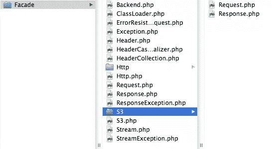

# 一个改头换面的 PHP 开发者的自白:命名空间超级英雄！

> 原文：<https://www.sitepoint.com/confessions-of-a-converted-php-developer-namespace-superheroes/>

当你开始编写超过几个类的代码时，你开始意识到你需要一种方法来组织文件和逻辑。虽然这很容易做到，但要确保您的类名是唯一的，并且不会意外地与您自己代码中的其他类或您正在使用的其他人代码中的类发生冲突，可能会变得相当困难。

## 名称空间！这就是你想要的。

名称空间是将代码封装到特定库或区域的一种方式。这很容易被视为创建不太可能与其他类冲突的类的一种方式。如果你有一个名为 foo 的类，然后开始使用一个类库，其中也包括一个名为 foo 的类，那么你就有麻烦了，因为你现在有两个同名的类。在 PHP 中，你会以一个丑陋的错误结束——这实际上是很好的，因为你能够跟踪它。在 Ruby 中，你最终会得到一个两个类合二为一的弗兰肯斯坦——这肯定不好。

为了解决这个问题，编程语言需要一种方法来将类似的项目组合到它们自己的封装区域中，以便代码的一个域可以与代码的另一个域具有相同的类。其中一个组的术语是*名称空间*。

自 Ruby 诞生以来，命名空间就一直是它的核心部分——只是没有正式命名为 Ruby 而在 PHP 中，它是一个相对较新的功能。因此，在许多 PHP 库中有一种半事实上的命名约定，将类映射到文件夹作为命名空间的一种形式。虽然这可以创建独特的类，但也使代码有些冗长和难看。

## PHP 缺乏命名空间

PHP 仅在 2009 年 6 月底发布的版本 5.3 中引入了适当的命名空间，引起了很大的轰动，从我的经验来看，这个版本的应用非常缓慢。我将这归因于一个主要事实，那就是向后兼容。不幸的是，托管社区对 PHP 新版本的接受非常缓慢，因此 PHP 5.3 对大部分用户群来说是不可用的。PHP 5.3 在已知使用 PHP 的[网站中占不到 9%。对于一个开发人员来说，在他们的库中使用名称空间实际上是切断了一个大的用户基础，虽然这不是扼杀一个特性的使用的借口——你可以理解为什么一些开发人员不愿意这样做。](http://w3techs.com/technologies/details/pl-php/5.3/all)

### PHP 的伪命名空间

在 PHP 中提供官方名称空间支持之前，通常根据类的文件夹结构用一种伪名称空间来定义类，添加下划线来区分新的文件夹或文件。

使用这种方法的库的一个例子是库[外观](https://github.com/lox/facade)。



外观的文件结构

我们可以看到在`Facade/S3`文件夹中有一个`Request.php`文件。按照这个伪命名空间，我们以一个名为`Facade_S3_Request`的类结束。这也使得自动加载器很容易找到要加载的文件。如果你问`Facade_S3_Request`，很容易找到`Facade/S3/Request.php`。

这很有效，除了您不得不在库代码和必须使用它的代码中使用冗长的类名。当您开始使用大型代码库时，这可能会变得有点难看——这里是我使用的库中的一个类名:`HTMLPurifier_AttrDef_URI_Email_SimpleCheck`。

### PHP 的官方命名空间

名称空间是通过使用 PHP 文件顶部的`namespace`关键字定义的(它必须在那里)，就像这样:

```
<?PHP
namespace Foo;

// or alternatively

namespace Foo{
# code here
}
```

命令之后的所有代码都在 Foo 名称空间中。

您还可以通过用反斜杠字符分隔子名称空间来分配它们。

```
<?PHP
namespace FooBar;

class MyClass
{
	public function hello()
	{
		return "Hello World";
	}
}
```

现在你可以用两种方法中的一种来使用这个代码，首先:

```
<?PHP
include 'my_class.php'; // Let's assume our previous code is in this file
echo FooBarMyClass::hello();
```

这使用完全限定的命名空间来引用该类，或者其次:

```
<?PHP
use FooBar;
include 'my_class.php'; // Remember our assumption from before...

echo BarMyClass::hello();
```

我们告诉 PHP 我们想要使用`FooBar`名称空间，然后我们调用`BarMyClass`。你可能认为我们可以调用没有`Bar`部分的`MyClass`,虽然这有道理——但事实并非如此。

只有当您研究 PHP 名称空间的别名方式时，它才真正有意义。`use FooBar`和说`use FooBar as Bar`一样——也就是说`Bar`是`FooBar`的别名。你可以说`use FooBar as Potato`，然后打`echo PotatoMyClass::Hello()`。迷惑？*是*。有用吗？*在某种程度上*。

有一堆关于优先级的规则和一些更多的特性，但是我已经讲了足够多的 PHP 了。您是为 Ruby 而来的，所以让我们看看 Ruby 是如何实现名称空间的。您可以在这个系列的 [SitePoint 文章](https://www.sitepoint.com/php-53-namespaces-basics/)中阅读更多关于 PHP 名称空间的内容。

## Ruby 模块，呃…名称空间！

当[谈论 mixins](https://www.sitepoint.com/confessions-of-a-converted-php-developer-mixing-like-a-baker/) 时，我们已经看到了 Ruby 模块的运行，但是它们也是 Ruby 创建名称空间的内置方式。

### 基本命名空间

```
module Good
	class Person
		def self.Welcome
			puts "Well, Hello World!"
		end
	end
end

module Evil
	class Person
		def self.Welcome
			puts "I will kill ye' all."
		end
	end
end
```

我们现在有两个模块，它们有独立的`Person`类，每个都有自己的`Welcome`方法。我们可以通过使用标准的模块操作符来访问它们。

```
Good::Person.Welcome
> "Well, Hello World!"

Evil::Person.Welcome
> "I will kill ye' all."
```

或者，我们可以将它包含到另一个类中，并删除模块名。

```
class HelloWorld
	include Good
	def self.WelcomeMessage
		Person.Welcome
	end
end

HelloWorld.WelcomeMessage
> "Well, Hello World!"
```

所以我们所做的是创建一个新的类，它包含了`Good`模块。在`WelcomeMessage`类方法中，我们简单地称之为`Person.Welcome`，因为我们已经包含了`Good`模块，`Person`指的是`Good::Person`。

### 应用多个“命名空间”

这种命名空间的方法很有趣，因为它允许您用`include`语句应用多个模块，并且这些方法将简单地相互覆盖，但是留下在后面的模块中不可用的方法。我们可以通过做两件事来看到这一点。首先，我们将向`Good`模块添加一个新类，并在`HelloWorld`类中调用我们的`WelcomeMessage`方法，其次，我们将告诉`HelloWorld`类包含`Evil`——这将覆盖`Good`中的任何类，这些类也在`Evil`中。

```
module Good
	class Animal
		def self.Welcome
			puts "Meow."
		end
	end
end

class HelloWorld
	include Evil
	def self.WelcomeMessage
		Person.Welcome
		Animal.Welcome
	end
end

HelloWorld.WelcomeMessage
> "I will kill ye' all."
> "Meow."
```

所以我们在这里看到的输出是来自`Good`和`Evil`的混合。我们首先包含了`Good`，它给了我们`Person`和`Animal`类，但是当我们包含`Evil`时，它覆盖了`Person`类——但没有覆盖`Animal`类，因为在`Evil`中没有定义。嘣！

### 嵌套模块

Ruby 中的模块非常多才多艺，你可以将它们嵌套在彼此内部来构建多级名称空间(从技术上来说，你也可以将它们嵌套在类中，因为`Class`是`Module`的子类，但是一步一步来，嗯？).

```
module SuperHeroes
	module JusticeLeague
		class Batman
		end
		class Superman
		end
	end
	module Avengers
		class IronMan
		end
		class CaptainAmerica
		end
	end
end
```

这里我们创建了一个模块`SuperHeroes`作为超级名称空间，然后创建了两个子模块`JusticeLeague`和`Avengers`作为子名称空间。这些子名称空间中的每一个都有几个超级英雄被定义为类。

我们现在可以在另一个类中包含这些子命名空间中的任何一个，例如:

```
class MyHeroes
	include SuperHeroes::Avengers
end

MyHeroes.constants
> [:IronMan, :CaptainAmerica]
```

我已经将复仇者包含到我的`MyHeroes`类中，然后列出了可用的常量(在本例中，是包含的类)。它给了我们`IronMan`和`CaptainAmerica`。

### 模块/类快捷方式

如果知道已经创建了模块，可以简化模块或类的命名。如果我们从前面继续，我们可以用这个简写创建一个新的模块。

```
module SuperHeroes::SHIELD
	class NickFury
	end
end
```

这很好，但是**只有**，因为我们已经定义了`SuperHeroes`模块。如果我在没有预定义模块的情况下尝试这样做，我会得到一个错误。

```
module IHave::NoFriends
end

> NameError: uninitialized constant Object::IHave
```

## 这是所有的乡亲

今天我们已经介绍了在 Ruby 中命名代码的方法，以及它与 PHP 的不同之处。谈到 Ruby 中的模块，我只是触及了皮毛，它们是真正的多功能和复杂的野兽！

如果你有任何关于使用模块的建议，请在评论中告诉我们！

## 分享这篇文章