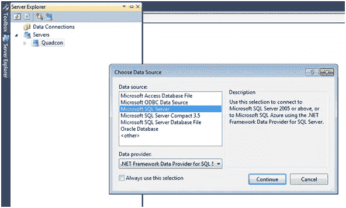
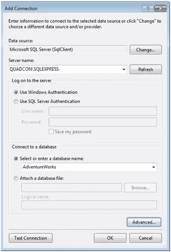
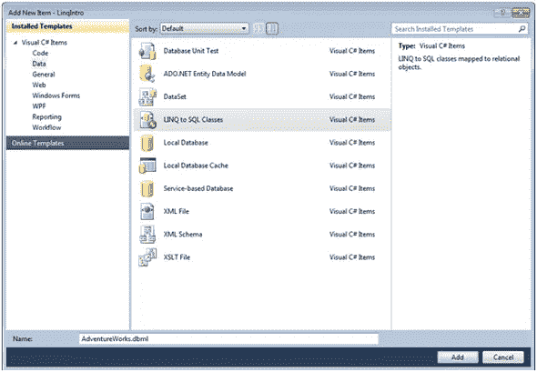
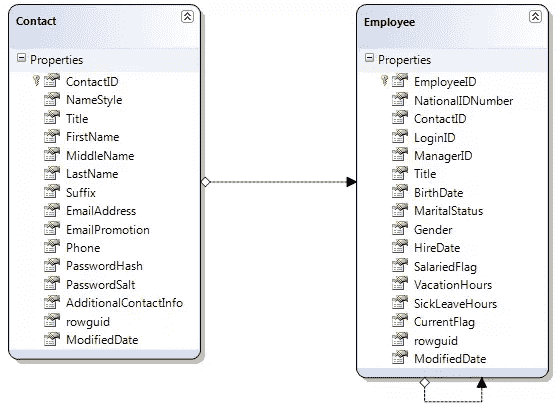
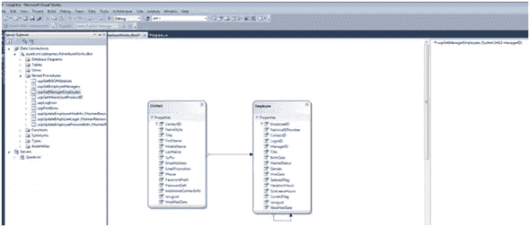
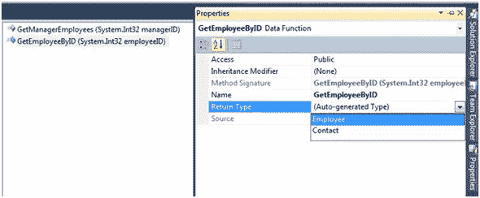
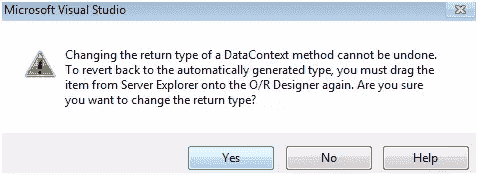
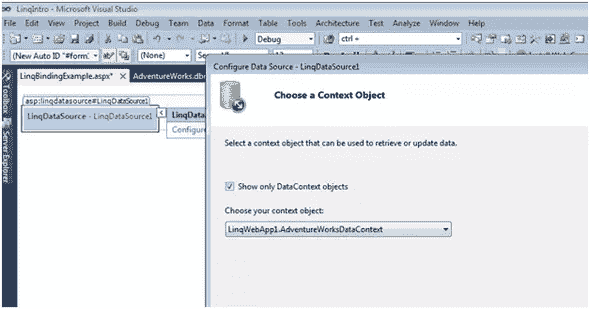
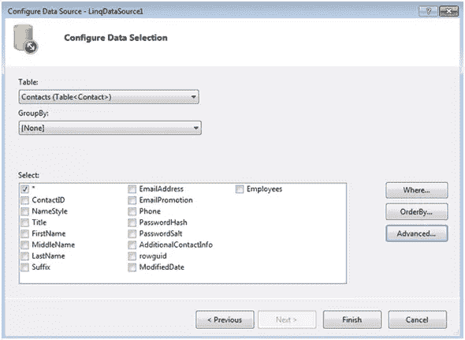
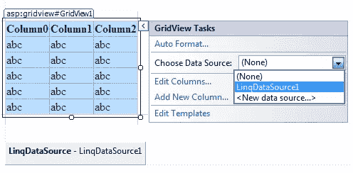

# LINQ 简介

> 原文：<https://www.sitepoint.com/introduction-to-linq/>

语言集成查询——LINQ——是一种新的数据访问特性，正如它所说的那样:允许从语言本身查询数据源。

通常在。NET 中，我们使用 ADO.NET 等技术直接查询关系数据库管理服务器，如 SQL Server 或 MySQL。LINQ 在这方面更进了一步，它允许从这些相同的 DBMS 源进行查询，但使用的是面向对象的技术。

借助 LINQ，我们可以进行编译时语法检查，使用智能感知，并能够访问其他数据源，如 XML 或任何自定义数据源。有很多 LINQ 扩展，比如 LINQ 到 SQL，LINQ 到 Sharepoint，LINQ 到 MySQL 等等。

让我们从 LINQ 开始，给你一个语法的直接感受。

```
 // create an array of integers
  int[] sampleNumbers = { 1, 2, 3 };

  IEnumerable doubledNumbers = from i in sampleNumbers
                                  select i * 2;

  // produces "2, 4, 6";
  foreach (int number in doubledNumbers)
  	Console.WriteLine(number); 
```

名为`doubledNumbers`的`IEnumerable`变量包含查询表达式的输出。如您所见，语法类似于 SQL。然而微软引入了“选择器”(在我们的例子中是“我”)。

随着我们对 LINQ 语法的深入研究，这些选择器将变得更加明显。此示例仅显示了一组数字。在我们的例子中，我们知道我们期待整数的返回。然而，为了帮助我们在运行时不知道确切的返回类型，微软引入了`var`关键字。

```
// create an array of integers
int[] sampleNumbers = { 1, 2, 3 };

var squaredNumbers = from i in sampleNumbers
                     select i * i;

// produces "1, 4, 9";
foreach (int number in squaredNumbers)
Console.WriteLine(number); 
```

所以像大多数懒惰的程序员一样，我们将使用`var`关键字来允许编译器在适当的时候确定类型。

让我们用另一个 LINQ 语法的例子来介绍 WHERE 子句，因为我们经常需要数据的子集。

```
 // create an array of random fruits
  string[] fruits = { "Blueberry", "Banana", "Orange", "Peach", "Kiwi", "Blackberry" };

  var fruitsStartingWithB = from f in fruits
                            where f.StartsWith("B") && f.Contains("berry")
                            select f;

  // produces "Blueberry, Blackberry"
  foreach (var fruit in fruitsStartingWithB)
  	Console.WriteLine(fruit); 
```

这里我们使用标准的“AND”(`&&`)操作符作为 C#的一部分。WHERE 子句中还有“OR”(`||`)运算符。

### 扩展方法

LINQ 大量使用扩展方法，以便按照我们需要的方式操作我们的数据。这些特性之一是`First()`扩展方法。这将获取结果中的第一项并返回它。它可以按如下方式使用:

```
string[] fruits = { "Blueberry", "Banana", "Orange", "Peach", "Kiwi", "Blackberry" };

string berry  = (from f in fruits
                 where f.StartsWith("B") && f.Contains("berry")
                 select f).First();

// Output is "Blueberry"
Console.WriteLine(berry);
```

在后续文章中，我们将讨论更多的扩展方法，这些方法允许我们对结果集进行更多的控制，并对 LINQ 功能进行微调。

### LINQ 到 SQL

在处理非面向对象的数据结构时，这对我们有什么帮助呢？让我们看看 LINQ 如何在处理关系数据时帮助我们。

我们从作为**微软 SQL Server 2008 R2 快车**版的一部分的 **AdventureWorks** 示例数据库中的一个简单查询开始。此处可下载[的速成版。您可以从 Microsoft CodePlex 获得 AdventureWorks 示例数据库，可从这里获得](https://www.microsoft.com/betaexperience/pd/SQLEXPDBMT64/enus/)。

一旦安装了 SQL Server 2008 Express Edition，您将需要“附加”AdventureWorks 示例数据库。为此，打开 **SQL Server 2008 管理工作室**。右击**数据库**，选择**任务- >附加数据库**。在安装位置选择`.mdf`文件，然后就可以开始示例练习了。

接下来，我们在 **Visual Studio** 中用**服务器资源管理器**工具栏窗口创建一个服务器连接。





为了连接到我们的 SQL Express 实例，我们选择 **Microsoft SQL Server** 数据源选项。然后我们简单地选择 **SQLEXPRESS** 实例和 AdventureWorks 数据库作为默认数据库选项。

接下来，我们向项目中添加一个新项。为了将 LINQ 与 SQL 数据源结合使用，我们选择创建一个 LINQ 到 SQL 的数据类。最简单的解释是，LINQ 到 SQL 将面向对象的类与 SQL 数据库表进行映射，也称为对象关系映射器。

还有其他可用的 ORM 框架，比如 nHibernate 或者亚音速。每一种都有自己的优点和缺点，但是为了撰写本文，我们将重点放在 LINQ 到 SQL 的特性上。



我们将这个`.dbml`文件命名为`AdventureWorks.dbml`。一旦您创建了它，您就可以从一张空白的石板开始创建实体。实体是一种强类型数据结构，通常用于表示业务关系或对象。微软已经引入了 ADO.NET 实体框架的**，进一步发展了这些先进的概念。这些话题超出了我们目前讨论的范围，以后可能会讨论。**

在我们的示例中，我们需要一个名为“Employee”的实体，它代表 AdventureWorks corporation 中某个雇员的一个实例。屏幕上的细节显示，您可以使用**工具箱**创建一个新实体，但是我们希望通过打开**服务器浏览器**来拖放 Employees 表，从而利用创建的数据源连接到 SQL Express 实例的能力。

结果是一个名为“Employee”的新实体对象(注意，它是“Employees”表名的单数形式，由 Visual Studio 自动命名)。Visual Studio 不仅为我们创建实体，它还为一个`DataContext`对象自动生成代码。这个`DataContext`对象表示与数据源的连接，在我们的例子中是 SQL Express 数据库连接。

`DataContext`还跟踪对所有实体的所有更改，并作为将实体记录插入、更新或删除回其主数据源(“雇员”数据库表)的参考点。这些对象被设计为一次性使用，因为它们是轻量级的，在创建数千个实例时没有明显的影响。

此外，`DataContext`不同于打开 SqlConnection 然后执行查询的标准 ADO.NET 方式；执行 LINQ 查询时生成的 SQL 在运行时执行，连接管理也是如此。

在一行中创建一个`DataContext`:

```
AdventureWorksDataContext dataContext = new AdventureWorksDataContext();
```

`DataContext`是根据之前创建的 DBML 文件创建并命名的。如果你将你的 DMBL 命名为`Sample.dbml`，那么你的`DataContext`将被命名为`SampleDataContext`。

此时，Visual Studio 已经使用 DBML 类的自动生成代码连接了所有内容。从 Solution Explorer 窗口中，您可以通过右击文件**查看代码**，来浏览这个为`AdventureWorks.dbml`文件自动生成的代码。请确保不要在这里进行任何永久性的更改，设计器的任何更改都会自动覆盖自动生成的代码文件中的任何更改。

我们现在可以使用 LINQ 查询雇员数据表。例如，我们只寻找女性员工。出于这些练习的目的，您可以假设我们在源代码顶部的“使用”部分使用了相同的引用名称空间:

```
using System;
using System.Collections.Generic;
using System.Linq;
using System.Text;

AdventureWorksDataContext dataContext = new AdventureWorksDataContext();

var employees = from emp in dataContext.Employees
                where e.Gender == 'F'
                select emp;

// produces a list of employee IDs for all female employees
foreach (var employee in employees)
Console.WriteLine(employee.EmployeeID); 
```

### 更新数据

Employees 表中的一列是 MaritalStatus 列。这是一个字符字段，对于单身员工为“S ”,对于已婚员工为“M”。由于女性结婚人数激增，人力资源部决定将所有人都标记为已婚。

我们的例子是使用 LINQ 到 SQL 来执行这个更新。

```
using (AdventureWorksDataContext dataContext = new AdventureWorksDataContext())
{
var employees = from e in dataContext.Employees
                       where e.Gender == 'F'
                       select e;

// produces a list of employee IDs for all female employees
foreach (var employee in employees)
{
  employee.MaritalStatus = 'M'; // all changes have not been persisted to the database.
  Console.WriteLine(employee.EmployeeID + " is now married.");

}

       // Send changes to the database.
       dataContext.SubmitChanges();

} 
```

这里的更改似乎很简单，但是需要注意的一点是，在调用`DataContext`的`SubmitChanges()`方法之前，对 Employee 实体记录的更改不会保存(持久化)到数据库中。

### 关系

到目前为止，我们只处理了一个雇员表。我们的 Employee 实体有一个 ContactID 属性，它是 Contacts 表的引用键。Visual Studio 的 DBML 设计器工具将自动识别数据库中的外键。我们只需将 SQL Express 连接的“服务器资源管理器”窗口中的“联系人”表拖放到 DBML 设计器中，让 Visual Studio 为我们创建联系人实体对象。

设计器视图现在看起来像这样:



我们现在可以引用每个员工的个人身份信息。让我们为人力资源部准备一份报告，列出 2002 年以后雇用的员工名单。

```
using (AdventureWorksDataContext dataContext = new AdventureWorksDataContext())
{
   var employees = from e in dataContext.Employees
   		     where e.HireDate > DateTime.Parse("2002-01-01")
                   select e;

   foreach (var employee in employees)
       Console.WriteLine(employee.Contact.FirstName + " " + employee.Contact.LastName);

} 
```

### 从 DataContext 直接执行查询

此时，您可能很熟悉通过 point 和/或存储过程直接调用标准 ANSI SQL 到数据库。LINQ 到 SQL 通过`ExecuteQuery()`方法调用支持这些直接查询。这个方法有两个被覆盖的参数，一个标准版本将一个`Type`作为它的第一个参数，或者一个通用版本返回给定的通用输入类型。

```
ExecuteQuery(String SqlQuery, Object[] Parameters)
```

```
ExecuteQuery(Type result, String sqlQuery, Object[] Parameters)
```

当在通用版本中使用`ExecuteQuery`时，我们打算使用 Employee 实体类型，这样我们就可以访问与 Contact 实体的关系，以获得雇员的名字和姓氏。因此，为`ExecuteQuery()`调用使用泛型方法签名符合我们的利益。

```
using (AdventureWorksDataContext dataContext = new AdventureWorksDataContext())
{

   var employees = from e in dataContext.Employees
  where e.HireDate > DateTime.Parse("2002-01-01")
                select e;

  var emps = dataContext.ExecuteQuery("SELECT * FROM HumanResources.Employee        WHERE HireDate > '2002-01-01'");

  foreach (var currentEmployee in emps)
Console.WriteLine(currentEmployee.Contact.FirstName + " " + currentEmployee.Contact.LastName);

Console.WriteLine("----------------");

 foreach (var employee in employees)
    Console.WriteLine(employee.Contact.FirstName + " " + employee.Contact.LastName);

} 
```

运行此示例时，您应该会收到两次查询执行的相同结果。此外，LINQ 到 SQL 还支持直接查询执行，其中 SQL 执行不需要任何返回参数，例如删除记录，使用`Execute()`方法手动插入或更新记录。

人力资源部要求我们改变之前让所有女性员工结婚的政策。现在他们想让我们把他们都变成单身。我们将通过 LINQ 到 SQL 的直接查询执行来实现这一点。

```
using (AdventureWorksDataContext dataContext = new AdventureWorksDataContext())
 {
     int rowsAffected = dataContext.ExecuteCommand("UPDATE HumanResources.Employee WITH(ROWLOCK) SET MaritalStatus = 'S' WHERE Gender = 'F' ");

     // should display "Execution completed, 84 rows affected."
     Console.WriteLine("Execution completed, {0} rows affected", rowsAffected);

 } 
```

### LINQ 到 SQL 的存储过程

我最喜欢的 LINQ 到 SQL 的特性之一是对 LINQ 的存储过程支持。LINQ 到 SQL 将存储过程视为标准方法调用。作为 AdventureWorks 数据库的一部分，有一个名为“uspGetManagerEmployees”的存储过程。

为了使 LINQ 到 SQL 能够集成这个存储过程调用，我们从服务器资源管理器窗口执行一个拖放操作，在这里我们从 SQL Express 连接中选择**存储过程**到我们的 DBML 设计器的右窗格中。



Visual Studio 现在将创建名为`uspGetManagerEmployees()`的方法。因为方法调用不需要“usp”前缀，所以我们右键单击它，选择**属性**，并将其重命名为“`GetManagerEmployees()`”。我们现在可以在代码中调用这个过程:

```
using (AdventureWorksDataContext dataContext = new AdventureWorksDataContext())
  {
        var employees = dataContext.GetManagerEmployees(185);

        foreach (var currentEmployee in employees)
           Console.WriteLine(currentEmployee.FirstName + " " + currentEmployee.LastName);

  } 
```

注意来自`GetManagerEmployees()`调用的返回类型是一个`ISingleResult`对象。这就是`var`关键字有用的地方，因为我们可能不知道完整的返回类型。在**设计器视图**中过程调用的属性显示结果类型是**自动生成的**。

但是，如果我们希望设计者将这个返回强类型化为一个已知的实体类型，该怎么办呢？为了进行这个示例，我们首先创建一个名为“`uspGetEmployeeByID`”的新存储过程:

```
CREATE PROCEDURE uspGetEmployeeByID
	-- Add the parameters for the stored procedure here
	@EmployeeID int = 0

AS
BEGIN
	-- SET NOCOUNT ON added to prevent extra result sets from
	-- interfering with SELECT statements.
	SET NOCOUNT ON;

    -- Insert statements for procedure here
	SELECT * FROM HumanResources.Employee where EmployeeID = @EmployeeID
END
GO 
```

从设计器视图中，我们将这个过程调用拖放到设计器视图的右侧窗格中。然后我们重命名方法调用，去掉“usp”前缀。此外，我们打算将结果类型改为 Employee 实体。



当您做出此选择时，您将收到一条警告，提醒您此更改是单向的。您无法撤消此更改。如果需要对存储过程进行调整，必须删除该方法调用，然后使用服务器资源管理器窗口中的拖放操作重新添加它。



一旦我们对所做的更改感到满意，我们就可以通过使用`DataContext`对象来调用这个新的存储过程。

```
using (AdventureWorksDataContext dataContext = new AdventureWorksDataContext())
{

   Employee jefferyFord = dataContext.GetEmployeeByID(15).First();

   Console.WriteLine(jefferyFord.Contact.FirstName + " " + jefferyFord.Contact.LastName);

} 
```

### 使用 ASP.NET 和 LINQ 到 SQL

LINQ 允许将完全可绑定的对象作为数据源。这允许我们用 LINQDataSource 构建功能齐全的数据网格。首先，我们将一个`LinqDataSource`从 **Visual Studio 工具箱**边栏菜单拖放到一个标准的**ASP.NET Web 表单** `.aspx`页面上。在页面上突出显示这个新对象后，我们现在可以配置这个`DataSource`来为 AdventureWorks 数据库使用我们的`DataContext`对象。



出于本示例的目的，我们只需要一个标准 ASP.NET datagrid 控件的只读数据源。我们这样配置我们的`LinqDataSource`对象:



通过选择所有列，我们有足够的信息来显示我们希望显示的雇员记录的名字和姓氏。配置数据源时可以使用更多高级功能，例如自定义查询或自定义 order by 子句，当记录从 LINQ 查询返回时，该子句会对记录进行预排序。

此外，`LinqDataSource`允许配置自动编辑、插入和删除命令。这些高级主题超出了本教程的范围，以后可能会讨论。

接下来，我们继续向页面添加一个标准的`GridView`控件。我们现在可以配置这个网格来使用我们之前创建的`LinqDataSource`。



我们选择新创建的`LinqDataSource1`对象作为**网格视图**的数据源。在我们选择这个之后，`GridView`控件将立即改变以反映`LinqDataSource`对象的新模式。

现在，您可以在浏览器中查看页面了。请注意，该页面可能需要一些时间才能完全加载，因为当前将`LinqDataSource`配置为从 AdventureWorks 数据库的 Contacts 表中返回所有行和列。

要为 HR 准备一份显示所有员工及其电子邮件地址列表的报告，我们可以从`GridView`的`SmartTag`弹出菜单中选择**编辑列**任务，并只选择我们希望显示的列。

的完整 HTML。aspx 页面应该如下所示:

```
<!DOCTYPE html PUBLIC "-//W3C//DTD XHTML 1.0 Transitional//EN" "https://www.w3.org/TR/xhtml1/DTD/xhtml1-transitional.dtd">
<html >
<head runat="server">
    <title></title>
</head>
<body>
    <form id="form1" runat="server">
    <div>
        <asp:GridView ID="GridView1" runat="server" AutoGenerateColumns="False"
            DataKeyNames="ContactID" DataSourceID="LinqDataSource1">
            <Columns>
                <asp:BoundField DataField="ContactID" HeaderText="ContactID"
                    InsertVisible="False" ReadOnly="True" SortExpression="ContactID" />
                <asp:CheckBoxField DataField="NameStyle" HeaderText="NameStyle"
                    SortExpression="NameStyle" />
                <asp:BoundField DataField="Title" HeaderText="Title" SortExpression="Title" />
                <asp:BoundField DataField="FirstName" HeaderText="FirstName"
                    SortExpression="FirstName" />
                <asp:BoundField DataField="MiddleName" HeaderText="MiddleName"
                    SortExpression="MiddleName" />
                <asp:BoundField DataField="LastName" HeaderText="LastName"
                    SortExpression="LastName" />
                <asp:BoundField DataField="Suffix" HeaderText="Suffix"
                    SortExpression="Suffix" />
                <asp:BoundField DataField="EmailAddress" HeaderText="EmailAddress"
                    SortExpression="EmailAddress" />
            </Columns>
        </asp:GridView>
        <br />
    </div>
    <asp:LinqDataSource ID="LinqDataSource1" runat="server"
        ContextTypeName="LinqWebApp1.AdventureWorksDataContext" EntityTypeName=""
        TableName="Contacts">
    </asp:LinqDataSource>
    </form>
</body>
</html> 
```

### 最后的想法

总的来说，LINQ 是一个强大的工具，允许你快速开发你的代码，花更少的时间在数据管理方面。

这提高了我们的工作效率，因为我们可以查询 Visual Studio 中的所有数据，而不需要了解数据库服务器的底层结构，甚至不需要了解数据源本身。

## 分享这篇文章