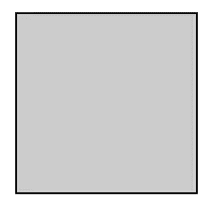
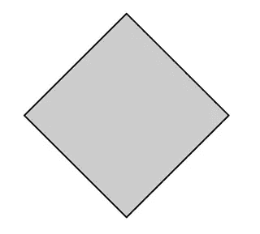
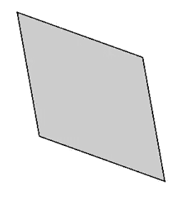

# CSS3 转换入门

> 原文：<https://www.sitepoint.com/a-primer-on-css3-transforms/>

*编者按:上周，我们在 CSS3 Transforms 上收录了来自真实世界的 [HTML5 & CSS3 的独家摘录，款待了《科技时报》的订阅者(是的，如果你还没有订阅《TT》，](https://www.sitepoint.com/books/htmlcss1/)[你应该订阅](https://www.sitepoint.com/newsletter/))。*

然而，作者非常渴望与我们的在线读者分享其中的一些内容，因此 Louis Lazaris 编写了这本关于 CSS3 转换的入门书——另外还有一些额外的技巧和窍门。

CSS3 令人兴奋的新增功能之一是包含 CSS 规范中的 [CSS3 2D 变换](https://www.w3.org/TR/css3-2d-transforms/)模块的特性集。

通过对规范的这些补充，开发人员能够以非常规的方式修改元素。在本文中，我将通过一些代码示例和一些使用建议向您介绍 CSS3 转换。

### 为什么我们需要 CSS3 转换？

我们可以用 CSS3 转换做的任何事情也可以用其他 web 技术来完成。例如，使用 JavaScript、SVG 或 Canvas，理论上您可以找到方法来做 CSS3 转换可以做的任何事情。

但是使用其他方法进行简单元素转换的开销和可维护性成本是一个巨大的缺点，因此 CSS3 Transforms 模块有助于缓解其中的一些问题。

有了简单的基于 CSS 的语法，并且(理想情况下)没有不必要的 JavaScript，元素转换变得更容易处理。让我们从基本语法开始。

### 基本语法

典型的 CSS3 转换如下所示:

```
#element {
    transform: function(a, b);
}
```

除了值之外，CSS3 转换看起来与任何其他 CSS 属性完全相同，因此您可以立即看到在项目中学习使用转换是多么容易。

那么冒号后面出现的不太典型的值呢？在上面的例子中，您会注意到这个值是斜体的，表示这部分转换相当灵活。

与 JavaScript 函数类似，transform 属性接受一个或多个函数，每个函数都有一个或多个参数。允许的参数数量取决于所使用的函数。

### 在单个元素上定义多个转换

如果您想对单个元素应用多个函数，那么您可以使用单个`transform`属性和用空格分隔的函数来实现。下面是一个定义了两个函数的示例:

```
#element {
    transform: function(a, b) function(a, b);
}
```

如果您不小心使用了逗号来分隔函数，整个值将被视为无效，并且没有一个函数适用，所以这一点要记住。

现在我们已经介绍了语法，让我们看看规范中定义的函数。

### Translate 函数:CSS 定位的替代方法

我们将介绍的第一个转换函数是`translate`函数。`translate`函数听起来比实际更复杂。

通常，如果您想要相对于视窗或者相对于它的父元素移动一个元素，您可以使用 CSS `position`属性，以及`top`、`bottom`、`left`和`right`属性。

`translate`函数提供了类似的东西，但是更容易使用。这里有一个例子:

```
#element {
    transform: translate(25px, 50px);
}
```

在上面的例子中，`translate`函数被传递了两个参数:第一个表示沿 X 轴的定位，而第二个参数(可选)表示沿 Y 轴的定位。因此，在这种情况下，所讨论的元素将被定位在右侧 25px(或水平方向)和下方 50px(或垂直方向)。

第二个参数(沿 Y 轴的位置)是可选的，但如果省略，其初始值为零。您还可以选择使用其他单位(例如，百分比或 ems)，负值是允许的，因此有一定的灵活性。

最后，您还可以使用 translateX 和 translateY 函数分别为 X 轴和 Y 轴声明平移函数，每个函数都接受一个参数。

### 其他转换函数

CSS3 `transform`属性提供了一些其他有用的函数以及它们各自的参数值。

#### 缩放元素

接受一个或两个参数的`scale`函数将沿着 X 和 Y 轴放大或缩小一个元素。下面的例子说明了它的用法:

```
 #element {
    width: 200px;
    height: 200px;
    transform: scale(3, 3);
}
```

上面的目标元素有一个设定的高度和宽度(200px 乘 200px)，但是由于具有指定参数的 scale 函数，该元素将显示为所述尺寸的三倍。

因此，每个参数的值必须是没有单位的数字。允许使用十进制表示法，如果省略第二个参数，它将假定与第一个参数的值相同(这与 translate 函数不同，translate 函数将第二个缺少的参数默认为零)。因此,`scale(3)`的值将与上面示例中显示的值相同。

值`scale(1)`将保持元素的当前大小(这等同于完全省略 transform 属性)。值“0”会将元素缩小到零，这实际上相当于`display: none`。

与`translate`功能一样，您可以使用`scaleX`或`scaleY`仅沿一个轴缩放。

#### 旋转元素

CSS3 变换还有一个`rotate`函数，信不信由你，它可以让你顺时针(正值)或逆时针(负值)旋转一个元素。这里有一个例子:

```
#element {
    width: 200px;
    height: 200px;
    background: #ccc;
    border: solid 2px black;
    transform: rotate(45deg);
}
```

如果我从该元素中移除`transform`属性，它将看起来像这样:



应用 45 度旋转后，它将变为:



`rotate`函数只接受一个参数，如前所述，正值或负值将决定元素旋转的方向。用于定义旋转角度的单位是度(表示为“deg”)，您可以使用十进制表示法。

#### 倾斜元素

规范中定义的另一个函数是`skew`函数，它沿着 X 或 Y 轴倾斜一个元素。下面是上面的同一个元素是如何被扭曲的:

```
#element {
    width: 200px;
    height: 200px;
    background: #ccc;
    border: solid 2px black;
    transform: skew(45deg, 30deg);
}
```

下面是它在浏览器中的样子:



这两个参数都以度表示，第二个参数是可选的。如果省略第二个，则假定沿 Y 轴的倾斜值为“0”(这意味着没有倾斜)。

同样，您可以选择使用`skewX`和`skewY`来瞄准单个轴。

#### `transform-origin`属性

我们将在这里介绍的最后一个与转换相关的特性是`transform-origin`属性。这是一个完全独立的属性，它与`transform`属性一起决定每个转换的来源。

让我们弄清楚这到底是如何工作的。还记得我之前用的音阶例子吗？好吧，如果缩放元素被放置在页面的左上角，元素的一部分在被放大时会被切掉。这是因为默认情况下，缩放是从对象的中心向外进行的(假设您没有使用负值)。

但是我们可以改变这种行为。在这种情况下，为了确保元素保持完全可见，您希望它向下向右缩放。我们会这样做:

```
#element {
    width: 200px;
    height: 200px;
    transform: scale(3);
    transform-origin: top left;
}
```

这确保了变换的“原点”是元素的左上角。`transform-origin`属性接受百分比、像素、ems 或关键字`top`、`left`、`center`、`right`和`bottom`形式的值。

`transform-origin`属性的初始值是“50% 50%”，如果省略，则假定第二个值为“center”。

### 记下占用的空间

在向元素添加转换时要记住的一件重要事情是，转换不会影响它们周围的元素流。例如，如果您放大或缩小某个元素，这不会导致其周围的元素移动以适应该元素的新大小。

类似地，如果你使用`translate`函数垂直或水平移动一个元素，它不会在平移的方向上推动其他元素。

此外，元素在应用变换之前占据的任何空间都将保持不变。这类似于`visibility: hidde` n 的工作原理；它会使一个元素在视觉上消失，但它所占据的空间将会保留。

### 使用建议

CSS3 转换不是动画。这些“转换”不会随着时间的推移而发生，但是像习惯的 CSS 规则一样，会立即应用。

当您将变换与基于脚本的效果、CSS 悬停状态、CSS3 过渡甚至基于 CSS3 关键帧的动画相结合时，它们的真正威力就会得到利用。

因此，虽然在某些情况下，将变换应用于静态对象可能有价值，但在过渡或动画的上下文中，您会发现更多的变换可能性。

### 浏览器支持

相对而言，对 CSS3 转换的支持相当强大。目前唯一占有很大市场份额但不支持转换的浏览器是 IE6-8。所有其他浏览器——甚至是 IE9+—都支持转换。

但是，有一个问题:在撰写本文时，还没有浏览器支持标准语法，所以我在本文中使用的代码示例将不起作用。因此，与许多 CSS3 属性一样，您需要使用供应商前缀，如下例所示:

```
#element {
    -webkit-transform: scale(3, 3);
    -moz-transform: scale(3, 3);
    -o-transform: scale(3, 3);
    -ms-transform: scale(3, 3);
    transform: scale(3, 3);
    -webkit-transform-origin: top left;
    -moz-transform-origin: top left;
    -o-transform-origin: top left;
    -ms-transform-origin: top left;
    transform-origin: top left;
}
```

尽管不支持标准语法，但您应该最后才包含它(正如我对上面两个属性所做的那样)，以确保代码是面向未来的，并且浏览器使用的是最新的实现。

如果你想兼容 IE6-8，你可以使用一个名为 [Transformie](http://transformie.com/) 的 jQuery 插件，或者一个名为[CSS 砂纸](http://www.useragentman.com/blog/2010/03/09/cross-browser-css-transforms-even-in-ie/)的 JavaScript 库，这两个插件都将增加 IE6-8 中许多与转换相关的特性的兼容性。

这就是这本书的内容。如果你在你的项目中使用了转换，请在评论中告诉我们，如果你对使用任何转换函数有任何建议，我很乐意倾听。

## 分享这篇文章