# 光速 iOS 应用程序:Padsteroids 2

> 原文：<https://www.sitepoint.com/light-speed-ios-apps-padsteroids-2/>

在[pad steroids 教程的第一阶段](https://www.sitepoint.com/light-speed-ios-apps-padsteroids-1/)中，我们创建了 iPad 应用程序，并在其中添加了一些简单的绘图。在第二阶段，我们将增加交互性，为玩家增加控制，让他们在屏幕上操纵飞船，发射激光束，在完成的应用程序中，激光束将被用来摧毁小行星。

iOS 工具包附带了一组丰富的控件、按钮、列表框、日期控件等等。但这是一个游戏，对于这个游戏，我们想要像游戏杆一样的东西。遗憾的是，没有原生的游戏杆控件，所以我们将创建一个新的名为“CircleControlView”的视图，它的行为类似于游戏杆。我们将使用其中的两个控制器，一个发射激光，另一个移动飞船。

### 构建 CircleControlView 视图

创建新的 CircleControlView 类从使用 Padsteroids 文件夹上的“New > File”选项开始，如图 1 所示。这与我们用来创建游戏表面视图的过程完全相同。

[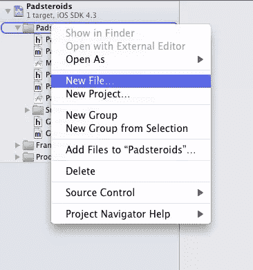](https://www.sitepoint.com/wp-content/uploads/2011/06/figure16.png)

图 1

与 GameSurface 视图一样，接下来的步骤是选择我们想要创建一个 Objective-C 类，并且它应该从 UIView 派生。然后我们需要将其命名为 CircleControlView，如图 2 所示。

[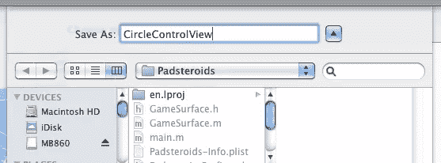](https://www.sitepoint.com/wp-content/uploads/2011/06/figure2.png)

图 2

如果您已经正确地创建了 CircleControlView 类，您应该会看到新的`CircleControlView.h`和`CircleControlView.m`类被添加到您的项目中，如图 3 所示。

[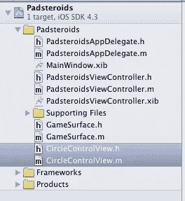](https://www.sitepoint.com/wp-content/uploads/2011/06/figure31.png)

图 3

下一步是深入研究`CircleControlView.h`文件并添加一些成员变量和两个访问器，如清单 1 所示。

**清单 1。CircleControlView.h**

```
#import &lt;UIKit/UIKit.h&gt;

@interface CircleControlView : UIView {
    BOOL initializedCenter;
    CGPoint centerPoint;
}

- (double)getAngle;
- (double)getDistance;

@end
```

`initializedCenter`是一个布尔值，它表示控制中心是否已经初始化。并且`centerPoint`存储操纵杆在视图中的当前位置。两个访问器，`getAngle`和`getDistance`返回操纵杆相对于中心的角度(以度为单位)，以及相对于中心的距离(以总可用距离的百分比表示)。例如，控制可以在零度和零距离，这意味着它在中心。或者它可以在 50%距离处为 25 度，这意味着它已经被向上移动到控制中心和圆的周长之间的中间位置。

类的定义都已经设置好了，是时候围绕着`CircleControlView.m`类进行修改来实现这个新的接口了。用于初始化和绘制控件的新代码如清单 2 所示。

**清单 2。CircleControlView.m 初始化和绘图**

```
#import "CircleControlView.h"

@implementation CircleControlView

- (id)initWithFrame:(CGRect)frame {
    self = [super initWithFrame:frame];
    if (self) {
        initializedCenter = NO;
    }
    return self;
}

- (void)drawRect:(CGRect)rect {
    if ( initializedCenter == NO ) {
        centerPoint.x = self.bounds.size.width / 2;
        centerPoint.y = self.bounds.size.height / 2;
        initializedCenter = YES;
    }

    CGContextRef context = UIGraphicsGetCurrentContext();

    CGContextSetShouldAntialias( context, true );

    CGContextSetFillColorWithColor(context, [UIColor blueColor].CGColor);
    CGContextSetAlpha( context, 0.2 );
    CGContextFillEllipseInRect( context, CGRectInset( self.bounds, 5, 5 ) );

    CGContextSetAlpha( context, 0.7 );
    CGContextSetStrokeColorWithColor(context, [UIColor blueColor].CGColor);
    CGContextSetLineWidth(context, 2.0);
    CGContextStrokeEllipseInRect( context, CGRectInset( self.bounds, 5, 5 ) );

    CGContextSetAlpha( context, 0.5 );

    CGRect ballRect;
    ballRect.origin.x = centerPoint.x - 20;
    ballRect.origin.y = centerPoint.y - 20;
    ballRect.size.width = 40;
    ballRect.size.height = 40;

    CGContextSetFillColorWithColor(context, [UIColor blueColor].CGColor);
    CGContextSetLineWidth(context, 1.0);
    CGContextFillEllipseInRect( context, ballRect );
}
```

绘图代码是最有趣的部分。如果这是第一次绘制控件，则从初始化中心点开始。它使用 drawing 绘制一个实心圆，然后是圆的边界，最后是当前位置的控制球。随意使用颜色和尺寸等等，开发你自己的控件的部分乐趣在于你可以完全控制外观和感觉。

下一步是使用清单 3 所示的方法向控件添加用户交互性。

**清单 3。CircleControlView.m 交互控件**

```
- (void)touchesBegan:(NSSet *)touches withEvent:(UIEvent *)event {
}

- (void)touchesEnded:(NSSet *)touches withEvent:(UIEvent *)event {
    centerPoint.x = self.bounds.size.width / 2;
    centerPoint.y = self.bounds.size.height / 2;
    [self setNeedsDisplay];
}

- (void)touchesMoved:(NSSet *)touches withEvent:(UIEvent *)event {
    centerPoint = [[touches anyObject] locationInView: self];
    [self setNeedsDisplay];
}
```

这些是相当标准的 UI 方法；`touchesBegan`、`touchesMoved`和`touchesEnd`。当玩家触摸控件并四处移动时，iOS 会发送这些事件。当他们完成触摸时，调用`touchesEnded`方法。在这种情况下，我们使用`touchesMoved`方法来跟踪用户移动操纵杆时的拇指。和将操纵杆返回到中间位置的`touchesEnded`方法。清单 4 展示了该类的访问器方法。

**清单 4。CircleControlView.m 访问器。**

```
- (double)getDistance { 
    double d = 0.0;

    CGPoint circCenter;
    circCenter.x = self.bounds.size.width / 2;
    circCenter.y = self.bounds.size.height / 2;

    double d1 = ( circCenter.x - centerPoint.x ) * ( circCenter.x - centerPoint.x );
    double d2 = ( circCenter.y - centerPoint.y ) * ( circCenter.y - centerPoint.y );
    d = sqrt( d1 + d2 );

    d = d / (double) ( self.bounds.size.width / 2 );

    return d;
}

- (double)getAngle { 
    double angle = 0.0;

    CGPoint circCenter;
    circCenter.x = self.bounds.size.width / 2;
    circCenter.y = self.bounds.size.height / 2;

    if ( circCenter.x == centerPoint.x &amp;&amp; circCenter.y == centerPoint.y ) {
        angle = 0.0;
    } else if ( circCenter.x == centerPoint.x &amp;&amp; centerPoint.y &lt; circCenter.y  ) {
        angle = 0.0;
    } else if ( circCenter.x == centerPoint.x &amp;&amp; centerPoint.y &gt; circCenter.y ) {
        angle = 180.0;
    } else if ( centerPoint.x &lt; circCenter.x &amp;&amp; centerPoint.y == circCenter.y ) {
        angle = 270.0;
    } else if ( centerPoint.x &gt; circCenter.x &amp;&amp; centerPoint.y == circCenter.y ) {
        angle = 90.0;
    } else {
        double p1 = abs( centerPoint.x - circCenter.x );
        double p2 = abs( centerPoint.y - circCenter.y );
        angle = atan( p1 / p2 ) * 57.29577951;
        if ( centerPoint.x &gt; circCenter.x &amp;&amp; centerPoint.y &gt; circCenter.y ) {
            angle = 180 - angle;
        } else if ( centerPoint.x &lt; circCenter.x &amp;&amp; centerPoint.y &gt; circCenter.y ) {
            angle = 180 + angle;
        } else if ( centerPoint.x &lt; circCenter.x &amp;&amp; centerPoint.y &lt; circCenter.y ) {
            angle = 360 - angle;
        }
    }

    while ( angle &gt; 360.0 ) {
        angle -= 360.0;
    }
    while ( angle &lt; 0 ) {
        angle += 360.0;
    }

    return angle;
}

- (void)dealloc {
    [super dealloc];
}

@end
```

这些方法看起来很复杂，但实际上只是一堆数学运算，用来计算从用户放置拇指的当前控制点到控件中心的角度和距离。`getDistance`方法使用勾股定理获得距离，并以百分比的形式返回。而`getAngle`方法做了大量的 trig 工作来找出给定象限的角度。

随着控件的开发，是时候更新 GameSurface 类了，这样我们就可以移动飞船了。

### 更新游戏界面

我们将从简单地移动船只开始，然后在本教程的后面部分开始发射激光。要移动船只，我们需要添加一个 moveShip 方法，如清单 5 所示。

**清单 5。更新了 GameSurface.h**

```
#import &lt;UIKit/UIKit.h&gt;

@interface GameSurface : UIView {
    CGPoint shipLocation;
    double shipDirection;
}

- (void)moveShip:(float)distance angle:(float)angle;

@end
```

然后我们需要通过将该方法添加到清单 6 所示的`GameSurface.m`文件中来实现它。

**清单 6。游戏中的移动 Surface.m**

```
- (void)moveShip:(float)distance angle:(float)angle {
    shipLocation.x -= ( distance * 3.0 ) * cos((angle+90.0) * 0.0174532925);
    shipLocation.y -= ( distance * 3.0 ) * sin((angle+90.0) * 0.0174532925);
    shipDirection = angle;
    [self setNeedsDisplay];
}
```

moveShip 的代码通过改变船只的 x 和 y 坐标来改变船只的位置，改变的值是根据传入的角度和距离值计算出来的。它还存储了船的当前角度，这样当它被渲染时，它就指向正确的方向。

做了这些改变后，是时候给游戏界面和两个圆形控件添加参考了

**清单 7。padsteroistsviewcontroller . h**

```
#import &lt;UIKit/UIKit.h&gt;

#import "CircleControlView.h"
#import "GameSurface.h"

@interface PadsteroidsViewController : UIViewController {
    IBOutlet CircleControlView *motionControl;
    IBOutlet CircleControlView *fireControl;
    IBOutlet GameSurface *gameSurface;    
}

@end
```

我们现在进行修改是很重要的，因为当我们更改 XIB 文件时，我们将把控件和视图链接到 PadsteroidsViewController 类。

### 更新 PadsteroidsViewController.xib

我们移动飞船所需的大部分代码修改已经完成，所以现在是时候将运动和火力控制的 fire control 视图添加到在`PadsteroidsViewController.xib`中定义的界面中了。

第一步是打开 XIB 文件，并从“查看>实用工具”菜单中选择身份检查器。面板底部是要添加到视图中的一组可用对象，如图 4 所示。

[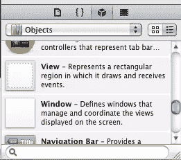](https://www.sitepoint.com/wp-content/uploads/2011/06/figure4.png)

图 4

向下滚动一点，您将找到视图对象。将一个视图对象拖到主视图上，它就会出现在界面中。在那里，将面板顶部的类从 UIView 更改为 CircleControlView，如图 5 所示。

[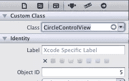](https://www.sitepoint.com/wp-content/uploads/2011/06/figure5.png)

图 5

现在我们需要适当地调整视图的大小。移动到 Sizing Inspector，将视图设置为图 6 所示的大小。

[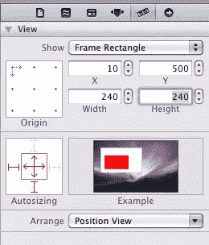](https://www.sitepoint.com/wp-content/uploads/2011/06/figure61.png)

图 6

现在切换到属性检查器，将模式更改为重绘，将背景更改为透明色，并确保如图 7 所示选中了用户交互启用复选框。

[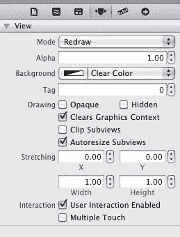](https://www.sitepoint.com/wp-content/uploads/2011/06/figure7.png)

图 7

我们需要两个这样的控件，所以按照相同的过程添加另一个视图，将其更改为 CircleControlView，并将其大小设置为图 8 所示的大小。

[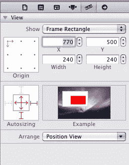](https://www.sitepoint.com/wp-content/uploads/2011/06/figure81.png)

图 8

您还需要为这个控件设置属性，如图 7 所示。现在视图中应该有两个控件了。一个在右下角，另一个在左下角。左下角的按钮控制激光的发射。右边的是运动控制器。

下一步是将这些链接到 PadsteroidsViewController，它被认为是“文件的所有者”。第一步是右键单击左侧的 CircleControlViewer。您应该会看到如图 9 所示的弹出窗口。

[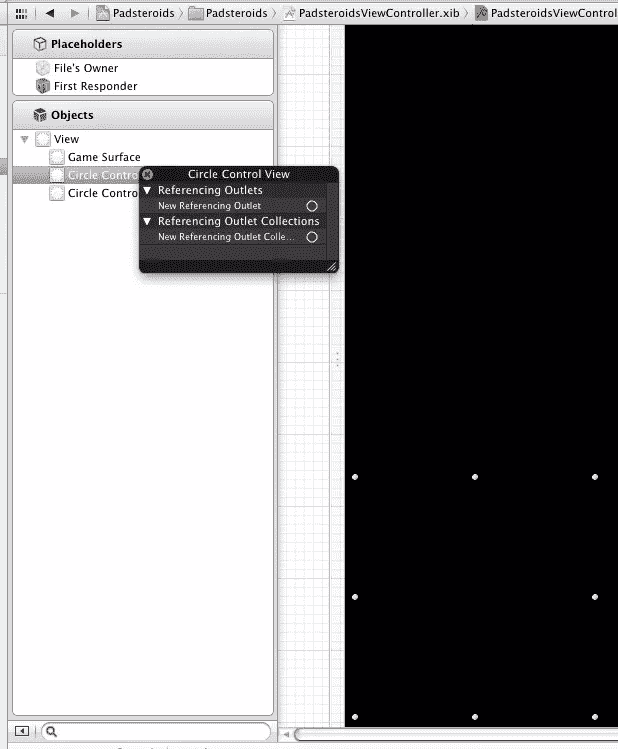](https://www.sitepoint.com/wp-content/uploads/2011/06/figure9.png)

图 9

在那里，单击新引用出口右侧的小“O ”,并将其拖至“文件所有者”占位符。您应该会看到如图 10 所示的内容。

[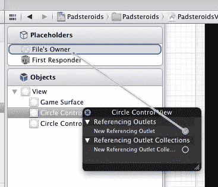](https://www.sitepoint.com/wp-content/uploads/2011/06/figure10.png)

图 10

从那里，放开鼠标按钮，应该会弹出另一个弹出菜单，给出可能的连接点列表，如图 11 所示。

[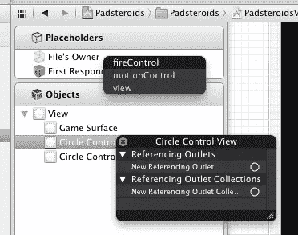](https://www.sitepoint.com/wp-content/uploads/2011/06/figure11.png)

图 11

对于消防控制，选择消防控制项目。重复运动控制的过程，并将其连接到`motionControl`点。您还需要将游戏界面连接到 game surface 项目，如图 12 所示。

[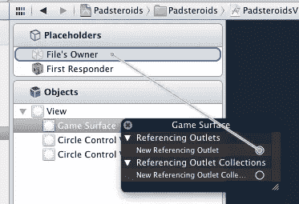](https://www.sitepoint.com/wp-content/uploads/2011/06/figure12.png)

图 12

第一次做的时候，这真的很奇怪。Xcode 界面生成器不同于我过去用过的任何其他用户界面生成器。但是一旦你习惯了，就开始有意义了。

### 完成动作的代码更改

进行动作控制的最后一步是对清单 8 所示的`PadsteroidsViewController.m`文件做一些小的修改。

**清单 8。更新 padsterysviewcontroller . m**

```
#import "PadsteroidsViewController.h"

@implementation PadsteroidsViewController

- (void)dealloc {
    [super dealloc];
}

- (void)didReceiveMemoryWarning {
    [super didReceiveMemoryWarning];
}

- (void)viewDidLoad {
    [super viewDidLoad];

    [NSTimer scheduledTimerWithTimeInterval:0.01
                                     target:self
                                   selector:@selector(gameUpdate:)
                                   userInfo:nil
                                    repeats:YES];
}

- (void)gameUpdate:(NSTimer*)theTimer {
    if ( [motionControl getDistance] &gt; 0 ) {
        [gameSurface moveShip:[motionControl getDistance] angle:[motionControl getAngle]];
    }
}

- (void)viewDidUnload {
    [super viewDidUnload];
}

- (BOOL)shouldAutorotateToInterfaceOrientation:(UIInterfaceOrientation)interfaceOrientation {
    return YES;
}

@end
```

我们在这里做的是在`viewDidLoad`函数中创建一个定时器，然后在新的`gameUpdate`方法中响应这个定时器。`gameUpdate`方法查看`motionControl`的当前位置。如果距离大于零，则意味着用户已经将控件从中心点移开，指示他们想要移动船。然后它调用`moveShip`方法根据给定的角度和距离移动船只。

如果一切正常，当您启动应用程序时，您应该会看到如图 13 所示的内容。

[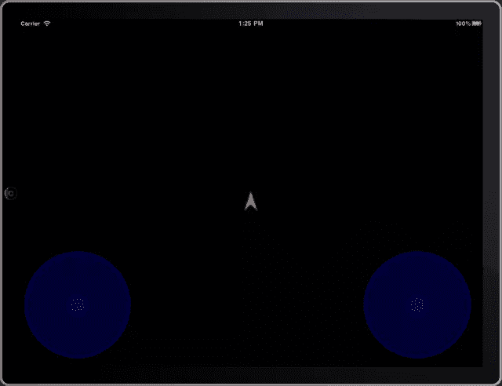](https://www.sitepoint.com/wp-content/uploads/2011/06/figure13.png)

图 13

通过移动运动控制器，你应该能够移动飞船，如图 14 所示。

[](https://www.sitepoint.com/wp-content/uploads/2011/06/figure14.png)

图 14

好吧！现在我们有了一个真正开始感觉像游戏的游戏。但是为了让整个事情变得生动，我们需要做的不仅仅是移动，我们需要拍摄一些东西。

### 添加激光

如果没有爆炸的方法，游戏会是什么样子呢？为此，我们将为飞船增加一个激光器，并将其连接到火控系统，这样玩家就可以指向他们喜欢的任何方向并射击。清单 9 显示了我们需要添加到`GameSurface.h`文件中的内容。

**清单 9。新游戏 Surface.h**

```
#import &lt;UIKit/UIKit.h&gt;

@interface GameSurface : UIView {
    CGPoint shipLocation;
    double shipDirection;

    BOOL gunEnabled;
    double gunDirection;
}

- (void)moveShip:(float)distance angle:(float)angle;

- (void)enableGun:(float)distance angle:(float)angle;
- (void)disableGun;

@end
```

这些增加相当于两个新方法`enableGun`和`disableGun`。当用户用拇指移动发射操纵杆时，就会调用`enableGun`方法。并且当玩家已经释放发射操纵杆时，调用`disableGun`。

现在我们已经有了在界面中启用和禁用枪的方法，我们必须开始进行所需的更改，以便在类中添加对它的支持。这从修改清单 10 所示的`drawRect`方法开始。

**清单 10。游戏面的新 draw rect . m**

```
- (void)drawRect:(CGRect)rect
{
    CGContextRef context = UIGraphicsGetCurrentContext();
    CGContextSetFillColorWithColor(context, [UIColor redColor].CGColor);

    CGContextTranslateCTM( context, ( self.bounds.size.width / 2 ) + shipLocation.x, ( self.bounds.size.height / 2 ) + shipLocation.y );

    if ( gunEnabled ) {
        CGContextSaveGState(context);

        CGContextSetStrokeColorWithColor(context, [UIColor greenColor].CGColor);
        CGContextSetLineWidth(context, 5.0);

        CGPoint target;
        target.x = ( 1000.0 * cos((gunDirection+90.0) * 0.0174532925) ) * -1;
        target.y = ( 1000.0 * sin((gunDirection+90.0) * 0.0174532925) ) * -1;

        CGContextMoveToPoint(context, 0.0, 0.0);
        CGContextAddLineToPoint(context, target.x, target.y);

        CGContextStrokePath(context);

        CGContextRestoreGState(context);
    }

    CGContextSaveGState(context);
    CGContextRotateCTM(context, shipDirection * 0.0174532925 );

    CGContextMoveToPoint(context, 0.0, -15.0);
    CGContextAddLineToPoint(context, 15.0, 30.0);
    CGContextAddLineToPoint(context, 0.0, 15.0);
    CGContextAddLineToPoint(context, -15.0, 30.0);
    CGContextAddLineToPoint(context, 0.0, -15.0);
    CGContextFillPath(context);

    CGContextRestoreGState(context);
}
```

当枪被激活时，增加的部分相当于增加了对枪的支持，这是通过在射击方向上从船到屏幕画一条线来实现的。

清单 11 显示了枪的`enable`和`disable`方法。

**清单 11。GameSurface.m 中的枪法**

```
- (void)enableGun:(float)distance angle:(float)angle {
    gunEnabled = YES;
    gunDirection = angle;

    CGPoint laserStart, laserEnd;
    laserStart.x = ( self.bounds.size.width / 2 ) + shipLocation.x;
    laserStart.y = ( self.bounds.size.height / 2 ) + shipLocation.y;
    laserEnd.x = laserStart.x + ( 1000.0 * cos((gunDirection+90.0) * 0.0174532925) ) * -1;
    laserEnd.y = laserStart.y + ( 1000.0 * sin((gunDirection+90.0) * 0.0174532925) ) * -1;

    [self setNeedsDisplay];
}

- (void)disableGun {
    gunEnabled = NO;
    [self setNeedsDisplay];
}
```

我们需要做的最后一个改变是`PasteroidsViewController.m`中的游戏更新方法。新代码如清单 12 所示。

**清单 12。更新了 PadsteroidsViewController.m 中的游戏更新**

```
- (void)gameUpdate:(NSTimer*)theTimer {
    if ( [motionControl getDistance] &gt; 0 ) {
        [gameSurface moveShip:[motionControl getDistance] angle:[motionControl getAngle]];
    }
    if ( [fireControl getDistance] &gt; 0 ) {
        [gameSurface enableGun:[fireControl getDistance] angle:[fireControl getAngle]];
    } else {
        [gameSurface disableGun];
    }
}
```

在这里，我们为`fireControl`视图添加监控，然后适当地向游戏界面发送`enableGun`或`disableGun`消息。如果一切按计划进行，你应该能够使用左手棒发射激光，如图 15 所示。在这一点上，这开始看起来和感觉起来像一个真正的游戏。

[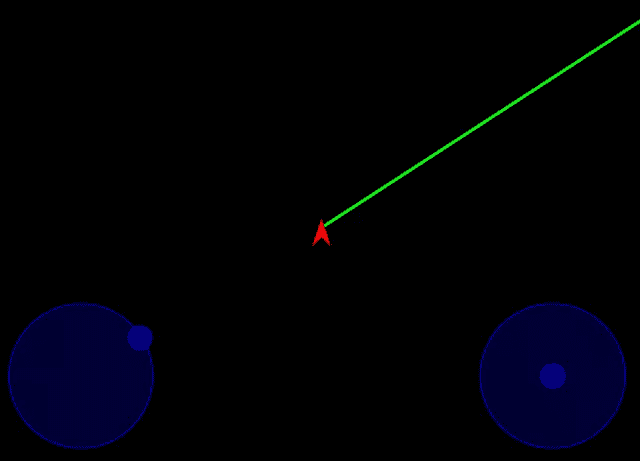](https://www.sitepoint.com/wp-content/uploads/2011/06/figure15.png)

图 15

### 结论

在我们教程的这一部分有很多东西要学。您将了解如何在界面中处理视图上的触摸。以及如何在界面构建器中连接对象。以及如何创建一个计时器并使用它来驱动游戏。

有了移动和射击的能力，我们给我们的小 Padsteroids 游戏增加了一些互动性。下一步将是本教程的最后一篇文章，将动态地向游戏表面添加一些小行星视图，以随机速度沿随机方向移动它们，并建立一个碰撞检测系统，以便激光可以将它们摧毁。

***Ed** :一旦你阅读了本系列的 [Padsteroids 第一阶段](https://www.sitepoint.com/light-speed-ios-apps-padsteroids-1/)和 [Padsteroids 第二阶段](https://www.sitepoint.com/light-speed-ios-apps-padsteroids-2/)，别忘了你可以通过对比 GitHub 上的 [Padsteroids 项目来检查或诊断你的代码。](https://github.com/buildmobile/padsteroids)*

## 分享这篇文章