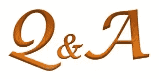

# 在哪里声明 jQuery 函数

> 原文：<https://www.sitepoint.com/declare-jquery-function/>



我们经常被问到这个问题，所以我想我们应该向所有 jQuery 初学者澄清一下。我将为以下问题提供答案:

## 问题

*   "这听起来可能是一个非常愚蠢的问题，但是我应该在哪里声明我的 jQuery 函数呢？"
*   " jQuery 代码在文档就绪函数之外工作吗？"
*   "为什么我的 jQuery 函数不起作用？"
*   "我应该把更改/点击事件放在 jQuery 还是 HTML 元素中？"

## 答案

对于任何学习 jQuery 的人来说，一个简单的解决方案是始终在文档就绪函数中声明 jQuery 代码。这是为了确保在运行任何 jQuery 代码之前，所有的 html 页面元素(也称为 DOM(文档对象模型))都已加载。

因为我们在使用 jQuery 时所做的几乎所有事情都是读取或操作文档对象模型(DOM ),所以我们需要确保一旦 DOM 准备好，我们就开始添加事件。

```
$(document).ready(function() {
  // do stuff when DOM is ready
});
```

请参见[不同类型的文档准备就绪](http://jquery4u.com/dom-modification/types-document-ready/)以获取帮助。这些可以帮助避免与其他 jQuery 框架的冲突。

## html 事件内部

我推荐使用 jQuery 来管理 DOM 上的事件。首先，它保持了 html 的整洁，其次，你可以像附加事件一样简单地禁用事件。

**另一个优势:**使用 jQuery 来附加事件(而不是在 HTML 标记中)，当您将鼠标悬停在一个链接上时，您将永远不会在状态栏中看到所有这些“javascript:void()”消息。

例如，在 jQuery 中创建一个点击事件:

```
$(document).ready(function() {
     $("a").click(function() {
         alert("Hello world!");
     });
 });
```

这与将其放入 html 代码中是一样的:

## 范围

**jQuery 函数需要在范围内:**

```
$(document).ready(function() {update();});

function update() { 
    $("#board").append(".");
    setTimeout(update, 1000);
}
```

或者

```
$(document).ready(function() {update();});

function update() { 
  $("#board").append(".");
  setTimeout('update()', 1000);
}
```

第二个可行，因为代码块中的 update()现在在范围内。

## 分享这篇文章