# 使用 WebMatrix 托管、发布和产生流量

> 原文：<https://www.sitepoint.com/hosting-publishing-and-generating-traffic-with-webmatrix/>

到目前为止， [Windows 应用程序库和 WebMatrix 系列文章](#earlier)主要关注安装和开发。一旦你建立了你的网站，自然的过程是找到一个主机，将它部署到主机的服务器上，为你的网站建立流量。这可能会让你感到惊讶，但所有这些都可以在不离开 WebMatrix 的舒适环境下实现。本文将集中讨论这些关键方面。

在开始之前，你应该在 [WebMatrix](http://) 和 [Windows 应用程序库](http://www.microsoft.com/web/gallery/)上阅读本系列的[篇早期文章](#earlier)。

### Web 部署

WebMatrix 提供了一个名为 **Web Deploy** 的选项，可以轻松部署您的网站，包括您的数据库和数据。

Web Deploy 运行在服务器上，使您能够本地或远程部署网站。它不仅仅是一个复制文件的过程；您还可以设置数据库并填充内容、安装和配置 SSL 证书、配置 IIS(如创建虚拟目录以及创建和配置应用程序池)、设置文件和文件夹权限、将库安装到全局程序集缓存(GAC)中，甚至注册 [COM](http://en.wikipedia.org/wiki/Component_Object_Model) 组件。

Web Deploy 还支持基于. NET 的提供者 API，使您能够创建自定义部署操作，因此它非常适合企业。这是一种方法的一部分，旨在使从有一个网站的想法到宣布它开始营业变得容易而无痛苦。

涵盖 Web Deploy 的所有方面本身就是一系列文章。如果您想了解更多关于您在使用该工具时可以获得的激动人心的机会，我建议您访问官方的 [IIS Web Deploy](http://www.iis.net/download/webdeploy) 网站并阅读更多相关信息。

本文主要关注使用文件传输协议(FTP)部署 WebMatrix 网站的 web 开发人员。

### 托管服务提供商

在你部署你的网站之前，你需要找到一个虚拟主机服务提供商。网站托管服务提供商是一种互联网托管服务，允许人们通过万维网访问自己的网站。有几十个托管公司，每个公司提供的托管计划有不同的功能和定价。WebMatrix 简化了选择任务，因为它包括一系列经批准的提供商，这些提供商还支持 Web Deploy 流程，可以自动执行大部分发布流程。

### 发布数据库

通过 WebMatrix 发布数据库很容易。如果您使用 SQL Server Compact 作为数据库，不仅会发布数据库中的数据，还会发布 SQL Server Compact。这可确保即使 web 服务器上未安装 SQL Server Compact，您的网站也能正常工作。如果您的网站使用 [SQL Server](http://www.microsoft.com/sqlserver/) 或 [MySql](http://www.mysql.com/) 数据库，WebMatrix 将通过创建脚本来发布数据库，这些脚本将创建您的所有数据库对象，如表、存储过程和视图。然后，它会将您的所有数据插入数据库。

### 查找和创建 Web 主机帐户

要设置虚拟主机，请按照下列步骤操作。

1.打开 WebMatrix，在**主页**选项卡，展开**发布**，选择**查找虚拟主机**，如图 1，“查找虚拟主机”显示。

**图一。寻找虚拟主机**

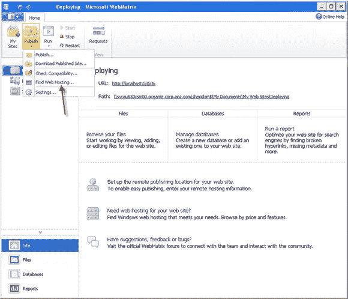

2.将会打开 Windows Web Hosting Gallery 网站。图 2，“Windows 虚拟主机库”显示了您如何通过搜索提供商列表来找到适合您需求的虚拟主机解决方案。

**图二。Windows 虚拟主机库** 

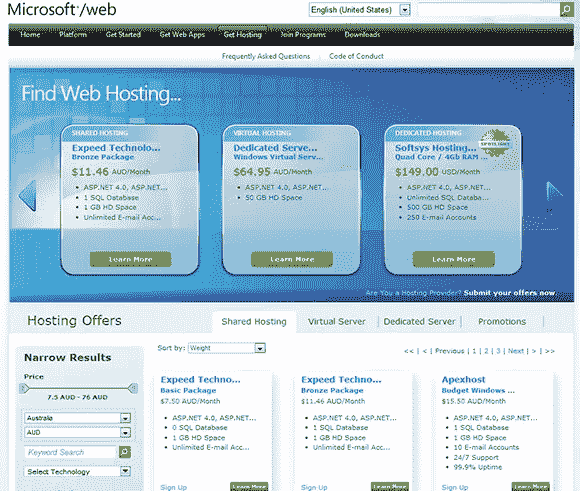

3.一旦你决定了一个主机服务提供商，按照主机服务提供商的网站提供的指导来建立一个新的帐户。

设置帐户后，主机服务提供商会向您发送一封电子邮件，其中包含您发布网站所需的信息。这些值可能因主机而异，但常见的值可能如下所示:

*   服务器:`your.provider.com`
*   用户名:`your.username`
*   密码:`password`
*   网站名称:`yoursite.your.provider.com`
*   目的地 URL: `http:// yoursite .your.provider.com`

如果您的帐户包含 SQL Server 数据库，您还会收到有关如何从您的网站连接到该数据库的信息。通常，数据库连接字符串如下所示:

```
User ID=user;Password=password;Initial Catalog=databaseName;Data Source=sql.host
```

这些值可以输入到 WebMatrix 中，这将允许您向主机发布您的网站。一些主机提供商会给你发送一个**发布设置文件**，这是一个扩展名为`.publishsettings`的文件。这是一个 XML 文件，您可以在配置网站以发布到主机提供商时使用。这使你不必手动输入数据。

如果您的网站连接到一个数据库，并且您正在使用 **Web Deploy** ，该文件也将包括数据库连接字符串。

### 为发布配置您的网站

下一步是在发布到 web 主机之前配置网站。

注意:下面概述的步骤向您展示了如何使用 FTP 发布您的网站，而不是 Web Deploy。

1.打开 WebMatrix，在**主页**选项卡中，展开**发布**，选择**设置**，如图 3“虚拟主机设置”所示。

**图 3。虚拟主机设置**

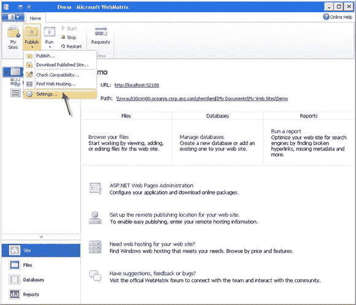

出现**发布设置**窗口。这在图 4“发布设置”中突出显示。

**图 4。发布设置**

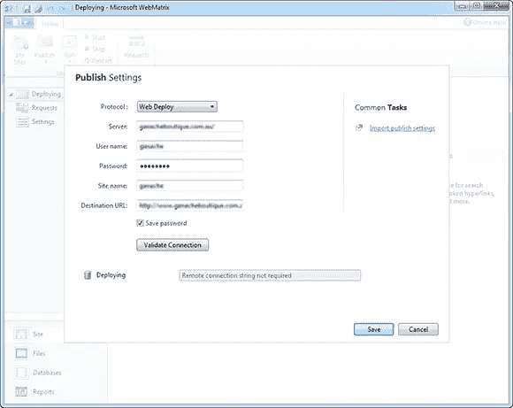

2.选择 FTP 作为协议后，输入服务器、用户名、密码、网站名称和主机服务提供商提供给您的目的地 URL。以下是这些值的分类:

a.服务器—这是由您的托管服务提供商提供的服务或服务器名称。这可能看起来像`ftp://server1.host.com`。
b .用户名和密码——由您的托管服务提供商提供的用户凭证。
c .目的地 URL——你的网站的 URL。超文本传输协议(HTTP)前缀是可选的。可以输入`http://www.yourwebsite.com`或者`www.yourwebsite.com/wiki`。
d .站点路径—这是一个可选值，指向您将文件发布到的文件夹。

3.为了避免每次部署都要重新输入密码，您可以选择**保存密码**来避免这样做。

4.点击**验证连接**以验证 WebMatrix 能够连接到您的托管服务提供商。这在图 6“验证连接”中突出显示。

**图 6。验证连接**

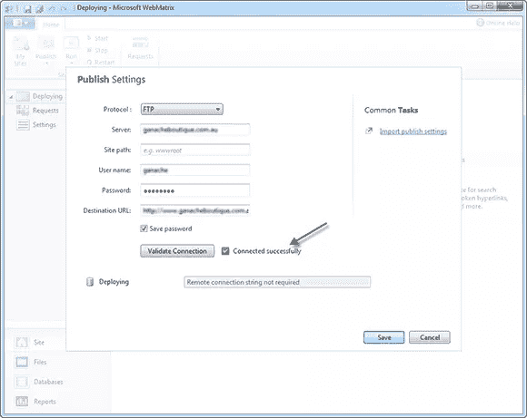

注意:FTP 并不支持所有类型的数据库。Microsoft SQL Compact 数据库将作为文件传输。Microsoft SQL Server 和 MySQL 数据库不会使用 FTP 传输。这些要么需要单独编写脚本，要么使用 Web Deploy 进行部署。

### 出版

拼图的最后一块是发布网站。同样，这也可以通过 WebMatrix 轻松实现。在发布任何文件之前，WebMatrix 会整理将要发布的文件，以便您可以根据需要进行更改。按照以下步骤将网站发布到您的主机提供商。

1.打开 WebMatrix，在**主页**选项卡中，展开**发布**，选择**发布**。出现**发布兼容性** y 窗口。**发布兼容性**将找出你的网站依赖哪些组件，然后检查它们是否在虚拟主机服务提供商处可用。例如，如果你的站点使用 ASP.NET 4.0，那么**发布兼容性**将验证主机服务提供商是否支持这个框架。图 7，“发布兼容性”显示了您的主机服务提供商是否支持该屏幕上的可用内容。

**图 7。出版兼容性** 

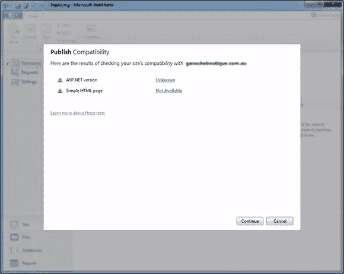

点击**继续**继续该过程。

2.下一个屏幕是**发布预览**屏幕，可以在图 8 中看到，“发布预览”。

**图 8。发布预览**

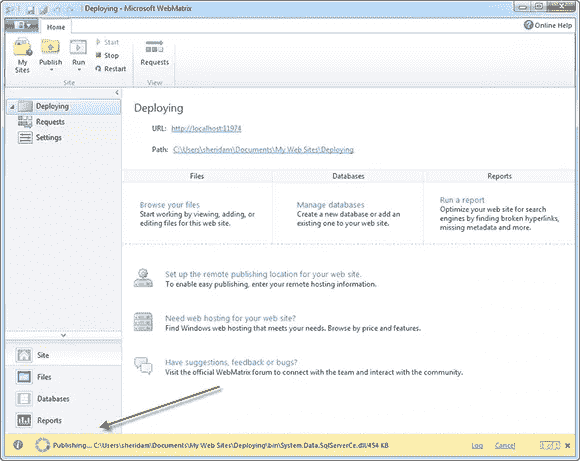

使用此屏幕，您可以根据需要修改任何文件。要防止文件被发布，请清除**已更改文件**下的复选框。任何带有清除复选框的文件都不会被发布。非常重要的是要记住，如果您确实部署了一个数据库，并且它已经存在于托管服务提供商上，那么现有的数据库将被覆盖。

3.一旦你决定发布什么文件，点击**继续**。WebMatrix 现在将在后台发布所有文件，这意味着您可以在发布的同时继续在 WebMatrix 中工作。它将在屏幕底部的导航栏中显示进度。这可以在图 9“发布状态”中看到。

**图 9。出版状态
T2**

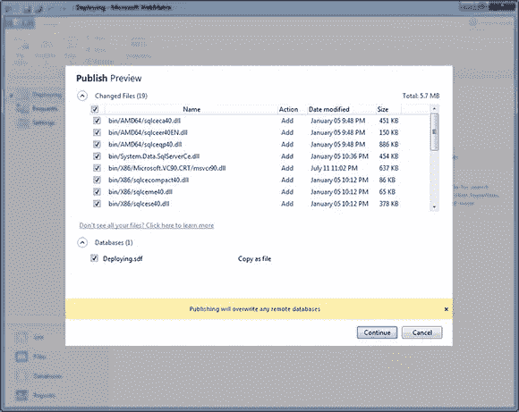

您可以随时点击导航栏中的**日志**来查看发布过程中的发布日志。图 10，“发布日志”描述了这个屏幕。

**图 10。发布日志**

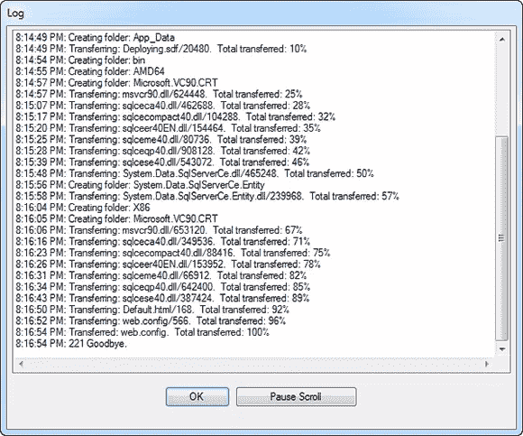

以上所有步骤都向你展示了如何托管和发布你的网站。一旦它上线了，就该给它增加流量了。你可以通过让你的网站对谷歌、必应和雅虎等搜索引擎可见来做到这一点。由于 WebMatrix 中的报告，这一过程的一部分变得更加容易。

### 报告

WebMatrix 报告功能可以帮助您通过**搜索引擎优化** (SEO)分析为您的网站带来流量，并就如何解决潜在问题提出建议。简单地说，SEO 就是提高你的网站在搜索引擎中的可见性的过程。这种分析是至关重要的，如果你想建立传入流量。如果你的搜索排名提高，那么流量也会提高。

### 创建报告

首先，在 WebMatrix 中打开一个现有网站，然后在工作区中单击**报告**。图 11“WebMatrix 报告”准确地指出了这一点。

**图 11。网络矩阵报告**

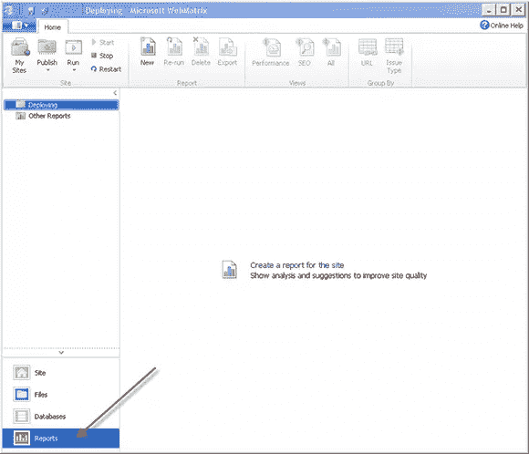

接下来点击**为站点创建一个报告**或者从菜单中点击**新建**，如图 12“创建一个报告”。

**图 12。创建报告**

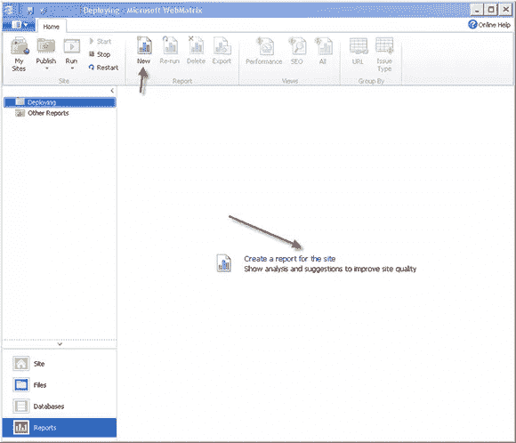

这将显示**新报告**对话框。该对话框在图 13“新报告”中突出显示。

**图 13。新报告**

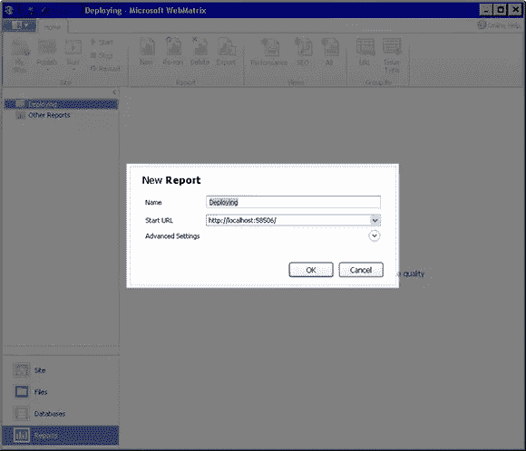

键入报告的名称以及分析开始页面的完整 URL。如果您忽略该页面，分析将从您网站中的默认文档开始。报告不限于当前网站。它们可以在任何网站上运行。为此，从导航选项卡中选择**其他报告**，并在主页选项卡中点击**新建**。这些步骤与前面描述的步骤相同。

点击**高级设置**允许您设置分析选项，包括最大抓取网址和最大页面下载大小。如果你的网站有大量的页面，这些将是至关重要的。图 14，“高级结果”显示了选项。

**图 14。高级结果**

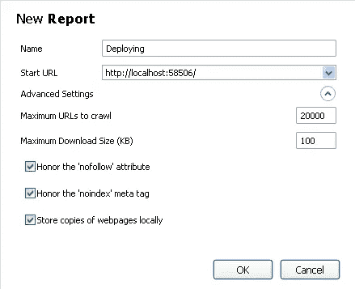

点击**确定**开始分析。WebMatrix 将在您的网站上爬行，模仿搜索引擎，并记录它发现的任何问题。结果可以在图 15“报告结果”中看到。

**图 15。报告结果**

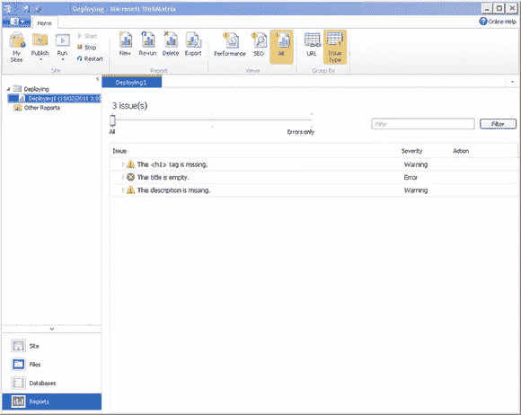

如果发现任何问题，它们将被分为**信息**、**警告**或**错误**类别。可以通过调整问题幻灯片来过滤信息，因此如果您只对错误感兴趣，只将它滑动到**错误**。这可以在图 16“过滤误差”中看到。

图 16。过滤误差


您也可以从菜单中过滤错误。选择**全部**和**问题类型**将按类别显示每个问题。结果显示在图 17 中，“按类别分类的问题”。

**图 17。按类别分类的问题**

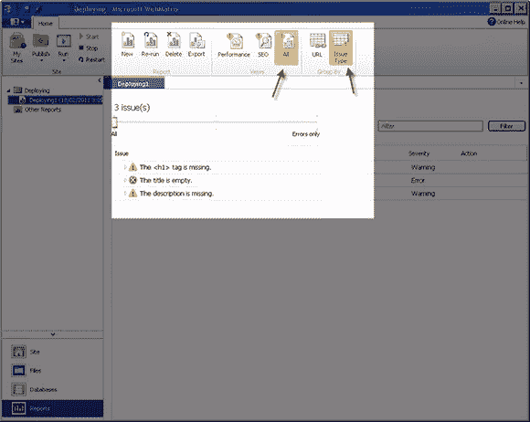

选择**所有**和`Performance`将网站中的每个页面分组，并显示加载时间。这有助于您识别加载时间比其他页面长的页面。性能结果如图 18“性能结果”所示。

**图 18。性能结果**

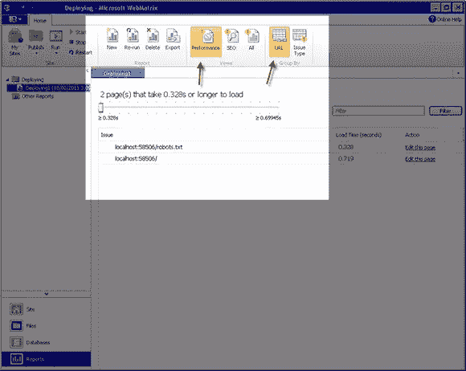

可以通过调整时间滑块来过滤信息，因此，如果您只对高负载页面感兴趣，请将其滑动到更高的负载时间。这可以在图 19“过滤性能结果”中看到。

**图 19。过滤性能结果**


要了解每期的更多信息，请单击该期。这将扩展问题，并为您提供问题的详细描述，以及如何解决问题的建议。这在图 20“扩大问题”中描述。

**图 20，展开问题**

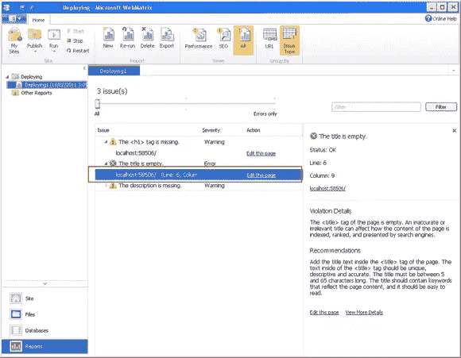

WebMatrix 概述了有关问题的详细信息以及建议的问题解决方案。当你准备好解决这个问题时，点击**编辑这个页面**，如图 21，“解决 SEO 问题”。

**图 21。解决 SEO 问题**

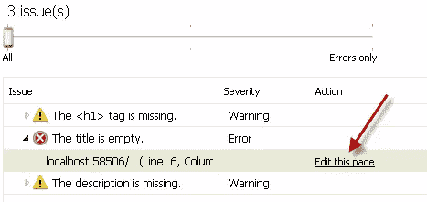

这将打开页面，并允许您随意编辑它。问题解决后，点击**重新运行**再次生成报告。这如图 22 所示，“重新运行报告”。

**图 22。重新运行报告**


WebMatrix 将所有报告保存到单个项目中。这些项目使您能够查看每个报告的结果。这些项目在**报告工作区**中可用。这在图 23“查看报告结果”中进行了描述。

**图 23。查看报告结果**

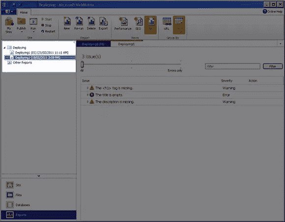

### 从这里去哪里

下一步是看看主要的搜索引擎是如何实现抓取、搜索和索引网站的。每一个搜索引擎都有不同的规则，所以如果你想被注意到，读一读他们在寻找什么。主要的搜索引擎有:

[必应站长工具](http://www.bing.com/toolbox/webmasters/)
[谷歌站长中心](http://www.google.com/webmasters/)
[雅虎站点浏览器](https://siteexplorer.search.yahoo.com/)

### 摘要

正如您在本文中看到的，WebMatrix 简化了寻找虚拟主机服务提供商的过程以及发布过程。发布一直是 web 开发人员的一个痛点，但是看起来这已经是过去的事情了——如果您使用 Web Deploy 就更是如此。

您还看到了 WebMatrix 将如何生成报告，帮助您的网站变得更加 SEO 友好，为您的网站带来更多流量，并提高您的页面排名。

总而言之，微软正在通过 [WebMatrix](http://www.microsoft.com/web/webmatrix/) 在一个易于使用和高度可配置的工具中提供复杂和复杂的基于 ASP.NET 的 web 设计、开发和发布功能，从而开辟新的天地。无疑会吸引很多开发者。

最后，让我们看看你从这篇文章中学到了多少。来参加简短的[测验](https://www.sitepoint.com/quiz/microsoft/hosting-publishing-and-generating-traffic-with-webmatrix)。

文章序:

*   [网络应用程序库，第 1 部分](https://www.sitepoint.com/article/microsoft-web-app-gallery-part-1)
*   [使用网络应用程序库寻找合适的 CMS](https://www.sitepoint.com/finding-the-right-cms-with-web-app-gallery/)
*   [用 WebMatrix 构建动态网站](https://www.sitepoint.com/building-dynamic-websites-with-webmatrix/)
*   使用 WebMatrix 托管、发布和产生流量

**note:**SitePoint Content Partner

本教程是在微软的支持下完成的。我们与微软合作，由 SitePoint 独立编写，努力共同开发对您最有用、最相关的内容。

## 分享这篇文章