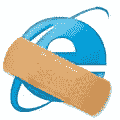

# 解决 IE6 问题的 10 个修复

> 原文：<https://www.sitepoint.com/10-fixes-for-ie6-problems/>

我们知道 [IE 可能会存在一段时间](https://www.sitepoint.com/the-death-of-ie6/)，但是我们还能支持浏览器和[避免黑客攻击和有条件的 CSS](https://www.sitepoint.com/5-reasons-to-avoid-css-hacks-and-conditional-stylesheets/) 吗？这里有 10 个补丁，可以用有效的 HTML 和 CSS 代码解决大部分 IE6 问题…

**1。使用文档类型**
你应该总是在每个 HTML 页面的顶部放置一个文档类型，并且推荐一个严格的版本，即

```
<!DOCTYPE HTML PUBLIC "-//W3C//DTD HTML 4.01//EN"
"https://www.w3.org/TR/html4/strict.dtd">
```

或者，对于 XHTML:

```
<!DOCTYPE html PUBLIC "-//W3C//DTD XHTML 1.0 Strict//EN"
"https://www.w3.org/TR/xhtml1/DTD/xhtml1-strict.dtd">
```

你最不需要的就是 IE6 进入古怪模式——它已经够古怪了。

**2。设置位置:相对**
将一个元素设置为`position:relative`可以解决许多问题，尤其是如果你曾经经历过看不见或者奇怪排列的盒子。显然，您需要注意绝对定位的子节点会相应地重新定位。

**3。使用 display:inline for Floated elements**
带有边距的浮动元素会引发著名的 IE6 双边距错误，比如你指定左边距为 5px，实际得到 10px。会修复这个问题，虽然不应该要求，但是你的 CSS 仍然有效。

**4。将元素设置为 *hasLayout***
许多 IE6(和 IE7)的渲染问题可以通过设置元素的 hasLayout 属性来修复。这是一个内部 IE 设置，它决定了内容如何相对于其他项目进行绑定和定位。如果您需要制作一个内嵌元素(如块中的链接)或应用透明效果，设置 hasLayout 也是必不可少的。

设置 hasLayout 最简单的方法是设置 CSS 高度或宽度(也可以使用 zoom，但这不是 CSS 标准的一部分)。建议设置实际尺寸，但如果不可能，您可以使用`height:1%`。如果父元素没有设置高度，元素的物理高度不会受到影响，但会启用 hasLayout。

**5。修复重复字符错误**
复杂布局会触发一个错误，浮动元素的最后几个字符会出现在下面被清除的元素上。有几种解决方案；很少是理想的，需要一些尝试和错误:

*   确保所有浮动元素都使用`display:inline;`
*   在最后一个浮动元素上使用一个`margin-right:-3px;`
*   使用条件注释作为浮动元素的最后一项，例如`<!--[if !IE]>Put your commentary in here...<![endif]-->`
*   在容器的最后一个元素中使用空的 div(也可能需要将宽度设置为 90%或类似的值)

参见[positioniseverything.net](http://www.positioniseverything.net/explorer/dup-characters.html)了解问题的完整描述。

**6。只对可点击和悬停的元素使用< a >标签**
IE6 只能对< a >标签应用 CSS 悬停效果。

您还应该将它们用于 JavaScript 驱动的小部件中的控件，这样它们就可以保持键盘导航。有一些替代选项，但是

**7。用！IE 专用代码的重要或高级选择器**
仍然有可能编写专门针对 IE6 的有效代码，而无需求助于传统的黑客或附加文件中的条件 CSS。例如，可以使用代码定义最小高度:

```
 #element {
	min-height: 20em;
	height: auto !important; /* understood by all browsers */
	height: 20em; /* IE6 incorrectly uses this value /*
} 
```

IE6 不理解“最小高度”,错误地用 20em 覆盖了“自动”高度。然而，如果内容需要更多的空间，它就会增加尺寸。

另一种选择是使用高级选择器，例如

```
 #element {
	min-height: 20em;
	height: 20em;
}

/* ignored by IE6 */
#element[id] {
	 height: auto;
} 
```

**8。避免百分比维度**
百分比混淆 IE。除非您能够仔细地确定每个父元素的大小，否则最好避免使用它们。您仍然可以在其他浏览器中使用百分比值！重要的，例如

```
 body {
	margin: 2% 0 !important;
	margin: 20px 0; /* IE6 only */
} 
```

**9。尽早测试，经常测试**
在你的网站或应用完成之前，永远不要离开 IE6 测试；问题会变得更糟，需要更长的时间来解决。如果你的网站可以在 Firefox 和 IE6 上运行，那么几乎肯定可以在其他浏览器上运行。

10。重构你的代码
通常，修复一个布局问题比重新考虑一个布局问题要花更长的时间。对 HTML 和更简单的 CSS 稍加修改通常会更有效。这可能意味着您放弃完全合法的代码，但是会出现较少的长期问题，并且您知道将来如何处理该问题。

我错过了你最喜欢的 IE6 补丁吗？欢迎评论和建议。

## 分享这篇文章