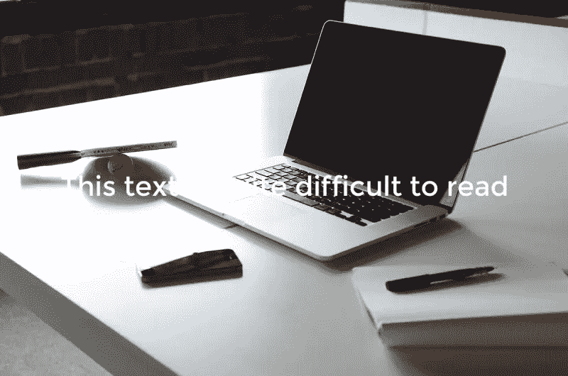

# 制作更好的网站背景视频的 10 条准则

> 原文：<https://www.sitepoint.com/10-guidelines-better-website-background-videos/>

在过去的几年里，我们开始看到越来越多的网站使用背景视频作为设计特色。随着互联网连接变得更快，视频编解码器变得更好，浏览器获得对 HTML5 视频的更好支持，这种趋势只会增加。

如果做得不好，背景视频可能会产生负面后果，例如减慢页面的其余部分，分散用户对实际页面内容的注意力，如果有太多的平移或移动，甚至会让用户感到恶心或不安。

然而，如果做得好，背景视频可以是一个伟大的，微妙的设计触摸，增加了额外的一层体贴。

那么，我们如何避免错误，做所有正确的事情呢？很简单，只要遵循这 10 条原则。

## 尽可能压缩视频

没有什么比访问一个网站，让背景视频在它试图缓冲的过程中时断时续更糟糕的了。这会分散注意力，给人一种整个网站加载缓慢的感觉，即使其余部分已经加载完毕。

为了避免这种情况，我们真的需要将视频压缩到我们认为可以接受的最低比特率。使用高质量的 1080p 视频看起来非常清晰和性感，这很有吸引力，但不值得在加载时间和中断的流媒体之间进行权衡。

你真的应该使用每秒 24 或 25 帧的低帧率的 720p 视频，并在选择你认为可以接受的最低帧率之前，测试 750k 和 1250k 之间的几种不同的比特率。也有一些黑客可以帮助隐藏糟糕的质量，我们很快就会谈到。

## 考虑使用覆盖来隐藏人工制品

如果您对视频的质量不满意，或者如果您对质量满意，但质量太高而无法流畅地传输，您应该考虑在视频上添加覆盖，这有助于掩饰质量。这可以通过直接在视频后添加一个绝对定位的 div 来轻松实现，甚至可以使用视频容器的`::after`伪元素。

你应该在这个元素上使用 CSS 属性`pointer-events: none;`来确保它不会阻止人们右击视频来暂停、播放等等。

一个纯色半透明的覆盖层会有所帮助，看起来真的很好，特别是如果你调整覆盖层的颜色以适应你设计的其余部分的颜色。有图案的覆盖层会更好地掩饰质量，但可能不适合某些设计。

要查看叠加的效果，请查看低质量视频上的图案叠加演示。

## 限制视频的总大小和长度

低比特率有助于确保我们的视频顺利播放，而不会暂停缓冲，但我们也需要记住，我们的用户来到我们的网站不是为了观看我们的背景视频，我们不应该假设他们乐意下载完整的 2 分钟视频，这可能是他们没有要求的 20MB 视频。

你应该始终将视频的长度限制在最多 30-40 秒，或者更好的是，找到一个无缝循环的短视频，这样它*看起来*像一个更长的视频，但大小可能小于 1MB 或 2MB，取决于长度。不要脸的插头:你可以在 BG Stock 找到一些非常好的[循环视频](https://html5backgroundvideos.com/product_features/seamless-loop/)，这是一个股票视频网站，我专门为网站背景视频而开办的。

## 避免过度运动

‘背景视频’中的关键词是‘背景’。顾名思义，视频是网站内容的补充，我们需要确保它不会抢走焦点。背景视频应该微妙和流畅，以避免分散我们的用户从他们应该在我们的网站上做什么。这意味着我们应该避免像快速或过度平移，抖动/不稳定的镜头和快速切换这样的事情。

## 确保与前景文本有足够的对比度

如果视频上有文字，确保其可读性是很重要的。如果文本颜色与视频冲突，您可能需要添加一个覆盖图来帮助区分文本，更改文本颜色，或者给文本添加一个`text-shadow`或背景。

这也有助于确保视频中没有强烈的色彩对比。例如，很难将清晰的文本放在下面的视频帧前面，因为它有暗点和亮点，并且我们的文本颜色可能会与其中一个冲突。

图片由 Pexels 提供

## 确保视频拉伸以填充其容器

CSS3 有一个广为人知的特性，叫做“ [`background-size`](https://developer.mozilla.org/en-US/docs/Web/CSS/background-size) ”，其中一个选项是“`cover`”。该属性确保背景图像总是与覆盖整个元素所需的一样大，不会更大或更小，同时保持其原始的纵横比。

还有一个不太为人知的属性叫做“ [`object-fit`](https://developer.mozilla.org/en-US/docs/Web/CSS/object-fit) ”，它对实际的 DOM 元素做同样的事情，这将是确保我们的视频始终覆盖其容器的一个好方法。不幸的是，[浏览器对“`object-fit`”的支持](http://caniuse.com/#feat=object-fit)还不尽如人意，所以我们要么需要使用 polyfill，要么编写一些 JavaScript 来模拟它的行为。

幸运的是，有一个名为 [jQuery Background Video](https://github.com/BGStock/jquery-background-video) 的简单 jQuery 插件可以为我们解决这个问题，以及其他一些我们即将触及的问题。声明:我写了这个插件。

## 说明设备

在这个时间点上，移动设备上的背景视频支持不是很大。iOS 拒绝自动播放视频，而是在视频顶部添加一个大的播放图标，点击后将打开媒体播放器。

如果我们在页面内容中嵌入一个普通的视频，这没问题，但是因为这只是一个额外的设计，并不包含任何关键信息，我们更喜欢后退到图像背景。Android 设备通常也不能很好地播放，所以在这两种情况下，我们最好只是禁用视频并退回到背景图像。

如何做到这一点取决于你，你可以在 CSS 媒体查询中隐藏小屏幕上的视频，或者使用 JavaScript 检查用户代理并在 iOS/Android 设备上完全删除视频。jQuery Background Video 默认是后者。

## 不要永远循环

如果您将“循环”属性添加到您的视频标签，您的浏览器将继续循环播放视频，直到您关闭标签。这会影响用户的 CPU 使用率，并且会降低页面其余部分的速度。

你可以完全去掉循环属性，只播放一次视频，但是在很多情况下，如果我们有一个短的循环视频，这不是我们想要的。编写一些 JavaScript 在 X 秒后暂停视频是非常简单的，我们只需要确保如果视频暂停并手动播放(在大多数浏览器中可以通过右键单击视频来完成)，我们需要重置计时器。

与我们的其他 JavaScript 增强功能一样，jQuery 背景视频覆盖了我们，允许我们以秒为单位设置“暂停时间”。

## 提供暂停按钮

不管你认为你的背景视频有多棒多微妙，总会有人宁愿暂停它。无论是因为它分散了他们的注意力，他们觉得它降低了他们的电脑速度，还是他们不希望它自己暂停。

我们可以用一点定制的 JavaScript 轻松地添加一个暂停/播放按钮，但是 jQuery 背景视频也是我们的后盾。默认情况下，它会添加暂停/播放按钮，您可以根据自己的意愿对其进行定位和样式设置。

## 考虑在游戏中淡入

请记住，我们的背景视频应该是微妙的，而不是分散注意力。开始播放时的突然移动会分散用户的注意力，因此在许多情况下，在开始播放时慢慢淡入`<video>`元素是个好主意。

我们可以这样做:添加海报图像作为`<video>`的包含元素的背景，默认情况下将视频的不透明度设置为零，在不透明度属性上添加 CSS 过渡，并在视频开始播放时将不透明度设置回 1。如果您不想自己制作实现，jQuery Background Video 可以为您解决这个问题。

当视频暂停时淡出也可能是一个好主意，特别是如果我们的海报图像比视频质量更高。

## 总之…

背景视频真的可以让你的设计与众不同，只要确保你做得好。遵循这 10 条指导方针，你会走得很好。

## 分享这篇文章