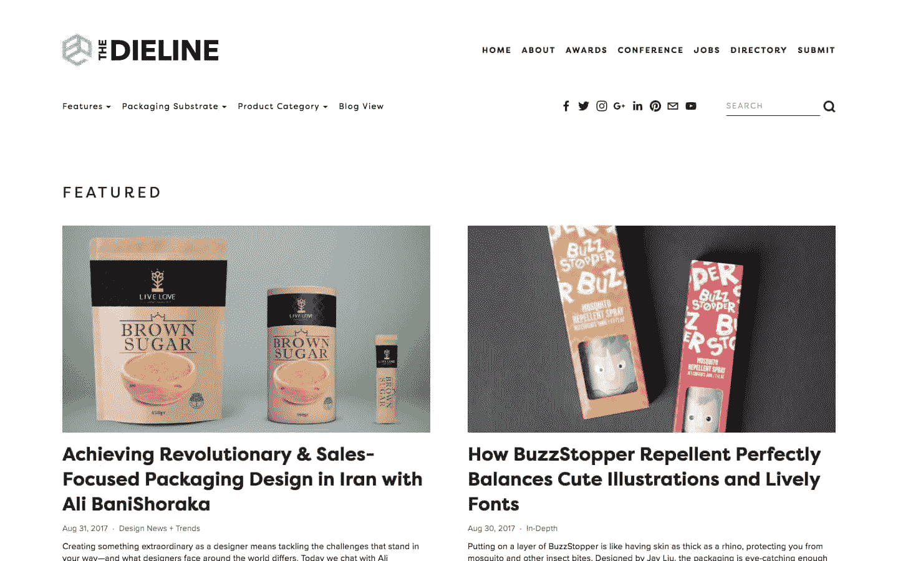
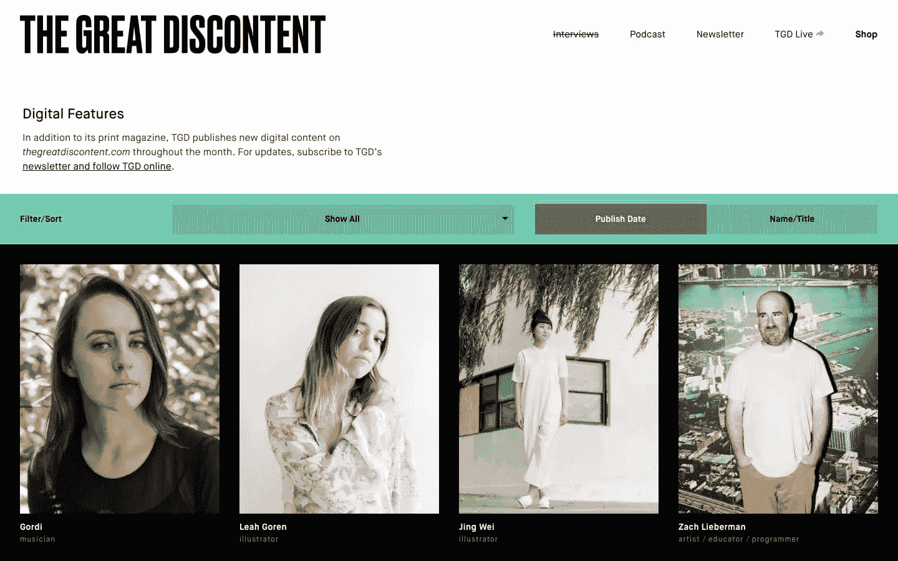
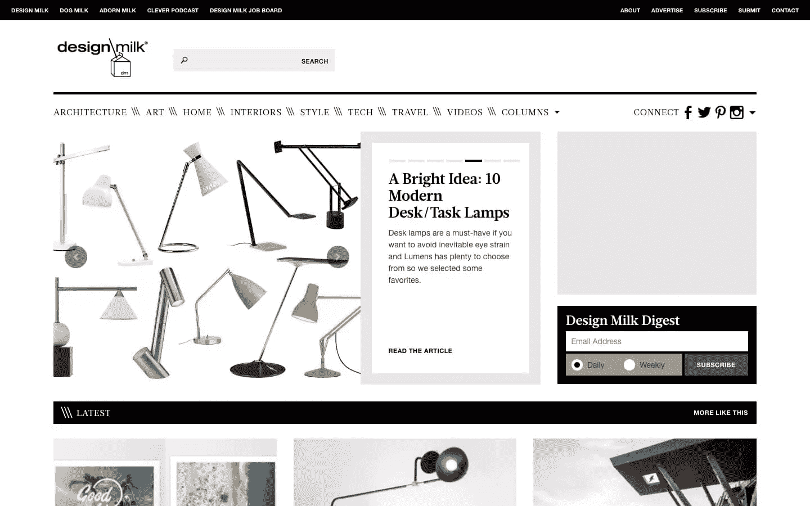
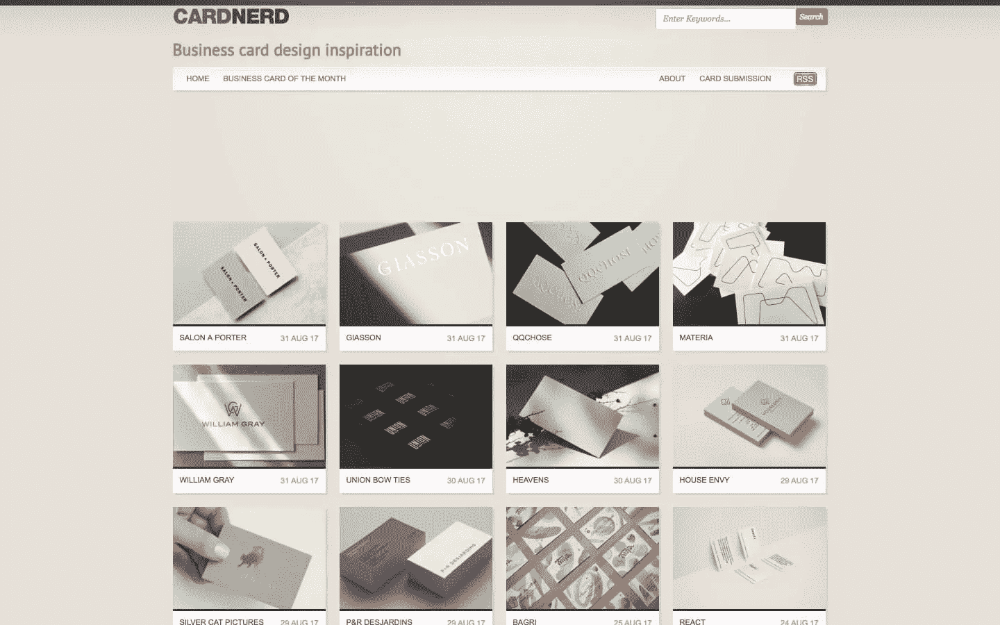
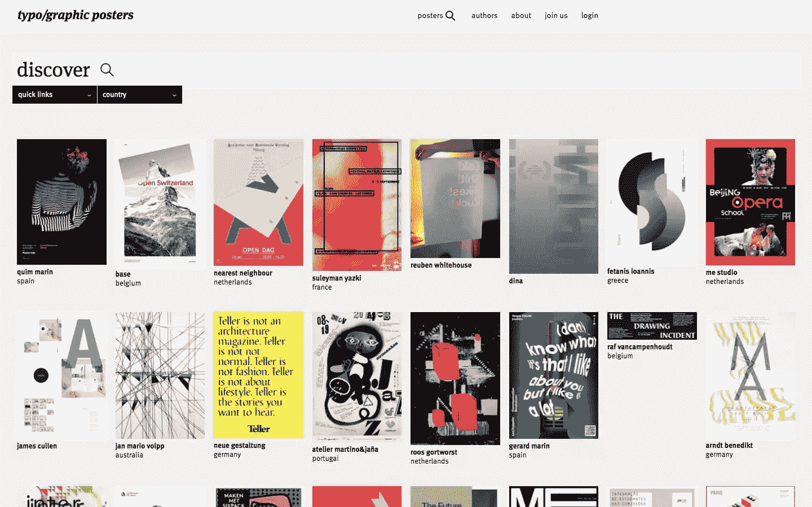
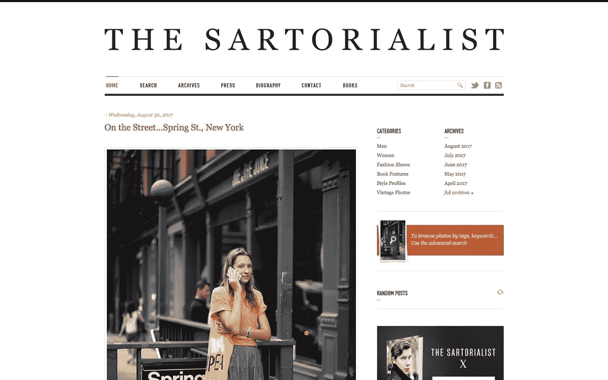
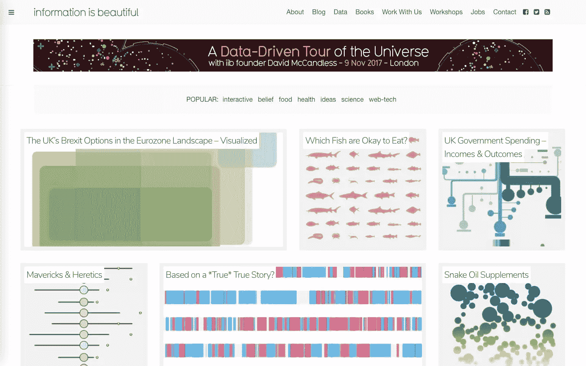
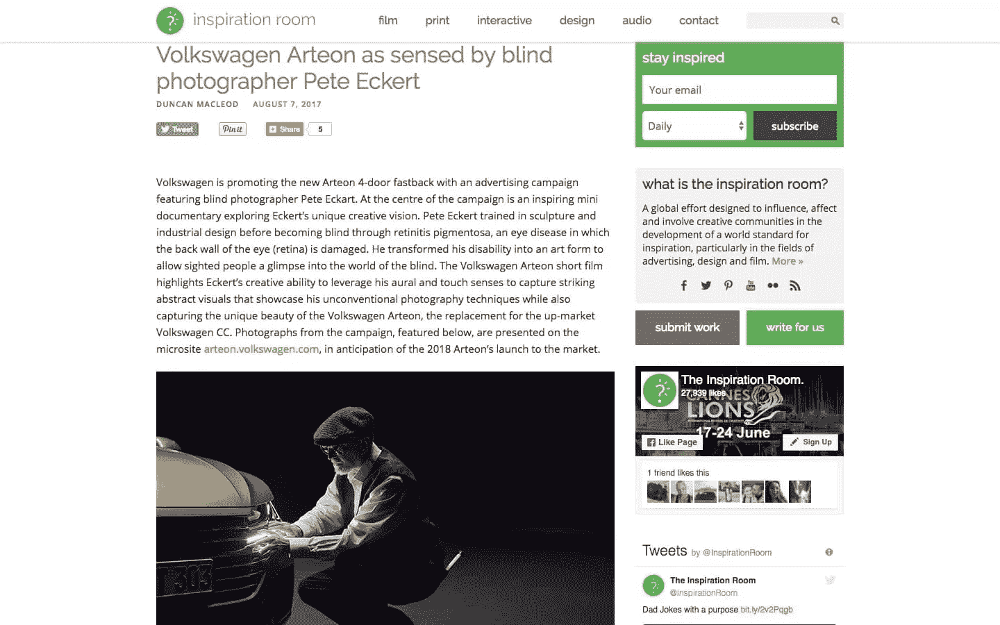

# 10 个意想不到的设计灵感来源

> 原文：<https://www.sitepoint.com/10-unexpected-sources-of-design-inspiration/>

你能想到的每一种设计都有一个灵感来源。努力创造完美的字体配对？前往[型狼](https://www.typewolf.com/)。为你的网站重新设计或者一个特定的网页寻找想法？浏览[蜡笔](https://www.crayon.co/f/)。寻找全方位史诗般的设计灵感来源？查看最新一批威比奖获得者。

尽管这些收藏很棒，但是完全依赖它们是很危险的。如果所有的设计师都从相同的网站上引用相同的想法、概念和模板来获得设计灵感，那么每一个设计都会变成现有设计的变体。当所有设计师的想法都基于相同的灵感来源时，几乎不可能创造出新颖或独特的东西。

幸运的是，有一个解决方案…

除了你的常规来源之外，再加入一些新的设计灵感来源！这 10 个网站会让你以意想不到的方式获得灵感。

## 1. [99%不可见](http://99percentinvisible.org/)

*99%看不见*是罗曼火星主持的博客和广播节目。它深入探讨了那些未被注意到但却美丽、迷人和重要的力量，这些力量塑造了我们的世界。

换句话说，那 99%的人。

每集大约 15-25 分钟，涵盖一个与建筑、物体、视觉、历史、技术、社会、城市、声音和基础设施相关的主题。这不仅能帮助你用全新的眼光看待周围的环境，还能帮助你磨练对细节的关注。“小事情”往往决定设计的成败，所以加强对小细节的关注绝对是一项值得掌握的技能。

## 2.[分型线](http://www.thedieline.com/)

自从我发现死亡线后，我的购物之旅花了两倍的时间。这个史诗般的网站每天至少有一个创新的包装设计，但经常分享两个或三个。看到最平凡的物品(如 [*【铅笔】*](http://www.thedieline.com/blog/2016/12/19/vibrant-italian-inspired-packaging-for-louise-fili-brillante-pencils) )如何通过标志设计和巧妙的包装得到提升，你会既惊讶又欣喜。

像设计的其他方面一样，设计的基本原理也适用于包装。例如，如果一袋咖啡的设计中没有足够的空白，当消费者试图在超市阅读时，它会看起来很拥挤，会使他们的眼睛疲劳，从而导致销售损失。因为这些设计概念会以多种方式延续下来，所以不管你是一名标志、网页还是用户界面设计师，滚动浏览*会强化你现有的设计知识。*

## 3.[巨大的不满(TGD)](http://thegreatdiscontent.com/)

《极度不满》是一份印刷和数字杂志，展示从摄影师、平面设计师到插画师和电影制作人的各种创意。与许多其他设计灵感来源不同，TGD 展示了作品背后令人惊叹的设计师，而不仅仅是作品本身。

有时候，阅读一位艺术家的开端、他们目前的项目以及他们所面临的最大挑战，可能比看到作品本身更令人鼓舞。

毕竟，创造性的工作会消耗你的情绪，因为你不是在同等程度上消耗你的体力和脑力，而是 100%(有时甚至更多！)你的精神力量。知道别人能理解往往会让你恢复活力，激励你坚持下去。你还将了解其他创意者如何产生他们的惊人想法。

## 4.[设计牛奶](http://design-milk.com/)

当我需要直截了当的视觉享受时，Design Milk 从未让我失望过。这本在线杂志收集了世界各地最好的艺术、室内设计、家具、时尚、技术和建筑。照片是惊人的，文化和美学风格多样，但普遍有趣，写作是坚实的。如果你需要从各种不同的艺术概念中获得灵感，Design Milk 绝对适合你。

而且，如果你只对某个特定的垂直领域感兴趣，比如说，建筑，很容易过滤掉其他内容，缩小搜索范围。

## 5.布拉德·弗罗斯特的 风格指南

没有什么能像风格指南一样将创意和有序融合在一起。Brad Frost，著名的前端设计师和《原子设计》一书的作者，创建了《T2 风格指南》来存放越来越多的关于这个主题的资源。*演讲*和*工具*部分当然值得滚动浏览，尽管我最喜欢的是 [*示例*](http://styleguides.io/examples.html) 。你会发现当今最大的品牌中一些制作最精良的风格指南。

更好的是，你可以根据它们的内容对它们进行分类。

## 6.[卡呆子](http://cardnerd.com/)

违反直觉的是，规则和限制经常激发一些最具创造性的设计。毕竟，它们迫使你去寻找意想不到的解决方案和变通方法，而“无限制”的方法往往会让设计师感到懒惰。

这解释了为什么名片是灵感的可靠来源。一个名片设计师有一个完成大任务的小媒介:传达某人的职业身份。每当你努力把你的副本精简到最基本的部分，或者让一个设计感觉不那么忙碌的时候，使用*卡呆子*。这个图库每天都会更新几次新的名片，从极简主义到大胆多彩。

## 7.[印刷海报](https://www.typographicposters.com/)

如果你对字体、颜色和形状的相互作用感兴趣，你会喜欢*印刷海报*。Andre Felipe 是一名平面设计师和网络开发人员，早在 2008 年就创建了这个网站，通过海报文化来推广优秀的设计。Felipe 对挑战传统的海报有很好的眼光，并仔细审查每一份提交的材料，以确保其符合一定的质量和创意标准。同样值得注意的是海报的文化和地理差异。你会发现来自伊朗、希腊、阿根廷、美国、加拿大、土耳其、波兰——*的设计，这还只是第一页！*

## 8.[裁缝](http://www.thesartorialist.com/)

我可以花几个小时在裁缝博客上，这是斯科特·楚门的一个时尚博客，可以说是它发起了街头时尚运动。在舒曼的摄影作品中寻找灵感，你不需要成为一个晾衣架。他发现行人很有个性，比如一个米兰少年穿着相对简单的服装，配着[蓬松的运动鞋](http://www.thesartorialist.com/photos/on-the-street-youth-milano-2/)，或者一个女人穿着带有[醒目红色袖口的皮夹克](http://www.thesartorialist.com/paris/on-the-street-at-the-shows-paris-5/)。每张图片都展示了一个古怪的元素或令人惊讶的细节是如何改变整个外观的。此外，颜色、线条、体积和纹理的对比也会给你带来灵感。

## 9.[信息是美好的](http://www.informationisbeautiful.net/)

当你盯着电子表格上的一排排数字时，数据感觉不到性感、可读性、趣味性甚至是有用性。当你在*上看数据可视化时，信息是美丽的*，另一方面，数据变得更加迷人。

创造者 David McCandless 和他的团队正致力于“将世界上的数据、信息和知识提炼为美丽、有趣、最重要的是有用的可视化、信息图和图表。”为此，你会发现类似*的文章。我推荐*信息是美丽的*下次当你在寻找将事实和数字转化为易于理解的视觉效果的酷而直观的方法，为你的下一个交互设计寻找灵感，或者为一个简单的仪表板或有趣的主页寻找灵感时。*

 *

## 10.[灵感屋](http://theinspirationroom.com/)

每 10 个疲惫、乏味、陈词滥调的广告活动中，就有一个有趣、深刻或引人注目的。然而，我们大多数人对自愿观看广告或翻阅杂志来寻找“超级碗”广告的设计灵感不感兴趣。

进入*灵感室*。这个以自己的名字命名的“创意档案和社区”成立于 2006 年，旨在收集来自世界各地的最佳广告活动。每一个可以想象的媒体和类别都被表现出来，包括电视、印刷、环境和互动、音频，甚至邮票和日历。

* * *

寻找新的想法和灵感来源从来都不是一个坏主意。在你的旋转中加入一些这样的元素，你会看到你的设计有了新的形状！

## 分享这篇文章*