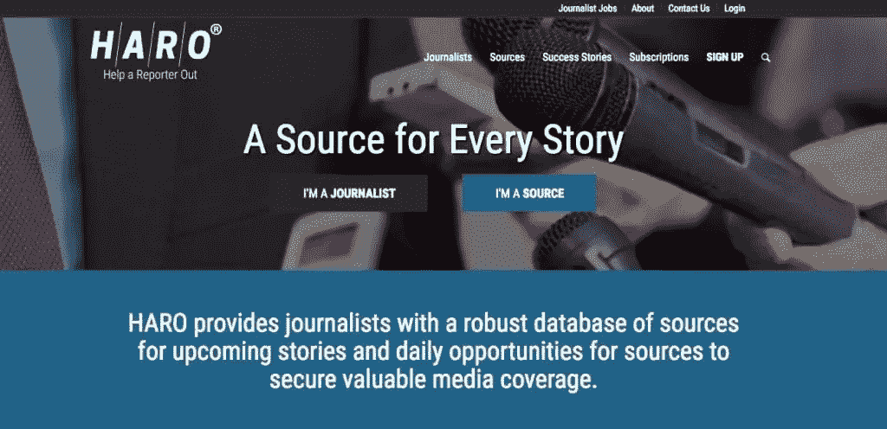

# 获得行业权威认可的 10 种意想不到的方法

> 原文：<https://www.sitepoint.com/10-unexpected-ways-to-get-recognized-as-your-industrys-authority-2/>

毫不夸张地说，你是在与你所在的特定领域、行业或利基市场的所有人竞争。数字时代使得公司或服务的物理位置变得不那么重要，如果不是完全不重要的话。许多企业只存在于无限的网络空间中。

对几乎任何东西进行简单的在线搜索，你会收到成百上千甚至上万的即时结果。

为了上升到顶端，成为牧羊人而不是绵羊，你需要强大的搜索引擎优化、[引人注目的内容营销](https://louder.online/content-syndication-10-tools-to-drive-content-success/)和[卓越的个人品牌](http://partner.asmallorange.com/personal-branding/)，让自己成为所在领域的专家。

## 权威的理由

当你是业内公认的权威时，你可以收费更高，影响更大，得到更多:信誉、关注、顾客，应有尽有。

你想要脱颖而出，接触(潜在客户、客户、追随者和其他专家)，走出去(参加社交活动)。

但是你不能只是挥舞着营销魔杖就成为其中一员。这将花费大量的(完全值得的)时间和精力。

权威不是这样:他或她不总是房间里最聪明或最有经验的。他们没有自称。他们不会因为这个描述而生或死。

权威总是在学习、实践、改进。他们关注行业新闻和趋势。他们愿意生活在舒适区之外。比起“权威”或“专家”的标签本身，他们更关心他们所做或销售的东西的质量。权威人士承认他们的局限性。

简而言之，他们向你展示他们是专家，而不是告诉你。邮票是挣来并被认领的。

听起来不错吧？最棒的是:任何人都可以做到。是的，你需要知识、经验和一点虚张声势。但是你也可以用不太明显的方法来帮助你的案子。

想成为你所在行业公认的权威？试试我在战壕里发现的这十个意想不到的方法。

## 不同意

要脱颖而出，你需要表明立场(这似乎很明显，对吧？).有时你需要摇动行业的船。作为一名权威，你必须永远不要害怕表达你的观点或信仰，即使它们违背了传统智慧。

达尔文、哥白尼、爱因斯坦和其他人最初不同意其他人所相信的…但是我们现在认为谁是专家呢？

## 帮记者一把

你可能听说过也可能没有听说过像 HARO 这样的服务，但是它们对于那些想要成名的人来说是天赐之物。HARO(以及类似于 [PitchRate](http://pitchrate.com/) 、 [SourceBottle](http://www.sourcebottle.com/) 和 [ProfNet](http://www.sourcebottle.com/) 的网站)将记者和作家与各行各业的专家资源联系起来。

你可以被引用，被引证，被链接，这都可以提高你的权威得分和公众意识。

## 回答问题

没有比回答难题更好的赢得声誉的方法了。像 Quora (人们提问，其他人回答)这样的服务是一种与大量观众分享你的专业知识的便捷方式。

只要确保你的答案写得好，有用，正确(就你所知)，引人入胜(否则你会融入背景)。

## 高质量内容

创建、共享(或销售)和分发高质量的内容。你已经知道内容营销对于传播品牌意识、搜索引擎优化和建立追随者是多么有效。

但它也能在拥挤的场地上让聚光灯照在你身上。

*   写一本电子书。作者立即被视为他们学科的权威。把它想象成一篇长长的、详细的博客文章。像 [Scrivener](https://www.literatureandlatte.com/scrivener.php) 这样的现代工具使得编写和编译格式变得容易，包括。mobi (Kindles)和。epub (iBooks)。
*   在受尊敬的行业网站上发表客座博文不仅是建立你的声誉和权威的好方法，也是建立反向链接的好方法(对强大的 SEO 至关重要)。
*   坚持在你自己的博客上投稿，与他人联系，分享你的想法和观点，传播意识。
*   创建一个 YouTube 频道来回答用户提交的问题，讨论行业趋势，并为您的专业知识提供一个形象、名称和声音。视频(尤其是 YouTube)在 2016 年变得异常强大。查看[的#AskGaryVee 秀](https://www.youtube.com/playlist?list=PLfA33-E9P7FC0AoARnMLvgFgESJe4_Ngs)寻找灵感。

使用像 [Asana](https://asana.com/) 或 [Trello](https://trello.com/) 这样的项目管理系统，或者像 [Interact](https://www.interact-intranet.com/product/features/interact-intranet-cms/) 或 [Podio](https://podio.com/) 这样的内部网工具，跟踪你的内容推广活动。

当你开始建立内容管道时，使用分析工具来看看你发布的哪些作品对你的品牌产生了最大的影响。

## 请求帮助

没有任何一个行业的权威能够做到或知道这一切。所以需要帮助的时候就去求助。不知道的事情就承认。让你周围都是有天赋和技能的人。不要试图独自做这件事。

人们更愿意接受“我不知道，但我会找到答案”而不是一些回答不了问题的废话。没有人指望你是一个坐在山上的无所不知的古鲁。不知道或者不需要帮助并不是弱点。事实上，它增强了你的吸引力。

## 社交化

社交媒体是与全球数百万人联系和分享的前所未有的渠道(据估计，到 2017 年，全球社交媒体用户将达到[25.1 亿)。使用它。](https://www.statista.com/statistics/278414/number-of-worldwide-social-network-users/)

参与[正确的平台](https://blog.hootsuite.com/top-social-media-sites-matter-to-marketers/)(取决于你的目标受众 Snapchat 上的千禧一代、LinkedIn 上的专业人士、Pinterest 上的女性，等等)。接触、联系、参与、分享、讨论和交流。

## 被看见

演讲和教学的机会是无价的。主动提出在当地图书馆、成人教育或社区中心、商展、学校或教堂教授或谈论你的行业。

在线网络研讨会和视频课程(通过 [Skillshare](https://www.skillshare.com/classes) 或 [Udemy](https://teach.udemy.com/) 创建和分发)同样值得(也更容易分享)。让你的脸和名字出现在那里。

## 志愿者

“被关注”指令的延伸，志愿为当地慈善机构和组织贡献你的时间和专业知识是免费宣传和建立关系网的极好来源，更不用说它将产生的善意和你做这件事的感觉有多好了。

## 创建 Meetup 群

如今，每件事和每个人都有一个团体。为什么你的职权范围应该有所不同？在现实生活中主持一个每周或每月一次的小组活动(查看 [Meetup](https://www.meetup.com/) 寻求帮助)或在[潜望镜](https://www.periscope.tv/)、[聚会场所](https://hangouts.google.com/)或[脸书直播](https://live.fb.com/)上进行在线聚会。

保持放松和随意，但要有目的。

## 讨人喜欢

这听起来可能有点普通，但是让自己变得可爱可以给你一剂强心针。

> "当人们喜欢消息的来源时，他们会信任消息."《讨人喜欢的因素》一书的作者蒂姆·桑德斯。

“喜欢”甚至是罗伯特·恰尔迪尼的六大影响力武器之一。

分享你的故事。真实、人性化、平易近人。告诉人们你早期的奋斗，你的掌握之旅，以及你现在如何作为一个权威来使用它。

权威人士对他们的专业领域了如指掌(“专家就是对越来越少的东西了解得越来越多的人。”尼古拉斯·m·巴特勒)。但是他们也需要被认为是有影响的。

走吧。得到认可。

你正在采取什么步骤来增加你的权威？在下面留下你的想法！

## 分享这篇文章