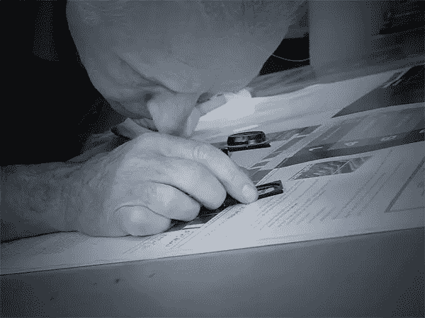
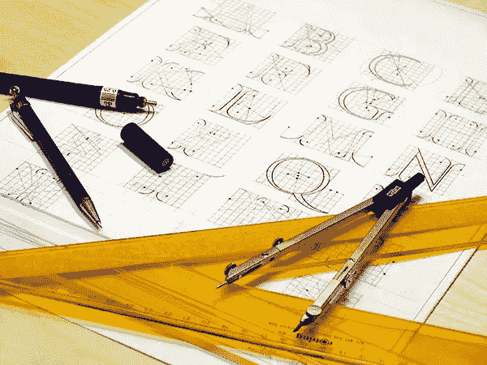
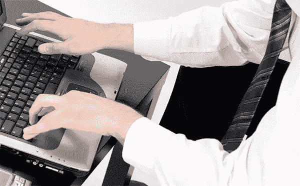
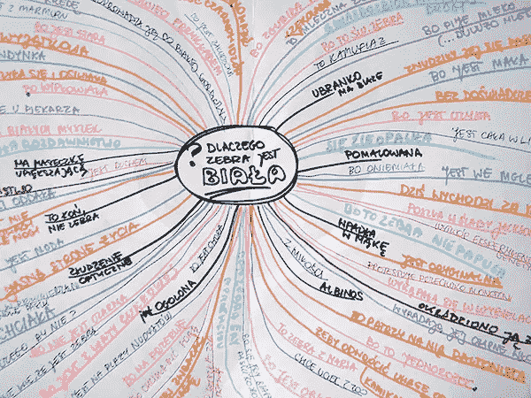

# 摆脱设计师障碍的 10 种方法

> 原文：<https://www.sitepoint.com/10-ways-to-rid-yourself-of-designers-block/>

我们都经历过。你有一个很快就要完成的大项目，你还有很多想法需要整理。当你坐在电脑前试图构思出议程的每一部分时，你的大脑撞上了一堵砖墙。你想出的任何东西看起来都不怎么样，你觉得没有灵感，你就是找不到在你的项目上取得任何进展所需的动力。我们都经历过这种情况。设计师的阻碍可以使任何设计师或任何项目脱轨。但是，一个经验丰富的设计师会为设计师的障碍做好准备，并随时准备突破这种自然出现的心理障碍。下面是十种方法来摧毁设计师的障碍，减少挫折，并保持生产力。

### 简化您的项目

当你被困在一个大得难以承受的项目中时，把它分成小块。一次解决一部分问题。这将使事情变得容易处理得多，因为一次解决一个小问题比一次解决所有问题要有序得多。一旦你开始并解决了问题的一部分，汁液开始流动，你进入了你的凹槽，动力带着你，项目的其余部分开始像多米诺骨牌一样到位。

### 创建清单

创建一份清单将有助于你保持条理。有时，即使是最有条理的设计师也会让他或她的工作失控。写下一个项目需要达到的所有目标将有助于你更好地评估整个项目的范围。创建一个清单也非常有帮助，因为它将确保你不会忘记任何东西。最重要的是，它将你的思想从在你的活动记忆中保存任务清单中解放出来，这显然会从你的实际设计工作中夺走宝贵的脑力。

### 不要过分挑剔

对你的工作持批评态度是好的。你应该仔细检查你所做的一切。然而，有一种东西太挑剔了，这会比其他任何东西都更快地扼杀你的创造力。当你在为你的客户寻找合适的解决方案时，事情并不完美也没关系。一旦你把所有的东西放在一起，你就可以精炼它，润色演示文稿。担心如何有效地解决问题，然后再调整你的工作。如果你的设计还不完美，不要担心；它只需要在终点线完美，而不是在过程中。

### 不要过度思考你的工作

我会对你完全诚实。我最好的设计作品来自于我不再对设计如此精确，而是开始设计的时候。我没有坐下来思考我正在做的事情的每一个细节。我有一个愿景，我带着它跑。在设计工作中，直觉能让你成为真正的明星。直觉似乎是自然的，事情往往会井井有条。对每一件小事都一丝不苟会让你的工作看起来很强迫，很死板。偶尔让自己放松一下，把复习过程留到有实质性的东西要复习的时候，这是非常好的。

### 拿出速写本

这是教科书式的回答，但却是绝对的真理。很多时候，你不能创造任何伟大的东西，因为它只是不来自推动像素。我相信你知道那些设计师中的一个，他们可以坐在电脑前，不需要任何草稿或草图就能做出五星级的海报或网站设计，但这并不总是对每个人都有效。我保证，即使他们时不时会遇到设计师的阻碍，不得不拿出他们的素描本。

你的素描本身不一定是艺术作品。它们可以是又快又脏的，简单的形状，涂鸦，或者任何能帮助你快速构思的东西。这些草图仅供你看。没有人对你评头论足，所以你可以尝试任何事情。做笔记，抓马克笔调色，涂鸦，只要能帮你找到设计困境的答案，都没关系。

### 研究其他艺术风格

根据你的客户，你可能不得不走出你的舒适区。在这种情况下，你将不得不做一些研究。例如，假设您正在为一家滑板公司创建网站或广告。一个想法突然出现在你的脑海中，为他们的网站或他们的标志做一个涂鸦风格的设计。没人指望你只知道如何创造一个[好看的涂鸦风格](https://www.sitepoint.com/taking-fonts-outside-30-examples-of-street-typography/ "Taking Fonts Outside: 30 Examples of Street Typography")。在这种情况下，你可以上网查看涂鸦图像和风格，并创建一个包含你喜欢的图像的文件夹。从你收集的所有研究中，你会根据你收集的涂鸦图像的风格为你的客户的标志画草图。研究是创造出符合客户需求的优秀设计的关键，同时也拓宽了你的视野，拓展了你的技能。

### 与其他设计师交流

有时候，你需要有人给你出主意。有时我们在自己的工作中视野狭窄，新的视角有助于开阔我们的视野。我无法告诉你有多少次我被困在一个项目中，一个十分钟的电话或与另一位设计师来回的一个简短的电子邮件会话让我再次前进。每个人处理问题的方式都不一样，所以问问另一个设计师他们的想法可能会激发出一个你以前没有考虑过的设计问题的独特解决方案。

### 好好休息一下

我知道这说不通，但是请原谅我。当你压力大的时候，你不会想清楚。对你的大脑来说，压力就像高峰时间的交通堵塞。你更容易心慌，更容易沮丧，压力会让你做出通常不会做出的决定。你可以通过真正的休息来平衡压力，包括离开你的办公桌，真正地暂停你的工作。积极的态度和良好的心情可以为你找回最佳状态创造奇迹。

### 创建思维导图

你可以在纸上手工创建，也可以使用思维导图软件。无论你用哪种方法，它都会帮助你联想单词。你从与你的主题相关的词开始，然后用与这些词相关的术语以及可能的解决方案展开。这个想法是，你最终会建立起抽象的联系，而你只是坐在那里盯着空间或空白的像素化画布是不会建立起这种联系的。它让你思考人际关系，这可以引导你找到独特的和创造性的解决方案。

### 参与各种项目

日复一日地做同一个项目，或者只做一个项目会让你视野狭窄。如果你有多个客户或项目要做，当你陷入其中一个项目时，就切换项目。这会让你保持头脑清醒，并给你第二次机会去完成一项现在难倒你的任务。我无法告诉你有多少次我把时间浪费在一个项目上。我最终完成了它，但我发现如果我为每个项目设定了每日目标，我往往会完成更多，因为我可以经常改变。例如，我将设定一个目标，今天为一个网站设计页脚。当我完成后，我会停止在那个项目上的工作，转而致力于另一个项目的一两个目标。这将确保你不会让自己有时间去调整和摆弄同一个项目，最终导致你的工作前功尽弃。

### 结论

设计师的阻碍是真正的生产力杀手。然而，如果你做了上面列出的一些事情，你将会冲破你的创造力障碍，创造出令人兴奋、鼓舞人心的作品。无论你做什么，不要只是坐在那里什么也不做。

*你怎么缓解设计师的阻滞？这十个里面你最喜欢哪一个？在下面的评论区分享你的建议。*

## 分享这篇文章