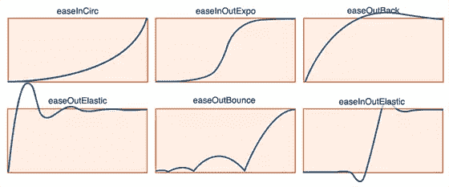
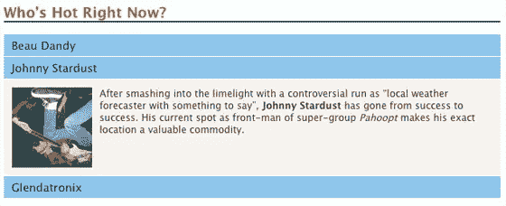

# 用 jQuery 制作动画

> 原文：<https://www.sitepoint.com/animating-with-jquery/>

jQuery 是为了制作动画而构建的。无论是在登录失败后淡出警告消息，向下滑动菜单控件，还是启动完整的侧滚，“射击”游戏，都可以通过一些强大的内置方法轻松完成，并通过大量插件进行增强。

**动画 CSS 属性**

到目前为止，我们已经掌握了一些有价值的动画示例——滑动、淡入淡出以及一些花哨的隐藏和显示——但我们对动画的确切内容以及它的具体发生方式还没有太多的控制。是时候引入一个非常令人兴奋的 jQuery 函数了，它被称为`animate`，可以让你制作一大堆 CSS 属性的动画，创造出一些你自己的惊人效果。让我们来看一个`animate`的例子:

```
$('p').animate({
  padding: '20px',
  fontSize: '30px'
}, 2000);
```

这段代码将动画显示页面上的所有段落，在 2 秒(2000 毫秒)内将填充从初始状态更改为 20px，并将字体大小增加到 30px。

为了使用`animate`，我们传递一个对象文字，其中包含我们希望动画化的属性，指定为键/值对——这与使用 css 函数分配多个属性非常相似。有一点需要记住:属性名必须是大小写一致的，以便被 animate 函数使用；也就是说，你需要把`background-color`写成`backgroundColor`，把`margin-left`写成`marginLeft`。任何由多个单词组成的属性名都需要以这种方式修改。

您可以传递一个毫秒数，或者一个字符串`slow`、`fast`或`normal`。CSS 属性的值可以用像素、单位、百分比或磅来设置。例如，你可以写`100px`、`10em`、`50%`或`16pt`。

更令人兴奋的是，您定义的值可以是相对于元素当前值的*:您所需要做的就是在值前面指定+=或-=值，该值将被添加到元素的当前属性中或从元素的当前属性中减去。让我们利用这一能力，在使用`hover`功能将鼠标移到菜单项上时，让我们的导航菜单摆动:*

```
$('#navigation li').hover(function() {
  $(this).animate({paddingLeft: '+=15px'}, 200);
}, function() {
  $(this).animate({paddingLeft: '-=15px'}, 200);
});
```

将鼠标放在导航菜单上，你会看到链接摆动得很好。

您还可以使用`animate`来实现对显示、隐藏和切换功能的细粒度控制。我们简单地将属性的动画值指定为`show`、`hide`或`toggle` ，而不是一个数字量:

```
$('#disclaimer').animate({
  opacity: 'hide',
  height: 'hide'
}, 'slow');
```

看到动画元素非常令人满意。作为一个练习，试着将你能想到的每个元素属性制作成动画——你会发现一些有趣的效果！`animate`函数也有一些强大的高级选项，我们将在本章中详细讨论。

**彩色动画**

一旦你意识到`animate`函数有多酷，你可能会想要动画元素的颜色。然而，制作颜色动画有点棘手，因为在开始和结束颜色之间的颜色值需要以特殊的方式计算。与高度或宽度值以简单的线性方式从一个值移动到另一个值不同，jQuery 需要做一些额外的数学运算来计算出什么颜色，比如说，介于浅蓝色和橙色之间的四分之三。

核心库中省略了这种颜色计算功能。仔细想想，这是有道理的:大多数项目都不需要这个功能，所以 jQuery 可以将核心库的大小保持在最小。如果你想制作颜色动画，你需要下载[颜色动画插件。](http://plugins.jquery.com/project/color)
**使用插件**

官方 jQuery 插件库包含了越来越多的插件——一些比另一些更有用。您可以通过名称、类别(如效果或实用程序)或从 jQuery 社区获得的评级来搜索插件。

找到感兴趣的插件后，将其下载到适合您项目的位置(很可能是 jQuery 源文件所在的位置)。在使用插件之前仔细阅读`readme`文件或相关文档是一个好主意，但是通常你需要做的就是将它包含在你的 HTML 文件中，就像我们包含自定义 JavaScript 文件一样。

如何利用你新发现的功能因插件而异，所以你必须查阅每个插件的文档，以便最好地利用它。

下载并包含颜色动画插件后，现在可以在 jQuery 动画代码中动画显示颜色属性，就像处理其他 CSS 属性一样。让我们在页面加载的两秒钟内逐渐突出我们的免责声明消息，以确保没有人会错过它:

```
$('#disclaimer').animate({'backgroundColor':'#ff9f5f'}, 2000);
```

看到动画免责声明是如何让它变得如此引人注目了吗？

**缓动**
*缓动*指的是在动画制作过程中发生的加速和减速，以使动画看起来更自然。缓动应用一种数学算法来改变动画进行的速度。谢天谢地，我们使用的是 jQuery，所以你可以放心地把你的高中数学技能锁起来。

jQuery 中有两种类型的缓动可用:`linear`和`swing`。任何时候在 jQuery 中使用动画函数，都可以指定这些参数来控制动画的放松。下图显示了它们之间的差异，其中显示了属性如何根据您选择的缓动选项在动画期间进行调整。


`swing`在加速之前，缓动开始时很慢，然后在动画快结束时，它又慢了下来，非常轻柔。视觉上，swing 缓动看起来比线性缓动更自然，如果没有指定缓动参数，jQuery 默认使用它。

线性缓动方法没有加速或减速:动画以恒定的速率出现。在大多数情况下，它看起来相当无聊，有点死板，但是值得一试——它可能正好适合你的目的。

作为一个例子，我们将使第一个段落标记具有动画效果，这样当点击它时，它会增长和收缩；我们将在它增长时使用线性缓动，在它收缩时使用摆动缓动。差别很微妙，但是如果你重复几次动画，你应该能够区分它们；缩小的动画感觉更自然一点:

```
$('p:first').toggle(function() {
  $(this).animate({'height':'+=150px'}, 1000, 'linear');
}, function() {
  $(this).animate({'height':'-=150px'}, 1000, 'swing');
});
```

这个语句中有相当多的 jQuery，所以现在可能是一个暂停的好时机，以确保您理解这里发生的一切:

*   我们使用一个带有选择器的过滤器来获取第一个段落标签。
*   一个 toggle 事件处理程序(在连续点击时执行每个传递的函数)被附加到该段落。
*   在处理程序中，我们选择`this`，它指的是触发事件的元素(在我们的例子中，是段落本身)。
*   第一个处理程序使用+=格式将段落的高度增加 150 个像素，使用`linear`缓动函数。
*   第二个处理程序使用-=格式将段落高度缩小 150 像素，使用`swing`缓动函数。

如果你设法跟上并理解了这些步骤中的每一步，那么就给自己点鼓励吧！您真的掌握了 jQuery 的窍门！

**高级缓和**

如前所述，swing easing 提供了一个更加视觉愉悦的过渡，可能对大多数任务都足够了。但摇摆和线性宽松只是冰山一角。除了核心 jQuery 库中包含的这两种基本类型之外，还有大量的简化选项。其中大部分可以在 jQuery 插件库中的 [easing 插件和](http://plugins.jquery.com/project/Easing)中找到。

**jQuery UI 包括几个插件**

缓动库也包含在 jQuery UI 库的 effects 部分。这个库包括几个常用插件，包括彩色动画、类转换和缓动。通过包含 jQuery UI 库，您将无需在页面中单独包含每个插件。

只需下载插件的 JavaScript 文件并将其包含在 HTML 页面中，放在 jQuery 库之后的任何位置。放松插件并没有给你提供新的功能，只是给你提供了 30 多个新的放松选项。解释所有这些缓解函数做什么甚至会考验最有想象力的作者，所以我们将简单地把你的注意力引向下图，在那里你可以看到一些用图形表示的算法。

你会注意到一些算法移出了图形区域；当动画元素到达过渡的这一部分时，它们将移动*经过*它们的目的地，最后返回并停留在那里。这种效果就像一个附着在松紧带上的元件，它会轻轻地将所有东西拉回到原位。



要使用其中一个新算法，我们只需将其名称传递给我们的`animate`函数。有很多选择，所以我们不妨直接进入它，尝试一些不同的:

```
$('p:first').animate({height: '+=300px'}, 2000, 'easeOutBounce');
$('p:first').animate({height: '-=300px'}, 2000, 'easeInOutExpo');
$('p:first').animate({height: 'hide'}, 2000, 'easeOutCirc');
$('p:first').animate({height: 'show'}, 2000, 'easeOutElastic');
```

看那一段去！您可能想知道这些缓动选项的名称来自哪里，或者在哪里可以看到完整的列表。这些算法源自罗伯特·彭纳的放松方程，在他的网站上有详细的描述。

查看所有可用方程的最好方法是查看插件的源代码。如果您使用文本编辑器打开您下载的文件，您将看到可以在 jQuery 动画中使用的函数列表。

**游玩时间**

休息一下，测试一下插件提供的所有放松功能。你不太可能需要使用所有的界面，但是熟悉它们会让你选择正确的界面，给你想要的界面带来精确的感觉。此外，体验一下`animate`函数将会巩固你对它的了解:它是 jQuery 忍者武器库中重要的一部分！

**弹性内容窗格**

现在我们已经了解了一些关于`animate`函数如何工作的知识，让我们来看看客户的最新一轮请求。今天的待办事项列表中增加了一个至关重要的页面组件: *StarTrackr！日报“现在谁最热门？”列表*(简称 SDWHRNL)。这份名单包括最近受欢迎或不受欢迎的名人，以及附带的照片和简短的简历。我们将应用我们刚刚学习的一些动画和放松技术来将列表实现为可以独立打开和关闭的窗格。

小部件在页面中的外观如下所示。



在我们的 HTML 中，我们将把 section 实现为一个包含所有名人的`div`元素。每个名人的窗格将被标记为一个`h3`，随后是另一个包含一张图片和一小段文字的`div`:

```
<div id="bio">
  <h2>Who’s Hot Right Now?</h2>

  <h3>Beau Dandy</h3>
  <div>
    
    <p>Content about Beau Dandy</p>
  </div>

  <h3>Johnny Stardust</h3>
  <div>
    
    <p>Content about Johny Stardust</p>
  </div>

  <h3>Glendatronix</h3>
  <div>
    
    <p>Content about Glendatronix</p>
  </div>
</div>
```

当用户单击其中一个标题时，我们希望相关的内容窗格在打开和关闭之间切换。您可以按照自己认为合适的方式设计窗格的样式，但是让块级元素的标题具有不同颜色的背景是一种常见的技术:它为用户单击它提供了一个清晰的行动号召。

**《跳动的心》动画？**

需要注意的一个怪癖是，直接在标题标签旁边制作元素的动画有时看起来会“跳动”——特别是当元素隐藏起来的时候。这是由于标题的页边距，当后面的元素隐藏时，页边距会折叠。我们在这里使用的一个简单的解决方法是完全删除标题标签的空白。

我们希望在页面加载时不显示任何内容，所以首先要做的是隐藏所有的内容容器:

```
$('#bio > div').hide();
```

相反，如果您希望默认打开一个窗格，您可以在这里指定它。这有助于让用户更清楚地看到窗格中“隐藏”着内容，他们应该点击标题来显示它。在 jQuery 中实现这一点很简单:我们只需应用`:first`过滤器并调用`show`动作来显示第一个窗格:

```
$('#bio > div:first').show();
```

**子选择器**

这些例子中有一个选择器特性，我们还没有涉及到。是*子*选择器，用大于号尖括号(>)表示。子选择器选择与选择器匹配的所有直接子级。如果我们省略了子选择器，我们的代码将选择 bio `div`元素下的所有`div`元素，即使它们嵌套在其他元素中。关于使用这个选择器的更多细节和代码示例，请随意查阅 [jQuery API 文档。](http://docs.jquery.com/Selectors/child)

既然我们的内容已经按照我们想要的方式进行了标记，我们只需要添加一些 jQuery 交互魔法。为了揭示我们的秘密内容，我们将采用熟悉的方法来捕获`click`事件，找到下一个元素(包含我们的内容)，并显示它。但是这一次，我们将使用一种“反弹”的方式，放松到内容的高度，以便窗格在视图中反弹:

```
$('#bio h3').click(function() {
  $(this).next().animate(
    {'height':'toggle'}, 'slow', 'easeOutBounce'
  );
});
```

缓动功能 easeOutBounce 产生了一个很棒的弹跳球效果，这对于像这样的内容窗格非常有用。在您的浏览器中旋转一下，自己看看吧！

**note:**Want more?

看看这本书，并在网上购买:jQuery:忍者新手，作者厄尔·卡斯尔丁&克雷格·沙尔基* 

## *分享这篇文章*