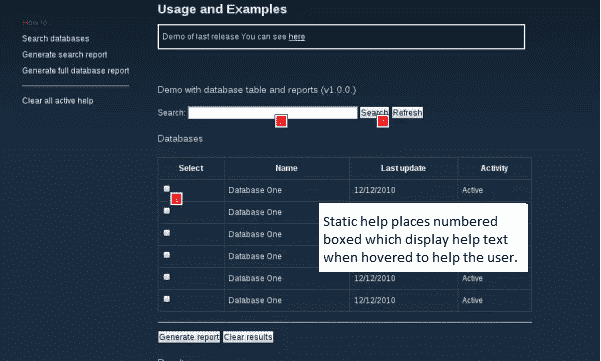
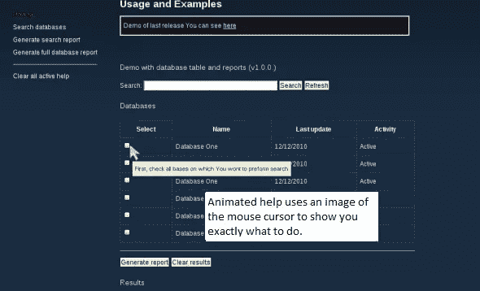

# jQuery 嵌入式帮助系统(客座博文)

> 原文：<https://www.sitepoint.com/jquery-embedded-system-guest-post/>

今天，我们在 jQuery 博客上发布了另一篇客座博文。Josip Kalebic 来自克罗地亚，是一名专门研究 jQuery 和 PHP 的 Web 开发人员。他帮助开发了这个非常棒的嵌入式帮助插件！动画帮助工具真的很特别，你一定要看看！交给他。

[嵌入式帮助网站](http://www.embedded-help.net)
[下载页面](http://www.embedded-help.net/download)
[查看演示](http://embedded-help.net/usage)

嵌入式帮助被设计为一个完整的 web 帮助系统，包括两个主要部分:

一个是[上下文相关的](http://en.wikipedia.org/wiki/Context-sensitive_help)框，包含取决于当前用户界面的问题(帮助链接)。

第二部分是嵌入式程序辅助，无论是逐步动画还是编号点的静态视图。程序帮助回答了“如何..?"。(怎么做一件事？)

经典的“上下文相关帮助”的问题是，如果用户在工作操作中遇到无法解决的问题，他将被迫寻找问题和答案。当他发现它时，他必须研究它，然后把它应用于自己的情况。因此，嵌入式帮助系统为搜索问题提供了更少的时间，并在实际情况中提供了答案的可视化应用。

embedded help 的目标是创建这样一个系统，它不需要对用户界面进行额外的修改，而是使用现有的结构元素，只使用 html 标签、类和 ID-s 作为选择器，jquery 是一个完美的工具。插件的工作原理是将路径(点)定义为 JSON 格式的数组[http://www.json.org/]，它描述了指针的移动和每个元素(点)的“做什么”动作，路径文件与 web 应用程序的其余部分分离。因此，整个嵌入式帮助可以在最后创建(当 web 应用程序完全开发完成时)，也可以随后集成到现有的 web 应用程序中。

尽管这个插件可以在任何网络界面上使用，但它最初的目的是用于网络应用、内容管理和电子商务系统

嵌入式帮助插件的技术特征:

*   双向方法:动画和静态
*   工具提示对齐 I 持续时间选项
*   外部函数调用系统
*   “Esc”键功能
*   Viewport system
*   JSON 路径定义

最后，我要感谢参与插件开发的人员: **Piotr Roznicki** 和**sze kely Szabolcs**，并邀请其他 jquery 开发人员参与他们对嵌入式帮助的改进或开发嵌入式帮助的新系统。[加入 sourceforge 项目](http://sourceforge.net/people/viewjob.php?group_id=512969&job_id=36058)。

有关嵌入式帮助系统的更多信息，请访问:
[http://sourceforge.net/projects/embeddedhelp/](http://sourceforge.net/projects/embeddedhelp/)
[http://plugins.jquery.com/project/embedded-help](http://plugins.jquery.com/project/embedded-help)

**作者:**来自克罗地亚的 Josip Kalebic 一名网络开发人员。
联系作者

## 分享这篇文章