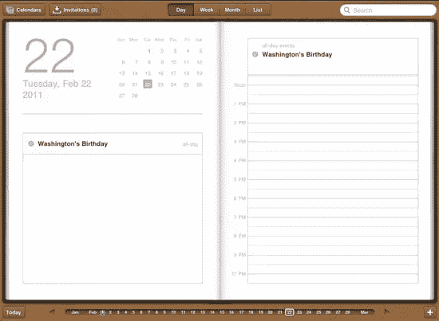

# 改进手机隐喻的 4 种方法

> 原文：<https://www.sitepoint.com/4-ways-to-improve-your-mobile-metaphors/>

在我的上一篇文章中，我提到了移动设备上的自定义控件工作良好的一种方式是它们模仿真实世界的控件。让我们以转盘为例:一个看起来像旧转盘的应用程序可能有一个可移动的指针，可以转动的旋钮，以及刮擦的能力(我发现类似的应用程序确实存在，但我没有检查过)。

这可能是苹果最喜欢打破的规则。要理解我的意思，看看 iPad 上的日历应用程序。它看起来很像一个传统的记事本，上面有很多可翻页的页面，但你必须点击底部的小箭头来翻页。没有使用滑动翻页的选项。

**iCal 应用不允许通过滑动翻页**

为了努力做到他们所说的，而不是他们所做的，让我们来看看一些方法，你可以向将使用你的应用的人提供有意义的一致体验:

*   离开电脑。在尽可能多的方面，抽象应该像主体本身一样工作。如果你正在开发我前面提到的转盘应用程序，那么尽一切办法把你的手放在转盘上！放一张唱片，调节旋钮，听磁针在唱片上的噼啪声，注意细节，让它成为一种享受。记笔记。
*   改善“现实生活”首先，在多点触控数字设备上安装转盘或记事本的好处是，你可以做所有在真正的转盘或记事本上做不到的事情。尽可能在外观和技术能力上改进真实世界的物体来增加乐趣。
    例如，能够滑动翻页是一种有趣的交互方式，但如果你被迫这样做，就会变成一件苦差事。数字唱盘可能有辅助控制，不需要急着拨针或挑选新专辑的用户。通过创建注重效率的备选任务流，为应用程序的高级用户或频繁用户做好计划。
*   在你建造它之前，先试一试。在你制作应用程序之前，你对它的体验越多，你就越能判断这个隐喻有多好，漏洞在哪里。一个便宜而有效的方法是通过纸(甚至是毡)原型，在那里你可以用打印输出或绘制的模型来“表演”交互。
    因此，在我们的转盘示例中，您可以演示您希望唱针臂在轻击一次时捕捉到唱片的边缘，但拖动允许它放置在任何地方。这种活动是即时协作的，因为它不在某人的个人电脑上，并导致许多澄清。一定要邀请开发者；他们会从执行的角度进行思考，并能为讨论带来技术机会和限制。
*   **想透细节**。我喜欢把开发人员想象成导演，他们把工作部分组合成一个有凝聚力的单元，告诉“演员”去哪里，什么时候让故事可信。如果事先讨论过这些互动，会使过程更加顺利，并减轻压力。这就是为什么在规划和设计阶段最好避免掩盖哪怕是很小的模糊区域的诱惑。
    人们很容易说，“开发者可以充实那些细节，我们现在没有时间去担心所有那些交互。”请记住，没有面向细节的生产，你的隐喻将会失败；正是这种直接的操作和精心设计的响应能力让这款应用感觉“正确”

有可能你正在构建一个应用程序，其中更多的标准控件是最佳的，没有必要让它看起来像别的东西。如果你不确定，考虑一下谁会使用你的应用程序，这个隐喻有什么目的，以及这个隐喻会给使用你的应用程序的人带来的独特价值。别忘了享受也算价值！

## 分享这篇文章