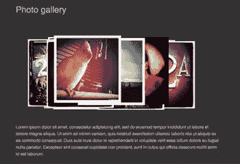
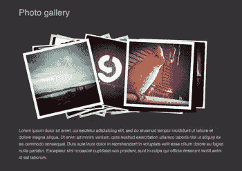

# 用 jQuery、Modernizr 和 CSS3 构建一个令人敬畏的图像库

> 原文：<https://www.sitepoint.com/build-an-awesome-image-gallery-with-jquery-modernizr-and-css3/>

即使我们确实生活在 Flickr 时代(显然这是紧随水瓶时代之后的时代)，能够在我的厨房桌子上摆放一大箱照片仍然是一件非常可爱的事情。事实上，我最喜欢的屏幕保护程序在模拟这一点上做得很好——它内置于 MacOS X 中，可以从 iPhoto 库中抓取照片，并将它们逐渐分散到整个屏幕上，形成一个漂亮而杂乱的堆。它看起来有点像这样:


照片慢慢淡入并投放到屏幕上，随机旋转。这是一个很棒的效果，看起来很舒服。在合适的网站上，它甚至可以成为常规图片库的有趣替代品。

我们能单独用 CSS3 实现这一点吗？我打赌你已经在想办法了。不幸的是，支持它们的 Firefox 和 IE 版本仍处于测试阶段——即使它们真的出来了，我们都知道升级它们的浏览器需要多长时间。现在，让我们来看看一种混合方法:

*   对于没有 JS 的人来说，图像将显示在一个干净、简单的照片库中。这里不需要逞英雄。
*   有 JS 但没有 CSS3-fu 的浏览器将会看到这个图库的一个版本，它在照片中逐渐淡入，并以一种随机的方式分散它们。为此，我们将使用 jQuery。
*   可以进行 CSS3 变换的浏览器将得到相同的渐隐和散射动画，加上一些旋转以获得更真实、混乱的效果。

## 建立一个简单的画廊

先说裸机版。这里有一个快速照片库，使用了我用不同的 iPhone 相机应用程序拍摄的一些 250×250 的照片:


对于非 JS 用户来说，标记很简单:一些`div`用于基本布局，一些 CSS 用于基本布局，图像在左侧以网格的形式排列。它既干净又简单，目前来看还不错；您可以[看到示例 1 中的标记。](https://s3.sitepoint.com/examples/modernizr-gallery/demo/step1-no-js.html)让我们开始着手解决 JS 用户的问题。

## 进入现代化

有许多不同的方法来测试 JS 的存在或不存在——但是当你需要更多的细节，比如浏览器是否支持 CSS3 的`box-shadow`，或者知道如何处理一个`canvas`时，你该怎么做？进入 [Modernizr](http://www.modernizr.com/) ，一种干净直观的方式来检测不同种类的浏览器支持，不依赖于垃圾浏览器嗅探或令人沮丧的测试。在 SitePoint 播客的最近一集[中，你可以听到关于它是如何做到这一点的所有细节。](https://www.sitepoint.com/podcast-95-the-undetectables-with-paul-irish/)我们将使用它来查看 CSS3 转换是否可用。

定制的 Modernizr 构建器可以生成一个整洁、精简的脚本版本，其中只包含您需要的测试，所以我使用这个构建器来构建这个选项。

让我们在页面中包括这个和 jQuery。您的 HTML 元素现在应该附加了两个新类:`js`和`csstransforms`。使用你最喜欢的浏览器开发工具来检查它们是否存在。

## 调整 CSS

当 JavaScript 打开时，我希望图像首先被隐藏——我们将通过一次增加一个图像的不透明度来显示它们。它们也将被绝对地放置在画廊区域内。Modernizr 给了我们一个`js`类，所以让我们使用它:

```
 .js #gallery {
     width: 960px;
     height: 300px;
     margin: 50px 0;
 }

.js #gallery,
.js #info {
    width: 100%;
    position: relative;
}

.js #gallery img {
    margin: 0;
    opacity: 0.0;
    -moz-opacity: 0.0;
    -ms-opacity: 0.0;
    -webkit-opacity: 0.0;
    position: absolute;
    bottom:0;
    left: 0;
} 
```

由于 images 的`opacity`属性被设置为`0.0`，一旦插入，您将看不到任何图像。还可以；我们将在下一部分把它们都放回去。如果它困扰你，现在就把这几行注释掉。

## 准备图像

我们的下一个任务是对图像进行洗牌:我们将从一个 jQuery [`each`](http://api.jquery.com/each/) 循环开始，为它们分配新的样式。我们的图库`div`是 760 像素宽，300 像素高，所以我们需要一个高达 510 的数字来表示图片的左边位置，以及 30 左右的数字来表示图片从底部开始的位置——这将确保它们保持在图库的边界内。当它们落在除法上时，它们会缩小到正常大小，所以我们还会添加一个变量，来表示我们希望在每个维度上添加多少像素的脂肪。我的图像在任何一个维度上都不超过 250 像素，所以一定要做一些自己的计算来适应更大或更小的图像！

JavaScript 的 [`Math`](https://developer.mozilla.org/en/JavaScript/Reference/Global_Objects/Math/random) 对象会为我们处理一些随机的位置。由于`Math.random`只知道如何在 0 和小于 1 之间选择一个数，我们需要用`Math.floor`乘上然后下舍入以得到一个有用的数字:

```
$('#gallery img').each(function(count) {
    var $photo = $(this);
    var zoom = 150;
    var offsetLeft = Math.floor(Math.random() * 510);
    var offsetBottom = Math.floor(Math.random() * 70);
 }); 
```

现在我们有了数字，我们可以使用 jQuery 的 [`css`](http://api.jquery.com/css/) 和 [`attr`](http://api.jquery.com/arrt/) 方法将它们插入到图像的样式和属性中。这是几行简单的台词:

```
$('#gallery img').each(function(count) {
    ...
    $photo.css({
        "left" : offsetLeft + "px",
        "bottom" : offsetBottom + "px"
     }).attr({
         height : $photo.height() + zoom,
         width : $photo.width() + zoom
    });
}); 
```

## 摊牌

每张照片现在都应该被注入人造像素，然后被不小心扔成一团——是时候一张一张地展示它们了。jQuery 的`animate`方法可以负责逐渐缩小图像并增加不透明度——只需向它传递想要更改的 CSS 属性，并花费一定的时间来完成。

我们将把所有这些都包装在 JavaScript 的`setTimeout`方法中，该方法允许我们在延迟之后执行动作。在我们的例子中，我们希望我们的动画相隔 5 秒(即 5000 毫秒)发生。您是否注意到在我们的`each`函数中有一个计数器`count`？我们将使用它来分隔我们的照片动画，在`each`循环结束时乘以 5000。此时，整个`each`循环应该是这样的:

```
$('#gallery img').each(function(count) {
        var $photo = $(this);
        var zoom = 150;
        var offsetLeft = Math.floor(Math.random() * 450);
        var offsetBottom = Math.floor(Math.random() * 30);

        $photo.css({
            "left" : offsetLeft  + "px",
            "bottom" : offsetBottom  + "px"
        }).attr({
            height : $photo.height() + zoom,
            width : $photo.width() + zoom
        });

      if (Modernizr.csstransforms) {
           var degrees = Math.floor(Math.random() * 40) -20;
           var rotations = "rotate(" + degrees + "deg)";
           $photo.css({
               "transform" : rotations,
               "-moz-transform" : rotations,
               "-ms-transform" : rotations,
               "-o-transform" : rotations,
               "-webkit-transform" : rotations
            });
       }
        setTimeout(function() {
                $photo.animate({
                       height: "-=" + zoom + "px",
                       width: "-=" + zoom + "px",
                       opacity: 1.0
                   }, 4000);
        }, (count*5000));
        count++;
     }); 
```

如果一切顺利，你应该得到类似于[例 2、](https://s3.sitepoint.com/examples/modernizr-gallery/demo/step2-withjs.html "Example 2")的东西，当你运行它时，你的图库应该看起来像下面这样。



## 倾斜！

这是令人愉快的随机，但角度真的掀起了效果。对于那些支持 CSS3 `transform`的浏览器，我们将添加一些随机生成的旋转。我们如何做到这一点？

除了添加方便的类名之外，Modernizr 还添加了一个全局对象，该对象可以对我们要求的每项功能给出肯定或否定的回答。在我们的脚本中，我们将检查`Modernizr.csstransforms`是否为真；如果是这样的话，我们将做更多的数学计算，找出一个漂亮的随机旋转，然后应用它作为照片的变换。这样做与上一步非常相似，只是这一次我们的随机数可以是负数:

```
if (Modernizr.csstransforms) {
     var degrees = Math.floor(Math.random() * 40) -20;
     $photo.css({
         "transform" : "rotate(" + degrees + "deg)",
         "-moz-transform" : "rotate(" + degrees + "deg)",
         "-ms-transform" : "rotate(" + degrees + "deg)",
         "-o-transform" : "rotate(" + degrees + "deg)",
         "-webkit-transform" : "rotate(" + degrees + "deg)"
      });
 } 
```

在`setTimeout`方法开始之前，把这个放到你的`each`循环中。[示例 3](https://s3.sitepoint.com/examples/modernizr-gallery/demo/step3-withtransforms.html) 向您展示了整个工具包，如果您有一个支持`transform`的浏览器，您应该能够看到如下内容:



## 就是这样！

你刚刚完成了一个平滑、舒缓的替代方案，可以替代乏味的老式旋转图像幻灯片。如果你想把它推得更远，你可以用更多的视觉享受添加一些花哨的东西，比如`box-shadow`，或者额外的动画。更重要的是，如果这是您第一次使用 Modernizr，那么您现在已经体会到在项目中实现它是多么容易。

## 分享这篇文章