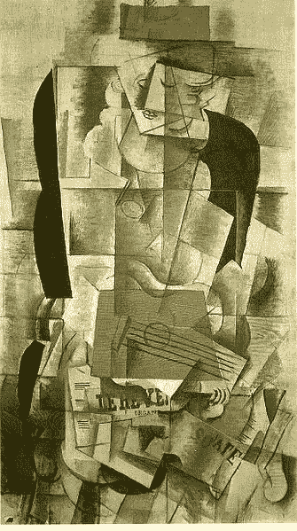
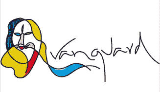
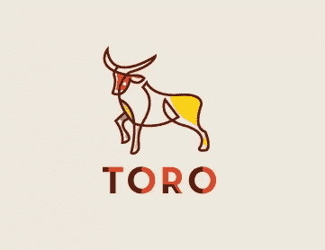
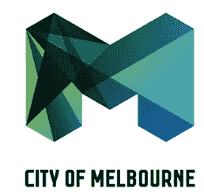
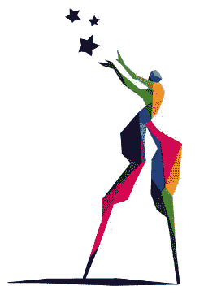

# 立体主义在标志设计中的运用

> 原文：<https://www.sitepoint.com/using-cubism-in-logo-design/>

立体主义是 20 世纪的先锋派艺术运动，与毕加索和乔治·布拉克有着密切的联系。这种艺术风格彻底改变了欧洲的绘画和雕塑。

 在立体派艺术作品中，正如我们将在标识的例子中看到的，物体被分解，然后以一种非常抽象和有些令人不安的形式重新组合。这位立体派艺术家从多个视角描绘物体，物体表面以任意角度相交。物体的正常深度感被去除。

今天，身份设计师正在使用这种艺术风格作为他们标志作品的灵感。立体派风格将图像简化到一个简单的水平，而简单是一个好标志更重要的特征之一。许多标志都有一种手绘的感觉，引人注目且美观，远离了一些基于矢量的标志非常干净、计算机化的外观。

因此，为了你的视觉享受和设计灵感，这里有一个立体派风格标志的小集合。

詹姆斯·斯特兰奇的立体派咖啡

前锋由[卡尔梅斯](http://logopond.com/gallery/detail/108661)

托罗由[范保罗](http://www.vanpaul.com/)

墨尔本城市标志

J .沃尔特·汤普森的美属维尔京群岛

立体派(文化商业:影响、策略和技术)研究小组

好吧，也许这个没有那么鼓舞人心，但是我刚刚*有*包括伦敦 2012 年奥运会的标志。

你觉得这些 logo 设计怎么样？

主要图像来源:乔治·布拉克:拿着吉他的女人，创作于 1913 年，在法国乔治·蓬皮杜艺术中心的法国国家现代艺术博物馆。

## 分享这篇文章