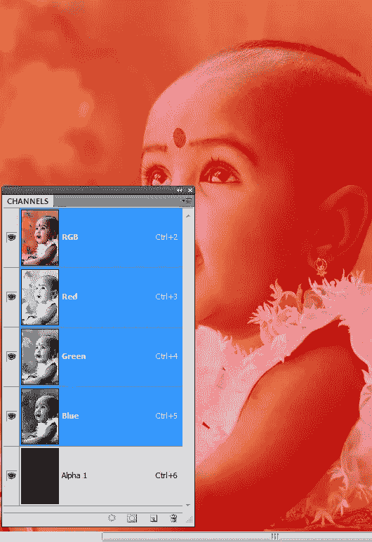
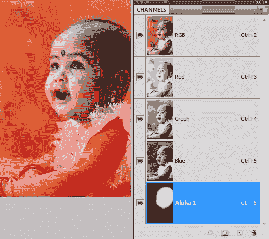
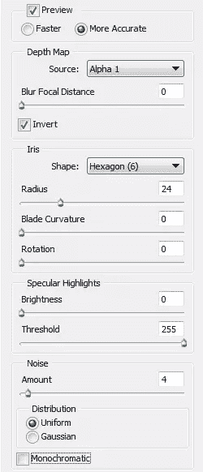

# 如何在 Photoshop 中模仿 Lensbaby 外观

> 原文：<https://www.sitepoint.com/how-to-mimic-the-lensbaby-look-in-photoshop/>

[Lensbaby](http://www.lensbaby.com) 是一个可弯曲的镜头，可以让你控制照片的哪一部分对焦。通过有选择地聚焦图像的一部分，您可以增加额外的强调，并将注意力吸引到图像的该部分。作为一种控制观众视线的方法，它对印刷和网页设计都很有用。因此，不用为你的相机购买额外的镜头，这里有一个类似的效果，你可以使用 Photoshop 中的镜头模糊滤镜来创建。

1.打开您想要模糊背景或图像特定部分的照片。我用的是 jyobish 的这张照片，我想模糊掉除了她的头以外的所有地方。

2.通过在“图层”面板中单击“通道”面板的选项卡或选择“窗口”>“通道”,打开“通道”面板。你需要做一个选择，告诉 Photoshop 你想要模糊图像的哪一部分，哪一部分应该保持焦点，我们将在下一步中通过制作 alpha 通道来做到这一点。

3.单击“通道”面板底部的“新建通道”图标。然后，在面板顶部，通过单击 RGB 通道旁边的眼睛图标来关闭 RGB 通道的可见性。

整个图像呈现快速蒙版模式的红色覆盖。

4.我们想要编辑蒙版，使你想要保持焦点的区域没有任何红色(一旦你完成这项技术，任何你留下红色的区域将变得模糊)。在工具栏上设置前景色为白色，背景色为黑色。实现这一点的快捷方式是按 D 键将颜色重置为黑白，然后按 X 键使白色在上面。

5.选择一个大的软笔刷，在屏幕顶部的选项栏上，设置笔刷的不透明度为 50%。

6.确保选择了 Alpha 通道。在你想要保持焦点的区域上绘画。完成后，任何红色的东西都会变得模糊，图像的其余部分会保持清晰。我画了大部分小女孩的脸，停在她的脖子和粉红色的顶部。

7.关闭 alpha 通道的可见眼，选择 RGB 通道，这样您就可以再次看到全色。

8.选择“滤镜”>“模糊”>“镜头模糊”。在“镜头模糊”对话框中，将深度贴图源更改为 Alpha 1——这是您之前创建的 Alpha 通道。点击反转设置，因为最初，模糊和清晰的区域将与你在 alpha 通道中创建的相反。选中“反转”复选框可对其进行分类。调整“半径”滑块，直到获得合适的模糊量。

如果您喜欢它的外观，您可以通过拖移“噪点”滑块给图像添加少量噪点。

11.完成后点击确定，瞧！她的眼睛锐利而专注，婴儿手臂和顶部的背景和前景都模糊不清。

## 分享这篇文章