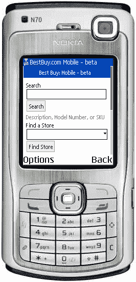

# 打破移动网络内容的神话

> 原文：<https://www.sitepoint.com/busting-the-mobile-web-content-myth/>

关于移动网站开发的一个常见误区是，传统网站上的内容可以很容易地被改编成更小的移动版本。从`media="screen"`到`media="handheld"`的一个简单的风格变化就是你需要做的所有事情来神奇地调动你的网站，对吗？

不对。

虽然自由使用 display 确实可以过滤内容:在您的移动样式表中没有，但实际上，这不是一个好主意。事实上，许多 CMS 系统可以输出一个移动的、精简的网站版本，但即使这样也不总是你的客户想要的。

W3C 将一个 Web 的[概念定义如下:](https://www.w3.org/TR/mobile-bp/#OneWeb)

“一个网络”是指在合理的范围内，向用户提供相同的信息和服务，而不管他们使用的是什么设备。然而，这并不意味着在所有设备上完全相同的[表示](https://www.w3.org/TR/di-gloss/#def-http-representation)中可以获得完全相同的信息。移动使用的环境、设备能力变化、带宽问题和移动网络能力都会影响表示。此外，一些服务和信息更适合并针对特定的用户环境。

正如这个定义所暗示的，有些东西在某些设备上是不可用的。此外，一些设备(如手机)在某些活动(如打电话)方面比其他设备好得多。因此，为特定活动设计的设备应该利用其在网络上的独特功能。

虽然只有一个网站，并根据访问者使用的媒体简单地设计不同风格的概念在许多标准化组织中很流行，但为了给移动用户提供优化的体验，需要一个单独的移动网站。在移动设备上冲浪的客户有不同的需求和要求，因此强迫他们接受与传统网站上显示的内容相同的内容是一种灾难。下面的图像显示了这一原则的一个很好的例子。百思买移动网站只显示两个功能(产品搜索和寻找商店)——与传统网站相去甚远。

你如何选择你正在开发的网站的移动版本的内容和功能？

## 分享这篇文章