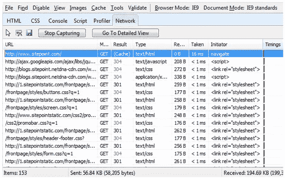
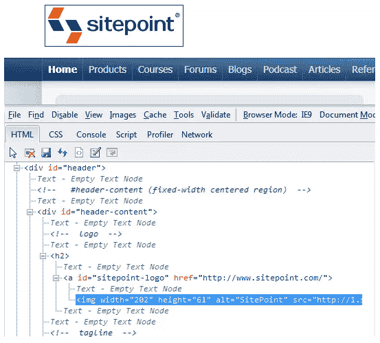
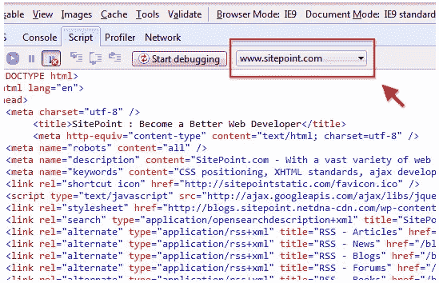
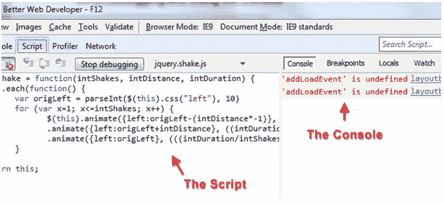
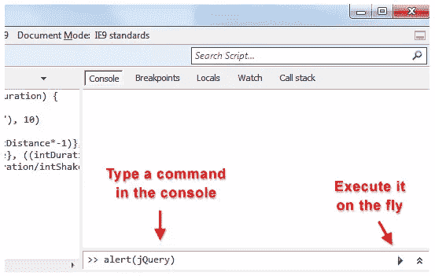
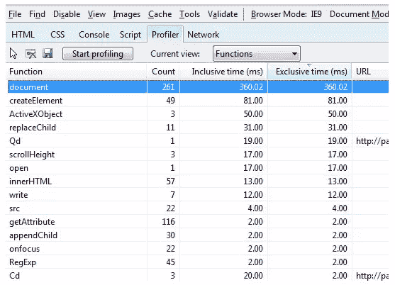
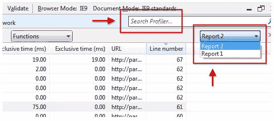
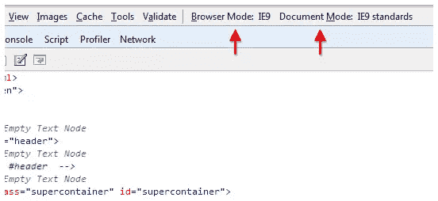

# 使用 Internet Explorer 9 中的 F12 开发工具加快调试速度

> 原文：<https://www.sitepoint.com/debug-faster-with-f12-developer-tools-in-internet-explorer-9/>

你能想象在没有某种集成开发和调试工具的帮助下构建和调试一个网站的代码吗？对于我们这些已经开发网站和网络应用超过几年的人来说，我们不需要去想象——这是我们经常面对的现实。

但是时代变了。今天，web 开发人员的繁重需求和责任使得开发工具在所有现代浏览器中的兴起成为必要。

随着 [IE9 Beta](https://clk.atdmt.com/MRT/go/291299661/direct;wi.1;hi.1/01/) 及其内置 [F12 开发者工具](https://clk.atdmt.com/MRT/go/291299662/direct;wi.1;hi.1/01/)的发布，IE 团队在帮助开发者快速调试前端代码和提高网站性能方面取得了进展。

在本文中，我将带您了解 IE9 的 F12 开发人员工具的一些最重要的特性，特别关注哪些是新特性，哪些是最实用的:

1.[网络检查选项卡](#one)

2.[检查 HTML 和 CSS](#two)

3.[脚本调试和使用控制台](#three)

4.[提高脚本性能](#four)

5.[更改 UA 字符串和兼容模式](#five)

6.[拼凑](#six)

**网络检查标签**

IE9 新增的 Network 选项卡允许您监控和优化站点性能。

要查看网络资源(如上面的[站点点](https://www.sitepoint.com/)所示)，点击 F12 打开开发者工具(或者你可以从 IE9 的工具菜单中选择“F12 开发者工具”选项)；然后单击网络选项卡。

为了获得更好的性能，默认情况下,“网络”选项卡不会立即开始捕获资源。要开始查看当前页面上加载的资源，请单击**开始捕获**按钮，然后刷新页面。资源将继续只显示在当前选项卡中，当您点击**停止捕获**按钮或关闭选项卡时，资源将停止显示。

上面的屏幕截图显示了正在加载的资源的摘要。它包括关于请求的 URL、通过 HTML 或 CSS 加载的文件、基于 Ajax 的请求和通过 JavaScript 动态加载的资源的信息(例如，如果图像元素的 src 属性被更改)。

在摘要视图中，双击任何项目都可以显示该特定项目的详细视图。详细视图包括请求头、响应头、cookies 和计时。

详细视图中显示的数据可以 CSV 或 XML 格式导出。该选项通过**保存**图标可用，打开如下所示的保存对话框:

这对于与其他开发人员共享信息或提交 bug 来说很方便。甚至还有一个名为 [HTTP Archive Rule Runner](https://clk.atdmt.com/MRT/go/291299663/direct;wi.1;hi.1/01/) 的第三方在线工具，它将接受基于 XML 的数据，并针对输入的数据运行一些 [YSlow](https://clk.atdmt.com/MRT/go/291299664/direct;wi.1;hi.1/01/) 测试以进行分析。

为了测试 IE9 Beta 中的新网络标签，你可以访问 [IE9 试驾](https://clk.atdmt.com/MRT/go/291299666/direct;wi.1;hi.1/01/)网站上的[网络监控演示](https://clk.atdmt.com/MRT/go/291299665/direct;wi.1;hi.1/01/)，或者在 MSDN [IEBlog](https://clk.atdmt.com/MRT/go/291299667/direct;wi.1;hi.1/01/) 上阅读更多关于网络标签功能的信息。

**检查 HTML 和 CSS**

打开 F12 开发者工具，点击图标选择元素，也很容易找到 DOM 元素和样式。

这个选项(也可以在 **Find** 菜单中找到，或者通过按 Ctrl-B)使您能够选择任何元素并调出其相关的 HTML 和 CSS。下面是一个示例，显示了在树节点结构中显示的带有等效 HTML 代码的 SitePoint 徽标:

一旦选择了**通过点击**选择元素选项，您所悬停的网页上的任何项目都将获得一个蓝色边框(如上面的 SitePoint 徽标所示)。这允许您专门选择要检查的页面区域。

DOM 窗格允许您动态编辑 HTML，并立即在窗口中看到变化。为此，只需点击**编辑**图标，像在常规文本编辑器中一样编辑 HTML。当你完成编辑后，按下**编辑**按钮，修改将在视窗中可见。

在 DOM 树旁边，您将看到与所选元素相关联的所有 CSS 样式，如下所示:

IE9 的 F12 开发工具允许你动态改变样式来测试和调试选中的 CSS。

在**属性窗格**(开发人员工具的右侧)中以层叠顺序并根据特殊性显示为所选元素列出的样式；因此，出现在底部的样式是在级联中出现较晚的样式，或者具有更大的特异性。被覆盖的样式用一条线穿过，所以在调试 CSS 问题时可以考虑这一点。

您也可以选择**跟踪样式**选项，它将按字母顺序显示应用的属性，不显示选择器。

使用**布局**和**属性**选项可以获得关于所选元素的更多信息。关于这些特性的更广泛的讨论，请参见 MSDN 上的[用开发者工具](https://clk.atdmt.com/MRT/go/291299668/direct;wi.1;hi.1/01/)调试 HTML 和 CSS。

回到**主窗格**(工具的左侧)，你可以从 **HTML** 标签切换到 **CSS** 标签。 **CSS** 选项卡列出了在所选样式表中找到的所有属性和值，它们是完全可编辑的，更改会立即生效。 **CSS** 选项卡也有一个样式表选择器，让您在样式表之间切换。这对于使用多个 CSS 文件的大型网站来说很方便。

**脚本调试和控制台使用**

正如任何优秀的开发工具所期望的那样，IE9 提供了强大的客户端脚本调试功能，帮助开发人员解决处理复杂代码时可能出现的问题。要开始调试页面上的脚本，请打开 F12 开发工具并选择**脚本**选项卡。

从这里开始，有许多选项可供选择。下拉列表允许您选择要使用的特定脚本，如下图所示:

点击**开始调试**按钮，调试选中的脚本。这将从浏览器窗口中取消固定 F12 开发人员工具，脚本的内容将出现在右侧的控制台中，如下所示:

页面中出现的任何脚本错误(如上例所示)都会自动显示在控制台中。

在调试过程中，您可以设置断点(使用可选条件)，控制脚本的执行，或者检查变量和调用堆栈。

当选择**控制台**选项时，您可以通过在控制台命令行中键入语句来动态执行语句。**控制台**特性是 IE9 的 F12 开发者工具中的新特性，为开发者提供了许多宝贵的特性。

任何有效的代码行都可以在暂停的脚本中运行(通过按 enter 键或单击控制台命令行旁边的**运行脚本**按钮)，如下所示:

如果有必要，您可以将控制台的命令行更改为 multiline，这将允许您插入更复杂的命令和脚本来进行调试。自然，在多行模式下，在键盘上敲**回车**不会执行脚本；相反，它会将光标移动到新的一行。要在这种模式下执行键入的代码，您可以单击**运行脚本**图标。

控制台中的命令行还允许您记录错误和其他信息，以帮助调试脚本。

**提高脚本性能**

调试脚本只是开发周期的一个方面。除了已经讨论过的调试特性，F12 开发人员工具允许使用 **Profiler** 选项卡测试脚本的性能。

脚本分析器功能提供了关于脚本在自定义方法和内置脚本函数上花费的时间的数据。 **Profiler** 选项卡中的一个按钮允许您启动和停止分析过程，因此您可以控制收集的数据。

下面的屏幕截图显示了在 SitePoint 主页上执行概要文件的部分结果:

可以在**函数**视图或**调用树**视图中查看数据，并且可以通过点击列标题或移除标题对结果数据进行排序和重新排列。

每次启动和停止探查器时，都会记录不同的分析会话。您的所有评测会话都可以在**报告**下拉列表中找到，并且可以搜索，如下图所示:

搜索功能为您在选定报告中找到的搜索词添加黄色突出显示，从而便于在报告的上下文中扫描搜索结果。它还能让你使用**上一个**和**下一个**按钮跳到下一个搜索结果。当试图在一个冗长的报告中跟踪特定的方法名时，这可能会很方便。

最后，通过点击**导出数据**图标，您捕获的任何个人资料数据都可以轻松导出为 CSV 格式。这将打开一个保存对话框，通过它您可以在本地存储您的数据。

这只是使用 IE9 及其集成 F12 开发工具的开发人员可以使用的脚本增强和调试功能的一个示例。随着 web app 热潮的如火如荼，网站性能变得前所未有的重要；IE 的工具在帮助开发人员进行这一关键领域的开发方面取得了长足的进步。

有关这些和其他脚本增强功能的更多信息，您可以在 MSDN 上使用开发工具查看[发现 Internet Explorer 开发工具](https://clk.atdmt.com/MRT/go/291299669/direct;wi.1;hi.1/01/)和[剖析脚本。](https://msdn.microsoft.com/en-us/library/dd565629%28v=vs.85%29.aspx) 
**改变 UA 字符串和兼容模式**

IE9 的 F12 Developer Tools 新增的一个特性是改变用户代理(UA)字符串的能力，该字符串由 web 服务器通过请求头读取。虽然这不会使 IE9 模拟不同浏览器的呈现，但它可以允许您运行针对其他 web 浏览器的功能和内容(例如，针对使用旧浏览器或浏览器版本的用户的警告消息或其他通知)。

然而，使用改进的**浏览器模式**和**文档模式**选项，可以为以前版本的 Internet Explorer 提供不同的呈现模式。这些选项在 F12 开发人员工具打开时随时可用，如下所示:

每种模式都会产生一个选项下拉列表，用于更改页面的呈现方式。尽管这些选项并不完全模拟原始渲染环境，但它们确实提供了一种相当准确且易于使用的不同模式下的测试方法:

*   浏览器模式—IE7 兼容性视图中的 IE7、IE8、IE9 和 IE9
*   文档模式—怪癖模式、IE7 标准、IE8 标准和 IE9 标准

对各种版本和模式的 Internet Explorer 进行快速测试从未如此简单，开发人员将直接受益。有关 IE 浏览器和文档模式的更多信息，请查看以下博客:

*   [IE 对网站开发者的兼容特性](https://blogs.msdn.com/b/ie/archive/2010/06/16/ie-s-compatibility-features-for-site-developers.aspx)
*   [用浏览器模式和文档模式测试网站](https://clk.atdmt.com/MRT/go/291299670/direct;wi.1;hi.1/01/)

**拼凑**

如今，网站和网络应用都是用复杂的脚本构建的。他们需要更多关注性能，并要求更快的调试工具。由此看来，IE9 的 [F12 开发者工具](https://clk.atdmt.com/MRT/go/291299671/direct;wi.1;hi.1/01/)有了很大的改进。随着 IE9 在 2011 年的发布([平台预览版](https://clk.atdmt.com/MRT/go/291299672/direct;wi.1;hi.1/01/)现在是第 7 版),随着 IE9 市场份额的增加，这些和其他集成支持 web 标准和优化代码的工具将对 web 开发人员变得非常有价值。

给 IE9 的新 F12 开发者工具一个[测试驱动](https://clk.atdmt.com/MRT/go/291299673/direct;wi.1;hi.1/01/)来发现新的和改进的特性是否能帮助你开发现代浏览器。完整的“如何做”可以在 [MSDN 开发者工具](https://clk.atdmt.com/MRT/go/291299674/direct;wi.1;hi.1/01/)上找到。

为什么不参加我们的简短[测验](https://www.sitepoint.com/quiz/microsoft/debug-faster-with-f12-developer-tools-in-internet-explorer-9/)，看看你从这篇文章中学到了多少。

**note:**SitePoint Content Partner

本教程是在微软的支持下完成的。我们与微软合作，由 SitePoint 独立编写，努力共同开发对您(我们的读者)最有用、最相关的内容。

## 分享这篇文章