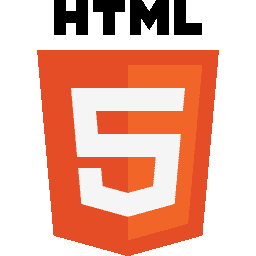

# HTML5 和新的 W3C 认可的标志

> 原文：<https://www.sitepoint.com/w3c-html5-logo/>

你在创建辉煌的 HTML5 网站吗？为什么不在你的网站上添加新的 HTML5 标志，让全世界都知道呢…

W3C 本周公布了新标志。其目标:*为开放的网络平台*创造一个引人注目的视觉形象。这意味着什么呢？…

像许多开发人员一样，我经常用二进制来看待这个世界。陈述必须是真或假，黑或白，合乎逻辑或不合逻辑。令人困惑的是，新标识实际上并不意味着 HTML 的有效性或一致性。也不表明你在使用 HTML5 标签。根据 W3C:

> 该徽标是一个通用的视觉标识，适用于广泛的开放 web 技术，包括 HTML5、CSS、SVG、WOFF 等。除了 HTML5 徽标，还有由 HTML5 技术家族支持的八个高级技术类别的图标。图标可用于突出显示更具体的功能，如离线、图形或连接。

HTML5 家族中的八个高级技术类别是:

*   **离线&存储**——我猜是用 JavaScript 吧？
*   **连接性/实时性** —本质上，类似 Ajax 的功能
*   多媒体 —包括 Flash 视频吗？
*   图形、3D &效果——那么没有纯文本网站了？
*   **设备访问** —支持一个浏览器算吗？
*   性能&整合——有多模糊？
*   **语义** —终于，一个真正的 HTML5“特性”！
*   **CSS3/Styling**——我说的太早了。

在你的 HTML 中加上一个`nav`标签，或者在你的样式表中加上一个圆角，你就可以自豪地在你的网站上展示这个标志了。支持所有八种“技术”的网站可以显示一组难以理解的徽章…

## 这是 W3C HTML5 的官方标志吗？

否。根据[常见问题解答](https://www.w3.org/html/logo/faq):

> W3C 在 2011 年 1 月引入了这个标志，目标是建立社区支持。W3C 还没有以任何官方身份接受它。如果像 W3C 所希望的那样，社区接受这个标志，W3C 将在 2011 年第一季度采用它作为自己的 HTML5 官方标志。

许多人会认为 W3C 优柔寡断……但他们并不确定。

然而，W3C 鼓励你使用这个标志。改变颜色，改变尺寸，把它用在 t 恤上，制作贴纸，做一个土豆图案——做你喜欢的事情。HTML5 徽标主页提供各种图像下载和徽章生成器。

具有讽刺意味的是，微软——唯一没有 HTML5 浏览器的供应商——已经成为最主要的 HTML5 标志用户之一，你可以在 beautyoftheweb.com[等网站上找到它。](http://www.beautyoftheweb.com/)

## 品牌将战胜犬儒主义

你可能在我上面的漫谈中察觉到一丝犬儒主义。然而，我得出的结论是，这个标志通常是一件好事。术语“HTML5”已经演变成一个远远超出实际规范的营销参考。像之前的 Web2.0、Ajax 和 DHTML 一样，HTML5 只是意味着下一代网站和在线应用程序。这可能会让开发者学究们畏缩不前，但世界上的其他人都知道 HTML5 是时髦的现代网络材料。

如果这个标志流行起来，开发者甚至会受益。大多数用户不知道 HTML 和 HRT，但他们可能会认出这个标志。一些恰当的*“您的浏览器不支持此功能”*消息可以说服 IE6、7 和 8 用户升级。

你会屈服并在你的网站上添加 HTML5 标志吗？

## 分享这篇文章