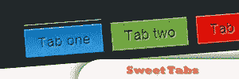

# jQuery & AJAX 的甜蜜标签

> 原文：<https://www.sitepoint.com/jquery-ajaxs-sweet-tab/>

## 介绍

随着世界进入网页设计的新时代，以直观和吸引眼球的方式组织网页内容是很重要的。开发人员划分文本的一个原则是使用制表符。选项卡允许您在有限的空间内使用更多的内容，并提供访问这些内容的方式。今天，我们将讨论如何借助 CSS3 和 jQuery 制作一个 AJAX 驱动的标签页。


## 可扩展的超文本标记语言

从 XHTML 标记开始。

```
<ul class="tabContainer">
	<!-- The jQuery generated tabs go here -->
</ul>

<div class="clear"></div>

<div id="tabContent">
	<div id="contentHolder">
		<!-- The AJAX fetched content goes here -->
	</div>
</div>
```

正如你已经注意到的，标记看起来太简单了。这是因为我们缺少标签页的代码，它是 jQuery 在页面加载时动态插入的。这使得添加新标签变得非常容易，因为您需要在 JavaScript 端添加标签。

```
<li>
	<a href="#" class="tab green">Tab two
		<span class="left"></span>
		<span class="right"></span>
	</a>
</li>
```

这是 jQuery 为每个选项卡插入的代码。它由位于内部的 LI 元素组成。上面的 tabContainer 无序列表。

## 半铸钢ˌ钢性铸铁(Cast Semi-Steel)

现在是标签页的 CSS 样式的时候了。

```
.tabContainer{
	/* The UL */
	float:right;
	padding-right:13px;
}

#contentHolder{
	background-color:#EEEEEE;
	border:2px solid #FFFFFF;
	height:300px;
	margin:20px;

	color:#444444;
	padding:15px;
}

#tabContent{
	background-color:#333;
	border:1px solid #444;
	margin-top:-15px;
	width:100%;
}

#tabContent, .tabContainer li a,#contentHolder{
	-webkit-box-shadow:0 0 2px black;
	-moz-box-shadow:0 0 2px black;
	box-shadow:0 0 2px black;
}

.tabContainer li{
	/* This will arrange the LI-s next to each other */
	display:inline;
}

.tabContainer li a,.tabContainer li a:visited{
	/* Styling the hyperlinks of the tabs as colorful buttons */

	float:left;
	font-size:18px;

	/* display:block allows for additinal CSS rules to take effect, such as paddings: */
	display:block;

	padding:7px 16px 1px;
	margin:4px 5px;
	height:29px;

	/* Giving positioning */
	position:relative;

	/* CSS3 text-shadow */
	text-shadow:1px 1px 1px #CCCCCC;
}
```

上面的样式使用了最新的 CSS3 规则，这些规则增加了页面的整体外观。Box-shadow 属性在选项卡下添加阴影，而#tabContent div 和#contentHolder。

```
#overLine{
	/* The line above the active button. */
	position:absolute;

	height:1px;
	background-color:white;
	width:90px;

	float:left;
	left:1px;
	top:-5px;
	overflow:hidden;
}

#main{
	margin:0 auto;
	position:relative;
	width:700px;
}

ul .left{
	/* The left span in the hyperlink */

	height:37px;
	left:0;
	position:absolute;
	top:0;
	width:10px;
}

ul .right{
	/* The right span in the hyperlink */

	height:37px;
	right:0;
	position:absolute;
	top:0;
	width:10px;
}

/* Styling the colors individually: */

ul a.green{	background:url(img/green_mid.png) repeat-x top center;	color:#24570f;}
ul a.green span.left{ background:url(img/green_left.png) no-repeat left top;}
ul a.green span.right{ background:url(img/green_right.png) no-repeat right top;}

/* .. Analogical styles for the red, blue and orange color .. */

/* The hover states: */
ul a:hover{	background-position:bottom center; text-decoration:none;}
ul a:hover span.left{ background-position:left bottom;}
ul a:hover span.right{ background-position:right bottom;}

.preloader{
	display:block;
	margin:120px auto;
}
```

如您所见，超链接和左/右跨度定义了不同的背景，这取决于所分配的颜色类别。我们可以成功地改变许多 CSS 样式，我们将有一个完全不同的选项卡设计。

## jQuery

这是魔法开始的地方。

```
<link rel="stylesheet" type="text/css" href="styles.css" />

<script type="text/javascript" src="https://ajax.googleapis.com/ajax/libs/jquery/1.4.0/jquery.min.js"></script>
<script type="text/javascript" src="script.js"></script>
```

我们使用了著名的 Google CDN，并添加了我们自己的 script.js 文件，其中包含了我们所有的脚本。
下面详细解释一下 jQuery 到底是做什么的:
*jQuery 库是从 Google 的内容存放网络自动下载的。
*$(文档)。ready()被排队等待执行，当 DOM 完成加载时，作为参数提供的函数也将运行。
* tabs 对象用＄循环。每个()方法和单个元素被创建并附加到。tabContainer(在第一步中介绍过)。
* click 事件的事件监听器。

```
$(document).ready(function(){
	/* This code is executed after the DOM has been completely loaded */

	/* Defining an array with the tab text and AJAX pages: */

	var Tabs = {
		'Tab one'	: 'pages/page1.html',
		'Tab two'	: 'pages/page2.html',
		'Tab three'	: 'pages/page3.html',
		'Tab four'	: 'pages/page4.html'
	}

	/* The available colors for the tabs: */
	var colors = ['blue','green','red','orange'];

&nbsp;	/* The colors of the line above the tab when it is active: */
	var topLineColor = {
		blue:'lightblue',
		green:'lightgreen',
		red:'red',
		orange:'orange'
	}

	/* Looping through the Tabs object: */
	var z=0;
	$.each(Tabs,function(i,j){
		/* Sequentially creating the tabs and assigning a color from the array: */

		var tmp = $(''+i+' ');

		/* Setting the page data for each hyperlink: */

		tmp.find('a').data('page',j);

		/* Adding the tab to the UL container: */
		$('ul.tabContainer').append(tmp);
	})
```

以上源码是 script.js 第一部分。通过向 tabs 对象插入一个新属性，您可以在页面上添加自己的选项卡。左边部分用单引号括起标签的名称，而右边部分包含 AJAX URL，它将被获取并显示在#content Holder div 中。

```
/* Caching the tabs into a variable for better performance: */
	var the_tabs = $('.tab');

	the_tabs.click(function(e){

		/* "this" points to the clicked tab hyperlink: */
		var element = $(this);

&nbsp;		/* If it is currently active, return false and exit: */
		if(element.find('#overLine').length) return false;

&nbsp;		/* Detecting the color of the tab (it was added to the class attribute in the loop above): */

		var bg = element.attr('class').replace('tab ','');

&nbsp;		/* Removing the line: */
		$('#overLine').remove();

&nbsp;		/* Creating a new div element with jQuery 1.4 by passing an additional object parameter: */

		$('<div>',{
			id:'overLine',
			css:{
				display:'none',
				width:element.outerWidth()-2,
				background:topLineColor[bg] || 'white'
			}}).appendTo(element).fadeIn('slow');

&nbsp;		/* Checking whether the AJAX fetched page has been cached: */

		if(!element.data('cache'))
		{
			/* If no cache is present, show the gif preloader and run an AJAX request: */
			$('#contentHolder').html('');

&nbsp;			$.get(element.data('page'),function(msg){
				$('#contentHolder').html(msg);

&nbsp;				/* After page was received, add it to the cache for the current hyperlink: */
				element.data('cache',msg);
			});
		}
		else $('#contentHolder').html(element.data('cache'));

&nbsp;		e.preventDefault();
	})

	/* Emulating a click on the first tab, so that the content area is not empty: */
	the_tabs.eq(0).click();

});
```

jQuery data()方法在整个代码中被多次使用。它通过调用带有两个参数$('#selector ')的方法向元素发送数据。data('label '，" String data ")这将“String Data”分配给元素，它是一个字符串，稍后通过调用 Data 方法而不使用其他参数来授予对它的访问权限。通过使用这些，我们拥有了自己简单的 AJAX 请求缓存系统。

## 结论

按照上面的步骤，您应该有了 jQuery 和 CSS3 的漂亮的支持 AJAX 的彩色标签。没那么难吧。如果你喜欢这个教程，一定要经常去 jQuery4u.com 看更多精彩的教程和技巧！

[看现场试玩](http://demo.tutorialzine.com/2010/01/sweet-tabs-jquery-ajax-css/demo.html)
[下载](http://demo.tutorialzine.com/2010/01/sweet-tabs-jquery-ajax-css/demo.zip)

## 分享这篇文章