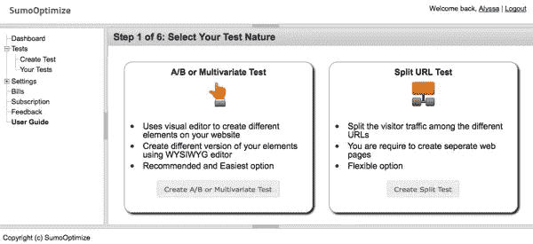
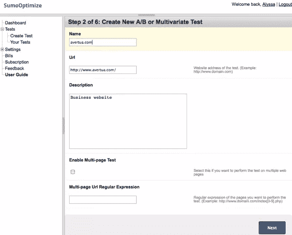
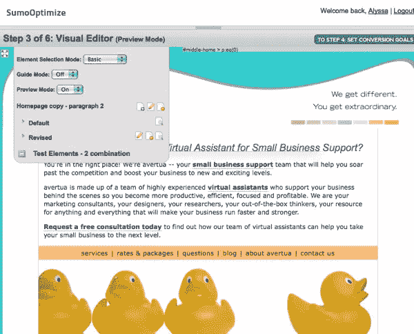
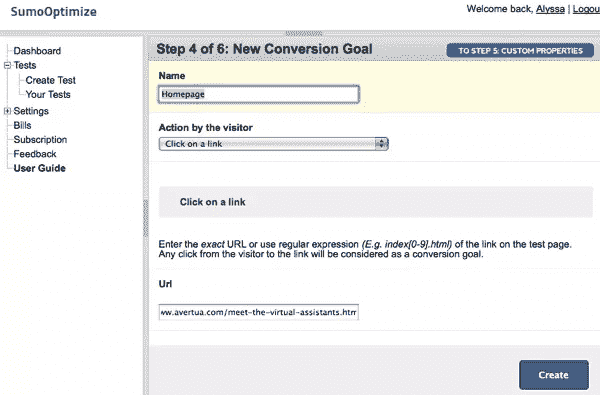
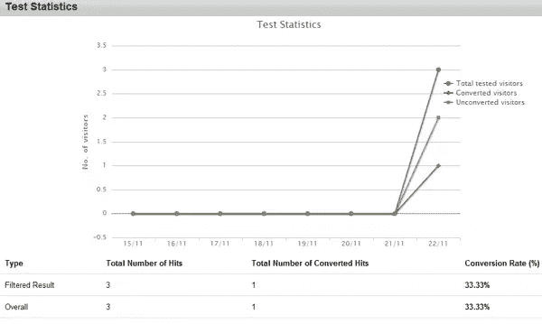

# 使用 SumoOptimize 运行高效的 A/B 测试

> 原文：<https://www.sitepoint.com/ab-test-with-sumooptimize/>

SumoOptimize 是一种新的网站优化服务，为开发者和网站所有者提供了一种从文本、布局、图像、颜色等元素 A/B 测试其网站的简单方法。

## 好处

这种服务有很大的潜力，因为它简化了一些重要的测试，这些测试需要与网站重新设计、营销文案修改、免费下载或电子邮件捕获位置以及广告布局一起进行。它甚至允许你分开测试两个不同的 URL，所以你可以用它来展示一个新设计的价值，复制等。给你的客户。

SumoOptimize 的一些特性是:

*   用户友好的可视化编辑器
*   多重转化目标
*   拆分 URL 测试
*   实时测试结果
*   高级分析

## 走一遍

这里有一个设置过程，以及一旦你创建了一个测试，你可以期望看到什么结果。

### 步骤 1:选择您的测试

首先，您需要注册一个免费的 elevation 帐户。一旦您的帐户设置完毕，您可以点击“创建测试”，并选择您想要运行的测试——A/B 或多变量测试，或分割 URL 测试。

### 步骤 2:创建您的测试

在下一个屏幕上，您需要添加关于测试的详细信息。

### 步骤 3:添加测试元素

现在，您将添加想要测试的元素。点击任何图片、文字、链接等。在可视编辑器中，选择“添加要测试的元素”

从编辑屏幕，您可以通过所见即所得编辑器添加您的变体。您还可以从该屏幕添加、编辑和预览差异。

### 第四步:设定转化目标

在这一步，你概述你想要发生的事情。你希望访问者点击链接还是提交表格？他们应该到达的结果 URL 是什么？

### 第五步:获取代码

下一个屏幕给出了您需要放入动态页面的代码，这样它就可以开始测试和跟踪了。如果您正在进行分割 URL 测试，那么代码需要添加到两个页面中。

### 第六步:分析你的统计数据

一旦您的测试正在运行，您就可以查看统计数据并运行报告，以了解差异是如何累积的。您还可以返回并编辑您的元素，以便随时调整测试。

虽然是一项新服务，但 SumoOptimize 和其他类似服务的潜力是巨大的，尤其是对于那些经常需要更改、改进和开发网站的人来说。您是否使用与您创建的 A/B 测试网站类似的服务？

## 分享这篇文章