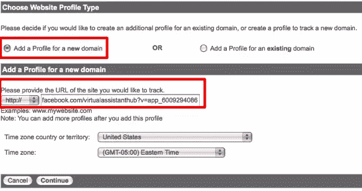

# 如何添加谷歌分析到脸书网页标签

> 原文：<https://www.sitepoint.com/google-analytics-on-facebook-page/>

我最喜欢的谷歌工具之一(当然是在谷歌搜索之后)是[分析](http://www.google.com/analytics/)。它不仅是免费的，而且通过使用分析，你可以收集到很多关于网站访问者的有价值的信息；这就是为什么超过 56%的跟踪网站统计数据的网站使用谷歌分析的原因。

如果你有一个为你的网站或客户的网站带来流量的脸书页面，你可能会受益于将谷歌分析添加到你的 FBML 标签中。这些数据，结合通过[脸书洞察](http://www.facebook.com/help/?search=insights)提供的信息，可以帮助你更全面地了解你的访客来自哪里，他们在做什么。

以下是将谷歌分析添加到你的脸书页面的三个步骤。

## 步骤 1:在谷歌分析中创建新的个人资料

假设你已经有一个谷歌分析账户，第一步是为你想追踪的脸书标签添加一个新的个人资料。如果你还没有谷歌分析帐户，你需要创建一个开始。

由于您的脸书页面上的每个 FBML 标签都有自己唯一的 URL，您可以向每个自定义标签添加单独的分析代码。在本教程中，我们将只做一个 FBML 标签。

转到您的 Google Analytics 帐户，点击“添加新个人资料”链接。

在下一个屏幕上，选择“为新域添加配置文件”,然后粘贴您的 FBML 标签的完整 URL。它看起来会像这样:

www.facebook.com/YourFacebookPageUsername/?v=app_999999999.

然后点击“继续”

## 步骤 2:向 FBML 添加跟踪代码

下一个屏幕将为您提供跟踪详情；我们对 Web 属性 ID 最感兴趣，它看起来像:UA-9999999-9。把线放在手边。

接下来，您将返回到您的脸书页面，并编辑您想要跟踪的选项卡的 FBML。为此:

*   点击您的个人资料图片下的“编辑页面”链接
*   点击“应用程序”
*   滚动到您已经为页面创建的 FBML 应用程序
*   单击“转到应用程序”

复制下面的代码，并用您的 Web 属性 ID 代码替换 UA-9999999-9，如上所示。然后，粘贴你的 FBML 代码底部的行，并保存你的更改。

<google-analytics uacct="”UA-9999999-9″"></google-analytics>

## 第三步:检查你的统计数据

一旦你完成了前两个步骤，返回谷歌分析，点击“完成”，你会看到你的标签网址列表与“跟踪未安装”图标:。追踪可能需要 24 小时才能生效。你会希望在一天左右的时间里回到这个页面，以确认它是否跟踪正确。

如果您计划将 Google Analytics 添加到多个选项卡，您将需要在 Analytics 中重命名该选项卡，以便于您跟踪。单击字段右侧的铅笔图标，并输入页面的新昵称。

仅此而已。生成的统计数据和跟踪的活动将取决于你的 FBML 标签上的内容类型，但你至少可以看到每日浏览量。

你会使用谷歌分析、脸书洞察或其他工具来追踪你的脸书页面访客吗？

## 分享这篇文章