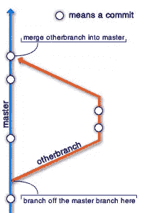

# Git 或:资源库的设计者指南

> 原文：<https://www.sitepoint.com/the-designers-guide-to-git-or-how-i-learned-to-stop-worrying-and-love-the-repository/>

设计师的工具集似乎总是在扩展。网页设计师完全依赖 HTML 编辑器和 Photoshop 的日子已经一去不复返了。现在，尤其是在与开发人员的团队中工作时，你需要更聪明、更协作地工作。

在这篇文章中，我将讨论如何使用 Git。

Git 是版本控制软件，最初由 Linus Torvalds(Linux 的创建者)创建。它的主要目的是跟踪文件的变化，以便您可以更好地管理您的工作。

作为设计师，你为什么要在乎？为什么要学习命令行来使用版本控制软件？

因为 Git 太棒了。

本质上，它跟踪项目中对文件的所有更改，所以如果你破坏了什么，Git 会帮助你回到正轨。它强大的工具可以让你查看你的修改，帮助你修复你的代码，使它没有特定的错误，或者确切地看到谁破坏了你宝贵的代码。

然而，它的用户确实有一句口头禅:Git 会完全按照你说的去做，但并不总是完全按照你的意思去做。因此，在本文中，我将介绍使用它的正确方法，以及可能会给您带来问题的常见陷阱。

## 树的隐喻

大多数源代码控制系统(包括 Git)使用树的概念来描述存储库。存储库是文件和目录(您的项目)的集合，以及在存储库的生命周期中对这些文件的更改列表。

主分支，有时称为“主干”，是项目中文件的当前状态。根据您的需要或工作方式，您可以从主分支创建其他分支。

使用 Git 时，您需要了解这些术语:

*   **分支**创建一个分支的副本，通常是主分支，因此它现在独立于创建它的那个分支。它使你能够有一个干净的石板来改变你内心的内容，当你对它们满意时，你可以将它们合并回来。
*   **合并**就像分支的反义词。您有两个分支，您可以将一个分支的更改合并到另一个分支中。在合并结束时，您仍然有两个分支，但是一个分支的更改现在也在另一个分支上。

功能分支是主分支的一个分支，当你开始你网站的一个新功能时，它是一种常见的工作方式。当特征完成时，您可以将它安全地合并回主分支。这样，管理您正在处理的特性就很容易了:您可以拥有一个正在进行的项目的一整套特性，并且只将已经完成并且正在工作的特性合并回主模块中。

## 开始存储库

要开始使用 Git，您必须安装它。前往[http://git-scm.com/download](http://git-scm.com/download)为你的操作系统寻找安装程序。

安装完成后，创建一个文件夹。我将命名我在这里使用的一个`sitepointexample:`

```
> mkdir sitepointexample
> cd sitepointexample
> git init
Initialized empty Git repository in /Users/mark/sitepointexample/.git/
```

警告:我是个苹果迷。这意味着对于 Windows 用户来说，命令行略有不同，但是 Git 命令基本上是相同的。]

逐步建立一个空白的知识库。它将返回`Initialized empty Git repository in /Users//sitepointexample/.git/`,让你知道你的回购已经可以使用了。

### 本地分行、远程分行

有一个遥控主是很常见的。远程主服务器是存储库的副本(通常位于团队中所有开发成员都可以访问的服务器上)，您可以从中推送或接收变更。

我将跳过深入探讨这个问题；互联网上有很多资源可以更详细地解释这一点。

## 状态、添加、提交、拉取、合并、推送

使用 Git 可以完成六个基本操作。这绝不是你能做的全部，但是在你的日常任务中，这六个是你最常使用的，按照这个顺序(除了 merge，你用的比其他五个少)。最有可能的是，你会死记硬背；你肯定会经常用到它们！

### 状态

向您展示您需要了解的关于您的存储库状态的一切。它显示了您正在处理哪个分支，哪些文件在最后一次提交后被修改了，以及哪些文件 Git 一无所知。它将指示文件是否已被移动或删除，或者是否有需要手动进行的合并。

通常，`git status`显示三组文件:

1.  修订是已经对其运行了`git add`的文件。如果运行`git commit`，这些文件将被提交。
2.  未跟踪的变更还没有运行过`git add`, Git 知道一些变更，但是不会做任何事情。
3.  未被跟踪的文件是 Git 一无所知的文件。它们要么是新文件，要么是从未添加到存储库中的文件。

下面是三个命令:a `git status`告诉我我还没有提交任何东西；我创建了一个名为 README 的空文件；而我又做了一个`git status`，告诉我我有一个未被跟踪的文件(名为 README):

```
> git status
# On branch master
#
# Initial commit
#
nothing to commit (create/copy files and use "git add" to track)
> touch README
> git status
# On branch master
#
# Initial commit
#
# Untracked files:
#   (use "git add ..." to include in what will be committed)
#
#       README
nothing added to commit but untracked files present (use "git add" to track)
```

`git status`是第一个使用的命令。每次都是在做其他事情之前先做。

### 增加

`git add <filename>`告诉存储库你想要跟踪一个文件的变更。在将变更添加到存储库之后，您可以继续工作，但是只有添加之前的变更才会被提交。您总是可以在添加的更改之上添加更改；它不会丢失任何东西，只是记录更多的变化。一旦你运行了`git add`，你应该使用`git status`来确保添加的是你想要的:

```
> git add README
> git status
# On branch master
#
# Initial commit
#
# Changes to be committed:
#   (use "git rm --cached ..." to unstage)
#
#       new file:   README
#
```

所以我添加了 README 文件，另一个`git status`告诉我，当我提交时，Git 将提交对该文件的更改。

如果您错误地添加了更改，您可以通过运行`git reset HEAD <filename>`来撤销更改，它会告诉存储库不要对更改做任何事情。它不会放弃您所做的任何更改；它只是不会犯他们。

### 犯罪

`git commit`保存对存储库的更改。提交为您提供了一个提交标识符，这是一个长字符串(MD5 散列)，存储库使用它来命名提交的时间点。在需要回滚到先前时间点的不幸事件中，您可以使用以下方法:

```
>git commit --message 'My First Commit'
[master (root-commit) d602d2b] My First Commit
0 files changed, 0 insertions(+), 0 deletions(-)
create mode 100644 README
```

我已经用`--message 'My First Commit'`提交了对文件的修改。当您检查提交日志以查找您所做的某个更改时，可以写下这些方便的提示。尽可能描述清楚。当出现问题时，它们会为您节省大量时间。你也可以用`-m 'MESSAGE'`代替`--message 'MESSAGE'`作为简写形式，节省你的时间。

### 拉

吸收团队其他成员所做的改变。对于这个例子，我没有其他团队成员使用这个存储库(整个存储库都在我的机器上)，但是当您使用时，它将看起来像这样:

```
> git pull
remote: Counting objects: 118, done.
remote: Compressing objects: 100% (75/75), done.
remote: Total 78 (delta 52), reused 0 (delta 0)
Unpacking objects: 100% (78/78), done.
From git@github.com:sitepoint/example
   36aeed8..8c18ec5  branchname -> origin/branchname
Merge made by recursive.
 .../Resource/otherfile.php                         |   19 ++
 .../Resource/file.php                              |    8 -
 2 files changed, 19 insertions(+), 8 deletions(-)
 create mode 100755 /Resource/file.php
```

这里有几点:

1.  我们使用 GitHub，一家托管存储库的公司。他们有很好的文档和在线帮助。看看他们。
2.  远程分支是`origin/branchname`。通常，`origin`表示托管您的存储库的远程服务器。
3.  `36aeed8..8c18ec5`是两个提交 id:这意味着 Git 从第一次提交(在您的机器上是`36aeed8`)更新到第二次提交(`8c18ec5`)。
4.  两个文件被拉下来，其中一个(`create mode 100755 /Resource/file.php`)是您的存储库中的一个新文件。它是由团队的另一名成员添加的。

### 合并

当你有两个分支，并且你想从其中一个分支获取变更并把它们添加到另一个分支时，使用`git merge`。

通常，您会对某个功能分支进行更改，当您对工作满意时，您会将这些更改合并到母版中:

```
> git branch otherexample
> git checkout otherexample
Switched to branch 'otherexample'
> git branch
  master
* otherexample
> touch OTHERFILE
> git add OTHERFILE
> git commit -m 'Other File Added'
[otherexample 16283e5] Other File Added
 0 files changed, 0 insertions(+), 0 deletions(-)
 create mode 100644 OTHERFILE
> git checkout master
Switched to branch 'master'
> git status
# On branch master
nothing to commit (working directory clean)
> git merge otherexample
Updating d602d2b..16283e5
Fast-forward
 0 files changed, 0 insertions(+), 0 deletions(-)
 create mode 100644 OTHERFILE
```

### 

以下是我所做的:

1.  `git branch otherexample`创建一个新的分支，称为`otherexample`。
2.  切换到新的分支。
3.  显示我有哪些可用的分支。它告诉我我有两个分支，`master`和`otherexample`。*【参考消息:`git branch -r`显示`origin`(我之前提到的远程服务器)有哪些分支。*
4.  `touch OTHERFILE`、`git add OTHERFILE`和`git commit -m 'Other File Added'`在新的分支上创建一个新文件，告诉 GIT 你想提交这个变更，用一个`'Other File Added'`的消息提交，就像上面的步骤一样。
5.  `git checkout master`跳回到`master`分支。
6.  `git merge otherexample`接受`otherexample`上的更改，并将它们合并到`master`，您所在的分支。您可以看到它已经在您的`master`分支中创建了文件“OTHERFILE”。

### 推

`git push`将*将*你的更改推送到远程服务器，与你的团队分享。当他们下一次`git pull`时，他们会看到你的改变。

通常是这样使用的。`git push`和`git push origin master`的区别在于，后者只会推`master`分支，而前者会尝试推*所有*分支。

例如，当你想推送一个单独的特性分支，这样一个团队成员也可以看到你对‘other branch’所做的修改时，你可以使用`git push origin otherbranch`。

## 结论

它们是 Git 的基础。然而，它是一种复杂的动物。还有很多很多命令——有些非常有用，而有些则有点危险。您可以挑选出一个提交，并将其合并到您的分支中，忽略其后的所有提交。您可以使用 Git 找到代码被破坏的确切提交位置。您可以回滚到当天早些时候、前一天、三周前或者存储库时间线上的任何时间所做的单个提交。

随着设计师工具包的扩展，我们需要利用方便的工作流工具，充分利用我们的一天。使用 Git，再也不会丢失所有的更改。

## 分享这篇文章