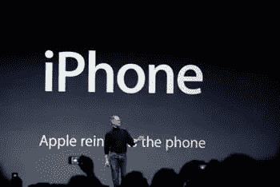

# 苹果:补课，犯错，最后向前？

> 原文：<https://www.sitepoint.com/apple-stuff-ups-mistakes-and-finally-moving-forward/>

随着[苹果最近发布](http://www.apple.com/pr/library/2010/09/09statement.html)的公告，许多开发者将欢呼雀跃:苹果已经公开发布了审查指南，展示了在应用程序进入应用程序商店之前对其进行评判的规则(如果它们确实进入了应用程序商店的话)。苹果还放松了对使用 Adobe Flash 开发 iPhone 应用程序的限制(有一段时间，这是被禁止的)。

在很长一段时间里，审查指南是保密的，iPhone 开发者的担心是，在花费时间、精力和金钱构建了一个应用程序之后，他们可能永远不会看到商店接受这个应用程序。苹果的束缚看起来充其量是随机的；“屁”应用将被接受，而高质量的应用被拒绝。

幸运的是，审查指南写得很不正式:“我们的应用商店里有超过 25 万个应用。我们不需要更多的屁应用了。”

有些指导方针或多或少是常识。例如，“我们有很多孩子下载很多应用程序，除非家长设置好，否则家长控制不起作用(很多人没有设置)。所以要知道，我们在关注着孩子们。”其他人敦促开发者通过声明“业余时间”应用将被排除在外来完善他们的应用。该指导方针的好消息之一是:“如果你的应用程序被拒绝，我们有一个审查委员会，你可以上诉。如果你跑到媒体面前诋毁我们，那是没有用的。”

以前，应用程序会因为一些无关痛痒的原因被拒绝:[普利策奖获得者讽刺作家的应用程序被拒绝](http://www.niemanlab.org/2010/04/mark-fiore-can-win-a-pulitzer-prize-but-he-cant-get-his-iphone-cartoon-app-past-apples-satire-police/)因为“诽谤”，而[苹果的应用程序技术总监可以随心所欲地发布“屁、便便和魔法”](http://gizmodo.com/5615902/apples-app-store-director-sells-fart-apps-on-the-side)应用程序。

这个问题不在于哪个应用程序比其他应用程序更容易获得批准；更多的是苹果已经把它的牌握得太紧了。受到惩罚的人是开发者，他们被迫历经磨难来建立和扩展苹果公司利润丰厚的应用商店。

然后谷歌出现了。

Android Market 提供了一个免费、开放的市场，我们可以为其开发应用。这把双刃剑意味着两件事:质量可能会动摇，但没有人有老大哥决定什么上线。此外，有了一个开放的市场，应用程序开发可以更好地进行:如果发现了错误，或者进行了改进，应用程序可以更快地分发给用户，而不需要另一轮批准——随之而来的是应用程序从应用程序商店下架的风险。

其次，对跨设备使用的限制，非苹果开发平台有望带来一系列新的移动应用。“一次开发，多次部署”的模式对大型组织来说很有意义:它让开发人员编写一次应用程序，然后部署到 iPhone、Android、Symbian 和该平台支持的任何其他设备上。

在我看来，这显然是苹果公司的一个策略，以关闭 Adobe Flash 开发的应用程序的应用程序商店，并试图将 Adobe 排除在市场之外。

但是还有其他令人兴奋的平台( [rhomobile](http://rhomobile.com/) 、 [Appcelerator Titanium](http://www.appcelerator.com/) )，它们显示出了很大的前景。当时，这些不是开发者的选择——因为它们不是用 Xcode 编写的，这些应用可能永远不会出现。

谷歌的公司精神是“不作恶”。然而，苹果已经通过使其平台开发者的生活变得困难而显示出它的颜色。这似乎正在改变——这无疑是对谷歌大举进入该市场并取得成功的回应。向苹果致敬，但它花了很长时间才走到这一步。

你怎么想呢?对你来说是谷歌还是苹果？

## 分享这篇文章