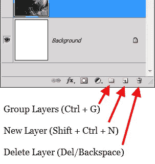
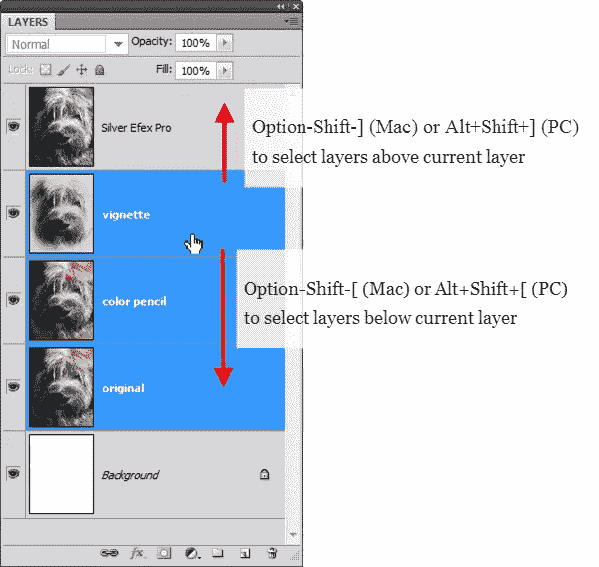
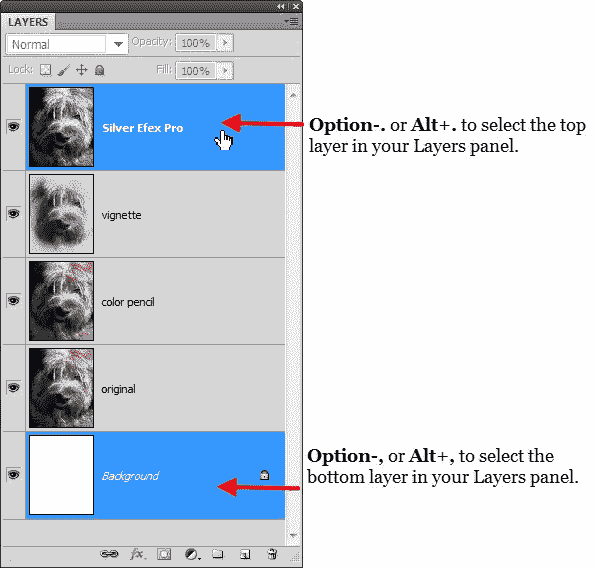
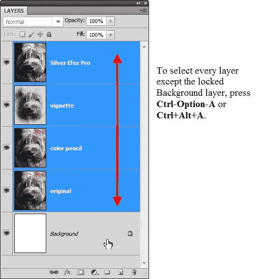

# 使用图层快捷方式加快 Photoshop 工作速度

> 原文：<https://www.sitepoint.com/speed-up-your-photoshop-work-with-layer-shortcuts/>

图层面板是 Photoshop 中最重要的面板之一。这是你隔离你的作品的地方，也是非破坏性编辑的关键。通过学习一些键盘快捷键来选择和移动你的图层，你可以大大加快你的工作速度。一只手放在键盘上，一只手放在鼠标上，这里有一堆快捷方式可以帮助你节省时间，避免来回切换到 Photoshop 主菜单。

**常用图层命令的快捷键**

要创建一个新层按下 **Shift-Ctrl-N** (Mac) **或 Shift+Ctrl+N** (PC)。

要使用选区创建新层(通过复制创建层)，请按 **Ctrl + J** (Mac 和 PC)。

要对层进行分组，按下 **Ctrl + G** ，要取消分组，按下 **Shift + Ctrl + G** 。

要合并所有图层，请按 **Ctrl + E** ，要合并所有可见图层，请按**Shift+Ctrl+E**

**选择图层的快捷键**

要一次选择多个层，请选择第一个层，然后按 **Option-Shift-[** (Mac)或 **Alt+Shift+[** (PC)选择第一个层下面的层，或 **Option-Shift-]** (Mac)或 **Alt+Shift+]** 选择第一个层上面的层。这允许您一次选择一个层。只需再次键入快捷键，即可选择上方或下方的附加层。

要选择当前层下面的层，请按下 **Option-[** 或 **Alt+[**

要选择当前图层上方的图层，请按下 **Option-]** 或 **Alt+]**

要选择图层面板中的顶层，请按下 **Option-。**或 **Alt+。** —阐明这是 Option 或 Alt 加句号/句号键。
选择底层，按 **Option-、**或 **Alt+、**

要选择当前活动层和顶层之间的所有层，请按下 **Option-Shift-。**或 **Alt+Shift+。** — Option 或 Alt+Shift 和句号/句号键。

要选择当前活动层和底层之间的所有层，请按下 **Option-Shift-、**或 **Alt+Shift+、**-Option 或 Alt+Shift 和逗号键。

要选择除锁定的背景层之外的每个层，请按 **⌘-Option-A** 或 **Ctrl+Alt+A** 。请注意，如果您已经解锁了背景层，它也将被选中。

**移动图层的快捷键**

**前置:**要将当前层移动到层堆栈的顶部，请按**shift-⌘-】**或 **Shift+Ctrl+]** 。

**移到最后:**要移动到层堆栈的底部，按 **Shift-⌘-[** 或 **Shift+Ctrl+[**

**前移:**要将当前层在层堆栈中上移一格，请按**⌘-】**或 **Ctrl+]** 。

**向后移动:**向下移动一个槽，按 **⌘-[** 或 **Ctrl+[** 。

现在你知道了。这里有相当多的快捷键，记住它们的唯一方法是有意识地努力使用和练习它们，但随着时间的推移，它们会成为你的第二天性，并真的有助于加快你在 Photoshop 中的工作流程。

## 分享这篇文章