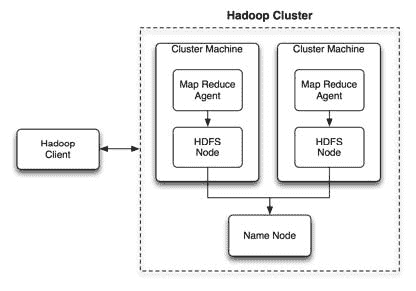
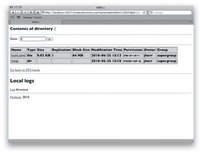
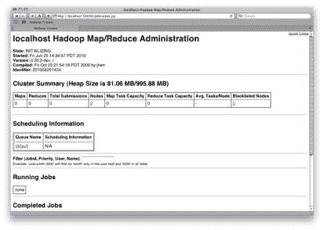
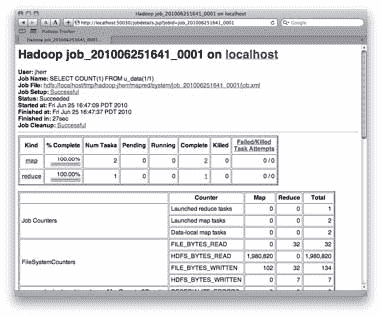
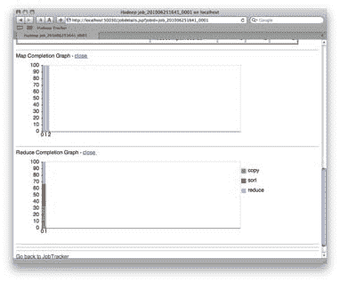

# 借助 Hadoop 实现大规模扩展

> 原文：<https://www.sitepoint.com/scale-big-time-with-hadoop/>

“这将如何扩展？”

如果您从事过 web 应用程序开发，您会不止一次听到这个问题。你手头有一个很棒的功能，对于几千个客户来说很好用，但是对于几百万人来说效果如何呢？

伸缩问题并不简单，也没有“放之四海而皆准”的解决方案，但我们可以看看网络巨头解决伸缩问题的一些方法，并收集一些如何解决这些问题的想法。在这个过程中，我们甚至可以学到一个方便的工具来添加到我们的工具箱中。

web 应用程序中大多数棘手的伸缩问题都可以在后台处理。例如，如果您运行一个约会网站，为您的每个客户寻找新的、兼容的匹配可以在后台处理。当客户在等待页面加载时，没有必要尝试并立即为他们找到合适的十个潜在合作伙伴；相反，您可以在他们下次访问主页时，在他们已经完成所有必需的处理后，再提供给他们。

能够后台处理的优势意味着您可以利用更多的机器能力来解决问题。你可以将一个困境，比如找到一个人的灵魂伴侣，分配给一群机器，这些机器咀嚼这些碎片，然后返回你需要的结果。

做大量的后台处理正是像脸书和谷歌这样的大公司解决可扩展性问题的方法。谷歌的搜索结果来自后台作业生成的大量预建索引；当你点击搜索按钮时，它当然不会搜索整个网页。

谷歌和脸书共享的一个设计模式是在共享一个公共数据源的大型机器集群中分配计算的能力。这种模式被称为 Map/Reduce，Hadoop 是这种模式的开源实现。本文是对 Hadoop 的介绍。即使您目前没有大规模的扩展问题，熟悉 Map/Reduce 这个概念也是值得的，使用 Hadoop 是一个很好的方法。

## 要求

Hadoop 运行在 Unix 类型的 shell 中。如果你运行的是 Linux 或者 Mac OS X，你已经准备好了，但是如果你运行的是 Windows，最简单的方法就是在虚拟机上运行 Linux。如需使用免费的 VirtualBox 虚拟化软件进行设置的说明，请查看本 SitePoint 教程。也可以使用 [Cygwin](http://www.cygwin.com/) shell 模拟器在 Windows 下运行 Hadoop。

你需要安装 SSH。在 OS X 上，SSH 是默认安装的，而在 Linux 上，安装它就像从您的包管理器中获取它一样简单。例如，在 Ubuntu 上:

```
$ sudo apt-get install ssh
```

接下来，您需要能够在没有密码的情况下 SSH 到您的本地主机。在 OS X 上，你必须首先启用远程访问。进入系统偏好 > 共享，勾选远程登录旁边的复选框。要测试 SSH，请尝试运行以下命令:

```
$ ssh localhost
```

如果提示您输入密码，您需要运行以下命令来为无密码 SSH 生成密钥:

```
$ ssh-keygen -t dsa -P '' -f ~/.ssh/id_dsa$ cat ~/.ssh/id_dsa.pub >> ~/.ssh/authorized_keys
```

最后，您需要安装 Java。往往已经是这样了；否则就去[Java.com](http://www.java.com/en/download/)抓住它。

## 介绍贴图/缩小

Map/Reduce 到底是什么？Map/Reduce 背后的中心思想是分布式处理。您有一个托管存储数据的共享文件系统的机器集群，并允许分布式作业管理。

跨集群运行的进程称为作业。这些作业有两个阶段:收集数据的映射阶段和进一步处理数据以创建最终结果集的归约阶段。

我们以在交友网站上寻找灵魂伴侣为例。数百万用户的所有配置文件都存储在共享文件系统中，该文件系统分布在一个机器集群中。

我们向集群提交一个具有我们正在寻找的配置文件模式的作业。在映射阶段，集群会找到所有符合我们要求的配置文件。在 reduce 阶段，对这些配置文件进行排序以找到最匹配的，其中只返回前十个。

Hadoop 是一个 Map/Reduce 框架，分为两大块。第一个是 Hadoop 文件系统(HDFS)。这是一个用 Java 编写的分布式文件系统，工作方式很像标准的 Unix 文件系统。在此之上是 Hadoop 作业执行系统。该系统协调工作，对工作进行优先排序和监控，并提供一个框架，您可以用它来开发自己的工作类型。它甚至有一个方便的网页，你可以在那里监控你的工作进度。

从高层次来看，Hadoop 集群系统类似于[图 1，“Hadoop 集群架构”](#fig_cluster "Figure 1\. The Hadoop cluster architecture")。

**图一。Hadoop 集群架构**



客户端连接到群集并提交作业。然后，这些作业将被发送到 MapReduce 代理，由它处理文件系统本地 HDFS 部分的数据作业。所有 HDFS 节点都与 NameNode 通信，以便在集群中注册自己。

现在，如果你看到这一切，并说，“这一切都很好，但它是 Java，我们使用。净，“这个不用担心。Hadoop 是一个平台，你可以用任何你想要的语言拥有这个平台的客户端。由于 Hadoop 非常擅长作为分布式处理平台，它获得了所有语言的支持。

除了 Hadoop 核心，我还要介绍一下 Hive 系统。Hive 是一个分布式 SQL 数据库，位于 Hadoop 和 HDFS 之上。有三个原因可以解释为什么 Hive 值得了解。首先，因为它使使用 Hadoop 变得更加容易，将它作为一种技术引入，您可以在今天的项目中使用它。第二，因为它使用 SQL，一种大多数用户都熟悉的技术。第三，因为它被脸书用于生产，这意味着它是健壮的、稳定的、维护良好的。

有了 Hadoop 和 Hive，您将能够托管拥有数十亿条记录的数据库，并在合理的时间内对它们运行查询(这些查询是作为 Hadoop 作业实现的)。这个时间可以通过改变集群中机器的大小和性能特征来调整。

现在只说一句话，让你对整个集群问题放心。Hadoop 允许您维护和部署一个机器集群，但是没有必要让一个机器集群只是用来玩的。其实任何老单机都可以。你可以在本地运行 HDFS、Hadoop 和 Hive，而且运行得很好。

现在让我们更深入地研究每一项技术。

## 安装和配置 Hadoop

前往 [Hadoop 版本页面，下载稳定的 Hadoop 版本](http://hadoop.apache.org/common/releases.html#Download)。Hadoop 版本内置了作业执行框架和 HDFS 系统。将档案文件解压到你的文件系统中的一个目录下，并将 cd 放入其中。出于本教程的目的，我们将在所谓的“伪分布式模式”下运行 Hadoop 也就是说，Hadoop 将通过在单独的 Java 进程中运行每个节点来模拟分布式集群。要为这种模式配置 Hadoop，我们需要编辑三个配置文件，它们都位于`conf`目录中。

只需用以下信息替换每个文件中的配置元素:

**例 1。`conf/core-site.xml`**

```
<configuration> <property> <name>fs.default.name</name> <value>hdfs://localhost:9000</value> </property></configuration>
```

**例二。`conf/hdfs-site.xml`**

```
<configuration> <property> <name>dfs.replication</name> <value>1</value> </property></configuration>
```

**例 3。`mapred-site.xml`**

```
<configuration> <property> <name>mapred.job.tracker</name> <value>localhost:9001</value> </property></configuration>
```

所需的另一个配置设置在`conf/hadoop-env.sh`文件中。打开该文件，并将 JAVA_HOME 设置为指向 JAVA 安装的根目录。例如，在 Mac OS X 上:

**例 4。`conf/hadoop-env.sh`(节选)**

```
export JAVA_HOME=/System/Library/Frameworks/JavaVM.framework/Home
```

有了所有这些，您应该能够从 Hadoop 目录运行以下命令:

```
$ bin/hadoop versionHadoop 0.20.2Subversion https://svn.apache.org/repos/asf/hadoop/common/branches/branch-0.20 -r 911707Compiled by chrisdo on Fri Feb 19 08:07:34 UTC 2010
```

## Hadoop 文件系统(HDFS)

HDFS 本身就是一种宝贵的资源。使用 HDFS，您可以使用一组商用机器构建一个单一的联邦文件系统。如果需要更多的磁盘空间，您可以添加更多的机器或向每台机器添加更多的磁盘，或者两者都添加。

您可以通过多种方法访问您的 HDFS。有一个 API，您的程序可以使用它连接到文件系统，并检索、添加、删除或更新文件和目录。也可以使用命令行界面，以及 web 界面来浏览目录和访问文件。甚至还有 Fuse 实现( [MountableHDFS](http://wiki.apache.org/hadoop/MountableHDFS) )，您可以直接在桌面上挂载文件。

HDFS 装置有两个主要元素。一个是 NameNode 服务器。这是位于一台机器上的单个服务器进程。每台 HDFS 机器都连接到 NameNode 服务器，以协调其身份并管理文件系统中属于它的部分。

另一个元素是运行在每台机器上的 HDFS 节点。它处理特定机器上的数据存储，并连接到 NameNode。

首先，让我们格式化 NameNode:

```
$ bin/hadoop namenode -format
```

现在，我们将启动所有 Hadoop 守护进程(这包括 HDFS 名称节点和数据节点，以及 Hadoop 作业和任务跟踪器):

```
$ bin/start-all.sh
```

随着一切的启动和运行，您现在应该能够使用 hadoop 可执行文件来执行文件系统命令。例如:

```
$ bin/hadoop fs -ls hdfs:/Found 1 items drwxr-xr-x - jherr supergroup 0 2010-06-25 15:10 /tmp
```

*`-fs`* (意为文件系统)参数有很多命令，包括常见的 ls 、 mv 、 rm 、 tail 、 head 等等。还有将文件从本地文件系统移动到 HDFS 文件系统的命令， moveToLocal ，反之亦然，movefromlocial。

我们可以像这样向文件系统添加一个文件:

```
$ *bin/hadoop fs -put test.xml hdfs:/*$ *bin/hadoop fs -ls hdfs:/*Found 2 items-rw-r--r-- 1 jherr supergroup 17 2010-06-25 15:13 /test.xmldrwxr-xr-x - jherr supergroup 0 2010-06-25 15:10 /tmp
```

您也可以在浏览器中查看该文件系统。转到`http://localhost:50070`，这是您的 NameNode 的仪表板。点击浏览文件系统链接，您将看到您的文件系统，如图[图 2，“浏览器中的 HDFS”](#fig_hdfs "Figure 2\. The HDFS in the browser")所示。

**图二。浏览器中的 HDFS**



正如您所看到的，基于 Java 的分布式文件系统运行在 Unix、Windows 和 Mac 上，并且可以在商用硬件上工作，它本身就是一种有价值的资源。话虽如此，但值得注意的是，HDFS 没有提供灵丹妙药。对于随机访问，以及存储大量小文件时，这在时间上是相当低效的。HDFS 针对其核心目的进行了优化，即为 Hadoop 作业提供共享数据存储。如果你正在寻找一个可扩展的文件系统，用于存储图像、HTML 文件或类似的文件，你可以看看 NFS，或者使用一个托管系统，比如亚马逊的 S3。

## 配置和运行 Hadoop

既然底层 HDFS 已经配置好并运行了，那么是时候对 Hadoop 的 JobTracker 和 MapReduce 部分做同样的事情了。

如果 JobTracker 正在运行，您应该能够导航到运行该跟踪器的机器上的端口 50030。仪表板如[图 3 所示，“Hadoop job tracker”](#fig_jobtracker "Figure 3\. The Hadoop JobTracker")。

**图 3。Hadoop JobTracker**



随着 JobTracker 的运行和 HDFS 的设置，您已经准备好安装 Hive 并使用分布式 SQL 做一些实际的工作了。

## 设置蜂箱

Hive 位于 Hadoop 之上，因此一旦您的集群建立起来，Hive 的启动和运行就是小菜一碟。[流程从下载和安装 Hive](http://wiki.apache.org/hadoop/Hive) 开始。您需要从 Subversion 存储库中取出 Hive，并用 ant 编译它，如该文档中所述。

一旦它被安装并且配置单元环境变量被设置，您可以像这样运行配置单元命令行客户端:

```
$ ./bin/hive Hive history file=/tmp/jherr/hive_job_log_jherr_201006251643_880032913.txt hive> show tables; OK Time taken: 5.508 seconds hive>
```

show tables 命令显示分布式数据库中当前没有表。从这里开始，你可以按照[入门页面上的说明向 Hive 安装](http://wiki.apache.org/hadoop/Hive/GettingStarted#MovieLens_User_Ratings)添加一个大型电影数据库。

这个数据库提供了一个很好的起点来试验查询，并查看 Hive 如何动态创建 Hadoop 作业来满足查询。例如，对电影数据库进行一个非常简单的查询，如下所示:

```
hive> SELECT movieid, AVG( rating ) FROM u_data GROUP BY movieid; Total MapReduce jobs = 1 ... Starting Job = job_201006251641_0002, Tracking URL = http://localhost: 50030/jobdetails.jsp?jobid=job_201006251641_0002 Kill Command = /Users/jherr/hadoop/bin/../bin/hadoop job - Dmapred.job.tracker=localhost:8021 -kill job_201006251641_0002 2010-06-25 04:51:40,648 map = 0%, reduce =0% ... 2010-06-25 04:52:04,895 map = 100%, reduce =100% Ended Job = job_201006251641_0002 OK 1 3.8783185840707963 2 3.2061068702290076 ... 1682 3.0 Time taken: 29.449 seconds hive>
```

我去掉了一些细节，但你可以看到总的流程。Hive 客户端创建一个作业来满足查询，您可以从 JobTracker web 应用程序中对其进行监控。然后，Hive 客户端监控作业并生成结果集。

在图 4 的[“已完成的作业”](#fig_complete "Figure 4\. The completed job")中，您可以看到作业页面完成后的示例。

**图 4。已完成的工作**



页面底部甚至有一个很酷的图形部分，显示 Hadoop 集群节点在映射所有数据时的进度，然后将其缩减为预期的查询结果。这显示在图 5 的[“作业状态图”](#fig_status "Figure 5\. The job status graph")中。

**图 5。作业状态图**



在实践中，您可以使用命令行客户端连接到 Hive 或其中一个驱动程序，如 HiveODBC。此外，您可以向 Hive 提供自己的代码，以添加定制的查询功能和过滤功能，然后将这些功能分发到集群中。非常方便的 [Hive 入门](http://wiki.apache.org/hadoop/Hive/GettingStarted)指南展示了 Python 中的一个例子。

## 接下来去哪里

需要注意的是，有几种方法可以利用 HadoopHive 只是利用 Hadoop 资源的一个工具。有许多项目以创新的方式使用 Hadoop，例如:

*   基于 Hadoop 框架的强大数据流语言

*   [h base](http://hbase.apache.org/)—类似于 Hive，但更倾向于对象持久性

*   超级表(Hypertable)—一种高性能分布式对象存储系统

*   ZooKeeper—一个基于 Hadoop 的易于使用的分布式流程管理系统

当然，你也可以开发自己的项目来利用 Hadoop 和 HDFS 的分布式能力。

Hadoop 是解决您当前扩展问题的解决方案，也是未来开发您自己的高度可扩展解决方案的框架。这是一个精心编写和记录的解决方案，它是开源的，非常受欢迎。甚至有很多关于 Hadoop 的书籍可以让你深入了解这项技术。

最终，Hadoop 是一项你应该熟悉的新兴技术，因为它最有可能在你未来的项目中派上用场。

## 分享这篇文章