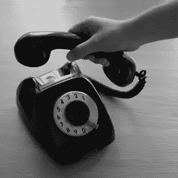

# 如何在第一次电话中吓跑潜在客户

> 原文：<https://www.sitepoint.com/how-to-scare-away-prospects/>

你有没有在和一个潜在客户通电话时脱口说出一些事后后悔的事情？或者，如果不能回答一个问题而没有找到正确的答案呢？我们都有过这样的经历，不幸的是，并不是每个潜在客户的电话都是成功的。

虽然没有一个万能的潜在客户拜访公式，但有些事情绝对不会帮你获得满意的结果。如果我们能提醒自己应该避免做什么，我们就更有可能获得良好的潜在客户拜访体验。以下是我在与潜在客户通话时认为不可做的几件事。

## 你可能会吓跑一个潜在客户，如果你…

**关于竞争的流言:**你的动机可能是无辜的——例如，解释你的服务如何成为客户的最佳选择。但如果它以唱衰竞争对手而告终，你可能会失去客户。有很多方法可以展示你的价值，而不用削减下一个人。

**谈论变坏的客户关系:**正如唱衰竞争对手是没有胜算的策略一样，唱衰过去的客户也是如此。如果潜在客户询问具体的关系，提供高层次的、不具体的细节，然后继续。考虑一下你是否愿意直接向你的老客户重复你说过的话。如果不是，就不说了。

打电话迟到:作为一个众所周知非常准时的人，我希望我的电话能准时开始。当然，有一个公认的 10 分钟左右的宽限期，但是如果你让客户等的时间比这个长，你可能会让他们觉得你不珍惜他们的时间，对这个机会不感兴趣。准时，如果你知道你会迟到，一封邮件提醒会有很大帮助。

过多地谈论你的个人生活:在我看来，在商业环境中，一点私人的东西对于建立真正的、可持续的关系是必要的。但是在通话中，分享一点你的私人生活和把客户介绍给你的猫 Fluffy 是有区别的。

给他们施加压力，让他们当场做出决定:许多客户喜欢在做出决定之前花些时间让谈话渗透进来。而且，很多时候，这会对你有利，因为你会确信他们会全心投入这段关系。当然要设定一个登记点，并向潜在客户概述“开始流程”,但要给他们足够的时间来思考。

## 轮到你了

我的一般经验是在潜在客户电话中放松并做好自己。当然，我想给客户留下深刻印象并赢得业务，但最终，如果我们的个性不和谐，彼此之间没有良好的共鸣，我们最好还是不要一起工作。所以真正的“我”永远是我的方法。

你认为在潜在客户电话中你能做的最糟糕的事情是什么？更重要的是，你如何让每个电话都成功？

*图片来源:[阿特罗斯科](http://www.sxc.hu/profile/atroszko)*

## 分享这篇文章