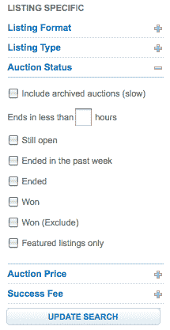
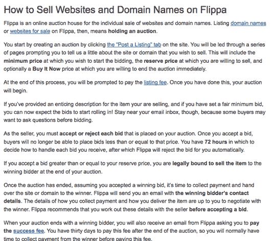
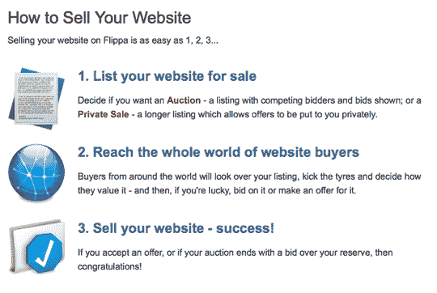

# 救命啊！有效的用户文档

> 原文：<https://www.sitepoint.com/help-user-documentation-that-works/>

如果你在一个新概念网站上工作——也就是说，一个不像电子商务网站或博客那样遵循既定格式的网站——制作用户文档可能是你最不想做的事情。然而，对于呈现用户不熟悉的过程的站点，高质量的文档是至关重要的。

环顾流行的新概念网站，如果你有相反的想法，那也情有可原。Twitter 帮助内容通知用户，该服务会自动缩短长网址——但它不会，对于第一次使用的用户来说，这令人困惑和沮丧。同样，我无法通过“我的墙”链接从脸书的主页(已登录)访问我的脸书墙，甚至无法只访问墙；相反，我必须点击我自己的名字才能进入我的墙。第一次解决这个问题花了我一些时间(还发了牢骚)。

虽然似乎没有人质疑这一点，但我认为这类问题会出现，因为开发这些网站的开发人员和可用性专家会编写与它们相关的用户文档——我指的是所有以用户为中心的内容，从详细的 FAQ 到逐字逐句的网站词汇表。是的，你的开发团队可以创建好的、清晰的、有用的用户文档，但是正如这些例子所示，这需要一些技巧。

良好的用户文档的好处是多方面的:除了帮助人们成功地使用网站及其相关服务，提高用户满意度，促进品牌忠诚度和口碑，它还可以降低您的支持成本，巩固您作为您所在领域的明确领导者的地位。

本文假设您计划使用现有开发团队中的资源为您的站点创建用户文档。它的主要目标是发布新概念网站的人，但是不管你的网站是关于什么的，也不管你是否已经写了用户文档，这些技术都会起作用。

使用最近重新开发的[Flippa.com](http://flippa.com)的用户文档作为案例研究，我们将一步一步地介绍你的团队在开发有效的用户文档时需要考虑的关键因素。首先，我们将讨论表明您的用户文档可以改进的最明显的问题。然后，我们将分解这些问题，以确定您的团队产生好的文档所需的语言和概念工具。最后，我们将探索您的团队在开发(或再开发)实际有用的用户文档时可以使用的技术。

## 识别用户文档中的问题

通常有一个关键的证据表明用户文档没有完成它的工作:支持查询。

Flippa.com 站点启动几个月后，支持团队发现:

*   客户不断地问同样的问题——这些问题在网站的常见问题解答中得到了回答

*   有时，即使在支持团队向用户指出适当的 FAQ 答案后，客户仍然不确定事实

*   该网站的交易和活动页面增加了工具提示式的帮助信息，但似乎并没有像 Flippa 希望的那样缓解用户的困惑

*   随着网站使用的扩大，支持队列(和支持成本)也在增长，因为越来越多的用户每天都在问相同的基本问题，而更有经验的用户在队列中添加高级问题。

Flippa 管理层发现一些帮助内容本来可以更清楚，但觉得用户文档的声音和语气不一致；它是由许多团队成员在不同的时间编写的，并且经常被他们修改以使信息更加清晰。

还有其他迹象表明您的用户文档需要改进。高退款和退货请求率可能表明，用户不确定当他们把辛苦赚来的钱交给你时，他们会得到什么。对你的网站或服务的评论，或者网上聊天，可以揭示你可能没有意识到的一致性和清晰性的问题。可用性测试可能会证明你的界面向用户提供了与你的用户文档中的信息不一致的线索。

一旦你发现你的用户文档有所欠缺，有人——你，团队成员，或者可用性或内容专家——就需要更仔细地查看它:将帮助、演示或 FAQ 内容与网站本身使用的实际过程和语言进行比较，并注意任何不一致的地方。

这里的目标是了解问题的程度。您可能会发现一个特定的 FAQ 页面在术语上令人困惑，通过纠正这个问题，您可能能够显著地纠正您的超重支持队列。不过，更有可能的是，您会发现一系列需要更详细关注的问题。Flippa 网站就是这种情况。

## 为良好的文档准备工具

Flippa 网站似乎在我之前提到的共同负担下工作:用户文档是由知道他们在做什么的人编写的，这些人也是建立该网站的人，但他们试图将这些概念传达给远不熟悉它们的人，即该网站的用户。

对于深陷其中的开发人员和设计人员来说，退后一步为对网站一无所知的人编写内容可能很困难——尤其是当网站即将推出，还有十亿其他成败攸关的任务要做的时候。然而，如果你想让你的技术团队编写用户文档，这是他们需要做的。

如果您正在从头开始编写用户文档，或者您需要彻底检查现有的文档，有一些工具可以使这项工作取得成功。如果您已经发现了现有用户文档中的一些问题，您可能会发现它们与我们将在本节中讨论的一些工具有关。

在任何情况下，当你准备创建用户文档时，第一步是好好看看网站的目标受众或用户群。从那里，你可以开发一个网站或概念词汇和标准措辞，所有这些你都将编译成一个全面的内容风格指南。

### 了解用户群

与网站的开发团队不同，新概念网站的用户群可能不熟悉网站及其所呈现的概念。网站使用率统计是定义网站用户群的一个常见起点。看一看 Flippa 的使用统计表明，男性比女性多，年轻人比老年人多，而且很大一部分用户来自美国以外的国家，其中许多人的第一语言不是英语。

然而，除此之外，Flippa 发现其用户群中有很大一部分似乎对在线拍卖的概念(或者说，拍卖的细节和语言)很少或没有经验。经过讨论，决定由买方构成主要受众，卖方构成次要受众。如果我们必须优先考虑一个群体，那就是买家。

当我们从产生货币交易的网站的角度来考虑这些信息时，Flippa 团队知道他们的用户文档必须创造一种安全感，并把网站呈现为一个公认的、受尊重的权威。文档必须传达清楚，并使细节尽可能容易理解——因为我们的非英语母语用户没有拍卖经验。这些用户必须足够迅速和彻底地理解信息，而不是离开，他们感到有信心立即开始通过网站买卖在线财产。

### 创造概念词汇

一旦你清楚地知道你在为谁写用户文档，你就可以开始考虑定义你的新概念网站的一些关键元素，并为它们设计标准的名字。预先确定你的概念的语言将会使以后编写一致的、可理解的用户文档变得更加容易。它还可以帮助你提高界面的可用性，从而提高你的底线。

让我们看一个例子。Flippa 主要是关于拍卖网站的。这在网站的标题中有所说明，如图 1 中的[“flippa . com 的主页标题”](#fig_homepage "Figure 1. Flippa.com’s home page header")。

**图一。Flippa.com 首页标题**

从品牌的角度来看，这很好。但是，当买家浏览房源时，他们会遇到拍卖，嗯，不是拍卖。它们是私人销售，在定价、投标、投标接受和拒绝以及其他流程方面不同于拍卖。如图[图 2，“Flippa 上的私人拍卖列表”](#fig_privatesale "Figure 2. A private sale listing on Flippa")所示，甚至列表页面界面也不同于标准拍卖界面，如图[图 3，“Flippa 上的公开拍卖列表”](#fig_auction "Figure 3. A public auction listing on Flippa")所示。

**图二。Flippa 上的私人销售列表**

**图 3。Flippa 上的公开拍卖列表**

更令人困惑的是，Flippa 的特定于列表的搜索功能，如图[图 4 所示，“Flippa 搜索功能仅提及拍卖”](#fig_listingspecific "Figure 4. Flippa search function mentions auctions only")，根本不涉及私人销售——它只涉及拍卖。这是否意味着没有搜索结果包含私下销售？私人销售是某种特殊的、限制进入的拍卖形式吗？当用户偶然发现一种他们在其他地方没有见过的销售类型时，这些问题在他们的脑海中比比皆是。

**图 4。Flippa 搜索功能仅提及拍卖**

卖家的处境相似。该网站在其界面和基本帮助页面中几乎只提及拍卖(如图[图 5 所示，“Flippa 的基本帮助仅提及拍卖”](#fig_help "Figure 5. Flippa’s basic help refers to auctions only"))，然而当列出他们的在线财产时，卖家被问及他们是想拍卖还是私下出售，如图[图 6，“Flippa 的列表页面要求用户选择一种销售类型”](#fig_private_or_auction "Figure 6. Flippa’s listing page asks users to select a sale type")所示。

**图 5。Flippa 的基本帮助仅指拍卖**

**图 6。Flippa 的列表页面要求用户选择销售类型**

这些内容位于上市过程的中间(这是 Flippa 团队希望尽可能减少摩擦的地方)，是我们能够找到的表明这两种销售类型之间一些差异的仅有的两个内容之一。它们没有在网站的帮助内容中定义，但是在如何销售你的网站页面上提供了更多的信息，如图 7[“拍卖和私人销售的唯一区别”](#fig_how_to_sell "Figure 7. The only other content differentiating between auction and private sale")所示。

**图 7。拍卖和私人销售的唯一区别**

专注于消除销售或注册过程中的摩擦的交易网站必须减少由这种遗漏引起的混乱。解决这个问题的第一步是开发一个标准的*概念词汇表*——新的或特定于站点的概念的命名法——在整个站点及其用户文档中使用。

对于 Flippa，我们决定将这两种销售方式分开:公开拍卖和私人销售。我们需要 *private* 用于私人销售，这样我们就可以在需要的地方使用 sale 这个词的变体——比如 selling 和 seller。我们曾考虑称公开拍卖为拍卖，但我们对受众的研究表明，最清晰的区分对用户最有帮助。如果私人销售始终是私人销售，将公众排除在公开拍卖之外将有使用户困惑的风险，如果没有给出指示，用户可能会怀疑拍卖可能是公开的或私人的。

下一步是为每个概念开发独特的语言。因此，用户会在拍卖中出价和出价，但会在私下销售中出价。这两种类型的交易都有一个网上房产列表，我们可以简称为列表，因为我们想避免每次在网站上谈论出售物品时都被冗长的私人销售或公开拍卖所束缚。然而，我们会保留列表页面，以备我们需要引用列表的实际接口时使用。

正如你所看到的，为你的新概念开发一个词汇表是很棘手的。除了找出对你的用户群有意义的东西，获得利益相关者的认同也很重要。再想想脸书的长城。当你无意中听到有人说，“他写在我的墙上，”这是对脸书的认可。你知道这个人在谈论脸书，因为在网络环境中使用的“墙”这个词已经与这个网站密不可分。

这是要记住的关键一点:当你创造一个新概念时，你有机会围绕这个概念形成语言。虽然高级管理层可能会为一个品牌名称深思熟虑几个月，但你为支持你的概念沟通而做出的命名决定最终可能会成为该品牌的核心。明智地选择你的话。与利益相关者讨论它们。和用户一起测试。尽你所能确信你的概念词汇是正确的。

### 创建支持措辞

一旦你发展了你的概念词汇，是时候把你的思想转向那些精心挑选的术语的措辞了。把你的概念词汇想象成一组积木，把支持短语想象成将你的概念粘在一起的胶水。

围绕 Flippa 底价概念的措辞就是一个很好的例子。底价是卖家对网上房产的最低要价。用户必须理解这一点，以便掌握与投标值、投标接受等有关的其他概念。在查看用户文档时，我们发现类似于等于或超过、大于或等于、等于或大于这样的短语出现得非常频繁——几乎与保留价格这个概念本身一样频繁。[图 8，“底价概念的措辞”](#fig_reserve_price "Figure 8. Wording around the concept of the reserve price")显示了底价帮助内容中的一个例子。

**图 8。围绕保留价格概念的措辞**

对于一个不熟悉网站并努力记住底价概念的用户来说，如果我们使用一致的措辞来表达这个概念会有所帮助。一致的语言减少了注意力分散的机会，并使信息更容易被吸收。所以，每次用户都被呈现一个达到或超过底价的出价的想法(什么*又来了？)，我们希望避免他们忙于计算大于或等于和等于或大于是否相同。*

 *出于这个原因，我们开发了支持短语等于或大于，并承诺在每次谈到达到或超过底价时使用该短语。这意味着用户只需学习一次这个短语，就能理解它的意思。这样他们就能在以后每次遇到这个短语时运用这些知识。一致的语言解放了用户，让他们专注于理解我们网站独有的更大的概念。

当你开发这种支持措辞时，要记住的一个考虑是你的受众的构成，因此，你希望你的用户文档传达的声音。我们本可以使用更简单的等于或超过的措辞来谈论 Flippa 上的保留价格。它比等于或大于更短更简洁——当这个短语在许多详细的信息页面中频繁使用时，这是一个很大的加分。此外，我们希望内容有专业的声音，等于或超过听起来肯定比高中术语等于或超过更专业。

然而，出于与观众相关的原因，我们选择了等于或大于 T1 的 T0。首先，这听起来更友好，信任是我们关注的一个重要因素。第二，有些人可能会认为“超过”意味着过度——听起来很昂贵——我们想传达的是，每个人都可以在网上交易房产。我们还认为，考虑到我们用户群的年轻人和非英语母语者的数量，更多的人会熟悉这种措辞:“more than”比“exceeds”更容易被这类用户理解。简而言之，为了清晰起见，我们牺牲了字数，并决定利用文本中的其他机会来传达网站的专业性和权威性。

在这一点上，你所做的每一个选择都应该是为了最大数量的用户获得最大的清晰度。如果你认为，对于一个受众毕竟主要来自英语国家的网站来说，强调非英语使用者可能是不合理的，请记住，我们并没有降低内容的质量:这些小词的选择只是为了最大限度地提高可访问性和理解性。*  *### 创建风格指南

不管你是一个人还是十个人在做用户文档，重要的是你要把你所做的关于概念词汇和标准措辞的所有决定汇编成一个风格指南，还有关于专有名词的大写、缩写的标点符号以及术语和拼写的处理的指示(例如，Flippa 把“website”作为一个单词，而不是两个)。

该参考指南将允许设计人员、开发人员和支持人员使用相同的词汇和语言与用户交流。它将使您能够以更简单的方式将用户文档和支持职责交给新的团队成员。这将有助于你为你的品牌建立一个声音和形象，并更容易发展一个忠诚、热情的追随者。* 

## *分享这篇文章*