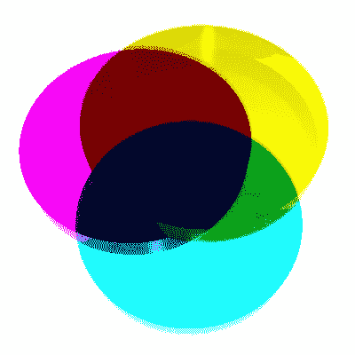
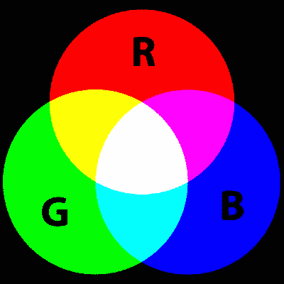
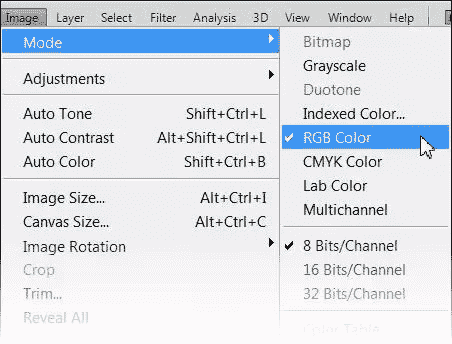

# 颜色模型简明指南

> 原文：<https://www.sitepoint.com/a-short-guide-to-color-models/>

如果您是图形或网页设计的新手，当您使用图像编辑器并看到各种可用的颜色模型和模式时，您可能会感到困惑。这篇文章旨在简要解释 Photoshop 中模型背后的理论，以及为什么你会选择一个特定的模型。

**什么是颜色模型？**
颜色模型只是定义颜色的一种方式。模型描述了颜色在计算机屏幕或纸上的表现。三种流行的颜色模型是:

*   **CMYK(青色、品红色、黄色、黑色)**
*   **RGB(红、绿、蓝)**
*   **实验室颜色**

让我们依次来看一下其中的每一项。

1.CMYK 模式用于**打印工作**，它根据青色、品红色、黄色和黑色的百分比来描述颜色。这四种颜色被商业印刷机构和办公室使用，你可能也会发现你的家庭打印机也使用这些颜色。这四种颜色是复制杂志、书籍和小册子中的全彩艺术品所必需的。通过将青色、品红色、黄色和黑色以不同的百分比组合在纸上，可以创造出多种颜色的幻觉。

CMYK 被称为“减色法”色彩模型。白色是纸张或其他背景的自然颜色，而黑色是彩色油墨的完全组合。

下面左边的分色使用最多的黑色和最少的青色、洋红色和黑色。右边是使用混色青色、洋红色和黄色油墨印刷的分色。

 

*[图片来自维基百科](http://en.wikipedia.org/wiki/File:Barns_grand_tetons.jpg)*

2.当处理基于屏幕的设计时，使用 RGB 模型。0 到 255 之间的值被分配给每种光颜色，红色、绿色和蓝色。例如，如果你想创建一个纯蓝色，红色的值为 0，绿色的值为 0，蓝色的值为 255(纯蓝色)。为了创建黑色，红色、绿色和蓝色的值都是 0，为了创建白色，它们的值都是 255。RGB 被称为“加色”模式，与减色模式相反。

 
在这种情况下，当我们谈论颜色的“价值”时，我们指的是颜色彼此之间的强度关系。在下图中，你可以看到一张照片被分成了红、绿、蓝三种元素。

*[来自维基百科的图像](http://en.wikipedia.org/wiki/File:Barn_grand_tetons_rgb_separation.jpg)*

3.Lab 颜色模型稍微复杂一些。它由三个部分组成——亮度部分(L ),范围从 0 到 100,“a”部分来自 Adobe 拾色器中的红绿轴,“b”部分来自 Adobe 拾色器中的蓝黄轴。“a”和“b”的范围都是从+127 到–128。当 Photoshop 从一种模型转换到另一种模型时，它使用 Lab 作为中间颜色模型。

那么，在所有这些之后，您应该使用哪个模型呢？

如果您知道您的作品将被发送到专业印刷机构，那么最好以 CMYK 模式开始您的文档。除此之外，可以肯定地说，对于几乎任何其他非印刷项目，您都可以使用 RGB 格式。从一种颜色模型转换到另一种颜色模型是可能的，但是由于 RGB 和 CMYK 空间都是设备相关的空间，转换公式不是那么简单，并且需要使用颜色配置文件的颜色管理系统(如 Photoshop 或其他图形编辑器),这就是为什么转换很少是精确的。如果你确实需要从一种颜色模式转换到另一种，只需选择图像>模式，然后选择你需要的一种。

## 分享这篇文章