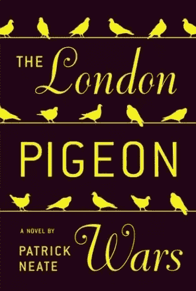
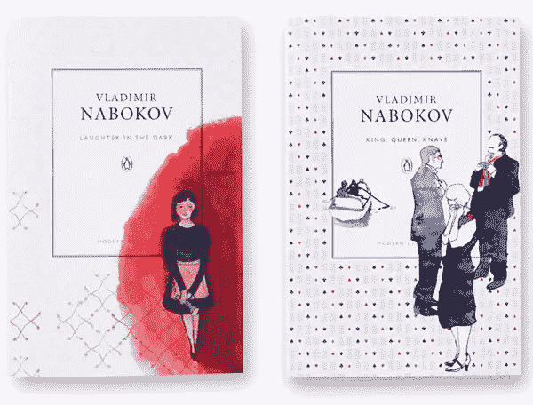
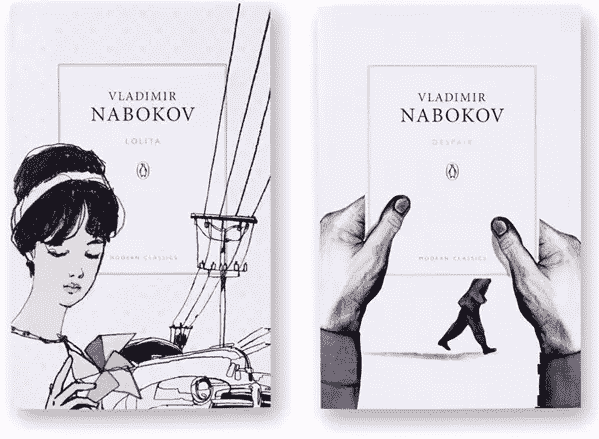
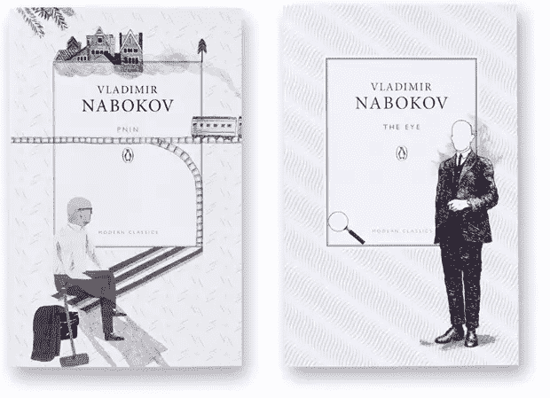
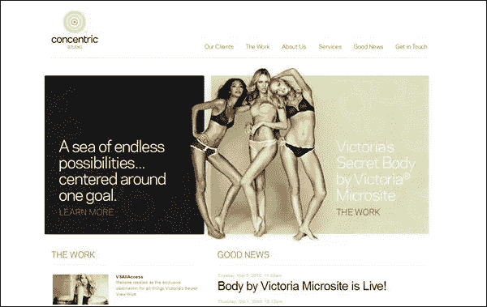
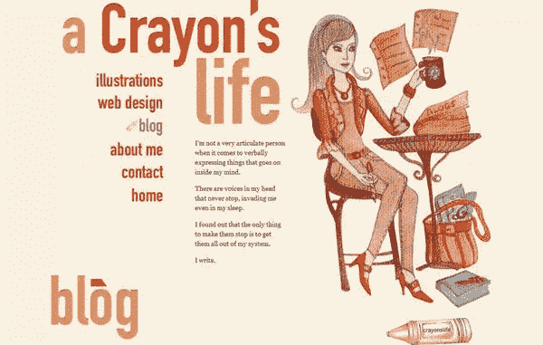

# 设计中的和谐第二部分:重复

> 原文：<https://www.sitepoint.com/harmony-in-design-part-2-repetition/>

上周，我发布了一篇短文[，概述了帮助我们在设计中实现视觉和谐的一些因素](https://www.sitepoint.com/new-series-harmony-in-design)。无论您的设计是用于网页还是印刷，这些因素都是相关的。今天我们来看看第一个，也就是**重复**。

正如上周提到的，视觉和谐是设计元素之间的一致或平衡。设计元素可以是照片、插图、字体、标题、背景和纹理(以及任何你想添加到设计中的东西)。所以，如果你*重复*这些元素中的一个，马上就会有一种和谐的感觉。两个或两个以上相同或接近相同的元素不仅表达了视觉上的一致，而且重复也有助于吸引眼球进入你的设计。这并不意味着你的设计仅仅通过添加两个相似的项目就会看起来很棒，但是你选择重复什么是很重要的。让我们看看一些重复的例子。

**图像或图标的重复**

在这本书的封面设计中，鸽子的轮廓在封面的三行重复出现。虽然剪影不尽相同，但都是一样的颜色，非常相似。鸟儿的重复出现给封面增添了一种俏皮的感觉。

电影《丑陋的真相》的预告海报是一个简单而有趣的设计(没有看过这部电影，所以无法评论它的质量)。头部和腹股沟之间的心脏区域的重复是幽默的，在排版中也有重复，与演员姓名和电影名称中的浅色和粗体黑色文本形成对比。

**边框中的重复**

在这个从[五角星](http://pentagram.com/)开始的新系列书皮中，你可以清晰的看到每本书之间的联系和一致性。每个封面上都有重复的边框粗细和位置，小企鹅标志也是如此。每本书都使用相同的字体，作者的名字、书名和“现代经典”的字样出现在每本书完全相同的位置。这就为每个封面留出了单独插图的空间，同时又不失该系列已经建立起来的视觉和谐。

更多关于纳博科夫书籍的信息，请看五角星博客。

**装饰中的重复**

同心工作室在他们网站的左、右街区的背景中重复他们的标志(同心圆)。

蜡笔人生博客在浅色背景以及博客标题和标题中使用了画布纹理。橙色和褐色的配色方案在网站的导航和主绘图中重复出现。

当你在设计的时候，花些时间去探索重复，以及如何利用重复来达到一致性和和谐性。

下周，我会看看主位参照如何在视觉和谐中发挥作用，希望你能加入。

## 分享这篇文章