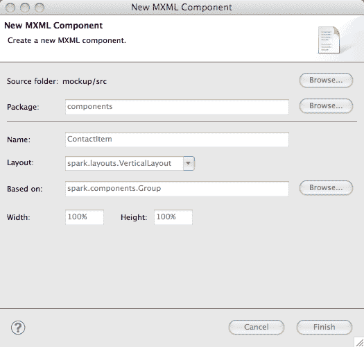

# 使用 Flash Builder 进行数据驱动的开发，第二部分

> 原文：<https://www.sitepoint.com/data-driven-development-with-flash-builder-part-ii-2/>

[我们介绍使用 Adobe Flash Builder 进行数据驱动开发的第一集](https://www.sitepoint.com/article/data-development-flash-builder-part-1)看到我们将 Catalyst 生成的 Flex 应用程序连接到我们的数据库，并使用 Flash Builder 的代码生成功能为我们的应用程序后端创建 PHP 服务。当我们完成时，我们已经有了一个可以工作的 Flex 应用程序，它通过 PHP 服务与我们的数据库进行了一次完整的往返，并用条目填充了一个联系人列表。

在今天的最后一期中，我们将了解 Flash Builder 为我们提供的一些更高级的代码生成功能，并为我们的应用程序添加一些数据编辑功能。

如果你从这个系列的第一集开始就一直关注它，你应该已经准备好了；对于那些晚加入我们的人，我假设你对 Flex 和 MXML 有一点熟悉。你实际上不需要知道任何 PHP，因为 Flash Builder 为我们做了所有繁重的工作，尽管你需要安装 PHP 和 MySQL。

请务必在文章的末尾用 [Adobe 赞助的测验来测试您的知识。](https://www.sitepoint.com/quiz/flex4/data-development-flash-builder-part-ii/)

## 概述

在本系列的前两篇文章中，我们使用 Adobe Flash Catalyst 将一些基本作品转换为联系人应用程序的工作原型，然后将 Flash Catalyst 项目导入 Flash Builder。使用 Flash Builder 的数据驱动开发工具，我们自动生成了一个 PHP 服务，其中包含了我们管理联系人数据所需的所有调用，并自动将其连接到我们的应用程序。

这一次，您将看到 Flash Builder 投入了多少工作来帮助我们快速构建应用程序。但是在这之前，我们需要添加一些特性来使我们的应用程序可用。

## 导入项目

我们的起始位置是上一条说明的最终结果。为了让生活更简单，[本期的可下载存档](http://sitepoint-examples.s3.amazonaws.com/flashbuilder/datadriven-flashbuilder-2.zip)有一个名为`part_2_start.fxp`的 Flash Builder 项目。

当您导入`.fxp`文件时，会出现一个对话框，要求您更新路径变量。这是因为我们在项目中使用了 PHP 安装，变量应该设置如下:

OUTPUT_FOLDER

这应该是您的 webroot，或者您为项目提供服务的 web 目录。比如`C:Inetpubwwwrootcontacts`。

PHP_FLEX_SERVER_ROOT

这应该是您的 web 服务器的根目录。比如`C:Inetpubwwwroot`。

PHP_WEB_URI

这应该是编译时用于访问项目的 url 根目录。比如`http://localhost/contacts`。

当然，这假设您有一个本地 web 服务器和 PHP 安装。

## 查看联系人详情

我们在应用程序的左侧已经有了一个工作联系人列表。我们现在需要的是添加一个联系人视图，这样当用户点击一个联系人的名字时，就可以看到列表中任何联系人的详细信息。

当我们在 Flash Catalyst 中工作时，我们定义了一个`contactView`状态。`Main.mxml`中的代码可以工作，但是对于我们想要做的事情来说有点简单，所以让我们稍微修改一下。

首先，删除所有用于在显示屏右侧显示联系人姓名的`<fx:DesignLayer>`和`<s:RichText>`元素:我们将为此创建一个新组件。

在 Flash Builder 的包浏览器窗格中右键单击`/src/components`，创建一个新的 MXML 组件。按照[图 1，“ContactItem 组件”](#fig_contactitem "Figure 1. The ContactItem Component")，调用`ContactItem`，并在对话框中填写详细信息。

**图一。`ContactItem`分量**



Flash Builder 将为我们生成组件结构。接下来，我们想加入代码来显示联系人项的详细信息。首先，在`Group`元素中插入下面的代码，它添加了一个公共变量，这样组件就可以被传递一个`Contact`值对象:

```
<fx:Script>  <![CDATA[    import valueObjects.Contact;    [Bindable]    public var contactData : Contact;  ]]></fx:Script>
```

**note:** Don’t Forget the Metadata!

不要忘记`[Bindable]`元数据——没有它，组件将不会在运行时获得对我们选择的更改。您还记得，在本系列的第二篇文章中，Flash Builder 为我们生成了`valueObjects/Contact.as`类，我们可以将它用作预期类型。

现在让我们添加生成的 Catalyst 代码的一个稍微清理过的版本，我们已经简单地从其中删除了 Catalyst 特定的项目并去掉了`includeIn`属性。代码应该如下所示:

```
<s:BitmapImage source="@Embed('asseimg/mockup/at.png')"/><s:RichText color="0xFFFFFF" fontSize="18" kerning="on" lineHeight="120%" whiteSpaceCollapse="preserve">  <s:content><s:p whiteSpaceCollapse="collapse"><s:span>Toby Tremayne</s:span></s:p></s:content></s:RichText><s:RichText color="0xFFFFFF" kerning="on" lineHeight="120%" whiteSpaceCollapse="preserve">  <s:content><s:p whiteSpaceCollapse="collapse"><s:span>9999 999 999</s:span></s:p></s:content></s:RichText><s:RichText color="0xFFFFFF" kerning="on" lineHeight="120%" whiteSpaceCollapse="preserve">  <s:content><s:p whiteSpaceCollapse="collapse"><s:span>toby@magicindustries.net</s:span></s:p></s:content></s:RichText><s:RichText color="0xFFFFFF" kerning="on" lineHeight="120%" whiteSpaceCollapse="preserve">  <s:content><s:p  whiteSpaceCollapse="collapse"><s:span>21b Baker Street</s:span></s:p></s:content></s:RichText><s:RichText color="0xFFFFFF" kerning="on" lineHeight="120%" whiteSpaceCollapse="preserve">  <s:content><s:p whiteSpaceCollapse="collapse"><s:span>London</s:span></s:p></s:content></s:RichText>
```

最后，我们希望确保`ContactItem`组件获取传递给它的实际数据，所以我们用对`value`对象的引用替换硬编码的值:

```
<s:RichText color="0xFFFFFF" fontSize="18" kerning="on" lineHeight="120%" whiteSpaceCollapse="preserve">  <s:content><s:p whiteSpaceCollapse="collapse"><s:span>*{contactData.first_name}*</s:span></s:p></s:content></s:RichText><s:RichText color="0xFFFFFF" kerning="on" lineHeight="120%" whiteSpaceCollapse="preserve">  <s:content><s:p whiteSpaceCollapse="collapse"><s:span>*{contactData.phone}*</s:span></s:p></s:content></s:RichText><s:RichText color="0xFFFFFF"  kerning="on" lineHeight="120%" whiteSpaceCollapse="preserve">  <s:content><s:p whiteSpaceCollapse="collapse"><s:span>*{contactData.email}*</s:span></s:p></s:content></s:RichText><s:RichText color="0xFFFFFF" kerning="on" lineHeight="120%" whiteSpaceCollapse="preserve">  <s:content><s:p  whiteSpaceCollapse="collapse"><s:span>*{contactData.address1}*</s:span></s:p></s:content></s:RichText><s:RichText color="0xFFFFFF"  kerning="on" lineHeight="120%" whiteSpaceCollapse="preserve">  <s:content><s:p whiteSpaceCollapse="collapse"><s:span>*{contactData.city}*</s:span></s:p></s:content></s:RichText>
```

现在，回到`Main.mxml`。首先，检查一下`Application`标签的`currentState`属性是否设置为`listView`:

```
<s:Application   xmlns:fc="http://ns.adobe.com/flashcatalyst/2009"   xmlns:s="library://ns.adobe.com/flex/spark"   xmlns:fx="http://ns.adobe.com/mxml/2009"   xmlns:flm="http://ns.adobe.com/flame/2008"   xmlns:lib="assets.graphics.mockup.*"   xmlns:d="http://ns.adobe.com/fxg/2008/dt"   xmlns:ai="http://ns.adobe.com/ai/2009"   xmlns:ATE="http://ns.adobe.com/ate/2009"  xmlns:contactservice1="services.contactservice1.*"  height="600" width="800"   backgroundColor="#FFFFFF"   preloaderChromeColor="#FFFFFF"   currentState="listView">
```

接下来，转到代码部分，我们从中剥离了放入`ContactItem.mxml`的元素，并加入对新组件的调用，如下所示:

```
<components:ContactItem     id="contactPane"     contactData="{contactList.selectedItem}"     includeIn="contactView"    x="450" y="125" />
```

如果您在 Flash Builder 中使用 code insight 键入此内容(即键入左尖括号并等待小弹出窗口)，您可以导航到您的`components:ContactItem`，当您选择它时，IDE 将自动为您的`<Application>`标签添加一个`xmlns`属性。如果没有，您需要确保将以下内容添加到`<Application>`标签中:

```
xmlns:components="components.*"
```

当我们使用 Flash Builder 代码生成工具将 list 组件连接到我们的 PHP 服务调用时，它被自动分配了一个`id`，但是它是一个非常不可描述的`list1`。将`id`改为`contactList`，让你的代码更清晰一点。

**note:** Setting Names and Properties in Catalyst

当然，在将项目移植到 Flash Builder 之前，您可以使用 Catalyst IDE 中的属性窗格为 Flash Catalyst 中的组件设置`id`名称和属性。

现在，我们希望当用户从联系人列表中选择一个项目时，联系人窗格出现在右侧。将此函数添加到`Main.mxml`的脚本块中:

```
protected function list_changeHandler():void {  currentState='contactView';}
```

然后在联系人列表上添加一个更改处理程序，如下所示:

```
<s:List id="contactList"     skinClass="components.TobyTremayneDataList"     x="157" y="163"     change="list_changeHandler()"    creationComplete="list_creationCompleteHandler(event)"     labelField="address1"    itemRenderer="components.RepeatedItem1">  <s:AsyncListView list="{getAllContactResult.lastResult}"/></s:List>
```

如果您遵循上一篇文章并做出自己的调整，Flash Catalyst 使用 parallels 创建过渡，同时淡化每个元素(名字、姓氏等)。我们已经用单个组件替换了那些单独的元素，所以我们需要修改转换代码。改为为每个过渡设置一个简单的淡入淡出，目标是我们新的 ContactItem 组件。新的转换集应该如下所示:

Flash Catalyst 创建了使用`parallel`同时淡化每个元素(名字、姓氏等)的`transition`。).然而，我们已经用单个组件替换了那些单独的元素，所以我们需要修改转换代码。改为为每个`transition`设置一个简单的`Fade`，它将针对我们新的`ContactItem`组件:

```
<s:transitions>  <s:Transition fromState="contactView" toState="listView" autoReverse="true">    <s:Fade duration="200" target="{contactPane}" />  </s:Transition>  <s:Transition fromState="listView" toState="contactView" autoReverse="true">    <s:Fade duration="200" target="{contactPane}" />  </s:Transition></s:transitions>
```

现在，如果您保存并编译您的 Flash Builder 项目，您将看到当您在联系人列表中单击时，所选联系人的数据会出现在显示屏的右侧。

## 分享这篇文章