# 在 Photoshop 中制作酷炫的按钮(或徽章)

> 原文：<https://www.sitepoint.com/make-cool-funky-buttons-or-badges-in-photoshop/>

只需几层，你就可以在 Photoshop 中创建一个看起来很酷的按钮(在爱尔兰我们称之为徽章)。我们将设置层结构，以便您可以轻松地重用按钮的主要部分，并简单地改变顶部的图像来创建一个新的按钮。让我们开始吧。

1.用深灰色背景创建一个 600 x 600 像素的新图像。

2.创建一个新层，使用椭圆选框工具(M)，拖出一个圆形选框。拖动时按住 Shift 键，以确保得到一个完美的圆。

[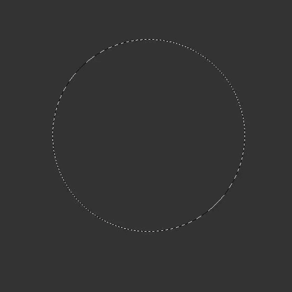](https://www.sitepoint.com/wp-content/uploads/2010/06/1EllipticalMarquee.jpg)

3.使用油漆桶工具(G)用你想要的任何颜色填充圆圈，在这个阶段没有关系。我用了鲜红色。使用 Ctrl + D / Cmd + D 取消选择。

[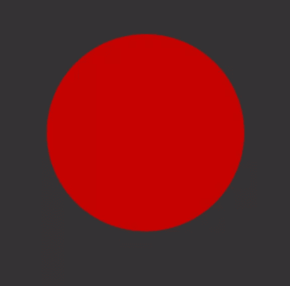](https://www.sitepoint.com/wp-content/uploads/2010/06/2RedCircle.jpg)

4.现在是时候开始设计了。点击图层面板底部的图层效果图标，从弹出菜单中选择投影。使用下图中的设置，但不要点按“好”。

[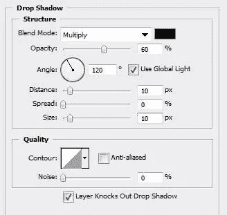](https://www.sitepoint.com/wp-content/uploads/2010/06/3DropShadow.jpg)

[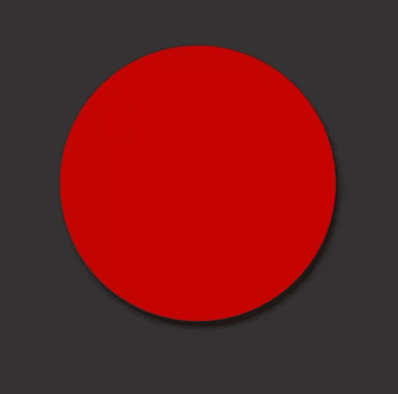](https://www.sitepoint.com/wp-content/uploads/2010/06/3aDropShadow.jpg)

5.仍然在图层效果对话框中，点击文字内阴影并添加以下设置。请注意,“使用全局灯光”复选框没有被选中，因此您可以更改灯光角度。先不要单击确定。

[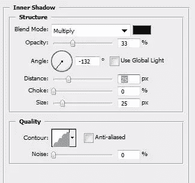T2](https://www.sitepoint.com/wp-content/uploads/2010/06/4InnerShadow.jpg)

[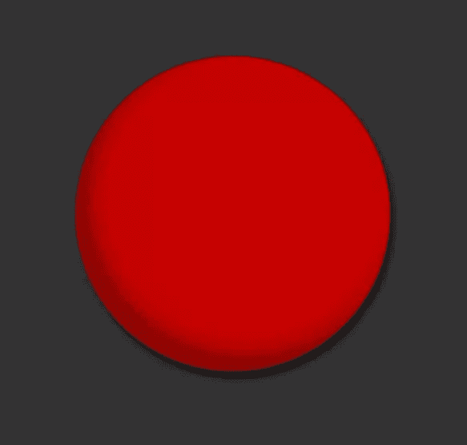](https://www.sitepoint.com/wp-content/uploads/2010/06/4aInnerShadow.jpg)

6.点击单词 Inner Glow 并更改以下设置。先不要单击确定。

[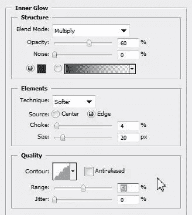](https://www.sitepoint.com/wp-content/uploads/2010/06/5InnerGlow.jpg)

[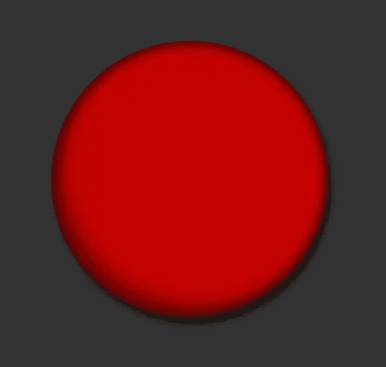](https://www.sitepoint.com/wp-content/uploads/2010/06/5aInnerGlow.jpg)

7.现在是最后的图层效果样式。点击文字渐变叠加，并使用以下设置。

[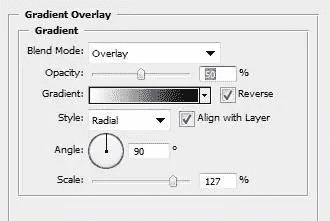](https://www.sitepoint.com/wp-content/uploads/2010/06/7aGradientOverlay.jpg)

现在，您可以单击“OK ”,您应该会看到类似这样的内容:

[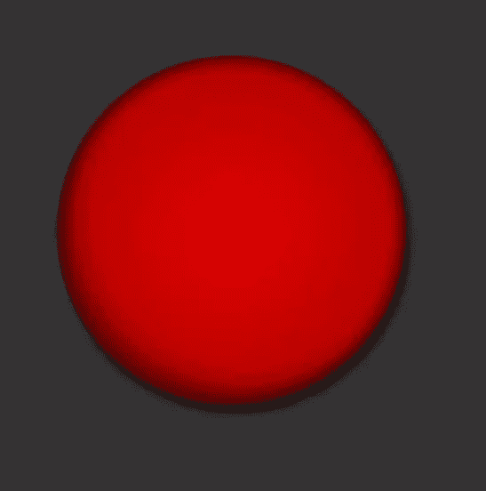](https://www.sitepoint.com/wp-content/uploads/2010/06/7GradientOverlay.jpg)

8.我们将在这一点上画一个亮点。创建一个新层，然后用椭圆选框工具，在按钮顶部附近画一个椭圆。选择渐变工具并将前景色设置为白色，然后在屏幕顶部的渐变工具选项中，选择前景色为透明渐变。使用渐变工具，向下拖动选区，创建如下效果:

[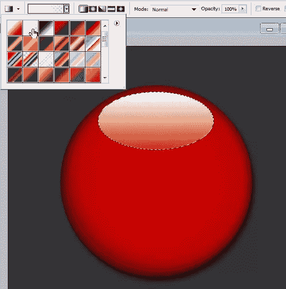](https://www.sitepoint.com/wp-content/uploads/2010/06/8Highlight.jpg)

9.取消选择选区，使用自由变换工具(Ctrl + T / Cmd + T)旋转新高光层的内容。如下定位高光。

[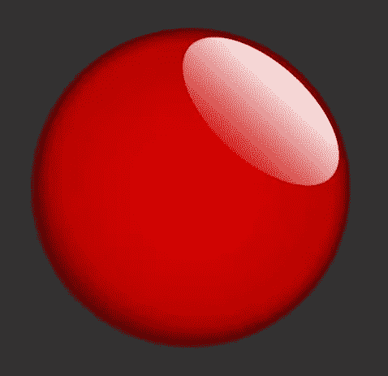](https://www.sitepoint.com/wp-content/uploads/2010/06/9HighlightPositionChange.jpg)

10.通过按 Ctrl + J / Cmd + J 复制高光层，然后关闭原始高光的可见性。确保您正在高光复制层上工作。选择橡皮擦工具，设置大小为 500 像素，然后点击一次，留下一小条白色。

[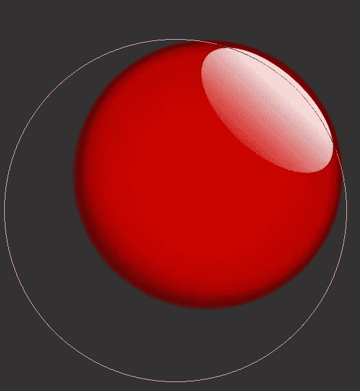](https://www.sitepoint.com/wp-content/uploads/2010/06/10Eraser.jpg)

擦除后，你会看到看起来像一个小的明亮的光泽。

[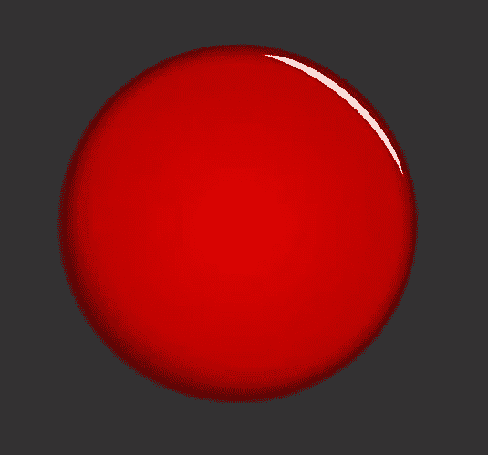](https://www.sitepoint.com/wp-content/uploads/2010/06/11SmallShine.jpg)

11.将高光副本的不透明度设置为 50%左右，然后打开原始高光层的可见性，并将不透明度也设置为 50%。

[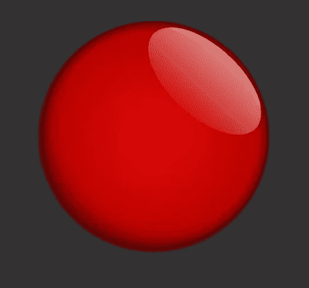](https://www.sitepoint.com/wp-content/uploads/2010/06/12HightlightsTogether.jpg)

12.选择高光复制层(小亮光)并复制它。再次使用 Ctrl + T / Cmd + T 来自由变换和旋转复制的光泽，并把它放在左下角，就像这样:

[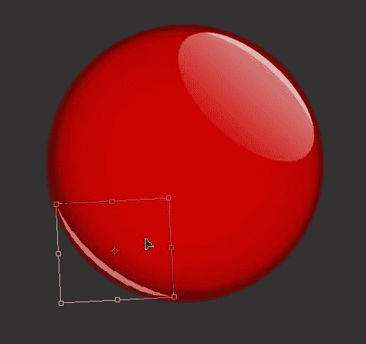](https://www.sitepoint.com/wp-content/uploads/2010/06/13HightlightsTogether.jpg)

按 Enter 键应用变换。如果你觉得底部太亮，将图层的不透明度降低到 20%左右。

在这个阶段，我们的按钮模板就完成了。我们所要做的就是将红色圆圈层的填充值调低到 0%，然后你可以放入任何你想要的图像。

[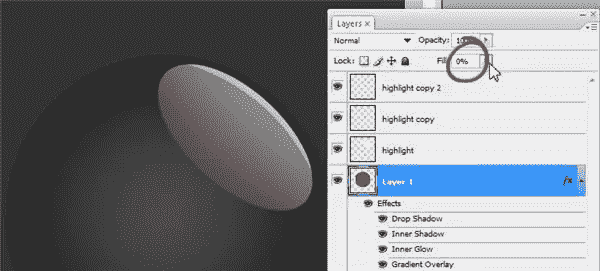](https://www.sitepoint.com/wp-content/uploads/2010/06/15FillOpacity.jpg)

任何你想出现在按钮上的图像都将位于这个图像的下面。

假设你想做一个鲍勃·马利按钮。将鲍勃·马利的图像放在你的(现在不可见的)红色圆圈下面的图层上。

现在按 Ctrl 键并点击圆形层来选择这个大小的圆形，然后按 Shift+Ctrl+I 来反转选择，转到 Marley 层，并按 delete 键来得到你的最后一个按钮。瞧啊。

最好的事情是，这是一个可重复使用的设计模板，所以请确保你挂在你的 PSD 文件。

## 分享这篇文章