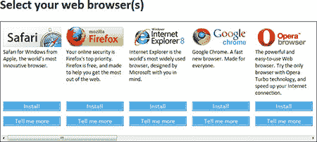

# 供应商推动更公平的浏览器选择屏幕

> 原文：<https://www.sitepoint.com/vendors-push-for-fairer-browser-choice-screen/>

可怜的微软——他们一定在想这一切什么时候会结束。他们的[浏览器选择界面](https://www.sitepoint.com/european-browser-choice-today/)在昂贵的欧盟法律诡计之后于 3 月 1 日推出。统计学家随后报告称[随机浏览器显示没有](https://www.sitepoint.com/microsoft-fix-their-non-random-browser-choice-screen/)那么随机。现在 Avant，Flock，GreenBrowser，Maxthon，斯雷普尼尔和 Slim 的制造商已经向欧盟抱怨他们浏览器的可见性。

供应商表示，除了最初显示在[选择屏幕](http://www.browserchoice.eu/)上的五个浏览器选项之外，还不清楚是否有更多的浏览器选项:

你可以明白他们的观点——任何有一点网页设计经验的人都知道水平滚动一般应该避免。

请愿书的结论是:

> 最终选择屏幕设计让绝大多数用户没有意识到有超过五种浏览器可供选择。
> 
> 我们只要求简单地添加任何文本或设计元素，这将向普通用户表明，在可见屏幕的右侧有选择。

微软重申，该屏幕是按照欧盟委员会的要求制造的。

在我看来，没有哪家厂商会对屏幕 100%满意——即使微软屈从于他们的愿望。提供 12 种浏览器有点可笑，很少有新手会喜欢如此多的选择。

更糟糕的是，在最近的 [PC Pro 评论](http://www.pcpro.co.uk/features/356350/on-test-the-hidden-seven-browsers-in-the-windows-ballot)中，这些应用程序中有几个被评为*“令人震惊的低质量】*。除了 Flock 和 Sleipner，许多用户可能会放弃他们新的又慢又丑的浏览器，回到 IE，并且永远不会尝试另一种选择。这不是欧盟想要实现的目标。

至少前 5 名的浏览器给了用户一个已经被数百万人尝试和测试过的高质量软件的选择。替代方案可能有优点，但它们不太受欢迎是有原因的——它们不能提供同等水平的支持。

水平滚动条可能不是一个好的设计，但它是在提供一切和保持屏幕简单之间的一个合理的折衷。我不认为它应该改变。是吗？

## 分享这篇文章