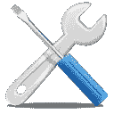
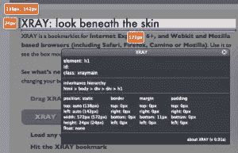

# 网页设计师的 10 大省时工具

> 原文：<https://www.sitepoint.com/10-big-time-saving-tools-for-web-designers/>

源自维基共享资源的工具剪贴画。

人类只是不像计算机那样擅长执行重复性的任务。而且，我真的很讨厌同一件事做不止一次。我认为任何以专业身份使用计算机的人(现在谁不是呢？)如果不问问自己如何通过让电脑做一些无聊的事情来提高工作效率，那就是失职了。

每当我注意到我连续不止一次地做同样的事情时，我知道还有改进的机会。这就是为什么我总是在寻找能帮我节省时间的好工具。使用这些工具不仅降低了我犯错误的可能性，它们还帮助我在工作时获得更多乐趣，因为我可以跳过无聊的东西，直接进入有趣的东西——电脑不能为我做的东西。

有很多工具就是为前端开发人员和网页设计人员设计的。以下是我遇到的一些最省时的工具，也是我比较常用的。希望它们也能为你节省一些时间。

## SpriteMe: CSS 精灵让路，太容易了

制作 CSS 精灵是一种通过将许多不同的图像组合成一个文件来提高网站性能的技术。虽然它们的有用性是毋庸置疑的，但是手动创建和更新它们可能会有点痛苦。有很多 CSS 精灵制作工具，比如流行的 [CSS 精灵生成器](http://spritegen.website-performance.org/)。然而，我最喜欢的是[精神](http://SpriteMe.org/)。

SpriteMe 是一个简单的免费 JavaScript bookmarklet 服务，它可以分析你运行它的任何页面上的所有背景图像，并帮助你将它们转换成一个或多个 sprite 图像。只需点击一下“制作精灵”按钮，SpriteMe 就会复制你已有的图像，并把它们组合成一个新的精灵图像。此外，它甚至会告诉你到底需要编辑什么样的 CSS 代码来实现 sprite！

有了 SpriteMe，你不再有任何借口不使用 CSS sprites。但这没关系，因为既然 SpriteMe 完成了几乎所有的工作，你就不再需要借口了。去享受更长时间的午休吧。

## YUI 网格生成器:基于 CSS 的即时自定义布局

如果您已经使用了 Yahoo！的用户界面库，你应该真正了解 YUI 网格生成器。如果你还没有使用 CSS 框架，这个工具为你开始使用提供了一个令人信服的理由。

YUI 网格生成器是一种优雅、可视化的方式，可以从头开始创建健壮的基于 CSS 的布局。你所需要做的就是输入你想要的布局，指定页面的宽度(固定的或可变的)，你想要的列数，以及每一列的宽度。您甚至可以将一个部分拆分成两个或多个子部分，轻松创建嵌套的列布局。

当你完成后，只需按下“显示代码”按钮，YUI 网格生成器就会给你所有你需要的样本 HTML，已经链接到 [YUI 网格 CSS](http://developer.yahoo.com/yui/grids/) 文件。我使用这个工具在几分钟内创建了一个 HTML 原型布局，当几个后端开发人员同事向我寻求布局帮助时，我会让他们使用这个工具。它就像一个魔咒！

## 访问 HTML 表单和表格生成器

表单和表格是 HTML 中最复杂的部分。就可访问性而言，表单不仅是最微妙的元素，也是网站前端和后端之间最重要的集成点。因此，获得正确的表单和表格代码非常重要。

这正是这两个来自 Accessify.com[的代码生成器所做的。](http://Accessify.com/)[快速表单生成器](http://accessify.com/tools-and-wizards/accessibility-tools/quick-form-builder/)询问您想要收集的数据，并给出您需要复制的所有 HTML 代码，以使表单顺利工作。它恰当地包括`<fieldset>` s、`<label>` s 等等。令人印象深刻的是，它甚至为您提供了 XHTML 或 HTML 样式语法的选项。

类似地， [Accessify Table Builder](http://accessify.com/tools-and-wizards/accessibility-tools/table-builder/) 为您提供了一个点击式界面来制作可访问的表格。它提示您输入经常被遗忘的`summary`属性，并确保您的标记具有正确的`headers`或`scope`属性，帮助您[创建漂亮的标记](https://www.sitepoint.com/5-top-tips-to-beautify-your-html-and-enrich-your-content/)。尤其是如果您还没有使用 HTML 表格的这些特性，下次您有一些表格数据要标记时，请尝试使用 Accessify Table Builder。

## 渐变图像生成器

即使是基本的渐变也是一些比较棘手的图像，尤其是对于没有多少艺术天赋的人来说(就像你一样)。虽然像 PhotoShop 这样的行业标准图形工具肯定可以完成这项工作，但有时你需要的只是一个从一种颜色转换到另一种颜色的超级简单的渐变。为什么要召集重炮来完成如此直接的任务？

SecretGeek 的渐变工具是我非常喜欢的两个渐变图像制作工具之一。另一个在 Gradient-Maker.com 的。两者都提供了一个超级简单的点击式界面来设置颜色、图像尺寸，对于 SecretGeek 的工具来说，还提供了一个图像格式。

## 排版预览和测试工具

虽然微妙，一个好的网站和一个伟大的网站之间最显著的区别之一是专业的排版。选择正确的字体、文本大小和文本位置是网页设计师必须做的一些最注重细节的工作，这意味着它很耗时。令人欣慰的是，有一些很棒的工具可以让比较字体这样看起来势不可挡的任务变得相当轻松。

[Typetester](http://typetester.org/) 是一个专门为比较屏幕上使用的字体而设计的网站。它允许您输入一些样本文本，然后比较多达三种不同的字体以及单个字体的属性，如行距、字距(`letter-spacing`)和颜色。它甚至将可用的字体分为不同的类别，向您显示哪些字体在哪些平台上可用。

另一个很棒的排版工具是[排版网格](http://css-tricks.com/typographic-grid/)，它以特定的间隔覆盖垂直或水平网格线。这很有用，因为它允许您立即查看页面上各种文本元素的间距是否根据您选择使用的字体的基本数学原理相加。如果你的文本有点偏离，这是一个很好的迹象，表明你需要调整一些 CSS 文本属性，如`line-height`，以获得最清晰可读的页面。

## WestCiv 的 XRAY:快速检查元素的 CSS 盒

WestCiv 的 x 射线检查工具提供了查看任何元素的布局属性的便捷方式。

作为网页设计者，我们经常检查网页，查看元素属性。我们中的许多人都使用 Firebug，虽然这仍然是严肃开发的最佳选择，但有时它超出了我们的需要。进入 [XRAY](http://westciv.com/xray/) ，这是一个跨浏览器的 bookmarklet，可以让您快速检查元素的 CSS 框及其所有相关属性。

正如复制和粘贴的快捷键无疑会节省你打字的时间一样，x 射线是一种点击式快捷键，可以节省你浏览网页设计的时间。调用 bookmarklet，XRAY 将弹出一个类似 HUD 的浮动窗格。单击页面上的任意位置，您单击的元素会在视口中高亮显示，经过测量，所有重要的布局属性都会显示在 XRAY 的窗格中。

## CleanCSS:优化和格式化你的 CSS

如果你曾经不得不仔细查看别人的代码，你就会知道当这些代码被清晰地格式化时，这种体验是多么有趣。遗憾的是，情况并非总是如此，像 CSS minifiers 这样的优化工具牺牲可读性来减小样式表的大小。幸运的是，像 [CleanCSS](http://cleancss.com/) 这样的代码格式化工具可以让你两全其美。

CleanCSS 格式化程序将任意 CSS 作为输入，并根据您的偏好，压缩或扩展它。您可以在完成编写样式后使用它作为穷人优化管道的一部分，或者您可以用它来扩展其他人的缩小代码，只需点击一个按钮。您甚至可以定义自己的自定义格式模板，并使用它来确保团队中的每个人总是提交符合项目编码约定的 CSS。

## 还有吗？

所有这些工具都可以节省你的时间，但是最重要的一点是让寻找改进的过程成为你日常工作流程的一部分。这样做会帮助你找到更多的工具，节省更多的时间，这都要归功于持续改进的魔力。说到其他工具，我有没有漏掉你最喜欢的一个？让我知道你在评论里用了什么！

## 分享这篇文章