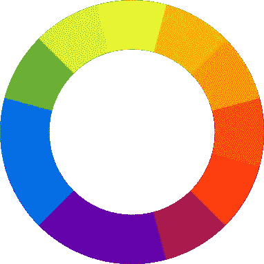
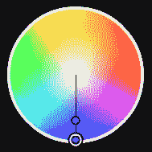
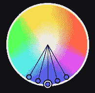
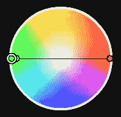
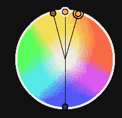
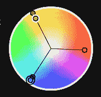
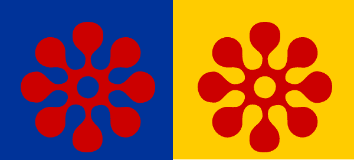

# 设计原则:色彩

> 原文：<https://www.sitepoint.com/principles-of-design-colour/>

在过去的五周里，我写了一些你可以用来改进设计的简单原则，即[对比度](https://www.sitepoint.com/principles-of-design-contrast/)、[接近度](https://www.sitepoint.com/principles-of-design-proximity/)、[平衡](https://www.sitepoint.com/principles-of-good-design-balance/)和[值](https://www.sitepoint.com/principles-of-design-value/)。在这个系列的最后一部分，我们来看看颜色。设计中的色彩本身就是一个巨大的话题，毫无疑问，我会在以后的博客文章中回到这个话题，但是今天，让我们来看看在为你的设计创造气氛时，你如何使用色彩方案。

颜色是我们生活中不可或缺的一部分。大自然用颜色来警告潜在的捕食者，吸引授粉者，吸引配偶，并显示水果可以吃了。任何在城市里开车的人都遵守由红色、绿色和琥珀色定义的交通规则，不需要任何文字。在广告和设计中，色彩被用来以其他方式难以创造的方式抓住注意力和激发兴趣。历史上，颜色被用来表示地位，例如贵族和皇室与紫色联系在一起，在许多国家，颜色是象征的重要来源。

这里有些不太对劲。

那么，你如何为你的设计选择正确的**颜色呢？没有单一的硬性规定，但是色轮是一个很好的开始。**

 ****冷暖**

传统的三原色是红、蓝、黄。当你把这三种颜色结合起来，你就得到三原色:橙色、紫色和绿色。当你把每一种二次色和它相邻的一次色结合起来，你就得到六种三次色:黄橙色、黄绿色、蓝绿色、蓝紫色、红紫色、红橙色。色轮就是这么来的。

上图显示了按光谱顺序排列的颜色:红色、橙色、黄色、绿色、蓝色和紫色(逆时针方向)。红色是最暖的颜色，蓝色是最冷的颜色。暖色调出现在光谱的红色、橙色和黄色一侧，冷色调出现在色轮的相反一侧。

**单色配色方案**

单色配色方案使用单一颜色的**亮度和饱和度的变化。这个方案往往看起来干净，优雅，同时产生一种舒缓的效果。原色可以与诸如黑色、白色或灰色的中性色结合。单色配色方案的缺点是有时会缺乏对比度，看起来不如其他一些方案鲜艳。**

*蓝底单色方案*

****

*红底单色方案*

**类比配色**

类似的配色方案使用色轮上彼此相邻的颜色。一种颜色设置为主色，另一种颜色增加丰富性。缺点也是有时会缺乏对比。

*蓝色底座的类似方案*

**赠送配色**

互补色方案由色轮上彼此相反的两种颜色组成。这个方案在制造强烈的对比和吸引注意力方面非常成功。 **

****

****

***互补方案带淡绿色底座*** 

**拆分互补方案**

分割互补方案是标准互补方案的变体。取色轮上的一种颜色和与其互补色相邻的两种颜色。该方案优于互补方案的优点在于，它可以稍微复杂一点，同时仍然保持强烈的视觉对比度。

*分裂* *互补方案带浅绿色底座*

**三色配色方案**

三色配色方案使用在色轮周围等距分布的三种颜色。它很好地提供了平衡、丰富和对比，尽管没有互补方案那样强烈的对比。

*三元组* *蓝底方案*

**使用这些配色方案的技巧**

1.选择一种比其他颜色用量大的颜色。如果你试图用相同数量的每种颜色，你会得到一个可怕的混乱。选择你的主色或基色，然后用其他颜色来增加趣味性。

池塘旁的[网站使用可爱的深蓝色灰色，配以免费的芥末色文字和高光。](http://www.bythepond.co.uk/)

2.如果颜色看起来太花哨，制服它们。

3.网上有几个创建配色方案的工具，我最喜欢的是 [Kuler](http://kuler.adobe.com) 。它可以让你玩色轮，一键选择这里讨论的配色方案。

4.*更新*黑色、白色和灰色可用于所有这些配色方案。你可以把它们想象成可以和任何颜色搭配的中性色。

所有颜色都受周围颜色的影响。下面的符号左边和右边是相同的红色阴影，但是背景颜色显著地改变了外观。左边的配色方案非常难看，而右边的颜色搭配得很好，给人一种向上的感觉。

**来自大自然的灵感**

如果你正在寻找挑选颜色的灵感和指导，关掉电脑，到外面去。大自然提供了最好的颜色组合。观察动物、植物、鸟类，注意它们令人惊叹的色彩设计。拍下他们的照片，保存在你的停尸房档案里。《色彩爱好者》有一篇关于[蝴蝶配色方案](http://www.colourlovers.com/blog/2007/06/01/colorful-beauty-in-nature-butterflies/)的精彩文章，我过去也写过如何[从 Photoshop 中的照片](https://www.sitepoint.com/make-swatches-from-photos-in-photoshop/)创建调色板，以及如何[从 Kuler 中的绘画创建配色方案](https://www.sitepoint.com/how-to-create-a-color-palette-from-an-image-using-kuler/)。

在设计中使用颜色时需要考虑的事项:

1.你设计中的颜色是搭配得很好还是很难看？背景上的文字很难读吗？

2.对于你想要传达的东西，你的设计是太酷了还是太暖了？你可以用冷色调的小暗示来冷却过热的设计(反之亦然)。

3.你的设计是黑白的吗？如果是这样的话，那么一点颜色实验真的可以让你的设计发挥出最大的潜力。

4.如果你正在设计网页(或设计应用程序)，你有没有想过[颜色如何影响可用性](https://www.sitepoint.com/how-to-boost-usability-with-intelligent-color-choices/)？

色彩理论是一个很大很大的话题，我们将会回来更多次。现在，我希望这是一个有帮助的概述，并且你已经发现关于设计原则的系列是有用的。感谢阅读。

你有挑选颜色的天赋吗？你用什么工具或方法来帮助挑选颜色？** 

## **分享这篇文章**