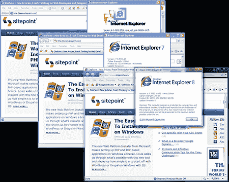

# Windows 7:第一个月回顾，第 2 部分

> 原文：<https://www.sitepoint.com/windows-7-review-2/>

这是微软 Windows 7 第一个月的三部分回顾。在第一部分中，我们讨论了[安装和接口](https://www.sitepoint.com/windows-7-review-1/)。今天，我们关注生产力、软件和安全性。

## 生产力

最好的新生产力特性之一是跳转列表。右键单击任务栏图标或将鼠标悬停在“开始”菜单中的图标上，会显示该应用程序最近打开的文档列表。经常使用的文件可以固定在跳转列表上，以便于访问。

图书馆是另一个很少有人注意到的功能，但是它可以节省时间。本质上，库是相关文件夹的列表。例如，您可以将照片存储在“D:我的图片”和“E:我的相机”中。您可以将这两个位置都添加到“照片”库中，并将其视为一个统一的文件夹进行搜索、存储等。

网络得到了改进，Windows 7 引入了“家庭组”，简化了多台设备之间的文件和打印机共享。对于新手用户来说，这些选项仍然有些令人生畏，但这是朝着正确方向迈出的一步。

我们不能在不讨论可怕的用户账户控制(UAC)的情况下检查生产率。这可能是有史以来引入的最令人恼火的“功能”，Vista 不断地请求允许做任何事情(直到你禁用了这该死的东西)。UAC 仍然在 Windows 7 中，但它的干扰性更小，配置也明显更容易。也许 Windows 7 UAC 并不是一个进步，因为它本来就不应该影响生产力。但对于许多 Vista 用户来说，这是梦想成真。

最后，我们有 XP 模式。对我来说，这是升级的最有说服力的理由之一，因为它允许你运行 IE6 和 IE7(或任何 XP 程序)的真正版本，就像它是一个原生的 Windows 7 应用程序一样。专业版、企业版和终极版用户可获得 XP SP3 的完全授权，易于安装(参见[使用 Windows 7 XP 模式在同一台机器上运行 IE6、IE7 和 IE8](https://www.sitepoint.com/article/ie6-ie7-ie8-win7-xp-mode))。然而，在 Windows 7 Home 上也有可能获得 [XP 模式的许多好处。](https://www.sitepoint.com/ie6-ie7-ie8-windows-7-home/)

## 软件

Windows 7 提供的软件少得惊人。这很好——我真的不需要照片库、MSN Messenger 或所有其他塞满我系统的垃圾。有些人抱怨，但我认为微软回归基本是好的。我相信反垄断监管机构也是如此。

如果你需要，所有的软件都可以从 http://download.live.com/下载。整个系统和 Windows update 中都提供了链接。

对于开发人员来说，Internet Information Server (IIS)仍然是所有版本的 Windows 7 上的一个组件。微软还发布了 [Web 平台安装程序](http://www.microsoft.com/web/Downloads/platform.aspx)，它可以安装和配置各种开发系统，如 PHP、SQL Server Express、Visual Web Developer，以及流行的应用程序，如 WordPress、Joomla 和 Drupal。这招不错。微软似乎正在拥抱使用 Windows 作为开发平台的开源。

Internet Explorer 8.0 在 Windows 7 中仍然无处不在，尽管欧洲用户应该*最终*看到[浏览器投票屏幕](https://www.sitepoint.com/microsoft-windows-browser-ballot/)如果他们保留 IE 作为他们的默认浏览器。投票屏幕问题仍在商定中，但大多数开发人员将在 Windows 首次启动后 10 秒内切换浏览器。

很少有人意识到微软在软件兼容性上走了多远。我还没有发现一个为以前版本的 Windows 编写的应用程序不能工作…尽管我可能比一些人更谨慎。

我唯一的抱怨是缺乏本地 64 位软件。大多数 32 位应用程序都能顺利运行，所以你可以安装 Firefox 和 Microsoft Office。但是，当 32 位软件需要访问具有 64 位驱动程序的设备时，可能会出现问题。例如，Skype 的网络摄像头功能失败，64 位版本的媒体播放器编解码器很少。Java 突出了这种荒谬的情况:根据您想要运行的应用程序，您需要安装 32 位和 64 位运行时。这是一个会让用户困惑的烂摊子，它真的应该在 2009 年之前就解决了。

## 安全性

微软声称 Windows 7 是迄今为止最安全的版本。我没有怀疑。然而，英国安全公司 Prevx 最近表示，由于微软的更新，Windows 7 用户正在经历“黑屏死亡”。自从发现恶意软件是罪魁祸首后，这种说法已经被收回。

很明显，Windows 7 仍然可能被感染。然而，在我看来，反病毒行业对 Windows 安全大吵大闹是因为他们获益最大。恐怖故事和偏执助长了他们的利润。

计算机系统的安全性取决于使用它的人。新手打开每一个电子邮件附件，点击“是”安装每一个软件，无疑会遇到恶意软件和病毒。如果你小心的话，这种情况不会发生:我运行过从 2.0 版开始的所有 Windows 版本，都没有安装常驻内存的防病毒解决方案，而且还没有被感染过。

直到最近，我一直使用轻量级解决方案，如 [ClamWin](http://www.clamwin.com/) 来检查下载文件的完整性。然而，我现在选择了[微软安全基础软件](https://www.sitepoint.com/microsoft-security-essentials-review/)——独立测试显示，它提供了比许多软件更好的安全性，速度足够快，并且不会占用你的硬盘或内存。Windows 7 没有提供 SE，但如果你经常购买杀毒软件，它是值得考虑的。

在我的下一篇文章中，我们将讨论微软和 Windows 的性能和未来。

另请参见:

*   [Windows 7 回顾第 1 部分:安装和接口](https://www.sitepoint.com/windows-7-review-1/)
*   [Windows 7 回顾第 3 部分:性能、未来和总结](https://www.sitepoint.com/windows-7-review-3/)

## 分享这篇文章