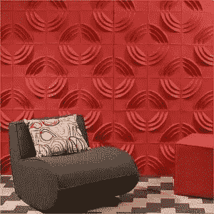
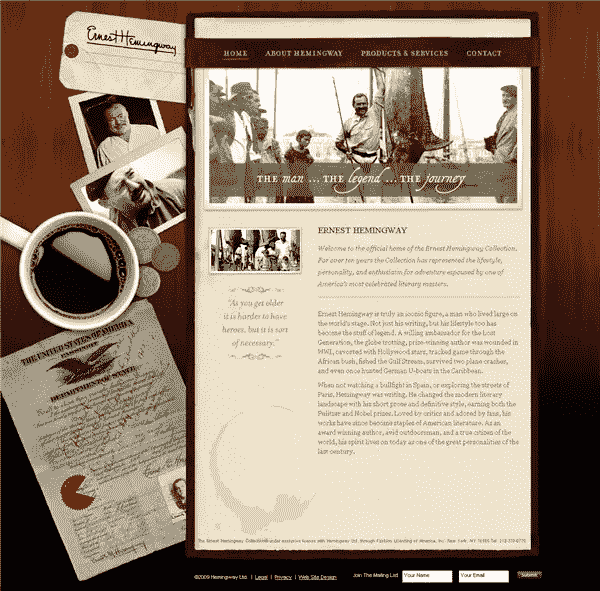
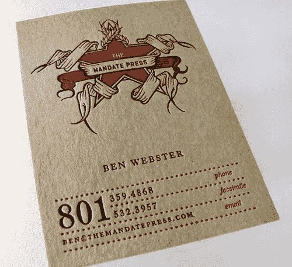

# 设计元素:纹理

> 原文：<https://www.sitepoint.com/elements-of-design-texture/>

接下来是我们系列的第三个设计元素。之前我们看了[线条](https://www.sitepoint.com/elements-of-design-the-line/)和[形状](https://www.sitepoint.com/design-elements-shape/)，以及它们如何被用来增强你的设计和传达信息。今天我们来看看质地。

纹理可以被定义为“通过触觉获得的物体外部表面所具有的特性和引起的感觉。”它倾向于在设计中扮演更多的配角，而不是主角。室内设计是一个例外，设计师在决定房间的颜色和位置时，会密切关注墙壁、地板和家具的纹理。

图片来源:[出色的室内设计](http://www.greatinteriordesign.com/)

显然，纹理更容易在印刷品上创建，因为设计师可以选择设计中使用的纸张、卡片或材料的类型。然而，在网络上，这就有点困难了，因为我们无法实际感受到手中的设计。我们可以通过使用各种材料的背景图像来给人以纹理的印象，例如，石头、纸板和扫描的旧纸或布经常被网页设计师用来给他们的网站带来触觉元素。

在欧内斯特·海明威的网站上，不难想象如果你用手指在“桌子”上滑动会是什么感觉。有带咖啡杯污渍的旧纸、硬币和木制家具。

**纹理支持内容**

就像我们看到的其他设计元素一样，重要的是不要为了使用纹理而使用纹理。只有当它支持你要传达的信息时，才使用它。

在过去的一两年里，人们对凸版印刷产生了极大的兴趣。凸版印刷会在纸上留下明显的印象，因为它是用热金属模铸来把油墨印在纸上的。看这张来自[授权出版社](http://themandatepress.com/)的名片，光看一眼就几乎能感觉到纸上的凹槽。

那个[我拍他是因为我爱他](http://ishothim.com/)网站(爱那个名字)有一个微妙的纹理背景。美丽的线条画增加了额外的纹理，一点阴影将人物从页面上抬起。

**纹理使用指南**

1.纹理是否适合信息？它支持这个信息吗？如果你的网站或宣传册是为 12 岁以下的芭蕾舞学校设计的，那么溅满鲜血、被腐蚀的金属背景可能不合适。

2.纹理不限于背景。使用图片，无论是照片还是插图，展示彼此形成鲜明对比的元素。使用强烈对比的字体，如粗糙、扭曲的字体，使用平滑、优雅的字体。

3.记住纹理是用在配角身上的，它不应该是这部剧的主角。

**相关阅读:**

*   [设计元素:线](https://www.sitepoint.com/elements-of-design-the-line/)
*   [设计元素:形状](https://www.sitepoint.com/design-elements-shape/)
*   [主要设计元素，新系列](https://www.sitepoint.com/the-primary-design-elements-a-new-series/)

## 分享这篇文章