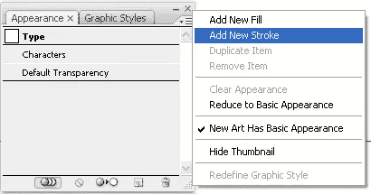
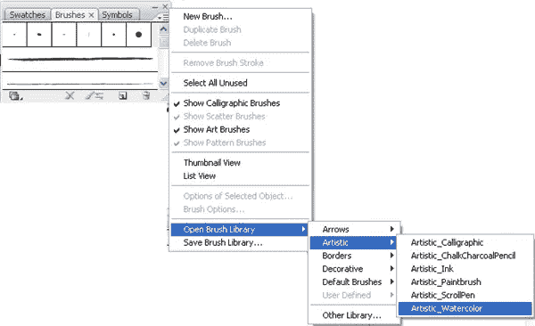
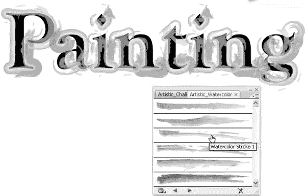
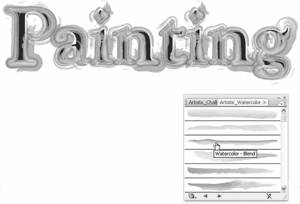
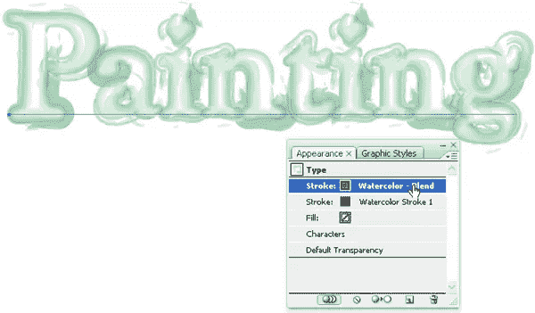
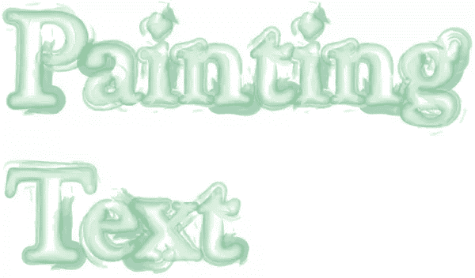

# 在 Illustrator 中创建绘画文本效果

> 原文：<https://www.sitepoint.com/create-a-painted-text-effect-in-illustrator/>

Adobe Illustrator 允许您为对象添加额外的填充和描边。我们现在要利用这一点来创造水彩文字的印象。最棒的是，应用效果后，文本仍可编辑。让我们开始吧。

1.在 Illustrator 中，创建一个新文档并添加一些文本。我用的是古迪旧风格的衬线字体。此时选择什么颜色并不重要，因为我们将在几个步骤中关闭颜色。实际上是我们要添加的笔画颜色造成了差异。

2.使用选择工具(黑色箭头)选择文本。然后打开外观调色板(Shift + F6)。

3.在“外观调板”弹出菜单中，选择“添加新笔画”。虽然我们可以使用工具栏上的颜色选择器为文本添加一种笔画颜色，但是为了达到这种效果，我们需要使用外观调色板添加一种笔画。

4.打开画笔调板，从调板菜单中选择“打开画笔库”>“艺术”>“艺术水彩”。

艺术水彩画笔在单独的调色板中打开。

5.确保新的笔触仍然在外观调色板中被选中，然后点击画笔调色板中的水彩笔触 1。

6.在外观调色板上，再次从调色板菜单中选择添加新描边。

7.在“外观”调板中选择新笔画后，从“画笔”调板中选择“水彩混合”。

开始看起来又好看又乱还手绘了。现在我们需要隐藏我们的原始文本。

8.双击文本将其全部选中。然后在工具栏的颜色选择器上，将文本的填充颜色设置为无。您应该会得到类似这样的结果。

9.如果要更改文本的颜色，首先要确保使用选择工具选择了文本。然后在外观调色板中的笔画上单击一次，然后使用色板或调色板更改颜色。这里我用了两种不同的绿色。

仅此而已。正如我在开始时提到的，真正酷的事情是文本仍然是可编辑的，所以你可以改变你已经拥有的或者添加更多具有相同外观的文本。

## 分享这篇文章