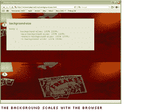
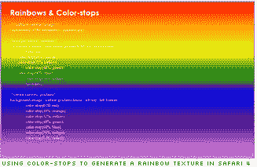

# CSS3:通向无限和更远！

> 原文：<https://www.sitepoint.com/css3-infinity-beyond/>

让我们面对现实吧。Mozilla 发布了很多 alpha、nightlies 和开发者版本，所以如果你忽略了上个月的产品——火狐 3.6 alpha——你可能会被原谅。

然而，这一次网络极客们确实有一些值得关注的理由。除了其他优点之外，新增加的功能包括支持:

*   `-moz-background-size`属性
*   多个背景图像
*   `rem`长度单位
*   CSS 渐变
*   改进的`display:table`渲染

现在让我们澄清一下，这个*是*一个 alpha 版本，只会被一小部分 Firefox 用户使用。尽管如此，它确实提高了我们在年底前在标准 Firefox 版本中看到这些特性的可能性。

所以，让我们仔细看看几个引人注目的功能。

#### 多个背景图像

虽然当 Mozilla 第一次推出[-moz-border-radius](https://developer.mozilla.org/en/CSS/-moz-border-radius)-为您提供简单的 CSS 圆角-时产生了一些反响，但我个人记得当时发现效果有点令人印象深刻。

对我来说，多张背景图片的概念一直都是杀手级的特性——允许我们用布局*做一些很棒的技巧，而不需要多余的标记。*

基本语法是显而易见的。不是为背景图像属性列出单个图像源，而是最多列出四个逗号分隔的图像。

您还可以为各自的`background-repeat`和`background-position`属性指定最多四个值:

```
#multi {  
  background-image:url(paper.png), url(paper2.jpg);  
  background-repeat: no-repeat, no-repeat;  
  background-position: top left, bottom right;  
}
```

我不得不说，我*确实*发现堆叠顺序有点违背直觉。第二个列出的图像将*放在第一个图像的*下面，依此类推。但是只要你意识到这一点，就没有问题。


那么，目前有哪些浏览器支持这个功能呢？

目前，只有 Safari 4.0、Chrome 3.0 和 Firefox 3.6 alpha(雷区)完全支持多幅背景图片。您可以通过将任何一个浏览器指向以下 URL 来查看我的示例:

[https://www.sitepoint.com/examples/css3/multi.html](https://www.sitepoint.com/examples/css3/multi.html)

那么，这在今天是否值得使用呢？

我将这段代码发送到其他浏览器时遇到的第一个问题是，它们拒绝只获取第一张图片而忽略其他图片。在那些浏览器中，逗号足以杀死整个声明，让背景空白。

然而，我发现(向 [@shaynet](http://www.twitter.com/shaynet) 点头)只要你第一次以标准的单一图像格式声明背景图像，Opera 和 Firefox 和 Safari 的旧版本完全可以忽略后面任何更新的 CSS 代码。

虽然 Internet Explorer 拒绝配合，但我们可以自由地使用条件注释向 IE 发送更简单的单图像代码，如下所示:

```
<!--[if IE]> 
<style type="text/css"> 
#multi { 
  background-image: url(old-paper2.jpg);  
  background-repeat: no-repeat; 
  background-position: top left; 
} 
</style> 
<![endif]-->
```

简而言之，我认为这个特性在今天是有用的和值得的，但是你*将*需要小心谨慎地使用它。

确保你的设计能很好地与旧浏览器兼容(毕竟，你并没有比以前更糟)，但要为使用这些新浏览器的越来越多的用户注入一层额外的丰富性。现在是开始实验的时候了。

#### 背景尺寸

正如你可能猜到的，`background-size`允许你缩放你正在使用的 CSS 背景图片。



目前`background-size`缺乏对其纯 CSS3 格式的支持，但 Opera、Chrome/Safari 和 Firefox 3.6 alpha 都通过自己的定制标记支持它。

该标记如下所示:

```
body { 
  background-image: url(background_image.jpg); 
  background-size: 50% 50%; /* w3c spec */ 
    -moz-background-size: 50% 50%; /* firefox css*/ 
    -webkit-background-size: 50% 50%; /* safari/chrome */ 
    -o-background-size: 50% 50%; /* opera css */ 
}
```

如果你正在使用这些浏览器中的任何一个，你可以[在这里](https://www.sitepoint.com/examples/css3/css3-background-size.html)看到运行中的代码。

那么，我们现在可以用这个吗？

同样，简短的回答是肯定的。像这样的专有控件总是会被其他浏览器忽略，所以使用它没有技术问题。

对我来说，只是不太清楚我想在哪里使用这个属性，因为重新缩放过程很少对图像友好。

所以，如果你能使用这个功能模拟出一个有吸引力的例子，我想看看你的工作。

#### CSS 渐变

CSS 背景渐变功能在我看来是最可行的新功能，尽管目前只有 Firefox alpha、Safari 4 和 Chrome 3 浏览器支持它。

像`background-size`代码一样，这是特定于浏览器的代码，尽管每个团队都为标准的`background-image`引入了一个新值，而不是创建一个全新的 CSS 属性。

最简单地说，它看起来有点像这样:

```
div#cssgradient2 { 
  background-image: -moz-linear-gradient(top, bottom,from(#A1D004),to(#6B9A00)); 
  background-image: -webkit-gradient(linear, left top, left bottom,color-stop(0.00, #A1D004),color-stop(1.00, #6B9A00)); 
}
```

正如你在上面看到的，Mozilla (Firefox)和 WebKit (Safari/Chrome)的代码是相似的，但不完全相同。两者都需要渐变的开始和结束颜色，以及方向坐标(即上、左、右、下等)。

虽然 WebKit 和 Mozilla 都可以进行径向和线性渐变，但它们处理过程略有不同。Mozilla 喜欢使用两个独立的属性值(即`-moz-linear-gradient()`和`-moz-radial-gradient()`)，而 WebKit 使用一个带有额外参数的属性值(例如，`-webkit-gradient(radial,...)`)。

为了简单起见，我今天将坚持使用[线性渐变](https://www.sitepoint.com/examples/css3/gradient.html)。

虽然 CSS 渐变总是需要至少两种颜色才能工作，但这两种方法都允许您设置渐变将通过的多种颜色路径点。

彩虹渐变的语法如下所示:

```
/* fallback */ 
background: #F66 url(rainbow-gradient.jpg); 

/*mozilla gradient*/ 
background-image: -moz-linear-gradient(left, right, 
  from(red), 
  color-stop(16%, orange), 
  color-stop(32%, yellow), 
  color-stop(48%, green), 
  color-stop(60%, blue), 
  color-stop(76%, indigo), 
  to(violet)); 

/* webkit gradient */ 
background-image: -webkit-gradient(linear, 
  left top, left bottom, 
  color-stop(0.00, red), 
  color-stop(16%, orange), 
  color-stop(32%, yellow), 
  color-stop(48%, green), 
  color-stop(60%, blue), 
  color-stop(76%, indigo), 
  color-stop(1.00, violet));
```



有趣的是，IE 也可以使用自 IE5 时代就存在的滤镜属性来处理简单的渐变(不包括彩虹)。

IE 友好的语法如下所示:

```
filter: progid:DXImageTransform.Microsoft.gradient( 
  enabled='true', 
  startColorstr=#A1D004, 
  endColorstr=#6B9A00, 
  GradientType=0 
); 
There are two things you need to know about this code.首先，是的，它很难看，但你可以看到开始和结束的颜色被设置。
其次，信不信由你，模糊的`GradientType`参数事实上设定了你的渐变方向。将垂直渐变设置为 0，水平渐变设置为 1。据我所知，在 IE 中用这个滤镜是不可能做对角线渐变或者颜色停止的。
在我看来，使用 CSS 渐变有三个真正的吸引力。

1.  与图像不同，CSS 渐变与包含它们的元素成比例缩放，允许它们根据内容的数量进行扩展和收缩。

3.  CSS 渐变非常有效，只需几行代码就可以生成大的、灵活的、有纹理的色调区域。这直接转化为用户更快的页面加载时间。

5.  在很多情况下，用户出于安全或带宽原因可能会阻止图像。CSS 渐变将越来越多地给你复杂的色调，图像不能去或不想要的地方——可以说最重要的是，在 iPhone 的 Safari 上。


那么，我们现在可以使用它吗？
同样，只要你明智，答案是肯定的。
显然，最新版本的 Safari、Chrome 和 Firefox 都有很好的渐变支持。IE 提供了过得去的渐变支持。这代表了在该功能被引入 Firefox 主版本之前，浏览器市场的大约一半。
剩下的浏览器可以被赋予一个普通的背景图像，这正是你现在处理渐变的方式。
摘要
反对使用新的浏览器功能是很容易的——总是为时过早，技术还太年轻。然而，你需要使用任何工具来变得熟练，渐变和多重背景将是前端开发人员在未来几年的生计。
我想游戏时间现在开始了。

```

## 分享这篇文章