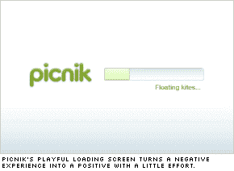
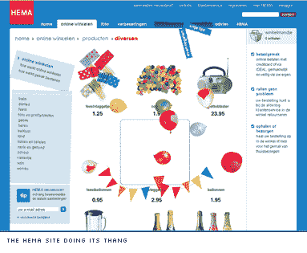
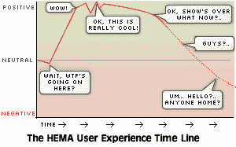

# 如果糖衣很惊艳还需要蛋糕吗？

> 原文：<https://www.sitepoint.com/do-you-need-cake-if-the-icing-is-amazing/>

一年多以前，我报道了安迪·巴德在 Web Directions UX08 的演讲，以及他对评估和衡量用户体验的想法。

他还谈到了通过注入一些乐趣、灵魂甚至人性来为一些空洞、平凡但必要的网站流程(即加载屏幕、错误消息、用户说明)增加价值。

我们谈到的例子包括:

1.  [Picnik](http://www.picnik.com/) 的加载器屏幕，并配有进度解说:“*铺开毯子…采摘蓝莓…放风筝…做三明治…* ”
2.  *天真无邪的冰沙* s 包装，里面有简单的
    一句话[别再看我的
    屁股了！](http://www.flickr.com/photos/duncan/2084134925/)”印在盒子的底座上。

两者都是更好的用户体验的典范，因为它们断然拒绝遵循标准的乏味惯例，而是敢于注入一丝温暖。

但是，如果你向用户提供的只是“温暖的模糊”，会发生什么呢？还算赢吗？

在一个朋友发给我一条“【to】嘿，你一定要看看这个”之后，我一直在思考这个问题。”链接到 [HEMA](http://producten.hema.nl/) 网站。对于那些不熟悉品牌名称的人来说，HEMA 是一家大型荷兰连锁百货商店。

[如果你喜欢的话，可以亲自去看看这个网站](http://producten.hema.nl)(假设你以前还没见过它——它已经上线至少 18 个月了)。

否则，这里是执行摘要:该网站呈现为一个普通的、类似宜家的在线商店:顶部有导航标签，流行产品显示在一个网格中。打哈欠。打哈欠。

这时候，现实似乎打破了，奇怪和美妙的事情开始发生。

当一个塑料杯翻倒，碰到胶带，多米诺骨牌效应就开始了。然后胶带撞在订书机上，然后压扁蛋糕，嘈杂地滑下木琴，像九柱戏一样打翻荧光笔。

这一连串的闹剧还在继续，把熨衣板、搅拌机、溜溜球、衣架和水壶卷入了越来越大的漩涡，最后变成了网站导航和文本的一部分。

当这一系列事件全部结束时，标签已经被撕破和磨损，导航文本已经塌陷成一滩烂泥，上面的纸屑四处飞舞。非常非常可爱。

现在，让我直截了当地说，这是一个完美执行的好主意。它打破界限，给你带来快乐，把你从冲浪的麻木中摇醒，并得意洋洋地喊道:“嘿，你！你知道吗？我们不一样！”

太棒了。

唯一的问题是，我认为对于大多数用户来说，这种关系到此为止。这不是一个标准网上商店的复活节彩蛋或恶作剧。虽然 [HEMA 有一个相当大的网站](http://www.hema.nl/)，但它和这个流行的网上恶作剧没有明显的联系。这个标志是不可点击的。网站导航和文本链接看起来是可点击的，但事实上不是。

无论演出结束后你会留下什么温暖而模糊的感觉，除了转发给朋友，没有什么方法可以表达你的爱。

Andy Budd 谈到了将用户体验绘制成一个时间线上的图表。我们可以假设用户在相对中性的情绪状态下开始他们的 HEMA 网站体验。随着体验的继续，他们可能会先是惊讶，然后是高兴和娱乐。

但是，如果你想:

*   告诉 HEMA 他们的网站有多棒？
*   访问 HEMA 的 *About* 页面，看看什么样的
    煽动者、思维创新的公司会做出如此疯狂的事情？
*   找到最近的商店来购买他们迷人而有趣的产品？
*   在一家看似有趣的公司调查就业机会？

嗯，你可能不太走运。除了编辑地址栏，当插科打诨结束时，节目就结束了。

最大的讽刺是？HEMA 笑话网站 T1 在博客和社交网络上非常受欢迎，以至于在几乎所有的 T4 普通网站 T5、T6、T7、T8 和 T9 搜索中，它的排名都超过了 T2 的正版 HEMA 网站 T3。在谷歌眼里，HEMA 是一个好笑话的提供者。

现在，毫无疑问，像我们这样的网络开发人员已经永远分享了这个链接和“哦哦哦”了。事实上，我们大多数人都喜欢这种有趣的工作。

尽管这部动画非常聪明，但我不得不怀疑，这个项目以及它所引起的轰动，是否已经转化为对 HEMA 商业特别有用的东西。

更重要的是，我想知道有多少用户因为找不到一些基本的“面包和黄油”,如定位商店、给出反馈或问问题，而感到失望、沮丧或困惑。他们可能觉得自己来对了地方，但没人想和他们说话。

你怎么看？这是营销上的高明还是浪费了机会？

来自 SitePoint 设计视图#63。

## 分享这篇文章