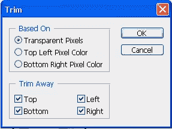
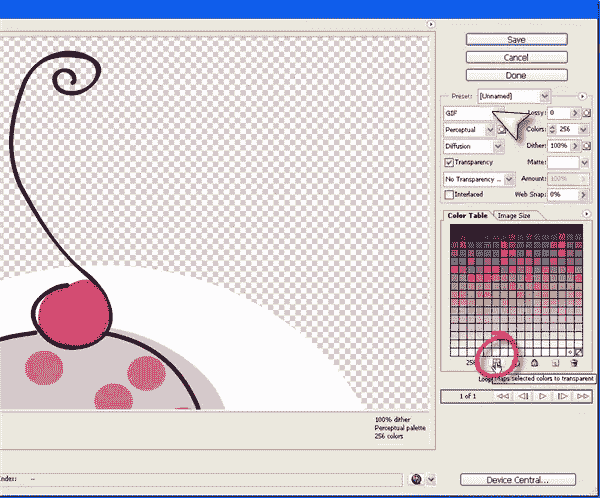
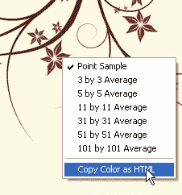

# Photoshop 网页图形技巧

> 原文：<https://www.sitepoint.com/photoshop-web-graphics-tips/>

每周，我都会发布一些小技巧来帮助你加快在 Photoshop 中的工作流程。今天，我有三个技巧来帮助你创建网页图片。

**用修剪命令**关闭裁剪

当你为网页设计和创建图形时，通常你必须在质量和文件大小之间找到一个平衡点。为了从文件大小中挤出最后一滴，您可以使用 Photoshop Trim 命令来裁剪非常接近的内容。

打开图像后，选取“图像”>“修剪”。

这将打开“修剪”对话框，您可以在其中决定如何完成修剪。Photoshop 会通过查看图像左上角或右下角的颜色并向下裁剪直到遇到另一种颜色，来切掉尽可能多的像素。如果背景是纯色的，那么当您为 web 创建基于文字的图像时，Trim 可以很好地工作。

**创造透明度的简单方法**

最简单的方法是删除图层面板中的背景图层，保留背景图层上面的任何东西。

然而，有另一种方法可以做到这一点，保持背景层完整。当您对 web 图形满意时，请选取“文件”>“存储为 Web 和设备所用格式”。在打开的对话框中，从“选择吸管”工具中选择 GIF 或 PNG，然后在图像上单击要使其透明的颜色。点击右下方的颜色表，然后点击将选定的颜色映射为透明(这是表中颜色样本下左边的第一个图标，瞧，你有一个透明的背景。

 **用滴管**提取十六进制色码

如果您在 Photoshop 中处理图像，并且想要在 web 设计中使用一些颜色，可以使用吸管工具提取 HTML 十六进制代码。

选择吸管工具(I)，然后右键单击(PC)或按住 Ctrl 单击(Mac)图像。出现一个下拉菜单，您可以选择将颜色复制为 HTML。这会将代码保存到剪贴板，然后你可以将它粘贴到你的 HTML 编辑器中。

****

这就是了。三个小技巧可以帮助你在创建网页图片时加快工作流程。

你还有什么其他的 Photoshop 网页技巧？

**相关阅读**

*   [三个节省时间的 Photoshop 技巧](https://www.sitepoint.com/time-saving-photoshop-tips/)
*   [如何在 Photoshop 中调整图像大小并保持清晰](https://www.sitepoint.com/resize-an-image-in-photoshop/)
*   [如何从一个简单的 Photoshop 笔刷中获得更多的东西](https://www.sitepoint.com/photoshop-brush-palette/)
*   [五个 Photoshop 图层速度技巧](https://www.sitepoint.com/five-photoshop-layers-speed-tricks/)
*   [如何在 Photoshop 中设置布局网格](https://www.sitepoint.com/how-to-setup-a-layout-grid-in-photoshop/)
*   [五个 Photoshop 类型的速度提示](https://www.sitepoint.com/five-photoshop-type-speed-tips/)

## 分享这篇文章