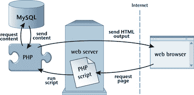
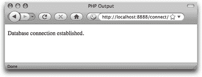
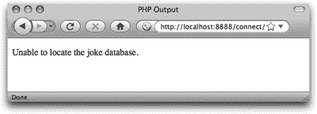
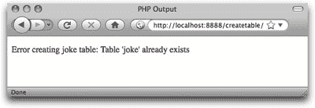
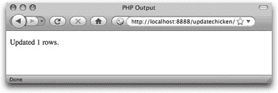
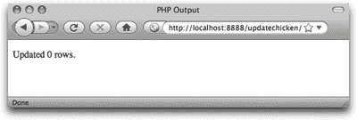
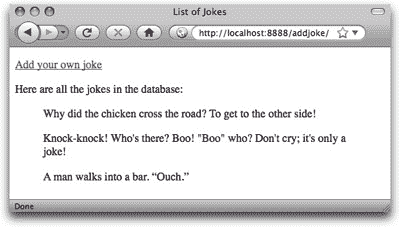
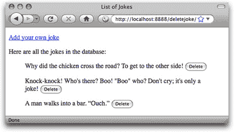

# 使用 PHP 和 MySQL 构建自己的数据库驱动网站，第 4 部分:在 Web 上发布 MySQL 数据

> 原文：<https://www.sitepoint.com/publishing-mysql-data-web/>

这就是你注册的东西！在这一章中，你将学习如何获取存储在 MySQL 数据库中的信息，并将其显示在网页上供所有人查看。

到目前为止，您已经[安装了](https://www.sitepoint.com/article/php-amp-mysql-1-installation/)，并学习了关系数据库引擎 MySQL 和服务器端脚本语言 [PHP](https://www.sitepoint.com/article/mysql-3-getting-started-php/) 的[基础知识。现在您已经准备好学习如何使用这些新工具来创建一个真正的数据库驱动的网站！](https://www.sitepoint.com/article/getting-started-mysql/)

如果你想离线阅读本教程，你可以[下载 PDF 格式的章节](https://www.sitepoint.com/books/phpmysql4/samplechapters.php)。

##### 大局

在我们跃进之前，有必要后退一步，清楚地了解我们的最终目标。我们有两个强大的工具:PHP 脚本语言和 MySQL 数据库引擎。重要的是要理解它们是如何结合在一起的。

数据库驱动的网站的整体思想是允许网站的内容驻留在数据库中，并允许从数据库中动态地提取内容，以创建网页，供人们使用常规的 web 浏览器查看。因此，在系统的一端，有一个访问者使用 web 浏览器请求一个页面，并期望得到一个标准的 HTML 文档作为回报。另一端是站点的内容，位于 MySQL 数据库的一个或多个表中，只知道如何响应 SQL 查询(命令)。



如上图所示，PHP 脚本语言是两种语言的中间人。它处理页面请求并从 MySQL 数据库获取数据(使用 SQL 查询，就像您在[第 2 章:MySQL 简介](https://www.sitepoint.com/article/getting-started-mysql/)中用来创建笑话表的查询一样)，然后动态地将数据作为浏览器所期望的格式良好的 HTML 页面输出。

请记住，当一个人访问您的数据库驱动的网站上的一个页面时，会发生以下情况:

*   访问者的 web 浏览器使用标准 URL 请求网页。
*   web 服务器软件(通常是 Apache)识别出请求的文件是一个 PHP 脚本，因此服务器启动 PHP 解释器来执行文件中包含的代码。
*   某些 PHP 命令(这将是本章的重点)连接到 MySQL 数据库并请求属于网页的内容。
*   MySQL 数据库通过向 PHP 脚本发送请求的内容来做出响应。
*   PHP 脚本将内容存储到一个或多个 PHP 变量中，然后使用 echo 语句将内容作为 web 页面的一部分输出。
*   PHP 解释器最后将它创建的 HTML 副本传递给 web 服务器。
*   web 服务器将 HTML 像普通的 HTML 文件一样发送到 web 浏览器，只是页面不是直接来自 HTML 文件，而是由 PHP 解释器提供的输出。

##### 用 PHP 连接到 MySQL

在从 MySQL 数据库中检索内容以包含在网页中之前，您必须知道如何从 PHP 脚本内部建立到 MySQL 的连接。回到[第 2 章:mysql 简介](https://www.sitepoint.com/article/getting-started-mysql/)，您使用了一个名为 MySQL 的程序，它允许您从命令提示符建立这样的连接。正如该程序可以直接连接到正在运行的 MySQL 服务器，PHP 解释器也可以；对连接 MySQL 的支持是以内置函数库的形式内置到语言中的。

内置函数`mysqli_connect`建立到 MySQL 服务器的连接:

```
mysqli_connect(hostname, username, password)
```

你可能还记得《第三章:PHP 简介》【that PHP 函数在被调用时通常会返回值。例如，`mysqli_connect`函数返回一个链接标识符，用于标识已经建立的连接。既然我们打算利用这种联系，我们就应该坚持这种价值观。以下是我们如何连接到 MySQL 服务器的示例:

```
$link = mysqli_connect('localhost', 'root', 'password');
```

如上所述，对于您的 MySQL 服务器，三个函数参数的值可能不同；至少，您需要替换您为 MySQL 服务器建立的 root 密码。这里需要注意的是，`mysqli_connect`返回的值存储在一个名为`$link`的变量中。

由于 MySQL 服务器是一个完全独立于 web 服务器的软件，我们必须考虑到由于网络中断或您提供的用户名/密码组合被服务器拒绝而导致服务器不可用或不可访问的可能性。在这种情况下，`mysqli_connect`函数返回`FALSE`，而不是连接标识符，因为没有建立连接。这允许我们使用`if`语句对这种失败做出反应:

```
$link = mysqli_connect('localhost', 'root', 'password'); 

if (!$link) 

{ 

  $output = 'Unable to connect to the database server.'; 

  include 'output.html.php'; 

  exit(); 

}
```

当`$link`的值为 false 时(即连接尝试失败时)，该 if 语句中的条件使用 not 运算符(`!`)使条件为真。如果连接成功，`$link`将有一个被认为是真的值，这将使`!$link`为假。简而言之，`if`语句的主体只有在连接失败时才会被执行。

在`if`语句的主体中，我们设置变量`$output`来包含一条关于出错原因的消息。然后我们包括模板`output.html.php`。这是一个通用模板，它只输出`$output`变量的值:

```
<!DOCTYPE html PUBLIC "-//W3C//DTD XHTML 1.0 Strict//EN" 

    "https://www.w3.org/TR/xhtml1/DTD/xhtml1-strict.dtd"> 

<html  xml:lang="en" lang="en"> 

  <head> 

    <title>PHP Output</title> 

    <meta http-equiv="content-type" 

        content="text/html; charset=utf-8"/> 

  </head> 

  <body> 

    <p> 

      <?php echo $output; ?> 

    </p> 

  </body> 

</html>
```

最后，在输出消息后，`if`语句的主体调用内置的`exit`函数。

```
exit is the first example in this book of a function that can be called with no parameters. When called this way, all this function does is cause PHP to stop executing the script at this point. This ensures that the rest of the code in our controller (which in most cases will depend on a successful database connection) will not be executed if the connection has failed.然而，假设连接成功，您需要在使用之前对其进行配置。正如我在[第 3 章:PHP 简介](https://www.sitepoint.com/article/mysql-3-getting-started-php/)中简单提到的，你应该在你的网站上使用 UTF-8 编码的文本，以最大化用户在网站上填写表单时可以使用的字符范围。默认情况下，当 PHP 连接到 MySQL 时，它再次使用更简单的 ISO-8859-1 编码，而不是 UTF-8。因此，您必须调用另一个内置 PHP 函数`mysqli_set_charset`来跟踪`mysqli_connect`代码:

```
mysqli_set_charset($link, 'utf8')
```

注意，我们使用包含 MySQL 链接标识符的`$link`变量来告诉函数使用哪个数据库连接。该函数成功时返回 true，出错时返回 false。同样，谨慎的做法是使用 if 语句来处理错误:

```
if (!mysqli_set_charset($link, 'utf8')) 

{ 

  $output = 'Unable to set database connection encoding.'; 

  include 'output.html.php'; 

  exit(); 

}
```

注意，这一次，我没有将函数的结果赋给变量，然后检查变量是真还是假，而是简单地使用函数调用本身作为条件。这可能看起来有点奇怪，但这是一个非常常用的快捷方式。为了检查条件是真还是假，PHP 执行函数，然后检查它的返回值——这正是我们需要发生的。
就像在[第 2 章:介绍 MySQL](https://www.sitepoint.com/article/getting-started-mysql/) 中一样，当你使用 MySQL 程序连接到 MySQL 服务器时，一旦你建立了连接，通常下一步就是选择你想要使用的数据库。假设您想使用您在《第 2 章:MySQL 简介》中创建的笑话数据库。这个数据库叫做`ijdb`。在 PHP 中选择该数据库只是另一个函数调用的问题:

```
mysqli_select_db($link, 'ijdb');
```

```
mysqli_select_db simply sets the selected database ('ijdb') for the specified database connection ($link). Yet again, it's best to guard against errors with an if statement:

```
if (!mysqli_select_db($link, 'ijdb')) 

{ 

  $output = 'Unable to locate the joke database.'; 

  include 'output.html.php'; 

  exit(); 

}
```

为了完善这个例子，让我们显示一条状态消息，表明什么时候一切正常。这是我们控制器的完整代码:

```
<?php 

$link = mysqli_connect('localhost', 'root', 'password'); 

if (!$link) 

{ 

  $output = 'Unable to connect to the database server.'; 

  include 'output.html.php'; 

  exit(); 

} 

if (!mysqli_set_charset($link, 'utf8')) 

{ 

  $output = 'Unable to set database connection encoding.'; 

  include 'output.html.php'; 

  exit(); 

} 

if (!mysqli_select_db($link, 'ijdb')) 

{ 

  $output = 'Unable to locate the joke database.'; 

  include 'output.html.php'; 

  exit(); 

} 

$output = 'Database connection established.'; 

include 'output.html.php'; 

?>
```

在您的浏览器中启动这个示例(如果您将`index.php`和`output.html.php`文件放在 web 服务器上名为 connect 的目录中，URL 将类似于`http://localhost/connect/`)。如果您的 MySQL 服务器已经启动并运行，并且一切正常，您应该会在下图中看到指示成功的消息。

如果 PHP 无法连接到您的 MySQL 服务器，或者如果您提供的用户名和密码不正确，您将看到与下图类似的屏幕。为了确保您的错误处理代码正常工作，您可能想要故意拼错您的密码以进行测试。

 ***什么 PHP 错误？***
根据你的网络服务器的 PHP 配置，你可能会看到也可能看不到上图中的第一段。如果 PHP 被配置为显示错误，这个警告消息是由 PHP 自动生成的。这些详细的错误可能是在开发过程中诊断代码问题的无价工具。因为一旦你的站点在 Web 上运行，你可能更喜欢隐藏这种技术信息，所以在产品服务器上关闭这些错误是很常见的。
如果您自己安装了 Apache，可能会显示这条消息。如果您使用的是捆绑的 Apache 解决方案(如 WampServer 或 MAMP)，PHP 错误显示可能会默认关闭。要显示这些错误(当您试图确定问题的原因时，它们在开发中特别有用)，您需要打开服务器的`php.ini`文件，并将`display_errors`选项设置为`On`。您可以从系统托盘菜单中访问 WampServer 的`php.ini`文件。MAMP 的`php.ini`文件在你系统的`/Applications/MAMP/conf/php5`文件夹里。
如果 PHP 连接到您的 MySQL 服务器，然后找不到`ijdb`数据库，您将会看到类似于图 4.4 的消息，“连接失败”。同样，您可能应该通过故意拼错数据库名称来测试您的错误处理代码。

建立连接并选择数据库后，就可以开始使用存储在数据库中的数据了。
 *** PHP 自动断开*** 
*您可能想知道脚本执行完毕后，与 MySQL 服务器的连接会发生什么。虽然 PHP 确实有一个从服务器断开连接的功能(`mysqli_close`)，但是当不再需要时，PHP 会自动关闭任何打开的数据库连接，所以你通常可以让 PHP 在你之后清理。*

##### 用 PHP 发送 SQL 查询

在[第 2 章:mysql 简介](https://www.sitepoint.com/article/getting-started-mysql/)中，我们使用一个名为 MySQL 的程序连接到 MySQL 数据库服务器，该程序允许我们键入 SQL 查询(命令)并立即查看这些查询的结果。在 PHP 中，也存在类似的机制:`mysqli_query`函数。

```
mysqli_query(link, query)
```

这里的 query 是一个字符串，包含您要执行的 SQL 查询。与`mysqli_select_db`一样，您还必须提供由`mysqli_connect`返回的 MySQL 链接标识符。

该函数返回的内容取决于发送的查询类型。对于大多数 SQL 查询，`mysqli_query`返回 true 或 false，分别表示成功或失败。考虑下面的例子，它试图创建我们在第 2 章“MySQL 简介”中创建的`joke`表:

```
$sql = 'CREATE TABLE joke (  

      id INT NOT NULL AUTO_INCREMENT PRIMARY KEY,  

      joketext TEXT,  

      jokedate DATE NOT NULL  

    ) DEFAULT CHARACTER SET utf8';  

if (!mysqli_query($link, $sql))  

{  

  $output = 'Error creating joke table: ' . mysqli_error($link);  

  include 'output.html.php';  

  exit();  

}  

$output = 'Joke table successfully created.';  

include 'output.html.php';
```

注我们再次使用相同的 if 语句技术来处理查询可能产生的错误。这个例子还使用了`mysqli_error`函数从 MySQL 服务器中检索详细的错误消息。例如，下图显示了当`joke`表已经存在时显示的错误。



对于`DELETE`、`INSERT`和`UPDATE`查询(用于修改存储的数据)，MySQL 还跟踪受查询影响的表行(条目)的数量。考虑下面的 SQL 命令，我们在[第 2 章:介绍 MySQL](https://www.sitepoint.com/article/getting-started-mysql/) 中使用它来设置所有包含单词“鸡”的笑话的日期:

```
$sql = 'UPDATE joke SET jokedate="2010-04-01"  

    WHERE joketext LIKE "%chicken%"';  

if (!mysqli_query($link, $sql))  

{  

  $output = 'Error performing update: ' . mysqli_error($link);  

  include 'output.html.php';  

  exit();  

}
```

当我们执行这个查询时，我们可以使用`mysql_affected_rows`函数来查看受这个更新影响的行数:

```
$output = 'Updated ' . mysqli_affected_rows($link) . ' rows.';  

include 'output.html.php';
```

下图显示了该示例的输出，假设您的数据库中只有一个“鸡”笑话。



如果刷新页面以再次运行相同的查询，您应该会看到如下图所示的消息变化，表明没有行被更新，因为应用于笑话的新日期与现有日期相同。



```
SELECT queries are treated a little differently as they can retrieve a lot of data, and PHP provides ways to handle that information.处理`SELECT`结果集

对于大多数 SQL 查询，`mysqli_query`函数要么返回 true(成功),要么返回 false(失败)。对于`SELECT`查询，需要更多信息。您还记得`SELECT`查询用于查看数据库中存储的数据。除了指示查询是成功还是失败，PHP 还必须接收查询的结果。因此，当它处理一个`SELECT`查询时，`mysqli_query`返回一个结果集，其中包含查询返回的所有行(条目)的列表。如果查询因任何原因失败，仍会返回 false:

```
$result = mysqli_query($link, 'SELECT joketext FROM joke');  

if (!$result)  

{  

  $error = 'Error fetching jokes: ' . mysqli_error($link);  

  include 'error.html.php';  

  exit();  

}
```

和以前一样，使用一个非常简单的 PHP 模板显示错误:

```
<!DOCTYPE html PUBLIC "-//W3C//DTD XHTML 1.0 Strict//EN"  

    "https://www.w3.org/TR/xhtml1/DTD/xhtml1-strict.dtd">  

<html  xml:lang="en" lang="en">  

  <head>  

    <title>PHP Error</title>  

    <meta http-equiv="content-type"  

        content="text/html; charset=utf-8"/>  

  </head>  

  <body>  

    <p>  

      <?php echo $error; ?>  

    </p>  

  </body>  

</html>
```

假设在处理查询时没有遇到错误，上面的代码会将结果集存储到变量`$result`中。这个结果集包含存储在笑话表中的所有笑话的文本。由于对数据库中笑话的数量没有实际限制，结果集可能会很大。
我在[第 3 章:介绍 PHP](https://www.sitepoint.com/article/mysql-3-getting-started-php/) 中提到过,`while`循环是处理大量数据的有用控制结构。下面是处理结果集中的行的代码概要，每次处理一行:

```
while ($row = mysqli_fetch_array($result))  

{  

  // process the row...  

}
```

while 循环的条件可能与您习惯的条件不同，所以让我解释一下它是如何工作的。将条件视为一个单独的语句:

```
$row = mysqli_fetch_array($result);
```

`mysqli_fetch_array`函数接受一个结果集作为参数(在本例中存储在`$result`变量中)，并将结果集中的下一行作为数组返回(我们在第 3 章讨论了数组)。当结果集中没有更多的行时，`mysqli_fetch_array`返回 false。
现在，上面的语句给变量`$row`赋值，但是，同时，整个语句取相同的值。这就是让您在`while`循环中使用语句作为条件的原因。由于一个`while`循环将一直循环，直到它的条件评估为 false，所以只要结果集中有多少行，这个循环就会发生多少次，每次循环执行时`$row`都采用下一行的值。剩下要解决的就是每次循环运行时如何从`$row`变量中获取值。
由`mysqli_fetch_array`返回的结果集的行被表示为关联数组。索引以结果集中的表列命名。如果`$row`是结果集中的一行，那么`$row['joketext']`就是该行的`joketext`列中的值。
我们在这段代码中的目标是存储所有笑话的文本，这样我们就可以在 PHP 模板中显示它们。最好的方法是将每个笑话作为一个新条目存储在一个数组中，`$jokes`:

```
while ($row = mysqli_fetch_array($result))  

{  

  $jokes[] = $row['joketext'];  

}
```

从数据库中取出笑话后，我们现在可以将它们传递给 PHP 模板(`jokes.html.php`)进行显示。
总而言之，下面是本例中控制器的完整代码:

```
<?php  

$link = mysqli_connect('localhost', 'root', 'password');  

if (!$link)  

{  

  $error = 'Unable to connect to the database server.';  

  include 'error.html.php';  

  exit();  

}  

if (!mysqli_set_charset($link, 'utf8'))  

{  

  $output = 'Unable to set database connection encoding.';  

  include 'output.html.php';  

  exit();  

}  

if (!mysqli_select_db($link, 'ijdb'))  

{  

  $error = 'Unable to locate the joke database.';  

  include 'error.html.php';  

  exit();  

}  

$result = mysqli_query($link, 'SELECT joketext FROM joke');  

if (!$result)  

{  

  $error = 'Error fetching jokes: ' . mysqli_error($link);  

  include 'error.html.php';  

  exit();  

}  

while ($row = mysqli_fetch_array($result))  

{  

  $jokes[] = $row['joketext'];  

}  

include 'jokes.html.php';  

?>
```

完成这个例子剩下的工作就是编写`jokes.html.php`模板。
在这个模板中，我们第一次需要显示一个数组的内容，而不仅仅是一个简单的变量。在 PHP 中处理数组最常见的方法是使用循环。我们已经看到了`while`循环和`for`循环；另一种对处理数组特别有帮助的循环是`foreach`循环:

```
foreach (array as $item)  

{  

  // process each $item  

}
```

一个`foreach`循环顶部的括号包含一个数组，后跟关键字`as`，然后是一个新变量的名称，该变量将用于依次存储数组中的每一项，而不是一个条件。然后对数组中的每一项执行一次循环体；每次，该项都存储在指定的变量中，以便代码可以直接访问它。
在 PHP 模板中使用`foreach`循环来依次显示数组中的每一项是很常见的。下面是我们的`$jokes`数组可能的样子:

```
<?php  

foreach ($jokes as $joke)  

{  

?>  

  <!-- Code to output each $joke -->  

<?php  

}  

?>
```

由于混合了描述循环的 PHP 代码和显示循环的 HTML 代码，这段代码看起来相当混乱。因此，当在模板中使用`foreach`循环时，通常使用另一种方式来编写它:

```
foreach (array as $item):  

  // process each $item  

endforeach;
```

下面是这种形式的代码在模板中的样子:

```
<?php foreach ($jokes as $joke): ?>  

  <!-- Code to output each $joke -->  

<?php endforeach; ?>
```

有了这个新工具，我们可以编写模板来显示笑话列表:

```
<!DOCTYPE html PUBLIC "-//W3C//DTD XHTML 1.0 Strict//EN"  

    "https://www.w3.org/TR/xhtml1/DTD/xhtml1-strict.dtd">  

<html  xml:lang="en" lang="en">  

  <head>  

    <title>List of Jokes</title>  

    <meta http-equiv="content-type"  

        content="text/html; charset=utf-8"/>  

  </head>  

  <body>  

    <p>Here are all the jokes in the database:</p>  

    <?php foreach ($jokes as $joke): ?>  

      <blockquote><p>  

        <?php echo htmlspecialchars($joke, ENT_QUOTES, 'UTF-8'); ?>  

      </p></blockquote>  

    <?php endforeach; ?>  

  </body>  

</html>
```

每个笑话都显示在一个段落(`<p>`)中，该段落包含在一个引号(`<blockquote>`)内，因为我们在这一页中有效地引用了每个笑话的作者。
因为笑话可能包含可以被解释为 HTML 代码的字符(例如，或&)，所以我们必须使用`htmlspecialchars`来确保这些字符被翻译成 HTML 字符实体(即，`&lt;`、`&gt;`和`&amp;`)，以便它们被正确显示。
下图显示了在数据库中添加了几个笑话后，这个页面的样子。


##### 将数据插入数据库

在这一节中，我将演示如何使用您所掌握的工具，使站点访问者能够将自己的笑话添加到数据库中。

如果你想让你网站的访问者输入新的笑话，你显然需要一个表单。这里有一个符合要求的表单模板:

```
<!DOCTYPE html PUBLIC "-//W3C//DTD XHTML 1.0 Strict//EN"   

    "https://www.w3.org/TR/xhtml1/DTD/xhtml1-strict.dtd">   

<html  xml:lang="en" lang="en">   

  <head>   

    <title>Add Joke</title>   

    <meta http-equiv="content-type"   

        content="text/html; charset=utf-8"/>   

    <style type="text/css">   

    textarea {   

      display: block;   

      width: 100%;   

    }   

    </style>   

  </head>   

  <body>   

    <form action="?" method="post">   

      <div>   

        <label for="joketext">Type your joke here:</label>   

        <textarea id="joketext" name="joketext" rows="3" cols="40"></textarea>   

      </div>   

      <div><input type="submit" value="Add"/></div>   

    </form>   

  </body>   

</html>
```

正如我们之前看到的，当提交表单时，表单将请求生成表单的同一个 PHP 脚本——控制器脚本(`index.php`)。但是，您会注意到，我们没有将 action 属性(`""`)留空，而是将其值设置为`?`。正如我们马上会看到的，在这个例子中用来显示表单的 URL 将会显示一个查询字符串，当提交表单时，将 action 设置为`?`会将该查询字符串从 URL 中去掉。

下图显示了该表单在浏览器中的样子。


提交该表单时，请求将包含一个变量`joketext`，它包含键入文本区域的笑话文本。这个变量将出现在 PHP 创建的`$_POST`和`$_REQUEST`数组中。

让我们将这个表单与前面的例子联系起来，前面的例子显示了数据库中的笑话列表。在列表顶部添加一个链接，邀请用户添加笑话:

```
<body>   

  <p><a href="?addjoke">Add your own joke</a></p>   

  <p>Here are all the jokes in the database:</p>
```

和表单一样，这个链接指向用于生成这个页面的同一个 PHP 脚本，但是这次它添加了一个查询字符串(`?addjoke`)，表明用户打算添加一个新笑话。我们的控制器可以检测这个查询字符串，并使用它作为一个信号来显示“添加笑话”表单，而不是笑话列表。

现在让我们对控制器进行必要的更改:

```
if (isset($_GET['addjoke']))   

{   

  include 'form.html.php';   

  exit();   

}
```

这个开头的 if 语句检查查询字符串是否包含一个名为`addjoke`的变量。这就是我们如何检测到用户点击了新链接。尽管查询字符串(`?addjoke`)没有为`addjoke`变量指定值，但它确实创建了这个变量，我们可以用`isset($_GET['addjoke'])`检测到它。

当我们检测到这个变量时，我们通过包含`form.html.php`来显示表单，然后退出。

一旦用户填写了表单并提交了表单，表单提交将导致对该控制器的另一个请求。我们通过检查`$_POST['joketext']`是否设置来检测:

```
if (isset($_POST['joketext']))   

{
```

要将提交的笑话插入数据库，我们必须使用存储在`$_POST['joketext']`中的值运行一个`INSERT`查询，以填充笑话表的`joketext`列。这可能会导致您编写如下代码:

```
$sql = 'INSERT INTO joke SET   

    joketext="' . $_POST['joketext'] . '",   

    jokedate="today's date"';
```

然而，这段代码有一个严重的问题:`$_POST['joketext']`的内容完全由提交表单的用户控制。如果一个恶意用户在表单中输入正确的 SQL 代码，这个脚本会毫无疑问地把它输入到 MySQL 服务器。这种类型的攻击被称为 SQL 注入攻击，在 PHP 的早期，这是黑客在基于 PHP 的网站中发现和利用的最常见的安全漏洞之一。

事实上，这些攻击是如此可怕，以至于 PHP 背后的团队为这种语言添加了一些针对 SQL 注入的内置保护，在今天的许多 PHP 安装中，默认情况下仍然启用。PHP 的这一保护性特性被称为 magic quotes，它会自动分析浏览器提交的所有值，并在任何危险字符(如撇号)前插入反斜杠(`)——如果它们被无意中包含在 SQL 查询中，就会导致问题。`

 `神奇引号的问题在于，它带来的问题和预防的一样多。首先，它检测到的字符和它用来净化它们的方法(在它们前面加一个反斜杠)只在某些情况下有效。根据站点的字符编码和使用的数据库服务器，这些措施可能完全无效。

其次，当提交的值用于创建 SQL 查询之外的其他目的时，这些反斜杠可能会非常麻烦。我在[第 2 章:介绍 MySQL](https://www.sitepoint.com/article/getting-started-mysql/) 中简单提到过这一点，在欢迎消息的例子中，如果用户的姓中包含撇号，magic quotes 特性会在其中插入一个伪反斜杠。

简而言之，魔术引号是个坏主意，以至于计划在版本 6 中将其从 PHP 中移除。然而，与此同时，您必须处理它在您的代码中产生的问题。最简单的方法是检测 web 服务器上是否启用了 magic quotes，如果启用了，就撤销对提交的值所做的修改。(通过将`php.ini`文件中的`magic_quotes_gpc`选项设置为`Off`，可以禁用神奇引号——并为您的 web 服务器节省大量工作。然而，为了确保如果这个设置被改变，你的代码仍然工作，当它被启用时，你仍然应该在你的代码中处理魔术引号。幸运的是，[PHP 手册](http://www.php.net/manual/en/security.magicquotes.disabling.php)提供了一段代码来做这件事:

```
if (get_magic_quotes_gpc())   

{   

  function stripslashes_deep($value)   

  {   

    $value = is_array($value) ?   

        array_map('stripslashes_deep', $value) :   

        stripslashes($value);   

    return $value;   

  }   

  $_POST = array_map('stripslashes_deep', $_POST);   

  $_GET = array_map('stripslashes_deep', $_GET);   

  $_COOKIE = array_map('stripslashes_deep', $_COOKIE);   

  $_REQUEST = array_map('stripslashes_deep', $_REQUEST);   

} 
```

避免浪费时间去理解这些代码的内部工作原理；为了保持代码简短，它使用了几个我们尚未看到的高级 PHP 特性——以及一两个超出本书范围的特性。相反，只需将这段代码放到控制器的顶部——实际上，任何其他 PHP 脚本都可以以查询变量或表单提交的形式接收用户输入(或者，正如我们将在第 9 章“cookie、会话和访问控制，浏览器 cookie ”)即可。并且放心；从现在开始，每当示例需要这段代码时，我都会提醒您。(在第 6 章:结构化 PHP 编程中，我将向你展示如何管理在你的控制器代码中重复包含这段代码的负担。)

随着神奇引号造成的损害被逆转，您现在必须准备那些您确实打算在 SQL 查询中使用的值。正如它提供了将用户提交的值输出到 HTML 代码的`htmlspecialchars`一样，PHP 提供了一个准备用户提交的值的函数，以便您可以在 SQL 查询中安全地使用它:`mysqli_real_escape_string`。不是最优雅的名字，但它做到了。你可以这样使用它:

```
$joketext = mysqli_real_escape_string($link, $_POST['joketext']);   

$sql = 'INSERT INTO joke SET   

    joketext="' . $joketext . '",   

    jokedate="today's date"';
```

这段代码首先使用`mysqli_real_escape_string`在新变量`$joketext`中存储`$_POST['joketext']`内容的“查询安全”版本。然后使用这个变量将提交的值作为`joketext`列的值插入到`INSERT`查询中。

这段代码中挥之不去的问题是如何将今天的日期分配给`jokedate`字段。我们可以编写一些有趣的 PHP 代码，以 MySQL 要求的`YYYY-MM-DD`形式生成今天的日期，但是 MySQL 本身有一个函数可以做到这一点:`CURDATE`:

```
$joketext = mysqli_real_escape_string($link, $_POST['joketext']);   

$sql = 'INSERT INTO joke SET   

    joketext="' . $joketext . '",   

    jokedate=CURDATE()';
```

这里使用 MySQL 函数`CURDATE`将当前日期指定为`jokedate`列的值。MySQL 实际上有几十个这样的函数，但是我们只在需要的时候介绍它们。附录 B，MySQL 函数提供了描述所有常用 MySQL 函数的参考。

现在我们有了查询，我们可以完成上面开始的 if 语句来处理“添加笑话”表单的提交。我们可以通过使用`mysqli_query`函数来执行我们的`INSERT`查询:

```
if (isset($_POST['joketext']))   

{   

  $joketext = mysqli_real_escape_string($link, $_POST['joketext']);   

  $sql = 'INSERT INTO joke SET   

      joketext="' . $joketext . '",   

      jokedate=CURDATE()';   

  if (!mysqli_query($link, $sql))   

  {   

    $error = 'Error adding submitted joke: ' . mysqli_error($link);   

    include 'error.html.php';   

    exit();   

  }   

  header('Location: .');   

  exit();   

}
```

但是等等！这个 if 语句还有一个新花招。一旦我们将新笑话添加到数据库中，而不是像以前那样显示 PHP 模板，我们希望将用户的浏览器重定向回笑话列表。这样他们就能看到新加入的笑话。这就是上面 if 语句末尾用粗体突出显示的两行代码的作用。

为了达到期望的结果，您的第一反应可能是允许控制器在将新笑话添加到数据库后，简单地从数据库中获取笑话列表，并像往常一样使用`jokes.html.php`模板显示该列表。这样做的问题是，从浏览器的角度来看，产生的页面将是提交了“添加笑话”表单的效果。如果用户刷新页面，浏览器将重新提交表单，导致新笑话的另一个副本被添加到数据库中！这很少是想要的行为。

相反，我们希望浏览器将更新后的笑话列表视为普通的网页，无需重新提交表单即可重新加载。做到这一点的方法是用 HTTP 重定向(HTTP 代表超文本传输协议，是描述访问者的 web 浏览器和您的 web 服务器之间交换的请求/响应通信的语言)来回答浏览器的表单提交。)——一个特殊的响应，告诉浏览器“你要找的页面在这里。”

PHP header 函数提供了发送类似这样的特殊服务器响应的方法，它允许您在发送给服务器的响应中插入特殊的头。为了发出重定向信号，您必须发送一个位置标头，其中包含您希望浏览器定向到的页面的 URL:

```
header('Location: URL');
```

在这种情况下，我们希望将浏览器发送回同一个页面——我们的控制器。我们要求浏览器提交另一个请求——这一次，没有附加表单提交——而不是将浏览器发送到另一个位置。由于我们希望使用父目录的 URL 将浏览器指向我们的控制器(`index.php`)，所以我们可以简单地告诉浏览器重新加载当前目录，该目录用句点(`.`)表示。

因此，在将新笑话添加到数据库后，将浏览器重定向回控制器的两行代码:

```
 header('Location: .');   

  exit();   

}
```

 *** `$_SERVER['PHP_SELF']`是当前页面的网址*** 

*PHP 中获取当前页面 URL 的另一种常用方法是使用`$_SERVER['PHP_SELF']`。*

*和`$_GET`、`$_POST`、`$_REQUEST`一样，`$_SERVER`是 PHP 自动创建的数组变量。`$_SERVER`包含由你的网络服务器提供的一大堆信息。特别是，`$_SERVER['PHP_SELF']`将始终被设置为您的 web 服务器用来生成当前页面的 PHP 脚本的 URL。*

*不幸的是，因为 web 服务器自动将对`http://localhost/addjoke/`的请求转换成对`http://localhost/addjoke/index.php`的请求，`$_SERVER['PHP_SELF']`将包含后一个 URL。将浏览器重定向到。让我们保留更短、更容易记忆的 URL 形式。*

*由于这个原因，我在本书中一直避免使用`$_SERVER['PHP_SELF']`。然而，由于它在 Web 上的基本 PHP 示例中使用得如此普遍，我想您可能想知道它是做什么的。*

控制器的其余部分负责像以前一样显示笑话列表。下面是控制器的完整代码:

```
<?php   

if (get_magic_quotes_gpc())   

{   

  function stripslashes_deep($value)   

  {   

    $value = is_array($value) ?   

        array_map('stripslashes_deep', $value) :   

        stripslashes($value);   

    return $value;   

  }   

  $_POST = array_map('stripslashes_deep', $_POST);   

  $_GET = array_map('stripslashes_deep', $_GET);   

  $_COOKIE = array_map('stripslashes_deep', $_COOKIE);   

  $_REQUEST = array_map('stripslashes_deep', $_REQUEST);   

}   

if (isset($_GET['addjoke']))   

{   

  include 'form.html.php';   

  exit();   

}   

$link = mysqli_connect('localhost', 'root', 'password');   

if (!$link)   

{   

  $error = 'Unable to connect to the database server.';   

  include 'error.html.php';   

  exit();   

}   

if (!mysqli_set_charset($link, 'utf8'))   

{   

  $output = 'Unable to set database connection encoding.';   

  include 'output.html.php';   

  exit();   

}   

if (!mysqli_select_db($link, 'ijdb'))   

{   

  $error = 'Unable to locate the joke database.';   

  include 'error.html.php';   

  exit();   

}   

if (isset($_POST['joketext']))   

{   

  $joketext = mysqli_real_escape_string($link, $_POST['joketext']);   

  $sql = 'INSERT INTO joke SET   

      joketext="' . $joketext . '",   

      jokedate=CURDATE()';   

  if (!mysqli_query($link, $sql))   

  {   

    $error = 'Error adding submitted joke: ' . mysqli_error($link);   

    include 'error.html.php';   

    exit();   

  }   

  header('Location: .');   

  exit();   

}   

$result = mysqli_query($link, 'SELECT joketext FROM joke');   

if (!$result)   

{   

  $error = 'Error fetching jokes: ' . mysqli_error($link);   

  include 'error.html.php';   

  exit();   

}   

while ($row = mysqli_fetch_array($result))   

{   

  $jokes[] = $row['joketext'];   

}   

include 'jokes.html.php';   

?>
```

当您查看这段代码以确保它对您有意义时，请注意对`mysqli_connect`和`mysqli_select_db`的调用必须在任何运行数据库查询的代码之前。然而，显示“添加笑话”表单不需要数据库连接，因此代码可以出现在控制器脚本的最顶端。

加载这个，通过你的浏览器给数据库添加一两个新笑话。生成的页面应该如下图所示。



你有它！只需一个控制器(`index.php`)拉动绳子，你就可以查看 MySQL 数据库中已有的笑话，并向其中添加新笑话。

##### 从数据库中删除数据

在这一节中，我们将对笑话数据库站点进行最后一次增强。我们将在页面上的每个笑话旁边放置一个标记为 Delete 的按钮，单击该按钮将从数据库中删除该笑话，并显示更新的笑话列表。

如果你喜欢挑战，在阅读我的解决方案之前，你可能想尝试自己写这篇文章。尽管我们正在实现一个全新的特性，但我们将主要使用与本章前面的例子相同的工具。以下是一些让你开始的提示:

*   您仍然可以用一个控制器脚本(index.php)完成所有这些工作。

*   你需要使用 SQL DELETE 命令，我在第 2 章 MySQL 介绍中介绍过。

*   要删除控制器中的某个笑话，您需要唯一地标识它。笑话表中的 id 列就是为此目的而创建的。在请求删除笑话时，您必须传递要删除的笑话的 ID。最简单的方法是使用隐藏的表单域。

至少，花点时间想想你将如何处理这件事。当你准备好看到解决方案时，请继续阅读！

首先，我们需要修改从数据库获取笑话列表的`SELECT`查询。除了`joketext`列，我们还必须获取`id`列，这样我们就可以唯一地标识每个笑话:

```
$result = mysqli_query($link, 'SELECT id, joketext FROM joke');    

if (!$result)    

{    

  $error = 'Error fetching jokes: ' . mysqli_error($link);    

  include 'error.html.php';    

  exit();    

}
```

我们还必须修改将数据库结果存储在`$jokes`数组中的 while 循环。不是简单地将每个笑话的文本作为一个条目存储在数组中，我们必须存储每个笑话的`ID`和文本。一种方法是让`$jokes`数组中的每一项都成为一个独立的数组:

```
while ($row = mysqli_fetch_array($result))    

{    

  $jokes[] = array('id' => $row['id'], 'text' => $row['joketext']);    

}
```

一旦这个 while 循环运行完毕，我们将得到`$jokes`数组，其中的每一项都是一个包含两项的关联数组:笑话的`ID`和它的文本。对于每个笑话(`$jokes[n]`)，我们因此可以检索它的`ID` ( `$jokes[n]['id']`)和它的文本(`$jokes[n]['text']`)。

那么，我们的下一步应该是更新`jokes.html.php`模板，从这个新的数组结构中检索每个笑话的文本，并为每个笑话提供一个删除按钮:

```
<?php foreach ($jokes as $joke): ?>    

  <form action="?deletejoke" method="post">1    

    <blockquote>    

      <p>    

        <?php echo htmlspecialchars($joke['text'], ENT_QUOTES,2    

            'UTF-8'); ?>    

        <input type="hidden" name="id" value="<?php    

            echo $joke['id']; ?>"/>3    

        <input type="submit" value="Delete"/>4    

      </p>    

    </blockquote>    

  </form>5    

<?php endforeach; ?>
```

以下是更新代码的亮点:

*   每个笑话将显示在一个表单中，如果提交，将删除该笑话。我们用信号通知控制器。删除 action 属性中的笑话查询字符串。

*   因为$jokes 数组中的每个笑话现在都由一个两项数组表示，而不是一个简单的字符串，所以我们必须更新这一行来检索笑话的文本。我们使用`$joke['text']`而不仅仅是`$joke`来做到这一点。

*   When we submit the form to delete this joke, we wish to send along the ID of the joke to be deleted. To do this, we need a form field containing the joke's ID, but this is a field we'd prefer to keep hidden from the user. We therefore using a hidden form field (`<input type="hidden"/>`). The name of this field is `id`, and its value is the ID of the joke to be deleted (`$joke['id']`).

    与笑话的文本不同，ID 不是用户提交的值，所以不需要担心用`htmlspecialchars`使它 HTML 安全。我们可以放心这将是一个数字，因为当`joke`被添加到数据库时，它是由 MySQL 为`id`列自动生成的。

*   点击这个提交按钮(`<input type="submit"/>`)提交表单。它的 value 属性给它一个删除标签。

 ***这个标记可能更好*** 

*如果你了解你的 HTML，你可能会认为这些<输入/ >标签不属于 blockquote 元素，因为它们不是引用文本的一部分(笑话)。*

严格地说，这是真的:表单及其输入应该在块引号之前或之后。不幸的是，要清楚地显示标签结构，需要一点层叠样式表(CSS)代码，这超出了本书的范围。

与其试图在一本关于 PHP 和 MySQL 的书中教你 CSS 布局技术，我决定用这个不完美的标记。如果您计划在现实世界中使用这些代码，您应该花一些时间来学习 CSS(或者获得有经验的人的服务)，这样您就可以完全控制您的 HTML 标记，而不用担心需要 CSS 代码来使它看起来更好。

下图显示了添加了删除按钮的笑话列表。



要使这个新特性发挥作用，只需更新控制器，使它能够处理单击我们的一个新的删除按钮所产生的表单提交:

```
if (isset($_GET['deletejoke']))    

{    

  $id = mysqli_real_escape_string($link, $_POST['id']);    

  $sql = "DELETE FROM joke WHERE id='$id'";    

  if (!mysqli_query($link, $sql))    

  {    

    $error = 'Error deleting joke: ' . mysqli_error($link);    

    include 'error.html.php';    

    exit();    

  }    

  header('Location: .');    

  exit();    

}
```

这段代码与我们在本章前面添加的处理“添加笑话”代码的代码完全一样。我们首先使用`mysqli_real_escape_string`来净化提交的`$_POST['id']`值，然后在数据库查询中使用它——这次是一个`DELETE`查询。您可能认为没有必要净化这个值，因为它是由用户看不到的隐藏表单字段产生的。然而，事实上，所有的表单域——甚至隐藏的表单域——最终都在用户的控制之下。例如，有广泛分布的浏览器插件，它们将使隐藏的表单域可见并可供用户编辑。记住:当涉及到保护你的站点安全时，浏览器提交的任何值最终都是可疑的。一旦执行了这个查询，我们就使用 PHP header 函数请求浏览器发送一个新的请求来查看更新后的笑话列表。

 ***为什么不是链接？***

如果您自己处理这个例子，您的第一反应可能是为每个笑话提供一个删除超链接，而不是为页面上的每个笑话编写一个包含删除按钮的完整 HTML 表单。事实上，这样一个链接的代码会简单得多:

```
<?php foreach ($jokes as $joke): ?>    

  <blockquote>    

    <p>    

      <?php echo htmlspecialchars($joke['text'], ENT_QUOTES,    

          'UTF-8'); ?>    

      <a href="?deletejoke&amp;id=<?php echo $joke['id'];    

          ?>">Delete</a>    

    </p>    

  </blockquote>    

<?php endforeach; ?>
```

*简而言之，永远不要用超链接来执行动作(比如删除一个笑话)；超链接应该只用于提供一些相关内容的链接。method="get "的表单也是如此，它应该只用于查询现有数据。只有在提交了 method="post "的表单后，才应该执行操作。*

*原因是带有 method="post "的表单被浏览器和相关软件区别对待。例如，如果您使用 method="post "提交表单，然后单击浏览器中的刷新按钮，浏览器将询问您是否确定要重新提交表单。当使用 method="get "链接和表单时，浏览器没有类似的保护来防止重新提交。*

类似地，网络加速器软件(和一些现代浏览器)会自动跟踪后台页面上的超链接，这样，如果用户点击其中一个链接，目标页面就会立即显示出来。如果你的网站因为超链接被跟踪而删除了一个笑话，你会发现你的笑话会被用户的浏览器自动删除！

这是完成的控制器的完整代码。如果您有任何问题，请务必在 [SitePoint 论坛](https://www.sitepoint.com/forums/)上发表！

```
<?php    

if (get_magic_quotes_gpc())    

{    

  function stripslashes_deep($value)    

  {    

    $value = is_array($value) ?    

        array_map('stripslashes_deep', $value) :    

        stripslashes($value);    

    return $value;    

  }    

  $_POST = array_map('stripslashes_deep', $_POST);    

  $_GET = array_map('stripslashes_deep', $_GET);    

  $_COOKIE = array_map('stripslashes_deep', $_COOKIE);    

  $_REQUEST = array_map('stripslashes_deep', $_REQUEST);    

}    

if (isset($_GET['addjoke']))    

{    

  include 'form.html.php';    

  exit();    

}    

$link = mysqli_connect('localhost', 'root', 'password');    

if (!$link)    

{    

  $error = 'Unable to connect to the database server.';    

  include 'error.html.php';    

  exit();    

}    

if (!mysqli_set_charset($link, 'utf8'))    

{    

  $output = 'Unable to set database connection encoding.';    

  include 'output.html.php';    

  exit();    

}    

if (!mysqli_select_db($link, 'ijdb'))    

{    

  $error = 'Unable to locate the joke database.';    

  include 'error.html.php';    

  exit();    

}    

if (isset($_POST['joketext']))    

{    

  $joketext = mysqli_real_escape_string($link, $_POST['joketext']);    

  $sql = 'INSERT INTO joke SET    

      joketext="' . $joketext . '",    

      jokedate=CURDATE()';    

  if (!mysqli_query($link, $sql))    

  {    

    $error = 'Error adding submitted joke: ' . mysqli_error($link);    

    include 'error.html.php';    

    exit();    

  }    

  header('Location: .');    

  exit();    

}    

if (isset($_GET['deletejoke']))    

{    

  $id = mysqli_real_escape_string($link, $_POST['id']);    

  $sql = "DELETE FROM joke WHERE id='$id'";    

  if (!mysqli_query($link, $sql))    

  {    

    $error = 'Error deleting joke: ' . mysqli_error($link);    

    include 'error.html.php';    

    exit();    

  }    

  header('Location: .');    

  exit();    

}    

$result = mysqli_query($link, 'SELECT id, joketext FROM joke');    

if (!$result)    

{    

  $error = 'Error fetching jokes: ' . mysqli_error($link);    

  include 'error.html.pas
```

## 分享这篇文章` 
```

```

```