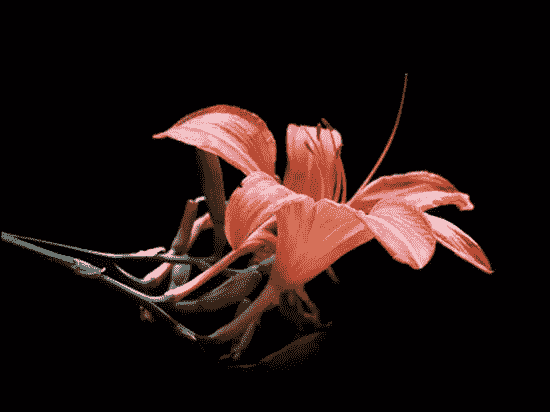
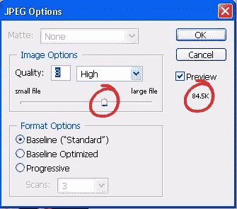
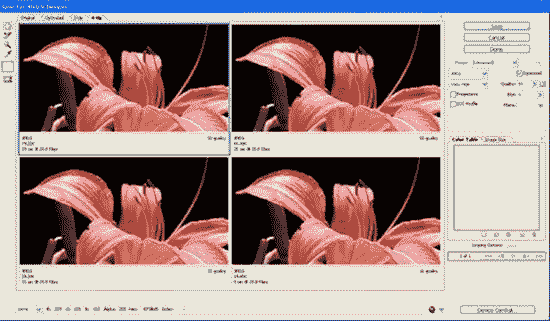

# 用 Photoshop 优化网页图像

> 原文：<https://www.sitepoint.com/optimizing-images-for-the-web-with-photoshop/>

Photoshop 中的“存储为 web 格式”命令允许您优化图像，以便在 Web 上使用。宽带可能允许我们在网上使用更大的图片，但是记住没有宽带的访问者并优化网站上的所有图片仍然很重要。一个成功的网站的一个重要方面是其快速加载的能力。

JPEG 和 GIF 是网络上最常用的两种格式，PNG 格式正在赶上。JPEG 格式旨在保留照片等连续色调图像的变化。它可以用数百万种颜色来表现图像。GIF 格式在压缩纯色图像和带有重复颜色块的图像时最有效，如艺术线条、徽标和文字插图。它使用 256 种颜色的调色板来表示图像，并支持背景透明。PNG 格式有点像 JPEG 和 GIF 的精华。它有 PNG-8 和 PNG-24 两种版本，其中 PNG-24 的质量更高，文件更大。

如果你是 Photoshop 的新手，你可能不知道你可以使用“**保存为网页”**命令将文件保存为 JPEGs、gif 和 png，而不是只使用文件菜单下的**“另存为”**命令。为了展示不同之处，我将使用这两个命令保存同一个图像文件。

**使用另存为** 另存为允许您以多种不同格式保存图像文件。在这个例子中，我想把我的照片保存为 JPEG 格式。

 **1.从打开的图像开始。我把我的尺寸调整到 900 像素宽，为我的照片博客做准备。

2.选择**文件>另存为**，在对话框中选择 JPEG 作为文件格式，并为新文件键入一个名称。单击保存，JPEG 选项对话框打开。

从这里你可以改变文件的质量和文件大小。这些属性彼此直接相关。质量越高，文件越大。所以我们需要在文件大小和质量之间做出妥协。单击预览复选框，这样您可以看到改变质量将如何影响图像。在这种情况下，通过将质量设置为 8，文件大小从 165.8K 变为 84.5K。这是一个非常大的文件大小节省，同时仍然保持相当好的质量。

保存照片时使用这种方法意味着 EXIF 元数据会与图像一起保存，因此对于想要在照片博客、网站或电子邮件中包含此信息的摄影师来说，这种方法非常有用。如果不需要这些信息，那么选择“存储为 Web 格式”是一个更好的选择。

**使用网页(和设备)保存功能**

Photoshop 提供了一系列用于压缩图像文件大小的控件，同时优化了屏幕质量。您可以使用“存储为 Web 和设备所用格式”对话框将原始图像与一个或多个压缩的备选图像进行比较，并在比较时调整设置。

1.再次打开 Photoshop 中的图像，选择**文件>存储为 Web 和设备格式**(注意:在 Photoshop 的旧版本中，该命令是文件>存储为 Web 格式)。

2.在“存储为 Web 和设备所用格式”对话框中，单击“4 页合一”选项卡。在预设下拉菜单中，选择您感兴趣的文件格式。左上方的预览显示原始图像。Photoshop 会自动呈现三种备选方案:高、中、低质量的 JPEG 预览，或者三个 GIF 选项，或者一个 PNG 选项。在每个预览窗口下，您可以看到文件大小、质量以及在特定的调制解调器速度下加载图像需要多长时间。

3.比较质量和大小差异，然后点按任何优化的版本来试验格式和质量设置，继续根据质量来判断大小。这是你将使用你的眼睛结合对话框提供的细节来做出决定的地方。

4.如果您对预览的效果感到满意，请单击“取消”，或者单击“保存”来命名并保存文件。

这是使用 Photoshop 保存文件的两种方法的概述。使用 Photoshop 优化网页文件时，您使用哪种方法？** 

## **分享这篇文章**