# 如何在 Illustrator 中绘制矢量 iPhone

> 原文：<https://www.sitepoint.com/how-to-draw-a-vector-iphone-in-illustrator/>

我想继续几周前我写的关于 Illustrator 中绘图工具的系列文章。主要使用矢量形状和一些渐变，我将在 Illustrator 中创建一个 iPhone 的矢量图。将它创建为矢量的乐趣在于，一旦你画了一次，你就可以重复使用它，并且在没有任何质量损失的情况下放大和缩小它。让我们开始吧。

1.在 Illustrator 中开始一个新文档。如果矢量用于打印，请选择 CMYK 和 300 ppi 的高分辨率。否则选择 RGB。将描边颜色设置为黑色，填充设置为无。

2.如果你没有 iPhone(我没有)，那么在你画画的时候，你需要看一张 iPhone 的照片。将 iPhone 图像复制并粘贴到 Illustrator 中。

3.我们将使用圆角矩形工具绘制手机的形状。从工具箱中选择它，然后单击一次，出现圆角矩形工具对话框。第一个矩形宽 433 像素，高 795 像素，圆角半径为 45 像素。单击确定。

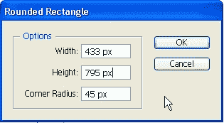 <

画板上将出现一个矩形。

4.按照以下尺寸重复步骤 3 两次:

*   398 像素宽，763 像素高，40 像素角半径
*   386 像素宽，749 像素高，35 像素角半径

你现在应该在画板上有三个圆角矩形，就像这样；
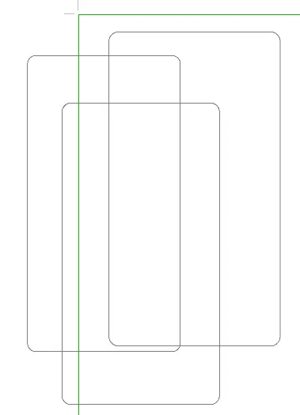

5.要将它们正确对齐，请按住 Shift 键并使用选择工具(V)选择每个矩形。选择多个对象时，选项栏会显示对齐选项。单击水平居中对齐图标和垂直居中对齐图标。

你的矩形现在应该排列整齐了。

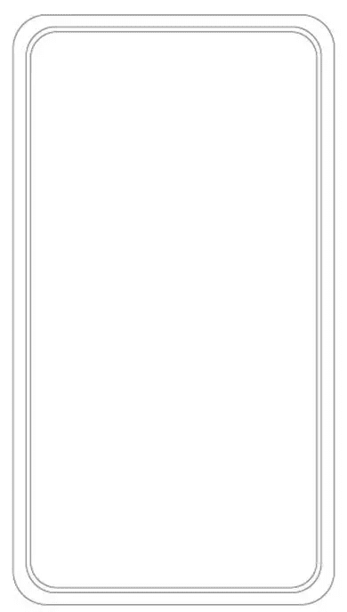

6.在“色板调色板”菜单上，选择“打开色板库”>“金属”以打开 Illustrator 的金属调色板。

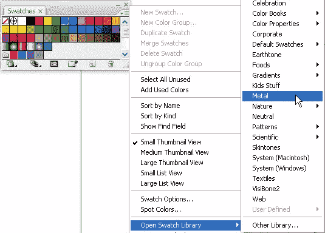

7.当我们在，再次选择打开样本库>渐变>金属。

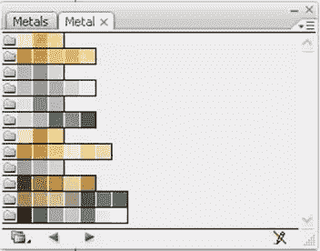

9.选择内部矩形，并将填充颜色设置为#090909。

10.选择中间的矩形，并设置填充金属梯度称为银。然后将笔画设置为“无”。

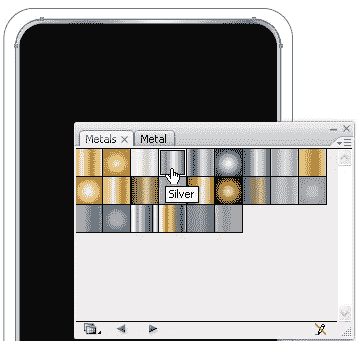
11。选择外部矩形，并将填充颜色设置为深灰色(在金属样本的最后一行)，或者只选择你自己的深灰色。再次，设置笔画为无。所以你应该有这样的东西:

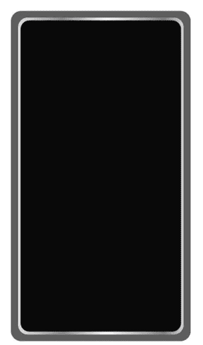

如果你仔细看，它看起来有点像 iPhone。好了，有点平了，我们可以用网格工具让深灰色的外矩形看起来更逼真。
12。在图层面板中，隐藏内部和中间的矩形。

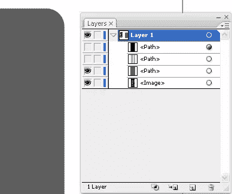

13.从工具箱中选择网格工具(U)。

网格工具允许您在对象上创建网格，以操纵颜色并从一点平滑过渡到另一点。

14.单击左上角以添加节点。然后点击颜色选择器，选择深灰色。

当您选择了一个节点，然后使用拾色器更改颜色时，Illustrator 会创建一个从一种颜色到下一种颜色的非常平滑的混合。这比仅仅使用渐变工具给你更多的控制。

15.用网格工具添加更多的节点，当你添加它们的时候，在浅灰色和深灰色之间变换颜色，给人一种有光泽的铬合金的感觉。

[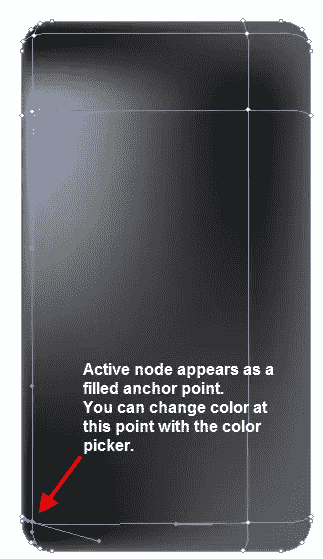](https://www.sitepoint.com/wp-content/uploads/2009/06/iphone11.png)

花一些时间在网格上工作，然后放大，这样你就可以看到你在做什么。您可以添加任意数量的节点。

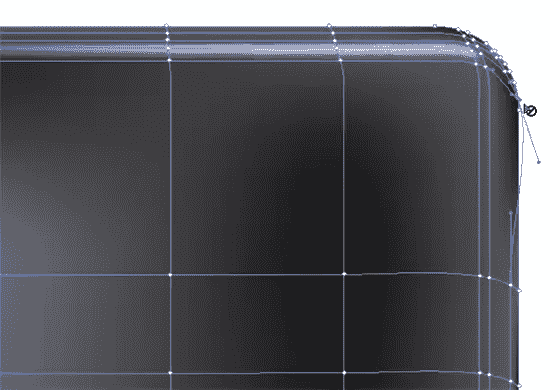

16.当您对外部矩形的光泽度感到满意时，打开其他两个矩形的可见性。

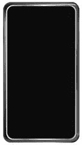

17.选择中间的矩形。它仍然看起来有点平，即使有渐变，所以我们将在它后面添加一个微妙的阴影。选择“效果”>“风格化”>“投影”,添加如下所示的值。

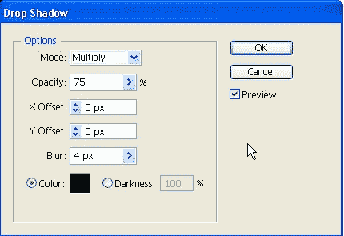

手机边缘有许多小按钮。我们可以使用另一个圆角矩形来添加它们，设置为与手机那部分的颜色相匹配。按钮将出现在手机顶部，因此选择它们，然后选择“对象”>“排列”>“置于底层”,使它们看起来更真实，不会突出太多。

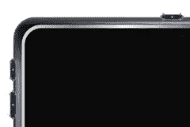

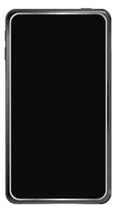

18.现在屏幕需要一些细节和效果。选择矩形(不是圆形)，设置拾色器为深灰色填充，浅灰色描边为 1px。现在画一个长方形。

[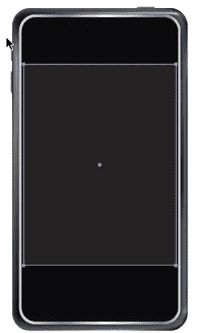](https://www.sitepoint.com/wp-content/uploads/2009/06/iphone16.png) 
19。使用圆角矩形工具可以以类似的方式绘制“听筒”。这一次添加一个轻微的深灰到黑色的渐变填充。

20.要创建主按钮，使用椭圆工具绘制一个浅灰色到黑色渐变的圆形，描边设置为无。
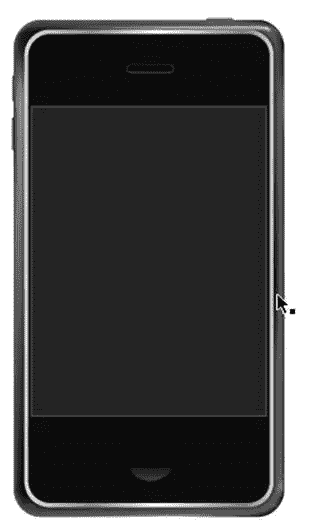
要完成那个按钮，再画一个圆角矩形，没有填充，白色描边 1px。

21.手机上的文本字体是 Helvetica，如果你没有，Arial 是非常接近的。我在屏幕上添加时间和日期以及服务提供商:

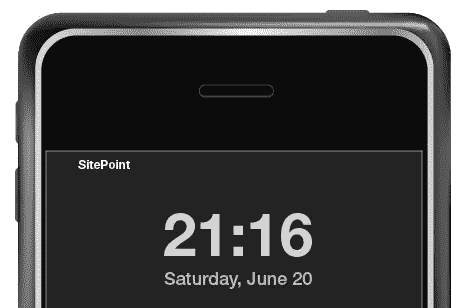

22.为了增加信号强度，回到矩形工具，然后画出五个小盒子，在盒子后面加一条黑色。

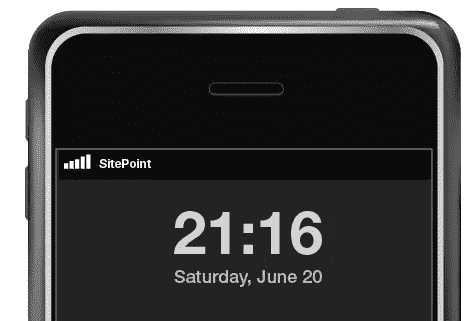

23.时间和日期也位于半透明渐变上，所以画出一个黑色矩形，并将其向后发送，使其位于文本后面。然后选择渐变，设置你的调色板如下。使用渐变工具(G)，向下拖动黑色矩形。

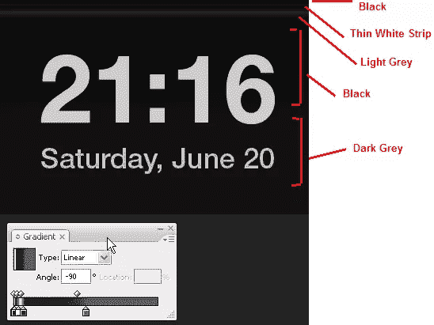

一旦你应用了渐变，设置矩形不透明度为 75-80 %,混合模式为正片。(混合模式位于 Illustrator 的透明度调色板上)。

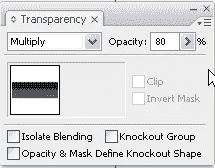

这是手机现在的样子:

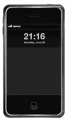

在这个阶段，你当然可以添加一些壁纸，但我会让手机保持黑屏。

24.使用椭圆工具，在手机底部画一个白色填充的形状。然后在上面，用黑色画第二个更小的椭圆。选择两个形状，然后选择“对象”>“混合”>“制作”,创建一个微妙的混合。

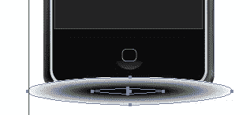

25.若要完成绘图，请选取“对象”>“排列”>“发送到背面”，将混合发送到背面。最后的向量如下所示。

这里面有相当多的步骤，确实需要一点时间，但是这里大部分用于绘图的工具都是基本的，用网格和渐变增加了一点趣味。我们当然可以继续添加一些东西，比如屏幕上的倒影和更多的图标。我认为你自己的 iPhone 矢量是一个有用的东西，如果你画自己的，你可以添加各种图标和装饰。

**相关阅读:**

*   [Illustrator 绘图工具，第 5 部分:钢笔工具–曲线](https://www.sitepoint.com/illustrator-drawing-tools-part-5-pen-tool-curves/)
*   [在 Illustrator 中绘图，第 4 部分:钢笔工具-直线](https://www.sitepoint.com/drawing-in-illustrator-part-4-pen-tool-straight-lines/)
*   [在 Illustrator 中绘图，第 3 部分:铅笔工具](https://www.sitepoint.com/illustrator-drawing-tools-part-3-the-pencil-tool/)
*   [在 Illustrator 中绘图，第 2 部分:形状工具](https://www.sitepoint.com/drawing-in-illustrator-part-2-the-shape-tools/)
*   [在 Illustrator 中绘图，第 1 部分:线条工具](https://www.sitepoint.com/drawing-in-illustrator-part-1-the-line-tools/)

## 分享这篇文章