# 在 Illustrator 中绘图，第 1 部分:线条工具

> 原文：<https://www.sitepoint.com/drawing-in-illustrator-part-1-the-line-tools/>

Illustrator 不仅是创建矢量图形的行业标准，使用起来也非常有趣。本指南主要面向 Illustrator 新手，但即使您已经使用该程序有一段时间了，您也会发现这是一个有用的复习课程。

**原理和术语**
我们不会在理论上陷入太多的困境，但是当你在 Illustrator 中绘图时，有些概念你需要理清。

Illustrator 创建基于*矢量的*作品。这意味着它可以调整大小而不失真。如果你想设计一个标志，它可以小到适合一顶棒球帽，也可以放大到充满一个广告牌，那么矢量就是一个好方法。

当你在 Illustrator 中绘图时，你会创建一条叫做**路径**的线。路径由一段或多段直线或曲线组成。每段的起点和终点都由**锚点**标记。路径可以是**闭合的**(例如，一个圆)，也可以是**开放的**，具有不同的端点(例如，一条波浪线)。

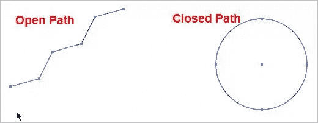

让我们从 Illustrator 的线条工具开始。重要的是要明白，当你用这些工具绘制路径时，线条的颜色将是你为笔画选择的颜色，路径本身是非打印元素。

**画线**
线段工具是工具箱中最顶端的工具，包括圆弧工具、螺旋工具和网格工具。要查看所有隐藏的线工具，只需在线段工具上单击并按住指针。你会看到弧形工具，螺旋工具和网格工具。

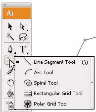

在 Illustrator 中，您可以“分离”一组工具，以便它们形成自己的浮动调色板。只要点击右手边的小三角形，隐藏的工具就会飞出来。

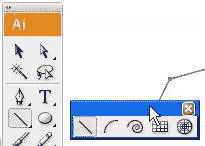

**1。线段工具**
使用线段工具绘制直线是熟悉在 Illustrator 中生成路径的好方法。选择线段工具，并执行以下任一操作:

*   将指针放在您想要线条开始的位置，单击并拖动到您想要线条结束的位置。

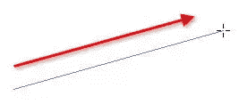

*   单击画板上您希望线条开始的位置。将打开一个对话框，您可以指定直线的长度和角度。如果要用当前填充颜色填充线条，请选择填充线条。然后单击确定。将按指定方式绘制直线。

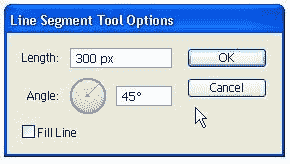

绘制手绘线段时，您可以在绘制线段时按住 **Shift** 键，将角度限制为 45 度的增量。要围绕中心半径对称绘制线段，请按住**选项** (Mac)或 **Alt** (Windows)键。

在绘制线段时按住 **Shift + Option** (Mac)或 **Shift + Alt** (Windows)会创建一条从中心点开始扩展的线，并且限制为 45 度的增量

**2。圆弧工具**
当你画一个圆弧时，你正在创建一个弯曲的线段。画一个徒手画的弧线；

1.选择圆弧工具。
2。将指针放在您希望弧线开始的位置，然后单击并拖动到您希望弧线结束的位置。

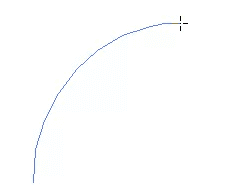

按住 **Shift** 键，将圆弧限制为 45 度的增量。
按住 **Option** (Mac)或 **Alt** (Windows)键，以初始点击点为中心点绘制一条弧线。

还可以使用“圆弧工具”对话框来设置更复杂的曲线。

1.选择圆弧工具。
2。在画板上想要弧线开始的位置单击一次。在对话框中，点击参考点定位器上的方块，指定从哪个角点绘制圆弧。这里有很多选项可供选择，我的建议是尝试所有选项，这样你就能感受到它们是如何影响曲线的。单击确定。

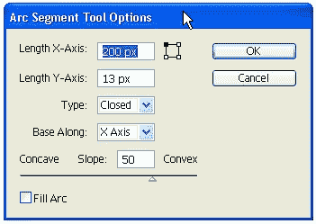

**长度 X 轴**
指定了圆弧的宽度。
**长度 Y 轴**
指定圆弧的高度。
**Type**
指定您希望对象是开放路径还是封闭路径。
**沿**
指定圆弧的方向。根据要沿水平(X)轴还是垂直(Y)轴绘制弧的底部，选择 X 轴或 Y 轴。
**坡度**
指定圆弧的坡度方向。为凹形(向内)坡度输入负值。为凸面(向外)坡度输入正值。斜率为 0 会创建一条直线。
**填充弧线**
用当前填充颜色填充弧线。
 **3。使用**螺旋工具
绘制一个手绘螺旋
1。从工具箱中选择螺旋工具。
2。在画板上单击并拖动，直到螺旋达到您想要的大小。以圆周运动方式拖动以旋转螺旋

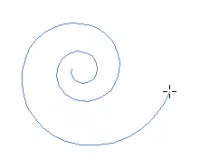

使用“螺旋工具”对话框；
1。从工具箱中选择螺旋工具。
在画板上您想要螺旋开始的位置单击一次。在对话框中，您可以设置以下任何选项，然后单击“确定”。

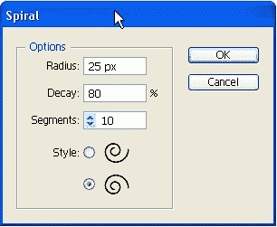

**半径**
指定从螺旋中心到最外点的距离。
**衰减**
指定螺旋的每个风相对于前一个风应该减少的量。
**段**
指定螺旋有多少段。螺旋的每一整圈由四个部分组成。
**样式**
指定螺旋的方向。

**4。矩形网格**
你可能喜欢将矩形网格用于数据布局，甚至作为分层设计的一部分。
1。选择矩形网格工具。
2。请执行下列操作之一:

*   在画板上单击并拖动，直到网格达到您想要的大小。

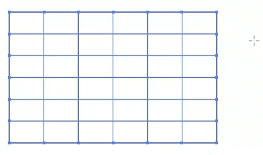

*   在画板上单击一次，打开“矩形网格”对话框。在对话框中，点击参考点定位器上的方块，指定网格的绘制起点。然后设置以下任一选项，并单击“确定”。

我选择了下面的选项，创建你可以在下面看到的矩形网格。

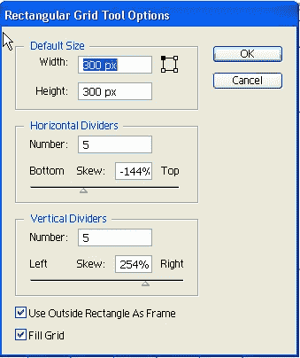

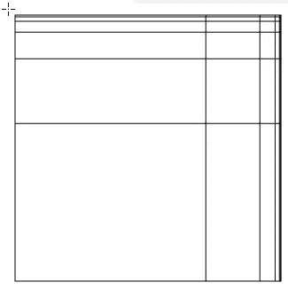

**默认尺寸**
指定整个网格的宽度和高度。
**水平分隔线**
指定你想要出现在网格顶部和底部之间的水平分隔线的数量。倾斜值决定了水平分隔线如何向网格的顶部或底部倾斜。
**垂直分隔线**
指定您希望出现在网格左侧和右侧之间的分隔线数量。倾斜值决定了垂直分隔线向左或向右倾斜的方式。
**使用外部矩形作为框架**
用一个单独的矩形对象替换上、下、左、右线段。
**填充网格**
用当前填充颜色填充网格(否则，填充设置为无)。

**5。极坐标网格工具**
这与矩形网格的工作方式相似，只是它创建了一个圆形网格。使用该工具；
1。选择极坐标网格工具。
2。请执行下列操作之一:

*   单击并拖动，直到网格达到您想要的大小。

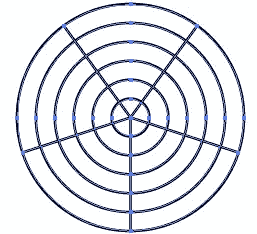

*   要打开工具的对话框，请在画板上单击一次。在对话框中，点击参考点定位器上的方块，指定从哪个角点绘制网格。然后设置以下任一选项，并单击“确定”。

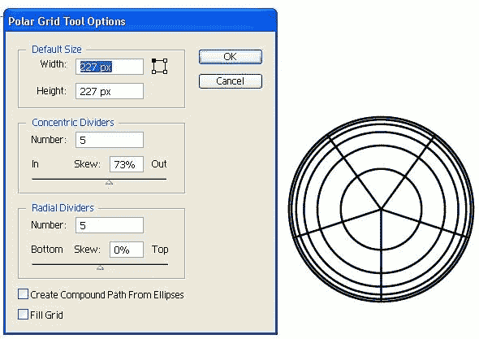

**默认尺寸**
指定整个网格的宽度和高度。
**同心分隔线**
指定您想要在网格中出现的圆形同心分隔线的数量。倾斜值决定了同心分隔线如何向网格内部或外部倾斜。
**径向分隔线**
指定您希望出现在网格中心和圆周之间的径向分隔线的数量。倾斜值决定了径向分隔线在网格上逆时针或顺时针的加权方式。
**从椭圆创建复合路径**
将同心圆转换成单独的复合路径，并每隔一个圆填充一次。
**填充网格**
用当前填充颜色填充网格(否则，填充设置为无)。

好了，这些是线条工具。它们都很容易使用，但是我建议，除了用每一种工具练习徒手绘制之外，您还可以尝试每一种工具的对话框，以便您可以看到使用这些工具有多精确。

明天，我们将看看形状工具，并在本周晚些时候钢笔工具。

## 分享这篇文章