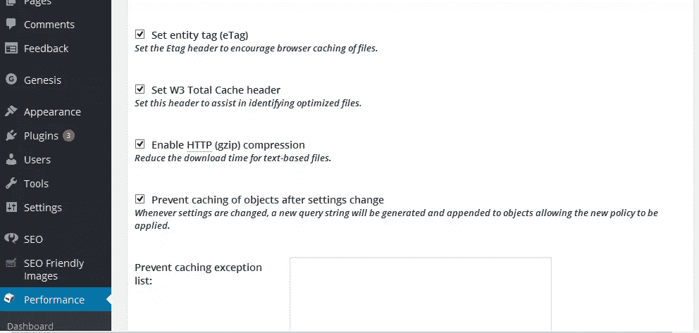
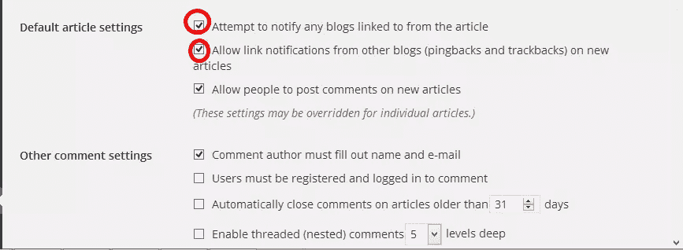

# 加速你的 WordPress 网站的 12 种方法

> 原文：<https://www.sitepoint.com/12-ways-to-speed-up-your-wordpress-website/>

速度是所有网站或服务都应该具备的品质，WordPress 也不例外。你永远不会有第二次机会来留下第一印象，所以重要的是确保你不会让你的访问者有任何理由离开你的网站，甚至在它完成加载之前，或者有任何理由让他们不想再回来。

在这篇文章中，我将向你展示如何有效地提高你的 WordPress 站点的加载速度，其中有 12 个最佳方法可以帮助你提高性能。如果你需要更有说服力的理由来说明为什么网站速度是至关重要的，看看我们之前的一篇关于[为什么网站速度很重要](https://www.sitepoint.com/speed-wordpress)的文章。

## 选择一个好的主人

你选择的网站主机对你的网站速度有很大的影响。一个好的网站主机是你网站运行的基础，这是提高网站速度的第一步(即使不是 WordPress 驱动的网站)。

有许多托管公司，这是一个竞争激烈的市场，值得去逛逛。Charles Costa 已经广泛地讨论了这个话题，下面的文章将帮助你指出正确的方向，并帮助你在选择主机提供商时做出明智的选择。

*   [如何将好的 WordPress 主机与坏的分开](https://www.sitepoint.com/separate-the-good-wordpress-hosts-from-the-bad/)
*   [托管 WordPress 主机:利弊](https://www.sitepoint.com/managed-wordpress-hosting-pros-and-cons/)
*   [查看信号 WordPress 托管报告摘要](https://www.sitepoint.com/review-signal-wordpress-hosting-report-summary/)

## 使用 CDN

**内容交付网络**或**内容分发网络** (CDN)是一个分布式服务器系统，根据用户的地理位置向其交付网页和其他网络资源。

CDN 通常复制所有静态文件(CSS、JavaScript、媒体文件等。)在您的网站上使用，并尽快将它们交付给用户。

Jacco Blankenspoor 的这篇文章进一步研究了 WordPress 和 CDNs。

## 贮藏

缓存是内容的临时存储，例如页面、图像和用于呈现页面的其他文件。这些内容作为缓存保存在访问者的本地驱动器上，因此当相同的访问者再次请求它们时，它们的呈现速度会快得多。缓存也发生在服务器上。这是一个技术领域，但有几个流行的 WordPress 插件可以帮助你非常容易地配置和管理缓存，最流行的选择是 [W3 总缓存](https://wordpress.org/plugins/w3-total-cache)和 [WP 超级缓存](https://wordpress.org/plugins/wp-super-cache/)。

## 缩小 CSS 和 JavaScript 文件

“缩小”CSS 和 JavaScript 文件的过程会将原始文件压缩到尽可能小的大小，从而提高浏览器检索文件的速度。

如果你喜欢用手动方式来缩小你的网站 CSS 和 JavaScript 文件，YUI 压缩器将会派上用场，或者你可以使用 [WP Minify](https://wordpress.org/plugins/wp-minify) 来用自动方式处理这项工作。一些缓存插件也提供缩小功能。

## 压缩图像

除了大的图片文件对 WordPress 站点的缓慢有很大的影响，它们也消耗带宽。图像是一个很好的优化对象。

使用免费的 WPMU DEV WordPress Smush API， [WP SmushIt](https://wordpress.org/plugin/wp-smushit) 插件将帮助你在不影响图片质量的情况下减小图片的尺寸。我使用这个插件，发现它极大地缩小了图像尺寸。

### 压缩你的网站

简单地说，站点压缩就像把你的整个站点变成一个 ZIP 存档。当网站的任何页面被请求时，客户端的浏览器就像 WinRAR 一样解压文件，然后显示内容。尽管这听起来像是一项额外的工作，会减慢速度，但相信我，它不会。

尽管 [W3 Total Cache](https://wordpress.org/plugins/w3-total-cache) 以缓存著称，但它也可以用于站点压缩。您可以通过进入:**管理页面**->-**性能**->-**浏览器缓存**->-**启用 HTTP (gzip)压缩**来启用该功能。

## 优化您的数据库

WordPress 经常自动保存几乎所有内容。这包括:不需要的修订、引用通告、pingbacks、垃圾邮件、未经批准的评论或标记为垃圾的评论。

就像你的硬盘会变得支离破碎一样，你的 WordPress 数据库也会遇到类似的问题。但是，您可以使用 [WP-Optimize](https://wordpress.org/plugins/wp-optimize) 插件来优化您的数据库，或者使用 [WP-DB Manager](https://wordpress.org/plugins/wp-dbmanager) 来优化您的数据库，并为常规数据库优化安排日期。

## 选择正确的插件

安装大量插件会给你的网站和网站文件增加大量垃圾。安装或保留你并不真正需要的插件是没有意义的。

最好的方法是审核你的 WordPress 插件，保留那些对你的网站运行至关重要的插件，去掉那些不重要的插件。

## 禁用引用通告和 Pingbacks

默认情况下，每当另一个博客提到你，你的网站就会收到通知。这些被称为 [pingback 和 trackbacks](https://codex.wordpress.org/Introduction_to_Blogging) 。你可以在这里关闭 WordPress 的这个功能:**管理页面**->-**设置** - > **讨论**，不勾选前两个复选框如下图。

关闭这个 WordPress 功能不会损害你的网站。

## 选择一个好的主题或主题框架

虽然有些 WordPress 主题非常快并且编码良好，但有些却恰恰相反。

当选择一个主题时，注意主题的演示页面的加载速度，这将让你了解主题对你的站点加载速度的影响。

## 优化你的主页结构

显示文章摘录，尽量减少页面中的插件和文章数量，是保持主页优化的一个很好的方法。

这不仅有助于你的网站加载速度，也改善了你的整体用户体验。正如我上面提到的，你只有一次机会留下第一印象！

## 启用保持活动

[HTTP Keep-Alive](https://en.wikipedia.org/wiki/HTTP_persistent_connection) 是使用单个传输控制协议(TCP)连接来发送和接收多个 HTTP 请求，而不是为每个请求打开一个新的连接的思想。

您的网络主机可能已经启用了这些设置，所以先检查一下，但是如果您有一个典型的主机帐户，您可以将下面的代码行复制到您的`.htaccess`文件中来启用 keep-alive。

`Header set Connection keep-alive`

## 结论

在这篇文章中，我介绍了 12 种提高 WordPress 网站速度的最佳方法。这些方法的有效实施将会大大提高你的 WordPress 站点加载速度。Web 性能是一个广泛的话题，如果你想阅读更多关于这个主题的内容，这里有一些你可能会感兴趣的文章。

*   加速你的 WordPress 网站
*   加速你的 WordPress 网站的 10 种简单方法
*   [用 P3 优化你的 WordPress 性能](https://www.sitepoint.com/optimizing-wordpress-performance-with-p3/)
*   [用 CDN 加速你的 WordPress 网站](https://www.sitepoint.com/speed-up-your-wordpress-site-with-a-cdn/)

我期待在下面的评论中听到你对 WordPress 性能的建议。

## 分享这篇文章